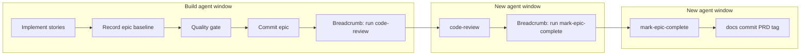

# Epic close-out: commit at plan end, manual follow-ups

## Goal

Generated epic plans **end at the epic commit**. `code-review` and `mark-epic-complete` become **manually invoked follow-up skills**, chained by **end-of-run breadcrumbs** — each follow-up runs in a **fresh agent window**. Each skill commits **only the doc edits it authored**.

This resolves the [WORKFLOW_BACKLOG auto-commit item](docs/WORKFLOW_BACKLOG.md#auto-commit-after-agent-coding-runs) via **plan-authorized commits** (human approves the plan in Plan Mode) rather than a global `stop` hook.

## 1. Expand `plan-next-epic` — plan ends at epic commit

**File:** [`.cursor/skills/plan-next-epic/SKILL.md`](.cursor/skills/plan-next-epic/SKILL.md)

### First-epic status-flip commit (skill runtime, not generated plan)

**First epic only:** immediately after flipping the PRD/ROADMAP status to `Active` and removing the phase stub, commit those planning-doc edits as a `docs:` commit (request `git_write`). The skill never leaves its own edits uncommitted.

### Precondition addition (generated plan body, near top)

Unchanged from prior draft:

- **Clean tree before baseline:** `git status --porcelain` must be empty before recording the epic baseline. If dirty, halt and ask the user to commit or stash.
- **Epic baseline:** Run `git rev-parse HEAD` immediately before the first implementation edit. Record the SHA in the plan body (e.g. `**Epic baseline:** abc1234`) — this is the fixed point for `code-review`.

### Frontmatter todos (always append after story todos)

| Todo id | Purpose |
|---------|---------|
| `quality-gate` | Run `pnpm type-check && pnpm lint && pnpm format-check && pnpm test:ci` |
| `commit-epic` | Conventional commit for this epic's changes |

Remove `code-review` and `mark-epic-complete` todos from generated plans.

### Body sections (always append at end, in order)

1. **Verification** — quality bar commands (same as [WORKFLOW_GUIDE Step 5 exit condition](docs/WORKFLOW_GUIDE.md)); stop on failure.
2. **Commit epic** — authorized by this approved plan:
   - Review diff; stage only files in scope for this epic.
   - Write a conventional commit message (`feat`/`fix`/`docs`/etc.) referencing phase + epic id.
   - Commit (request `git_write`). Pre-commit hook runs automatically — if it fails, **fix and retry the commit** (a failed pre-commit hook aborts the commit, so there is nothing to amend).
   - Verify `git status --porcelain` is empty after commit.
3. **Handoff** — end the run by telling the user, including the epic baseline SHA and epic identifier from the plan (substitute actual values), e.g.:

   *"Epic committed. Next: open a new agent window and run `/code-review` — epic baseline `<sha>`, Epic `<id>`."*

### Remove

- The existing rule that every generated plan ends with a `mark-epic-complete` step (current line 106).

Keep existing rules: Plan Mode only for the skill itself; no push in commit steps (push remains `ship-phase`).

## 2. Carve out commits in git-workflow

**File:** [`.cursor/rules/git-workflow.mdc`](.cursor/rules/git-workflow.mdc) — § Commits (line 125)

Update from:

> Agents do not commit unless the user explicitly asks.

To a narrow exception list:

- **(a)** The user explicitly asks
- **(b)** An approved implementation plan in `.cursor/plans/` includes an authorized **Commit epic** step
- **(c)** An explicitly invoked skill authorizes a commit scoped to **its own edits** — `ship-phase`, `plan-next-epic` status-flip commit, `mark-epic-complete` tag commit

Keep push/PR rules unchanged.

**Note:** Your personal Cursor user rule ("only commit when asked") should be updated separately to match — the repo cannot change that file.

## 3. Align `code-review` with epic follow-up

**File:** [`.cursor/skills/code-review/SKILL.md`](.cursor/skills/code-review/SKILL.md)

### Epic baseline defaults (under Process step 1)

- The fixed point and epic identifier come from the **user's invocation message** (carried by the build handoff), e.g. `epic baseline abc1234, Epic 3`.
- If either is missing, fall back to the skill's existing behavior: **ask the user**.
- Clean-tree precondition is satisfied by the epic commit in the prior build window.

### End-of-run breadcrumb (after presenting both reports)

Tell the user, carrying the **epic identifier** forward:

- **If fixes are needed:** apply them, commit them, then open a new agent window and run `/mark-epic-complete for Epic <id>`.
- **If no fixes are needed:** open a new agent window and run `/mark-epic-complete for Epic <id>` now.

No change to the skill's core two-axis review logic.

## 4. Rewrite `mark-epic-complete`

**File:** [`.cursor/skills/mark-epic-complete/SKILL.md`](.cursor/skills/mark-epic-complete/SKILL.md)

### When to run (rewrite)

Manually invoked in a **fresh agent window** after the epic is committed and `code-review` has passed (including any committed fixes). **Remove** "only when explicitly instructed by the closing step of an implemented plan."

The **epic identifier** comes from the user's invocation message (carried by the `code-review` breadcrumb). If missing, ask the user which epic to mark — **do not infer it from code inspection**.

### Clean-tree precondition (new)

`git status --porcelain` must be empty before editing; if dirty, halt and ask the user to commit outstanding work first.

### Commit scoped to skill edits (new)

After appending the `` `Complete` `` tag (and **Last updated** line if present), commit the PRD edit as a `docs:` commit (request `git_write`). Commit **only** this edit.

Existing steps (find epic heading, consistency check, report) remain.

## 5. Update WORKFLOW_GUIDE

**File:** [`docs/WORKFLOW_GUIDE.md`](docs/WORKFLOW_GUIDE.md)

### Step 5 exit condition (~line 128)

Require the generated plan to contain:

1. Quality gate
2. Commit epic step
3. Closing handoff instructing the user to run `/code-review` in a new agent window, including epic baseline SHA and epic identifier

**Remove** the sentence assigning a four-element check to `plan-review` — that skill is maintained outside this repo.

### Step 6 Build (~line 131)

Describe the post-build sequence as **manual steps, each in a new agent window**:

1. Build ends with the epic committed
2. User runs `/code-review` in a new window, passing the baseline SHA and epic id from the build handoff
3. User applies and commits any fixes (if needed)
4. User runs `/mark-epic-complete for Epic <id>` in a new window (epic id from the code-review breadcrumb; which commits its own PRD edit)

Update **Last updated** date to 2026-07-08.

## 6. Resolve WORKFLOW_BACKLOG item

**File:** [`docs/WORKFLOW_BACKLOG.md`](docs/WORKFLOW_BACKLOG.md)

- **Remove** the [Auto-commit after agent coding runs](docs/WORKFLOW_BACKLOG.md#auto-commit-after-agent-coding-runs) entry and its Contents link.
- **Partially address** [Integrate quality skills into the documented workflow](docs/WORKFLOW_BACKLOG.md#integrate-quality-skills-into-the-documented-workflow): add a one-line note that `code-review` is now a named manual follow-up after epic commit; other audit skills remain situational. Do not remove that backlog item entirely.

## 7. Persist research brief (optional but recommended)

**File:** `docs/research/RESEARCH-0002-epic-closeout-commit.md` (new)

Capture the investigation from this chat: Cursor docs posture (explicit workflow commits, not blind auto-commit), plan-authorized commit rationale, rejected `stop` hook approach, epic baseline convention, and the fresh-window breadcrumb model. Follow [`docs/research/README.md`](docs/research/README.md) template.

## Out of scope

- Cursor `stop` hook implementation
- `pre-release-review` in epic loop (still phase/PR boundary via `ship-phase`)
- Ad hoc / non-plan sessions (still manual commit)
- AGENTS.md changes (WORKFLOW_GUIDE remains the planning-loop authority)
- **`plan-review` (Claude-side) updates** — handled separately outside this repo

## Manual test checklist (after implementation)

1. Invoke `plan-next-epic` on a first epic: confirm PRD/ROADMAP Active flip is committed as `docs:` before plan generation; tree is clean.
2. Confirm generated plans contain only `quality-gate` and `commit-epic` todos, plus Verification / Commit epic / handoff sections — no `code-review` or `mark-epic-complete` in the plan.
3. On a real epic build: verify build window ends with epic committed and a handoff that includes baseline SHA and epic id (e.g. `/code-review — epic baseline abc1234, Epic 3`).
4. In a new window, run `/code-review` with the handoff values; if either is omitted, confirm the skill asks. Confirm breadcrumb includes `for Epic <id>`.
5. In another new window, run `/mark-epic-complete for Epic <id>`; if epic id is omitted, confirm the skill asks (no code inference). Confirm clean-tree check, PRD tag appended, and a `docs:` commit containing only the PRD edit.
6. Confirm pre-commit failure during epic commit aborts the commit (fix and retry — no amend).
7. Confirm non-plan agent sessions still do not commit without explicit ask (git-workflow carve-out is narrow).
