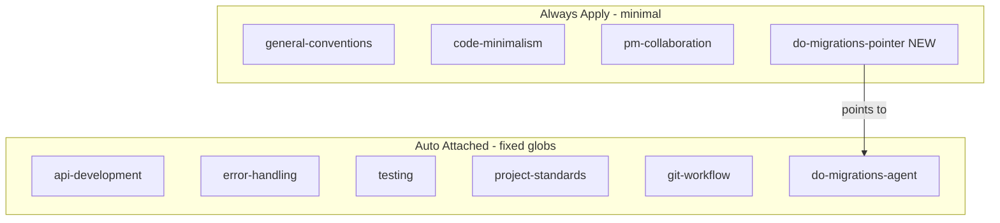

# Fix RULE_AUDIT Findings (Priority + Contradictions)

## Scope

**In scope** (per your choices): executive summary items 1–10, contradictions C-001–C-003, RA-015 (glob + stub), plus post-fix `RULE_AUDIT.md` status update.

**Deferred** (follow-up pass): RA-005/006 size trims, RA-016–025 tutorial/persona/dedup trims, `testing.mdc` collapse below 300 lines (activation fix removes the worst cost; line count stays flagged).

---

## 1. Fix broken activation frontmatter (RA-001, RA-002, RA-013, RA-014)

### [`api-development.mdc`](.cursor/rules/api-development.mdc) (RA-001, RA-009)

Replace invalid `autoAttach:` block with valid frontmatter:

```yaml
description: API development standards for Next.js App Router routes
alwaysApply: false
globs:
  - 'src/app/api/**/*.ts'
  - 'src/app/api/**/*.tsx'
```

- **Remove** `src/lib/api-contracts/**` glob (directory does not exist).
- **Add** interim schema guidance: co-locate Zod schemas in route `_lib/` (e.g. `src/app/api/posts/_lib/schemas.ts`) until a shared contracts directory is introduced.
- Keep forward-looking path/API conventions; cross-ref [`error-handling.mdc`](.cursor/rules/error-handling.mdc) for envelopes (no full RA-022 dedup in this pass).

### [`error-handling.mdc`](.cursor/rules/error-handling.mdc) (RA-002)

Replace `autoAttach:` with narrowed Auto Attached globs (split `.ts` / `.tsx`, no brace expansion):

```yaml
alwaysApply: false
globs:
  - 'src/app/api/**/*.ts'
  - 'src/app/**/actions.ts'
  - 'src/app/**/error.tsx'
```

Drops blanket `src/**/*` — error guidance loads on API routes, server actions, and error boundaries instead of every TS edit.

### Brace-expansion globs (RA-013)

Split `src/**/*.{ts,tsx}` in:
- [`forms.mdc`](.cursor/rules/forms.mdc)
- [`notifications.mdc`](.cursor/rules/notifications.mdc)
- [`logging.mdc`](.cursor/rules/logging.mdc) (also keep separate `scripts/**/*.ts` entry)

### [`git-workflow.mdc`](.cursor/rules/git-workflow.mdc) (RA-014)

Replace `**/*` with paths where git workflow actually matters:

```yaml
globs:
  - 'src/**/*.ts'
  - 'src/**/*.tsx'
  - 'scripts/**/*.ts'
  - '.husky/**'
  - '.github/workflows/**'
```

No body trim in this pass (RA-017 deferred).

---

## 2. Demote oversized alwaysApply rules (RA-003, RA-004)

### [`testing.mdc`](.cursor/rules/testing.mdc) (RA-003, RA-008)

- Set `alwaysApply: false` — rely on existing test/mocks globs only.
- **Fix stale Examples section** (lines 303–316) to real paths:

| Replace (phantom) | With (exists) |
|---|---|
| `format-date.unit.test.ts` | `extract-auth-form-error.unit.test.ts` |
| `use-get-message.unit.test.ts` | `useGetMessage.unit.test.tsx` (note legacy camelCase) |
| `use-toggle`, `counter.unit.test.tsx` | `use-sign-out.unit.test.ts`, `inline-error.unit.test.tsx` |
| `app/api/posts/route.integration.test.ts` | `app/auth/confirm/route.integration.test.ts` |
| `auth-form.integration.test.tsx` | `login-form.integration.test.tsx` |

- **Do not** cut the good-vs-bad tutorial blocks this pass (RA-016 deferred). File will remain >300 lines — note in audit as PARTIAL.

### [`project-standards.mdc`](.cursor/rules/project-standards.mdc) (RA-004, C-001, C-002, RA-012, RA-023)

- Set `alwaysApply: false`; keep `globs: ['**/*.ts', '**/*.tsx']` so it Auto Attaches on code edits.
- **Resolve C-001**: line 29 → `component.tsx` + `component.unit.test.ts(x)` (align with [`testing.mdc`](.cursor/rules/testing.mdc)).
- **Resolve C-002**: change component skeleton example from `export function UserProfile` to `export const UserProfile = () =>` (matches line 125 + [`typescript.mdc`](.cursor/rules/typescript.mdc)).
- **RA-012**: replace `use-get-message.ts` example with `use-sign-out.ts`.
- **Minimal trim only**: add cross-refs to `typescript.mdc` / `nextjs.mdc` for generic React/TS bullets; keep depth/Ousterhout, `_lib/` vs `src/utils/`, `cn` path — the repo-specific core. Full tutorial purge (RA-018/020/021) deferred.

---

## 3. Update stale currency (RA-007, RA-010, RA-011)

### [`supabase.mdc`](.cursor/rules/supabase.mdc) (RA-007)

Replace line 15 contradiction:

> **No custom schema or migrations exist yet**

With current state: 3 shipped migrations (`profiles`, `avatars` bucket + select policy), `public.profiles`, `storage.avatars` — cross-ref [`AGENTS.md`](AGENTS.md) data model section.

### [`react-tanstack-query.mdc`](.cursor/rules/react-tanstack-query.mdc) (RA-010)

- Drop `src/services/posts-repository` and `src/hooks/*-query-keys.ts` aspirational example.
- Primary reference: [`use-sign-out.ts`](src/hooks/use-sign-out.ts) (real, kebab-case-adjacent pattern).
- Optional secondary: `useGetMessage.ts` with `// legacy demo hook` note.
- Replace "Phase 5 error-boundary" with links to [`inline-error.tsx`](src/components/inline-error.tsx) / [`error-panel.tsx`](src/components/error-panel.tsx) and `error.tsx`.

### [`ui-shadcn.mdc`](.cursor/rules/ui-shadcn.mdc) (RA-011)

Line 15: `style: default` → `style: new-york` (matches [`components.json`](components.json)).

---

## 4. Fix theme contradiction (C-003, RA-024)

### [`ui-styling.mdc`](.cursor/rules/ui-styling.mdc)

- Line 14: "semantic color names from Tailwind config" → semantic CSS variables from [`globals.css`](src/app/globals.css) (`bg-background`, `text-foreground`, etc.) per [AGENTS.md § Hard constraints](../../AGENTS.md#hard-constraints).
- Lines 57–59: replace `bg-white dark:bg-gray-900 text-gray-900 dark:text-white` with token-based example:

```typescript
<div className="bg-background text-foreground border border-border">
```

- Responsive/image tutorial sections (RA-019) left intact this pass.

---

## 5. Migration safety: glob + stub (RA-015)

Split the always-on cost from the full protocol:

**New** [`do-migrations-pointer.mdc`](.cursor/rules/do-migrations-pointer.mdc) (~5 lines, `alwaysApply: true`):

```markdown
Before any database schema, migration, or Supabase storage work, read
`.cursor/rules/do-migrations-agent.mdc` in full.
```

**Update** [`do-migrations-agent.mdc`](.cursor/rules/do-migrations-agent.mdc):

- Set `alwaysApply: false`
- Keep globs: `supabase/migrations/**/*.sql`, `**/*.plan.md`

Pattern mirrors [`rule-authoring-pointer.mdc`](.cursor/rules/rule-authoring-pointer.mdc).

---

## 6. Close out audit artifact

Update [`RULE_AUDIT.md`](RULE_AUDIT.md):

- Mark RA-001–004, RA-007–015, RA-024 as **RESOLVED** (or **PARTIAL** for RA-003 line-count).
- Mark C-001–C-003 as **RESOLVED**.
- Mark RA-005/006/016–025 as **DEFERRED** with one-line reason.
- Update open questions with decisions recorded (migrations glob+stub, api rule kept forward-looking).

---

## File change summary

| File | Action |
|------|--------|
| `api-development.mdc` | Fix frontmatter, remove phantom glob, add `_lib/` schema note |
| `error-handling.mdc` | Fix frontmatter, narrow globs |
| `testing.mdc` | `alwaysApply: false`, fix example paths |
| `project-standards.mdc` | Demote activation, fix naming + arrow example |
| `supabase.mdc` | Fix migration/schema statement |
| `forms.mdc`, `notifications.mdc`, `logging.mdc` | Split brace globs |
| `git-workflow.mdc` | Narrow globs |
| `ui-styling.mdc` | Token-based theming, remove gray utilities |
| `react-tanstack-query.mdc` | Real hook refs, drop Phase 5 |
| `ui-shadcn.mdc` | Fix `components.json` style string |
| `do-migrations-agent.mdc` | `alwaysApply: false` |
| `do-migrations-pointer.mdc` | **New** alwaysApply stub |
| `RULE_AUDIT.md` | Status pass |

**Unchanged this pass:** `code-minimalism.mdc`, `pm-collaboration.mdc`, SQL helper persona lines, `git-workflow.mdc` body, `testing.mdc` tutorial blocks.

---

## Verification

After edits:

1. Grep `.cursor/rules/` for `autoAttach` and `*.{ts,tsx}` — should be zero matches.
2. Grep for phantom paths (`api-contracts`, `format-date`, `posts-repository`, `Phase 5`).
3. Confirm `alwaysApply: true` only on: `general-conventions`, `code-minimalism`, `pm-collaboration`, `do-migrations-pointer` (new).
4. Optionally re-run `/rule-audit` to validate.


