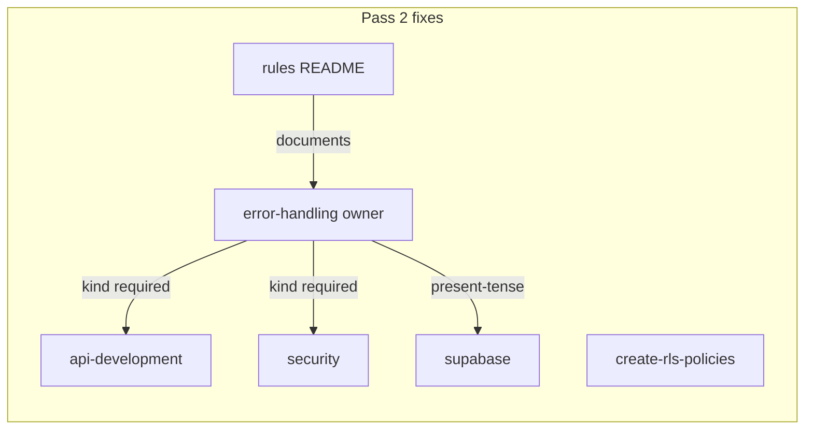

# Fix RULE_AUDIT Pass 2 (NEW Findings)

## Scope

**In scope** (per your choice): executive-summary items 1, 2, 5, 6, 8 plus contradictions C-004 and findings RA-026–032. Close out with `RULE_AUDIT.md` status update.

**Deferred** (unchanged): RA-005/006 Always Apply size trims, RA-016–025 signal-to-noise/dedup trims, `testing.mdc` line count.

---

## 1. Fix error envelope `kind` contradiction (C-004, RA-029, RA-032)

**Owner:** [`error-handling.mdc`](.cursor/rules/error-handling.mdc) line 63 — every error envelope must include `kind: 'operational' | 'fault'`. Shipped reference: [`src/app/admin/users/actions.ts`](src/app/admin/users/actions.ts), [`src/types/app-error.ts`](src/types/app-error.ts).

### [`api-development.mdc`](.cursor/rules/api-development.mdc)

Three touch points:

| Location | Current | Fix |
|----------|---------|-----|
| Line 47 (quick ref) | `{ message, code }` | Add `kind` + one-line note: "see `error-handling.mdc` for `kind` semantics" |
| Lines 71–75 (error example) | Missing `kind` | Add `kind: 'operational'` (validation/auth errors) |
| Checklist line 102 | "Consistent error envelope" | Explicit: "envelope includes `kind`" |

Keep the existing cross-ref at line 11/42 — no full RA-022 dedup in this pass.

### [`security.mdc`](.cursor/rules/security.mdc)

| Location | Current | Fix |
|----------|---------|-----|
| Lines 36–38 (401 example) | `{ message, code }` | Add `kind: 'operational'` |
| Line 52 (403 example) | `{ message, code }` | Add `kind: 'operational'` |

Optional consistency: lines 228/231 in the "Broken Access Control" section use bare `{ error: '...' }` — not in the audit finding, but consider a one-line cross-ref there rather than expanding examples (minimal diff).

---

## 2. Fix self-contradicting RLS INSERT template (RA-030)

### [`create-rls-policies.mdc`](.cursor/rules/create-rls-policies.mdc)

**Problem:** Line 32 canonical output contradicts lines 19–20 (INSERT must use `WITH CHECK` only, no `USING`).

**Replace line 32:**

```sql
-- BEFORE (wrong)
CREATE POLICY "My descriptive policy." ON books FOR INSERT to authenticated USING ( (select auth.uid()) = author_id ) WITH ( true );

-- AFTER (correct)
CREATE POLICY "My descriptive policy." ON books FOR INSERT TO authenticated WITH CHECK ((select auth.uid()) = author_id);
```

No other body changes — persona/tutorial content stays deferred (RA-025).

---

## 3. Remove stale Phase/Epic planning language (RA-026, RA-027)

### [`error-handling.mdc`](.cursor/rules/error-handling.mdc)

| Line | Current | Rewrite |
|------|---------|---------|
| 88 | "API routes will be added in Phase 5" | Present-tense: no shipped `src/app/api/**` routes yet; when added, apply the same try/catch + envelope patterns above. Cross-ref `api-development.mdc`. |
| 100 | "`ErrorBoundary` / `ErrorFallback` planned for Phase 5" | Point at shipped UI: [`inline-error.tsx`](src/components/inline-error.tsx), [`error-panel.tsx`](src/components/error-panel.tsx), and route-level `error.tsx`. Note: no reusable `ErrorBoundary` component exists today — `error.tsx` is the pattern. |

Also add `kind` to the test example at lines 197–205 (currently asserts `code` but not `kind`) — small consistency win while editing.

### [`supabase.mdc`](.cursor/rules/supabase.mdc)

| Line | Current | Rewrite |
|------|---------|---------|
| 62 | "**Epic 5 handoff:** profile page calls…" | Present-tense shipped flow: profile page → `uploadUserAvatar` ([`avatar-storage.ts`](src/utils/avatar-storage.ts)) → server action persists `profiles.avatar_url`. Link [`src/app/(app)/profile/`](src/app/(app)/profile/). |
| 180 | "once Phase 6 tooling is in place" | "review SQL before applying via `pnpm db:push`" — matches current human workflow in lines 22–35. |

---

## 4. Fix aspirational `src/services/` guidance (RA-028)

### [`supabase.mdc`](.cursor/rules/supabase.mdc) lines 140–158

**Problem:** Recommends `src/services/` repository pattern — directory does not exist. Real patterns today:

- Server reads: `_lib/` helpers (e.g. [`get-current-user-profile.ts`](src/app/(app)/_lib/get-current-user-profile.ts))
- Client mutations: hooks (e.g. [`use-sign-out.ts`](src/hooks/use-sign-out.ts))
- Server mutations: `actions.ts` files (e.g. [`profile/actions.ts`](src/app/(app)/profile/actions.ts))

**Rewrite "Repository Pattern" section** to:

- Rename to **"Data access placement (today)"** or similar
- Document the three patterns above with real paths
- Mark `src/services/` as **future/aspirational** only if we want to keep the idea — or delete entirely per code-minimalism (prefer delete + "when a shared service layer is introduced, add `src/services/` then update this rule")

Align anti-pattern at lines 155–158: "Never call Supabase directly from UI" → point at hooks/actions pattern used in profile, not nonexistent repositories.

---

## 5. Refresh stale rules README (exec summary item 8)

### [`.cursor/rules/README.md`](.cursor/rules/README.md)

Corrections needed (grep-driven verification after edits):

| Stale claim | Correct state |
|-------------|---------------|
| "25 rule files" (line 5) | 27 `.mdc` files |
| `alwaysApply: true` list (lines 136–143) | Only: `general-conventions`, `code-minimalism`, `pm-collaboration`, `do-migrations-pointer` |
| `project-standards`, `testing`, `do-migrations-agent` listed as always-on | All demoted to glob-scoped (prior pass) |
| `logging.mdc` glob `src/**/*.{ts,tsx}` (line 90) | Split `.ts` / `.tsx` entries |
| `error-handling.mdc` globs (line 98) | `src/app/api/**`, `actions.ts`, `error.tsx` only |
| `git-workflow.mdc` `**/*` (line 118) | `src/**`, `scripts/**`, `.husky/**`, `.github/workflows/**` |
| `api-development.mdc` `api-contracts` path (line 124) | Removed; `_lib/` schema co-location |
| `security.mdc` "Zod planned Phase 5" (line 68) | Zod is shipped (profile forms, etc.) — update to present tense |
| "six rules" always-on (line 154) | Four rules |

Run `ls .cursor/rules/*.mdc | wc -l` and `grep -l 'alwaysApply: true' .cursor/rules/*.mdc` during implementation to verify.

---

## 6. Close out audit artifact

Update [`RULE_AUDIT.md`](RULE_AUDIT.md):

- Mark **RESOLVED**: C-004, RA-026, RA-027, RA-028, RA-029, RA-030, RA-032
- Update executive summary: remove resolved NEW items; keep deferred items 3–4, 7
- Mark README open question #7 **Decided** (refreshed in this pass)
- Update "Follow-up" section to point at deferred pass (RA-005/006/016–025)

---

## File change summary

| File | Action |
|------|--------|
| `api-development.mdc` | Add `kind` to envelope quick-ref + example + checklist |
| `security.mdc` | Add `kind` to auth response examples |
| `error-handling.mdc` | Remove Phase 5 language; point at shipped error UI |
| `create-rls-policies.mdc` | Fix INSERT template SQL |
| `supabase.mdc` | Present-tense avatar flow; fix Phase 6 line; replace `src/services/` with real patterns |
| `.cursor/rules/README.md` | Activation table + file count + stale phase refs |
| `RULE_AUDIT.md` | Status pass |

**Unchanged:** all deferred-trim files (`testing.mdc`, `code-minimalism.mdc`, `pm-collaboration.mdc`, `git-workflow.mdc` body, `project-standards.mdc` tutorials, SQL persona rules).

---

## Verification

After edits:

1. `rg "Phase [0-9]|Epic [0-9]" .cursor/rules/` — should be zero (or only in historical audit docs)
2. `rg "api-contracts|src/services/" .cursor/rules/` — zero aspirational-as-current claims (aspirational may remain only if explicitly labeled future)
3. `rg "success: false.*error.*message.*code" .cursor/rules/` — every match should also include `kind`
4. `rg "alwaysApply: true" .cursor/rules/` — exactly 4 files
5. `create-rls-policies.mdc` line 32 — INSERT uses `WITH CHECK` only, no `USING`
6. Optionally re-run `/rule-audit` to validate and refresh findings


