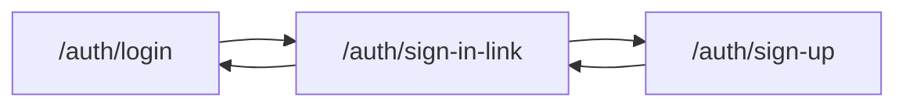

# Flow-neutral passwordless email screen

Copy, CTA placement, and one presentational extraction. No `next` on sign-up, no change to send/verify behavior.

## 1. Neutralize the request screen

In [`src/components/sign-in-link-form.tsx`](src/components/sign-in-link-form.tsx), change only the `EmailOtpRequestCard` copy props:

- `title`: `"Continue with email"`
- `description`: `"Enter your email and we'll send you a link and a code"`
- `submitLabel`: `"Email me a link"`
- `successTitle`: `"Check your email"`
- `successBody` second paragraph: `"We sent you an email."` (address line and the rest of that paragraph stay as they are)
- `footer`: `"Prefer a password? "` + `Link` to `loginHref` labeled `"Sign in"` + `" or "` + `Link` to `/auth/sign-up` labeled `"Sign up"`. Both links `prefetch={false}` with `className="underline underline-offset-4"`.

The screen creates an account for an unrecognized address, so no label on it may assume the person is signing in — that is why `successTitle` changes alongside `title`.

Leave `successDescription` (`"Use the link or code from your email"`) unchanged — it is already flow-neutral.

In [`src/app/auth/sign-in-link/page.tsx`](src/app/auth/sign-in-link/page.tsx), set `metadata.title` to `"Continue with email"`.

## 2. Extract the or-divider

Create `src/components/or-divider.tsx` exporting a named `OrDivider` — the divider block currently inline in [`src/components/login-form.tsx`](src/components/login-form.tsx), moved verbatim: a `relative` wrapper holding an absolutely positioned `w-full border-t` span and a centered `bg-card text-muted-foreground px-2` `"or"` label. No props; it is only used inside a `Card`, which is where `bg-card` is correct.

Replace the inline block in `login-form.tsx` with `<OrDivider />`. No test file — static presentational markup with no branch.

## 3. Align the login and sign-up CTAs

In [`src/components/login-form.tsx`](src/components/login-form.tsx), change the secondary button label from `"Email me a sign-in link"` to `"Email me a link"`. Href and `next` handling stay as they are.

In [`src/components/sign-up-form.tsx`](src/components/sign-up-form.tsx), after the `"Sign up"` submit button and still inside the `flex flex-col gap-6` stack, add `<OrDivider />` followed by an outline `Button asChild` wrapping a `Link` to `/auth/sign-in-link` (`prefetch={false}`), labeled `"Email me a link"`. Bare path — sign-up has no `next`. The existing `"Already have an account? Sign in"` row below the stack stays.

## 4. Update tests

[`src/components/sign-in-link-form.integration.test.tsx`](src/components/sign-in-link-form.integration.test.tsx):

- Every query for the old submit label (`/send sign-in link/i`) becomes `/email me a link/i`.
- Every assertion on the old success title (`/complete sign-in/i`, including the `queryByText` negative in the Activity-reset test) becomes `/check your email/i`.
- The confirmation-copy regex becomes `/we sent you an email\. enter the code below, or follow the link instead/i`.
- The Activity-reset title assertion `/sign in with email/i` becomes `/continue with email/i`.
- Leave the thrown-error mock string `"Unable to send sign-in link"` — that is not UI copy.

[`src/components/login-form.integration.test.tsx`](src/components/login-form.integration.test.tsx) — both sign-in-link CTA queries change from `/email me a sign-in link/i` to `/email me a link/i`. Href assertions stay.

[`src/components/sign-up-form.integration.test.tsx`](src/components/sign-up-form.integration.test.tsx) — add one test that `getByRole('link', { name: /email me a link/i })` has `href` `/auth/sign-in-link`.

## 5. Verify

Run `pnpm pre-push`. The change is string-to-assertion alignment across three test files; all must pass together before the work is finished.

## Out of scope

`EmailOtpRequestCard` itself, send/verify/redirect logic, recovery copy, README, and feature inventory.
