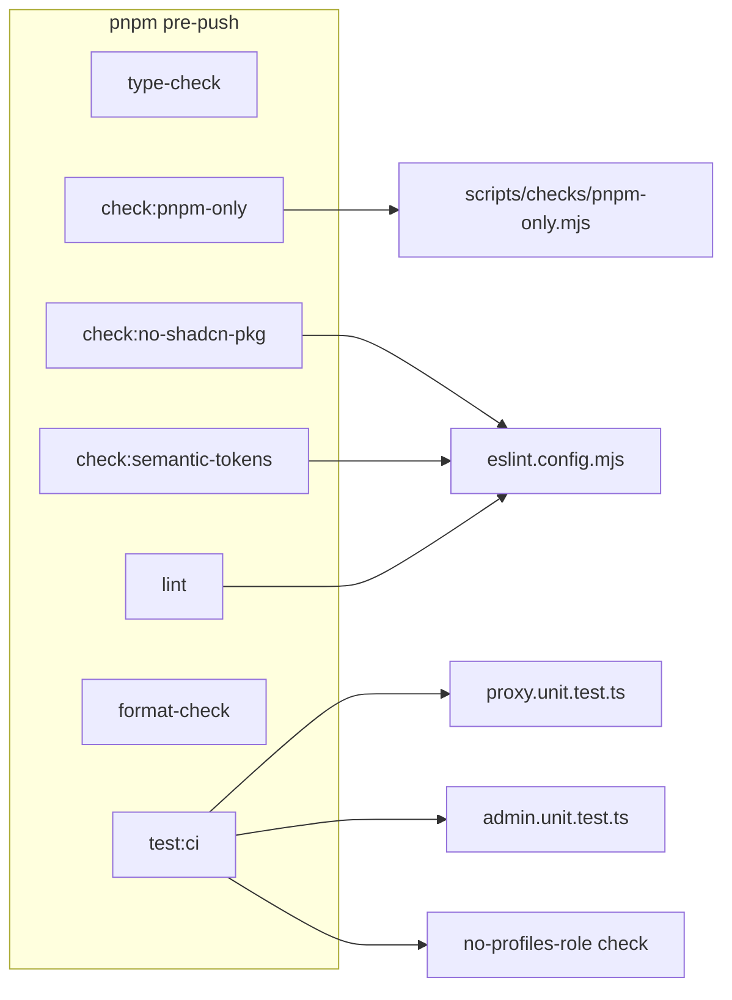

# Enforce five hard constraints deterministically

## Current state

| Constraint | Today | Gap |
|---|---|---|
| pnpm only | [`package.json`](package.json) already has `packageManager: "pnpm@11.0.9+sha512…"`; only `pnpm-lock.yaml` exists | No automated lockfile guard |
| No shadcn npm pkg | No shadcn imports in `src/` | [`eslint.config.mjs`](eslint.config.mjs) is bare `eslint-config-next` — no restricted-imports |
| Semantic tokens | App code uses semantic tokens; numeric scales only appear in exempted areas | No lint enforcement; `#features` anchor in [`src/config/site.ts`](src/config/site.ts) is safe because hex detection runs only inside class-string contexts (`className`, `cva`, `cn`) |
| Auth boundary | [`src/supabase/proxy.unit.test.ts`](src/supabase/proxy.unit.test.ts) tests `/profile`, `/admin`, `/` manually | Does not enumerate routes from [`src/app/`](src/app/) — new pages could ship without coverage |
| Admin gate | [`src/utils/admin.ts`](src/utils/admin.ts) reads `app_metadata.role` only; profiles migration has no `role` column | No source/migration safety tests |

**Confirmed exemption scope for semantic tokens** (after inspecting [`src/components/ui/`](src/components/ui/)):

- **Exempt entire directory:** `src/components/ui/**` — contains `text-white`, `bg-black/50`, `bg-transparent` on shadcn primitives (numeric scales are absent in app code today)
- **Exempt:** [`src/app/globals.css`](src/app/globals.css) — token definitions
- **Rule scope:** numeric Tailwind palette scales only (`bg-blue-500`, `text-red-600`, etc.) — **not** named utilities like `text-white`
- **Scan targets:** string/template literals inside JSX `className`/`class`, `cva()` base + variant strings, and `cn()` arguments when `cn` is imported from `@/utils/tailwind`
- **Out of scope for scan:** `clsx()` (zero direct usage in repo); identifier arguments to `cn()` (see known limitation below)

---

## Architecture



Each `check:*` script is runnable alone for debugging. Constraints 2–3 are also enforced by `pnpm lint` (same ESLint config). Constraints 4–5 are enforced by `pnpm test:ci` via extended Vitest files; `check:auth-boundary` and `check:admin-gate` are thin Vitest/script wrappers for targeted runs.

---

## 1. Package manager — `check:pnpm-only`

**New file:** [`scripts/checks/pnpm-only.mjs`](scripts/checks/pnpm-only.mjs)

- Fail with a clear message if `package-lock.json` or `yarn.lock` exists at repo root
- Read `package.json`; fail if `packageManager` is missing or does not start with `pnpm@`
- Optionally warn (not fail) if `packageManager` version disagrees with `pnpm --version` — only auto-fix/pin if missing (story: pin to currently installed version when adding)

**package.json script:** `"check:pnpm-only": "node scripts/checks/pnpm-only.mjs"`

No change needed to `packageManager` field unless verification finds it missing.

---

## 2. No shadcn npm package — `check:no-shadcn-pkg`

**Update:** [`eslint.config.mjs`](eslint.config.mjs)

Add `no-restricted-imports` (repo-wide, `src/**` and `scripts/**`):

```javascript
'no-restricted-imports': ['error', {
  paths: [
    { name: 'shadcn-ui', message: 'Primitive-first UI: own components in src/components/ui — do not install shadcn as an npm package.' },
    { name: '@shadcn/ui', message: '…' },
    { name: 'shadcn', message: '…' },
  ],
  patterns: [{ group: ['@shadcn/*'], message: '…' }],
}]
```

**package.json script:** `"check:no-shadcn-pkg": "eslint --max-warnings 0 --no-error-on-unmatched-pattern \"src/**/*.{ts,tsx}\" \"scripts/**/*.{ts,tsx}\""` — relies on the shared config; fails only on restricted-import violations.

---

## 3. Semantic tokens — `check:semantic-tokens`

**New file:** [`eslint-rules/semantic-tokens.mjs`](eslint-rules/semantic-tokens.mjs) — local ESLint rule plugin

Rule behavior:

- Applies to `src/**/*.{ts,tsx}` excluding `src/components/ui/**`
- Walk AST for:
  - `JSXAttribute` where `name.name === 'className'` (and `class` for completeness) — scan string/template literal values
  - `CallExpression` where callee is `cva` — scan base string + variant string literals (as originally specified)
  - `CallExpression` where callee resolves to `cn` imported from `@/utils/tailwind` — scan each **string and template-literal** argument with the same hex/numeric-scale detection (e.g. `cn("bg-blue-500", condition && "text-foreground")` flags the literal `"bg-blue-500"`)
- **Do not** add `clsx()` handling — confirmed zero direct usage in this codebase
- **Callee resolution for `cn`:** track `ImportSpecifier` / default import binding from `@/utils/tailwind` in the file scope; only flag `cn(...)` calls that use that binding (not arbitrary functions named `cn`)
- Shared detection (all three scan sites):
  - Hex colors: `#` + exactly 3, 4, 6, or 8 hex digits, not followed by another hex digit (avoids most false positives; class-string scope keeps `#features` in `href` untouched)
  - Numeric Tailwind scales: `(bg|text|border|ring|fill|stroke|from|to|via|outline|decoration|divide|placeholder|caret|accent|shadow)-(slate|gray|zinc|neutral|stone|red|orange|amber|yellow|lime|green|emerald|teal|cyan|sky|blue|indigo|violet|purple|fuchsia|pink|rose)-\d{2,3}`

**Known limitation — code comment in `eslint-rules/semantic-tokens.mjs`:**

> This rule does not resolve identifiers passed as `cn()` arguments back to their declarations (e.g. a shared style constant imported from another file). A raw color value inside such a constant will not be caught. Scoped out deliberately — see [ADR-0002](docs/adr/ADR-0002-dissolve-locked-rules-enforce-deterministically.md) for rationale (deterministic checks catch the common inline paths; full cross-file constant resolution is deferred to avoid false negatives from incomplete analysis and to keep the rule maintainable).

**Wire in** [`eslint.config.mjs`](eslint.config.mjs):

```javascript
{
  files: ['src/**/*.{ts,tsx}'],
  ignores: ['src/components/ui/**'],
  plugins: { local: { rules: { 'semantic-tokens': semanticTokensRule } } },
  rules: { 'local/semantic-tokens': 'error' },
}
```

**package.json script:** `"check:semantic-tokens": "eslint --max-warnings 0 --no-error-on-unmatched-pattern \"src/**/*.{ts,tsx}\""`

---

## 4. Auth boundary — extend proxy tests

**New helper:** [`src/test/discover-app-routes.ts`](src/test/discover-app-routes.ts)

Recursively walk [`src/app/`](src/app/):

- Skip `_`-prefixed segments, `_components`, `_lib`, and route-group folders `(…)` (contribute no URL segment)
- `page.tsx` → page route (`/`, `/profile`, `/admin/users`, …)
- `route.ts` → handler route (`/auth/confirm`, future `/api/...`)
- Normalize to leading-slash paths

**Update:** [`src/supabase/proxy.unit.test.ts`](src/supabase/proxy.unit.test.ts)

Add a `describe('auth boundary (discovered routes)')` block:

- `discoveredRoutes` computed once at module load
- **Public routes** (`/` or `/auth/**`): `it.each` asserts unauthenticated → status 200 (no login redirect)
- **Protected routes** (everything else): `it.each` asserts unauthenticated → 307 redirect to `/auth/login`
- Sanity assertion: discovered set is non-empty and includes known routes (`/profile`, `/admin`) so the helper itself is tested

This fails automatically when a new `page.tsx` or `route.ts` appears under `src/app/` without proxy coverage.

**package.json script:** `"check:auth-boundary": "vitest run src/supabase/proxy.unit.test.ts"`

---

## 5. Admin gate — extend admin tests + migration check

### 5a. Source contract test

**Update:** [`src/utils/admin.unit.test.ts`](src/utils/admin.unit.test.ts)

Add `describe('admin gate contract')`:

- Read `src/utils/admin.ts` source at test time
- Assert it references `app_metadata` / `ADMIN_ROLE` and does **not** import or query `profiles` for role
- Assert `isAdmin` implementation path goes through `isAdminFromAppMetadata(claims?.app_metadata)` (regex or simple string checks — behavioral tests already exist; this is the migration-safety contract)

### 5b. Migration safety check

**New file:** [`scripts/checks/no-profiles-role.mjs`](scripts/checks/no-profiles-role.mjs)

Scan every `supabase/migrations/*.sql`:

- Strip `--` line comments before matching (avoids false positive on existing comment *"No role column"*)
- Fail on DDL that adds `role` to `public.profiles`:
  - `create table public.profiles` with a `role` column definition
  - `alter table public.profiles … add … role`

Clear error names the migration file.

**New test:** [`scripts/checks/no-profiles-role.unit.test.ts`](scripts/checks/no-profiles-role.unit.test.ts) — smoke-test the checker against the real migrations dir (passes today) and a temp fixture migration that should fail.

**package.json script:** `"check:admin-gate": "node scripts/checks/no-profiles-role.mjs && vitest run src/utils/admin.unit.test.ts"`

---

## Wire into `pre-push` and CI

**Update** [`package.json`](package.json) `pre-push`:

```
pnpm type-check && \
pnpm check:pnpm-only && \
pnpm check:no-shadcn-pkg && \
pnpm check:semantic-tokens && \
pnpm lint && \
pnpm format-check && \
pnpm test:ci
```

- Constraints 2–3 run twice (isolated + full lint) — intentional per story; isolated scripts enable fast debugging
- Constraints 4–5 enforced via `test:ci` (extended Vitest files + migration unit test)

**Update** [`.github/workflows/pull-request.yaml`](.github/workflows/pull-request.yaml): add three explicit steps — `check:pnpm-only`, `check:no-shadcn-pkg`, `check:semantic-tokens` — before the existing lint step, each as its own named step (not folded into a single `pnpm pre-push` call), so a CI failure shows which specific constraint failed rather than a single opaque "pre-push failed."

---

## Verification (acceptance)

After implementation, deliberately violate each constraint locally and confirm the matching check fails with a clear message:

| Violation | Expected failure |
|---|---|
| Touch `package-lock.json` | `check:pnpm-only` |
| Add `import 'shadcn-ui'` in any ts file | `check:no-shadcn-pkg` / `lint` |
| Add `className="bg-blue-500"` in a non-exempt `src/` component | `check:semantic-tokens` / `lint` |
| Add `cn("bg-blue-500", condition && "text-foreground")` (with `cn` from `@/utils/tailwind`) in a non-exempt `src/` component | `check:semantic-tokens` / `lint` |
| Add `src/app/shop/page.tsx` without updating proxy | `check:auth-boundary` / `test:ci` |
| Add `role text` to profiles in a migration fixture | `check:admin-gate` / `test:ci` |

Then revert violations and confirm:

```bash
pnpm type-check && pnpm lint && pnpm format-check && pnpm test:ci
```

all pass with zero false positives on the current tree.

---

## Files touched (implementation)

| File | Action |
|---|---|
| [`package.json`](package.json) | Add 5 `check:*` scripts; extend `pre-push` |
| [`eslint.config.mjs`](eslint.config.mjs) | `no-restricted-imports` + local semantic-tokens rule |
| [`eslint-rules/semantic-tokens.mjs`](eslint-rules/semantic-tokens.mjs) | New custom rule |
| [`scripts/checks/pnpm-only.mjs`](scripts/checks/pnpm-only.mjs) | New |
| [`scripts/checks/no-profiles-role.mjs`](scripts/checks/no-profiles-role.mjs) | New |
| [`scripts/checks/no-profiles-role.unit.test.ts`](scripts/checks/no-profiles-role.unit.test.ts) | New |
| [`src/test/discover-app-routes.ts`](src/test/discover-app-routes.ts) | New route enumerator |
| [`src/supabase/proxy.unit.test.ts`](src/supabase/proxy.unit.test.ts) | Extend with discovered-route matrix |
| [`src/utils/admin.unit.test.ts`](src/utils/admin.unit.test.ts) | Extend with source contract |
| [`.github/workflows/pull-request.yaml`](.github/workflows/pull-request.yaml) | Add three named steps (`check:pnpm-only`, `check:no-shadcn-pkg`, `check:semantic-tokens`) before lint |

**Explicitly out of scope (at time of plan):** `AGENTS.md`, any `.cursor/rules/*.mdc` — docs restructure shipped separately.
