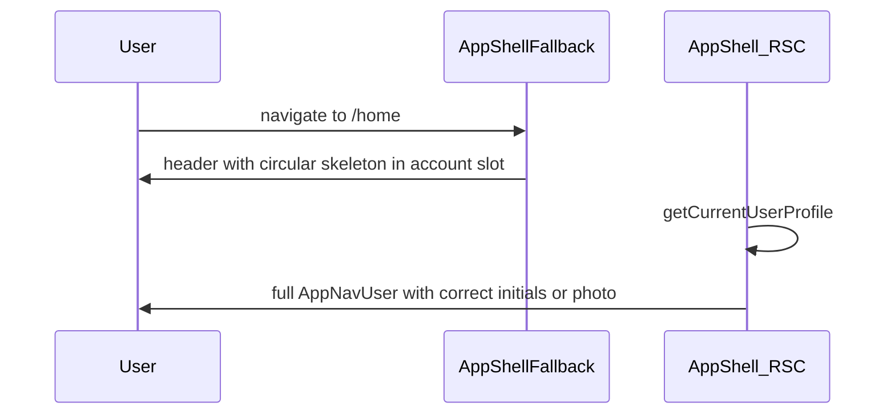

# Header avatar loading — skeleton fallback only

## Problem

Navigating to `/home` blocks on [`AppShell`](src/app/(app)/_components/app-shell.tsx) while [`getCurrentUserProfile`](src/app/(app)/_lib/get-current-user-profile.ts) runs. [`AppShellFallback`](src/app/(app)/_components/app-shell-fallback.tsx) renders a header with **no** `rightSlot` / `mobileNav`, leaving a blank gap on the right while the profile fetch completes.

Claims-only initials were considered and ruled out: email-based initials can disagree with display-name initials (e.g. FO → AW), which reads as a bug.

## Scope (this slice)

**In:** circular skeleton placeholder in the app shell fallback header (desktop + mobile slots).

**Out (deferred):** sessionStorage profile cache, homepage/login warming, avatar image prefetch, `AppShellHeaderNavSlot` cache preview. Revisit only if skeleton alone doesn't feel good enough after shipping.

## Architecture



Single transition: **skeleton → correct avatar**. No wrong-identity intermediate state.

## Implementation

### New component: `AppNavUserSkeleton`

Location: [`src/app/(app)/_components/app-nav-user-skeleton.tsx`](src/app/(app)/_components/app-nav-user-skeleton.tsx)

- Mirror [`AppNavUser`](src/app/(app)/_components/app-nav-user.tsx) trigger dimensions: ghost `Button` `size="icon"` `rounded-full` wrapping a circular [`Skeleton`](src/components/ui/skeleton.tsx) (`h-8 w-8 rounded-full`).
- **`disabled`** on the button — removes it from tab order and prevents activation while profile loads. A focusable control that does nothing is a keyboard trap in spirit; Epic 6's deterministic a11y bar will flag this class of issue.
- `aria-busy="true"` and `aria-label="Loading account menu"` on the button; `aria-hidden="true"` on the skeleton (matches [`DataTableSkeletonBody`](src/components/data-table-skeleton-body.tsx) pattern).
- Server component is fine — no client interactivity needed.

### Update `AppShellFallback`

[`src/app/(app)/_components/app-shell-fallback.tsx`](src/app/(app)/_components/app-shell-fallback.tsx)

- Pass `rightSlot` and `mobileNav` to `SiteHeader`, each rendering `<AppNavUserSkeleton />` — same dual-slot shape as live [`AppShell`](src/app/(app)/_components/app-shell.tsx).
- No changes to [`AppShell`](src/app/(app)/_components/app-shell.tsx) itself.

## Files touched

| File | Action |
|---|---|
| `src/app/(app)/_components/app-nav-user-skeleton.tsx` | Add |
| `src/app/(app)/_components/app-shell-fallback.tsx` | Edit |

## Tests

| File | Coverage |
|---|---|
| `src/app/(app)/_components/app-nav-user-skeleton.unit.test.tsx` | skeleton renders; button is `disabled`, has `aria-busy` and loading label; skeleton is `aria-hidden` |

No render-only test for `AppShellFallback` itself (per [`testing.mdc`](.cursor/rules/testing.mdc)); the skeleton component test covers the behavior.

## Quality gate

```bash
pnpm type-check && pnpm lint && pnpm format-check && pnpm test:ci
```

## Manual test checklist

1. **Homepage → Open app** (already signed in) — circular skeleton appears in header right slot during load, then correct avatar
2. **Login → /home** — same skeleton → avatar transition on first landing
3. **User with display name** — skeleton only, then correct initials (no email-initials flash)
4. **User with profile photo** — skeleton → initials briefly → photo (Radix fallback behavior unchanged)
5. **Mobile** — skeleton appears in mobile header slot too
6. **Slow network** (optional DevTools throttle) — skeleton stays visible for duration of profile fetch; no blank gap
7. **Keyboard** — Tab through header during load; skeleton account control is skipped (not in tab order); after load, real account menu is focusable and operable

## PRD placement

Fits as a small story under Phase 11, header-adjacent to completed Epic 2, e.g. **"2.3 Header account-menu skeleton fallback"** — no hard-constraint or schema changes.

## Future follow-up (not in this slice)

If skeleton feels too passive after shipping, profile warming can be added as a separate slice: sessionStorage cache, warm on homepage/login, cache preview in fallback. Design notes from the earlier plan iteration are preserved in chat history for reference.
