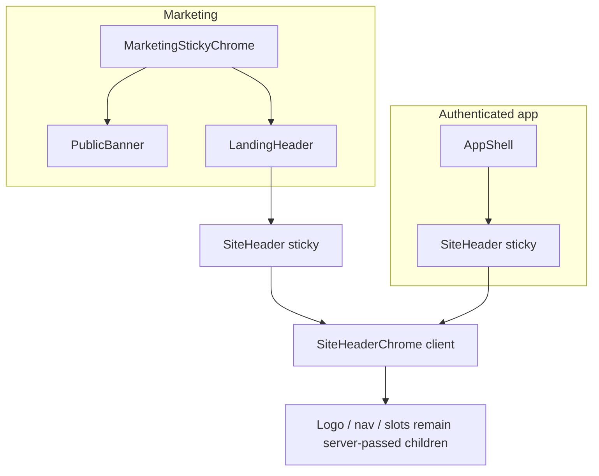

# Header polish

Four stories, one shared chrome path. [SiteHeader](src/components/site-header.tsx) serves marketing and the authenticated app; [SeminovaLogo](src/components/seminova-logo.tsx) also renders in the admin sidebar, footer, auth layout, and mobile sheet. Work lands on those shared files so both shells pick it up.

## Story 1 — Soften border tokens

Global tweak in [src/app/globals.css](src/app/globals.css). Keep `--border`, `--input`, and `--sidebar-border` in lockstep (they already match per mode).

- Light (`:root` / `.light`): `oklch(0.8717 0.0093 258.3382)` → `oklch(0.92 0.006 258)`
- Dark: `oklch(0.4461 0.0263 256.8018)` → `oklch(0.30 0.02 257)`

Starting values only — after the other stories land, eyeball cards, tables, inputs, sidebar, and dialogs in both modes and nudge if a surface goes too faint or stays too hard. No new tokens, no hardcoded colors in components. `check:a11y-contrast` ignores border tokens; `check:semantic-tokens` is unchanged.

## Story 2 — Scroll-aware sticky chrome

**Constraint:** [SiteHeader](src/components/site-header.tsx) stays a server component. `'use client'` only on the new hook and wrapper. Logo, nav, and slots stay children passed through — the Next.js pattern that keeps server slots (auth, mobile chrome) server-rendered.

**New files**

- [src/hooks/use-scrolled.ts](src/hooks/use-scrolled.ts) — `window.scrollY` past a 10px threshold with a dead band: flips on at 10px, back off at 4px, so scrolling near the boundary can't oscillate. Start `false` so SSR/first paint matches “at top.” Read `scrollY` before paint via an isomorphic layout effect (`useLayoutEffect` on the client, `useEffect` on the server) so the SSR pass doesn't warn — this component is a client component but Next still server-renders it. Attach the scroll listener with `{ passive: true }`. Co-located unit test, same style as [use-mobile.unit.test.ts](src/hooks/use-mobile.unit.test.ts).
- [src/components/site-header-chrome.tsx](src/components/site-header-chrome.tsx) — client wrapper that owns only the `<header>` class string: `sticky` / `children` in, class string out. Compose the rest/scrolled classes through `cn()` from `@/utils/tailwind` — no hand-concatenation.

**Chrome classes**

- Always reserve the hairline: `border-b` so toggling color cannot shift layout.
- At rest: transparent background, `border-transparent`, no blur.
- Past ~10px: `bg-background/95 backdrop-blur border-border`.
- Transition: `transition-colors duration-swept`. Kill it under reduced motion with `motion-reduce:transition-none` (CSS, not a JS check in the hook).

**Call sites**

- [landing-header.tsx](src/app/(marketing)/_components/landing-header.tsx) — drop `sticky={false}` so marketing uses the default sticky header.
- [marketing-sticky-chrome.tsx](src/app/(marketing)/_components/marketing-sticky-chrome.tsx) — **required companion, not in the epic text.** Today this wrapper is `sticky` *and* `bg-background/95`, so a transparent header would still sit on a frosted slab. Keep `sticky top-0 z-50` so a live public banner stays pinned with the header; drop `bg-background/95`. Banner tiles carry their own tint (`bg-primary/15`, etc.), but that only covers the tile — before settling on a fully transparent strip, render a live public banner and scroll content beneath it. If any wrapper padding around the tile lets content bleed through, keep a background on the banner row itself rather than on the whole wrapper.
- App shell already uses default sticky [SiteHeader](src/app/(app)/_components/app-shell.tsx) — it picks up the wrapper with no prop change.

Do not put scroll state on the marketing wrapper. The epic wants the client boundary on `<header>` only.

## Story 3 — Nav and auth affordances

[site-nav-links.tsx](src/components/site-nav-links.tsx)

- Container `gap-6` → `gap-1`.
- Every link: `px-3 py-1.5 rounded-md` (already `rounded-md` + swept color transition).
- Drop `font-medium` from the active state — same weight always, no row reflow.
- Active = background pill (`bg-muted text-foreground`). Hover = `hover:bg-muted` (inactive keeps `text-muted-foreground`).
- Mobile sheet already passes `gap-1` and `py-2` via `linkClassName` in [landing-mobile-nav.tsx](src/app/(marketing)/_components/landing-mobile-nav.tsx); tailwind-merge lets those win. Eyeball the sheet so pills don’t feel cramped.

[landing-auth-buttons.tsx](src/app/(marketing)/_components/landing-auth-buttons.tsx)

- “Sign in”: `outline` → `ghost`. “Sign up” stays the only solid button.
- Stacked mobile layout already applies `w-full` to both — leave that.

## Story 4 — Logo mark and header height

[seminova-logo.tsx](src/components/seminova-logo.tsx)

- Tile `size-8` → `size-7`.
- Inset ring + light shadow on the tile, semantic only: `ring-1 ring-inset ring-primary-foreground/20 shadow-xs`.
- Wordmark: add `tracking-tight`. Icon stays `size-4` unless the smaller tile looks cramped — then nudge, don’t invent a new size token.

Blast radius to eyeball: header, [site-footer](src/components/site-footer.tsx), [admin-sidebar](src/app/admin/_components/admin-sidebar.tsx) (including collapsed icon mode), [auth layout](src/app/auth/layout.tsx), mobile sheet.

[site-header.tsx](src/components/site-header.tsx) inner row: `h-16` → `h-14`. Update the `h-16` comments on [reference-anchor-links.ts](src/app/(marketing)/reference/_lib/reference-anchor-links.ts) and [workflow-anchor-links.ts](src/app/(marketing)/workflow/_lib/workflow-anchor-links.ts). Leave `scroll-pt-20` / `scroll-mt-24` — they still clear 56px. Admin shell header stays `h-16` (not SiteHeader).

## Tests

- [use-scrolled.unit.test.ts](src/hooks/use-scrolled.unit.test.ts) — new: false at rest, true past 10px, still true between 4px and 10px on the way back down, false at or below 4px.
- [site-header.unit.test.tsx](src/components/site-header.unit.test.tsx) — keep the composition assertion (wordmark, nav, slot). Add that the `<header>` is present so the wrapper seam is covered.
- [site-nav-links.unit.test.tsx](src/components/site-nav-links.unit.test.tsx) — keep the `aria-current` cases unchanged. Do not assert CSS classes: constant font weight and the pill background are verified in the visual sweep, not the unit suite.

No new landing-auth or logo tests unless an existing assertion breaks. [app-shell.unit.test.tsx](src/app/(app)/_components/app-shell.unit.test.tsx) and [admin-sidebar.unit.test.tsx](src/app/admin/_components/admin-sidebar.unit.test.tsx) mock these components and should stay green.

## Quality bar and visual sweep

`pnpm pre-push` (includes `check:semantic-tokens`). No README/DESIGN sync — token *values* are not documented there.

Visual pass, light and dark:

- Marketing landing at scroll-top (transparent, no hairline) and after a short scroll (frost + hairline), with and without a public banner.
- Landing hero with the header transparent at rest: nav links, ghost “Sign in,” and the wordmark must stay readable against the hero in both modes. Ghost drops the outline that currently helps “Sign in” sit on a busy background — if it fails, fix with tokens or a different shipped variant, never a hardcoded color.
- Authenticated app header (same chrome, no hero — frost will be subtle).
- Admin sidebar logo, collapsed and expanded.
- Border sweep: card, table, input, dialog, sidebar edge — not just the header. Accept/reject bar is WCAG 1.4.11: a control's edge must stay distinguishable from its surroundings at roughly 3:1. `check:a11y-contrast` does not cover border tokens, so this is the only gate on them — nudge the token if any surface drops below it.
- Reduced-motion: chrome should snap, not fade.

No layout shift when the hairline appears (reserved `border-b`). No `'use client'` on `site-header.tsx`.

## Close-out

After the quality bar and visual sweep pass, commit the epic as a single commit carrying the `Epic:` git trailer.

Then stop and tell the user to run `/code-review` in a new agent window.
