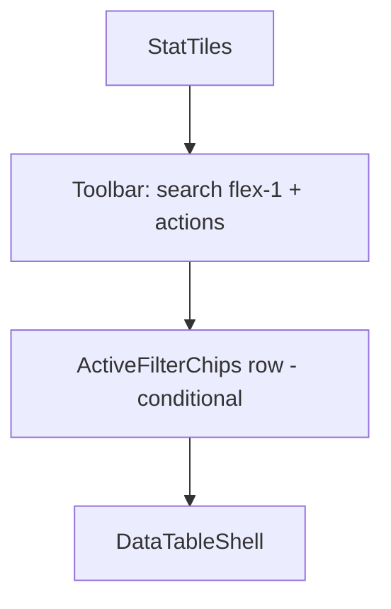
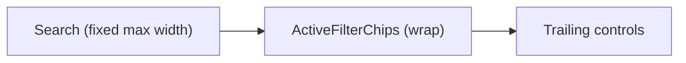

# Inline filter chips in admin table toolbars

## Problem

Today all three list views follow the same vertical stack:



The search input uses `flex-1` in [`users-toolbar.tsx`](src/app/admin/users/_components/users-toolbar.tsx), [`logs-toolbar.tsx`](src/app/admin/logs/_components/logs-toolbar.tsx), and [`reference-toolbar.tsx`](src/app/(marketing)/reference/_components/reference-toolbar.tsx), so it stretches to full available width even when no chips are active. When filters turn on, [`ActiveFilterChips`](src/components/active-filter-chips.tsx) renders as a **separate sibling row** below the toolbar (see [`users-table.tsx`](src/app/admin/users/_components/users-table.tsx) lines 82–96 and [`logs-table.tsx`](src/app/admin/logs/_components/logs-table.tsx) lines 83–105), which adds vertical chrome and feels like an extra layer.

## Target layout

One toolbar row on `sm+`:



- **Search** — stop using `flex-1`; use committed starting width `w-full sm:w-auto sm:min-w-[14rem] sm:max-w-xs`. This width is a post-build visual tuning target for the human reviewer, not a decision to make during implementation.
- **Chips** — sit immediately to the right of search; `flex min-w-0 flex-1 flex-wrap items-center gap-2` so they consume leftover space and wrap within the row instead of spawning a full-width second row.
- **Trailing controls** — stay right-aligned (`shrink-0`; keep existing `sm:ml-auto` on the action cluster where it already exists).
- **Mobile** — keep the existing `flex-col` stack, but order becomes: search → chips (when present) → actions, still within the toolbar component (no separate chip row).

When no filters are active, [`ActiveFilterChips`](src/components/active-filter-chips.tsx) already returns `null`, so the toolbar collapses to search + actions with no empty middle gap.

## Implementation approach

### 1. Tighten `ActiveFilterChips`

In [`src/components/active-filter-chips.tsx`](src/components/active-filter-chips.tsx):

- Remove the visible `"Active filters:"` label — chips + per-chip remove buttons + **Clear all** are sufficient when inline.
- Add an explicit accessible name to the chips container: `role="group"` with `aria-label="Active filters"`.
- Keep existing chip ids, remove handlers, and per-chip `aria-label` patterns unchanged (behavior stays the same).
- Update [`src/components/active-filter-chips.unit.test.tsx`](src/components/active-filter-chips.unit.test.tsx) to assert the group is queryable by that accessible name (`getByRole('group', { name: /active filters/i })`), replacing the removed visible-label assertion; keep remove/clear-all behavior tests.

### 2. Fold chips into each toolbar

Extend each toolbar to accept filter state (`filters`, `onRemove`, `onClearAll`) and render the existing `*ActiveFilters` helper inside it. Do not call `ActiveFilterChips` directly from any toolbar.

**Users** — [`users-toolbar.tsx`](src/app/admin/users/_components/users-toolbar.tsx) + [`users-table.tsx`](src/app/admin/users/_components/users-table.tsx):

- Add filter props (`filters`, `onRemove`, `onClearAll`) to the toolbar.
- Restructure outer layout: search column → inline `UsersActiveFilters` → refresh button.
- Preserve the email search hint below the input; use `sm:items-start` on the toolbar row so the hint doesn’t misalign trailing controls.
- Remove the standalone `<UsersActiveFilters />` sibling from `users-table.tsx`.

**Logs** — [`logs-toolbar.tsx`](src/app/admin/logs/_components/logs-toolbar.tsx) + [`logs-table.tsx`](src/app/admin/logs/_components/logs-table.tsx):

- Same inline chip slot between search and the tag combobox / action cluster.
- Order: `[search] [chips wrap] [LogsTagCombobox] [live + refresh + mark-all]`.
- Build the single-row inline layout with chips wrapping inside the toolbar container.
- Remove standalone `<LogsActiveFilters />` from `logs-table.tsx`.
- Whether Logs needs a dedicated second wrap line is a post-build visual tuning decision for the human reviewer; do not branch on it during implementation.

**Reference demo** — [`reference-toolbar.tsx`](src/app/(marketing)/reference/_components/reference-toolbar.tsx) + [`reference-table-demo.tsx`](src/app/(marketing)/reference/_components/reference-table-demo.tsx):

- Pass filter state into the toolbar and render `ReferenceActiveFilters` inline (search + chips + refresh) for canonical pattern parity documented in [`data-tables.mdc`](.cursor/rules/data-tables.mdc).

### 3. Doc touch (minimal)

Update the reference-implementation bullet in [`.cursor/rules/data-tables.mdc`](.cursor/rules/data-tables.mdc) to note that active filter chips render **inline in the toolbar** (not a separate row below). No AGENTS.md change — this is presentation polish, not a route or behavior contract change.

## Out of scope

- Stat tile behavior, chip label text, filter logic, or server queries — unchanged.
- New shared `DataTableToolbar` abstraction — three toolbar files already exist; a fourth wrapper would violate code minimalism unless duplication becomes painful (it shouldn’t for this change).
- Chip enter/exit layout animation — out of scope. Note: the `local/motion-tier` ESLint rule is already active, so any `transition-*` utility added or touched in these toolbars must carry `duration-swept` or `duration-dwell`.

## Manual test checklist

After implementation:

1. **Users (`/admin/users`)** — toggle stat-tile filters; confirm chips appear beside search (not a new row); search field is shorter; refresh stays right; removing chips and Clear all still work; email search hint still shows below search at 1–2 chars.
2. **Logs (`/admin/logs`)** — combine level tiles + unread + tag + search; confirm chips wrap inside toolbar without pushing table awkwardly; tag combobox and Live/Refresh/Mark-all remain usable.
3. **Reference (`/reference` table section)** — same inline behavior as Users.
4. **Responsive** — narrow viewport: search, then chips, then actions stack cleanly; no orphaned chip row.
5. **No-filter state** — with all filters cleared, toolbar is a single compact row (search + actions only).

## Quality gate

```bash
pnpm pre-push
```

Focus test updates on [`active-filter-chips.unit.test.tsx`](src/components/active-filter-chips.unit.test.tsx) only unless a toolbar test already exists and breaks.
