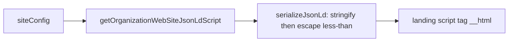
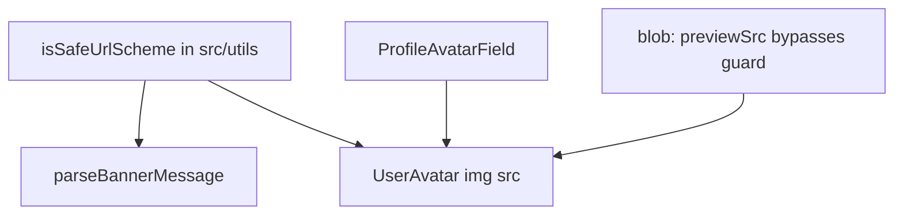

# JSON-LD escape and URL-scheme validation

Two small, independent security fixes. No schema or migration work.

## Story A — Escape `<` in JSON-LD

**Today:** [`src/utils/structured-data.ts`](src/utils/structured-data.ts) returns a graph object. [`src/app/(marketing)/page.tsx`](src/app/(marketing)/page.tsx) is the only `dangerouslySetInnerHTML` in the repo, and it injects `JSON.stringify(jsonLd)` unescaped. `JSON.stringify` does not escape `<`, so a later-editable site name of `</script>` would break out of the script tag.

**Change the builder’s contract, and its name with it.** Rename `getOrganizationWebSiteJsonLd` to **`getOrganizationWebSiteJsonLdScript`**, returning the **escaped JSON string** rather than the graph object. A private `serializeJsonLd` in the same file does `JSON.stringify(value).replace(/</g, '\\u003c')`. The landing page passes that string straight into `__html` — no stringify at the call site, so every future caller inherits the escape.

The rename is the guard, not decoration: `JSON.stringify` applied to a string type-checks and returns a quoted, double-encoded body with no error, so a name still reading as "returns the graph" leaves the exact re-stringify failure this story exists to close. `…JsonLdScript` makes the mistake visible at the call site without depending on anyone reading a rule file.

Keep `OrganizationWebSiteJsonLd` as the graph shape but **stop exporting it** — it is now internal to the module.

Rewrite the existing unit test in [`src/utils/structured-data.unit.test.ts`](src/utils/structured-data.unit.test.ts): it currently indexes `'@context'` and `'@graph'` on the returned object, which breaks against a string return. `JSON.parse` the returned string first, then keep the existing graph assertions against the parsed value (unicode escapes decode back to `<`, so they stay valid). Add a case that temporarily sets `siteConfig.name` to a value containing `</script>` and asserts the **serialized string** has no literal `</script>`.

**Reconcile the two rule files, one owner each.** [`seo.mdc`](.cursor/rules/seo.mdc) owns structured data — the escape contract lives there and only there. Update its Structured data paragraph to say the helper returns the escaped script body (`<` → `\u003c`), already serialized, and that pages inject it directly without stringifying.

[`security.mdc`](.cursor/rules/security.mdc) currently says to use DOMPurify with `dangerouslySetInnerHTML`. DOMPurify is not a project dependency, and it is the wrong control for JSON-LD (it treats the payload as HTML and would mangle it). Follow [rule-authoring](.cursor/skills/rule-authoring/SKILL.md) § Single ownership: rewrite the Injection Prevention bullet to carry the **principle only** — never use `dangerouslySetInnerHTML` for HTML; JSON-LD is the one shipped exception and is unicode-escaped by its builder, see `seo.mdc` § Structured data. Do not restate the helper name or the escape mechanic there; one of the two copies would go stale.

Put a one-line comment on the private serializer naming why this is unicode-escape, not HTML sanitization.

## Story B — One URL-scheme validator at render

**Today:** Banner links already validate in [`src/utils/parse-banner-message.ts`](src/utils/parse-banner-message.ts) (`isValidBannerLinkHref`: `http:`/`https:`, reject `//`, allow `/…`). Avatars do not. [`src/components/user-avatar.tsx`](src/components/user-avatar.tsx) and [`src/app/(app)/_components/profile/profile-avatar-field.tsx`](src/app/(app)/_components/profile/profile-avatar-field.tsx) put `avatarUrl` straight into `AvatarImage src`. Write-path checks (`isOwnedAvatarStorageUrl`) do not help a row written directly through RLS.

**The banner rules are the same as the story’s validator.** Lift the body of `isValidBannerLinkHref` into [`src/utils/is-safe-url-scheme.ts`](src/utils/is-safe-url-scheme.ts) as `isSafeUrlScheme`. `parse-banner-message.ts` imports it and **deletes the local copy** — no alias, no second implementation. This is the review watchpoint: the template’s scheme-validation surface shrinks to one function.

Do **not** merge with [`src/utils/is-safe-redirect.ts`](src/utils/is-safe-redirect.ts). That helper requires same-origin against a base URL for login `next` redirects. This one allows absolute `http:`/`https:` to any host, which banner links and avatar images need. A one-line comment on the new helper names that difference.

**Register it where security helpers are owned.** [`security.mdc`](.cursor/rules/security.mdc) § Open Redirect Prevention names `is-safe-redirect.ts` and tells agents never to re-implement redirect validation inline; nothing points at the new helper. Add a sibling line naming [`src/utils/is-safe-url-scheme.ts`](src/utils/is-safe-url-scheme.ts) as the render-time scheme check for DB-sourced URLs, and when to reach for it rather than `is-safe-redirect.ts`. Without this a spinoff adding a third URL-render surface inlines its own check — the drift this story exists to prevent.

**One guard in the shared path.** The guard lives inside `UserAvatar`, not at each render site. `ProfileAvatarField` and `UserAvatar` already duplicate the whole `Avatar` / `AvatarImage` / `AvatarFallback` / `getProfileInitials` block; guarding both would deepen that duplication and leave a fourth avatar surface inheriting nothing.

**Call sites**

- **Banner:** `parseBannerMessage` calls `isSafeUrlScheme` instead of `isValidBannerLinkHref`. Render in `banner-message.tsx` stays as-is (parse already dropped bad hrefs).
- **`UserAvatar`:** render `AvatarImage` only when the resolved src passes `isSafeUrlScheme`; otherwise initials via the existing fallback. Two new props:
  - `alt?: string` — when supplied, used as the image `alt`; when omitted, keep today's `alt="" role="presentation"` so the existing nav call sites are unchanged.
  - `previewSrc?: string | null` — a local `blob:` object URL that **bypasses** the guard and takes precedence over `avatarUrl`. It never reaches `isSafeUrlScheme` (which correctly rejects `blob:`) because it originates from `URL.createObjectURL` in this session, not from the database.
- **`ProfileAvatarField`:** delete its own `Avatar` block and its local `getProfileInitials` call; render `UserAvatar` with `avatarUrl`, `displayName`, `email`, `previewSrc={previewUrl}`, `alt={avatarAlt}`, and `className="h-16 w-16"` / `fallbackClassName="text-lg"` to preserve the current size. `hasAvatar` / Remove must key off **`previewUrl || avatarUrl`** — the raw values, not the guarded src — so a bad stored URL still renders initials but remains clearable.

**Tests**

- New [`src/utils/is-safe-url-scheme.unit.test.ts`](src/utils/is-safe-url-scheme.unit.test.ts): `javascript:`, `data:`, protocol-relative `//` → reject; same-origin path `/avatars/x` → allow; a realistic Supabase storage URL (`https://example.supabase.co/storage/v1/object/public/avatars/…`) → allow.
- Banner tests: drop the direct `isValidBannerLinkHref` import; keep the parse-behavior cases (javascript / `//` left as plain text).
- [`src/components/user-avatar.unit.test.tsx`](src/components/user-avatar.unit.test.tsx): `javascript:` (or `data:`) `avatarUrl` → no `avatar-image`, initials still shown; a `blob:` `previewSrc` → image renders and takes precedence over `avatarUrl`.
- [`profile-avatar-field.unit.test.tsx`](src/app/(app)/_components/profile/profile-avatar-field.unit.test.tsx): invalid persisted URL → no image but Remove still offered; existing upload path still shows the blob preview. Assert behaviour through the rendered output — these cases move down into `UserAvatar`'s implementation, so don't re-test the guard here.

## Out of scope

- Installing DOMPurify.
- Re-validating banner hrefs a second time at render.
- Changing avatar **write** validation (`isOwnedAvatarStorageUrl` stays the persist-time owner/origin check).
- `SECURITY_AUDIT.md` (audit snapshot, not this change’s contract).

## Verify

- `pnpm pre-push`
- View source on `/`: JSON-LD script has no raw `<` in string values; existing Organization / WebSite graph still parses.
- Signed-in profile: a normal https avatar still renders at the same 16-unit size with the same alt text; Change → file picker still shows the local preview before upload completes.
- Header and admin sidebar avatars are unchanged — no alt regression from `UserAvatar`'s new optional `alt`.
