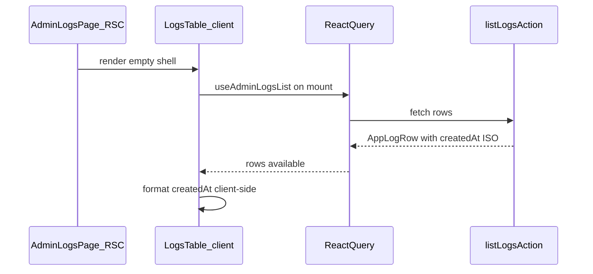

# Admin log timestamps — local timezone display

## Problem

[`formatLogTimestamp`](src/app/admin/logs/_lib/app-log-row.ts) runs inside [`mapAppLogRow`](src/app/admin/logs/_lib/app-log-row.ts) on the server. With no explicit `timeZone`, `Intl.DateTimeFormat` uses the server zone (UTC on Vercel). The table and detail dialog bind to the pre-formatted `timestampLabel`, so admins see UTC values that look like local time.

## Data-loading / hydration verdict

No hydration mismatch handling is required.

- [`page.tsx`](src/app/admin/logs/page.tsx) is a thin RSC shell; [`LogsTable`](src/app/admin/logs/_components/logs-table.tsx) is `'use client'`.
- [`useAdminLogsList`](src/app/admin/logs/_lib/use-admin-logs-list.ts) calls [`listLogsAction`](src/app/admin/logs/actions.ts) via TanStack Query after mount — no `prefetchQuery`, `HydrationBoundary`, or server-dehydrated logs cache exists under `src/app/admin/logs/`.
- Initial render shows skeleton rows (no timestamp text). Timestamps are formatted only once client data arrives, entirely in the browser.

## Shared formatting approach

**New module:** [`src/app/admin/logs/_lib/format-log-timestamp-display.ts`](src/app/admin/logs/_lib/format-log-timestamp-display.ts)

Move the existing date/time logic from `app-log-row.ts` here:

| Piece | Implementation |
| --- | --- |
| Date | `new Intl.DateTimeFormat(undefined, { month: 'short', day: 'numeric' })` |
| Time | `new Intl.DateTimeFormat(undefined, { hour: 'numeric', minute: '2-digit', second: '2-digit' })` |
| Milliseconds | Manual `padStart(3, '0')` on `date.getMilliseconds()` (unchanged) |
| Invalid input | Return `'—'` for null/undefined/unparseable ISO (same as today) |

**Per-call formatter construction (required):** instantiate both `Intl.DateTimeFormat` objects **inside** `formatLogTimestampDisplay` on every call — not as module-level constants. `Intl.DateTimeFormat` resolves its timezone at construction time; module-level instances would bake in the zone present at import and ignore `process.env.TZ` changes in tests.

**Exported API:** `formatLogTimestampDisplay(value: string | null | undefined): string`

**Output shape:** `{Mon} {day}, {h}:{mm}:{ss}.{mmm}` — e.g. `Jul 18, 10:32:07 AM.412`

- Preserve the existing comma + dot-before-ms convention.
- Omit explicit `timeZone` on formatters so the browser's local zone is used.
- **No timezone abbreviation** — no `timeZoneName`, no `formatToParts`, no zone suffix.
- No `'use client'` directive on the util file — it is plain Intl. Call sites are all client components; with client-only data loading, it will never run during SSR of row content.

**Reuse at three call sites:**

1. [`logs-columns.tsx`](src/app/admin/logs/_components/logs-columns.tsx) — custom `cell` renderer calling `formatLogTimestampDisplay(row.original.createdAt)` (column meta keeps `text-sm tabular-nums`).
2. [`log-detail-dialog.tsx`](src/app/admin/logs/_components/log-detail-dialog.tsx) — replace `log.timestampLabel` with `formatLogTimestampDisplay(log.createdAt)`.
3. [`logs-table.tsx`](src/app/admin/logs/_components/logs-table.tsx) — `getRowAccessibilityLabel` should format `row.createdAt` the same way so screen readers hear the local timestamp, not a removed field.

**Copy action:** unchanged — [`buildLogRowCopyText`](src/app/admin/logs/_lib/build-log-row-copy-text.ts) already passes raw ISO `createdAt`.

## Server-side cleanup

In [`app-log-row.ts`](src/app/admin/logs/_lib/app-log-row.ts):

- Remove `timestampLabel` from [`AppLogRow`](src/app/admin/logs/_lib/app-log-row.ts).
- Remove `logDateFormatter`, `logTimeFormatter`, `formatLogTimestamp`, and the `timestampLabel` assignment in `mapAppLogRow`.
- Leave `createdAt`, cursor types, and `mapAppLogRow` mapping otherwise intact (`isLogLevel` fallback, `isUnread` derivation).

No changes to [`list-app-logs.ts`](src/app/admin/logs/_lib/list-app-logs.ts), [`actions.ts`](src/app/admin/logs/actions.ts), or the DB query — server sort remains on `created_at`.

## Column / sort id cleanup (small, in-scope)

The timestamp column currently uses `accessorKey: 'timestampLabel'` and default sort id `'timestampLabel'`, but sorting is server-driven on `created_at` ([`manualSorting: true`](src/app/admin/logs/_components/logs-table.tsx), [`list-app-logs.ts`](src/app/admin/logs/_lib/list-app-logs.ts)).

Rename to `createdAt` for accuracy:

- [`logs-columns.tsx`](src/app/admin/logs/_components/logs-columns.tsx): `accessorKey: 'createdAt'` + custom `cell` (accessor value is unused for display once cell is custom).
- [`logs-table.tsx`](src/app/admin/logs/_components/logs-table.tsx): `DEFAULT_SORTING` id → `'createdAt'`.

Skeleton width stays at `w-36` (no abbrev suffix to accommodate).

## Files touched

| File | Change |
| --- | --- |
| **Add** [`format-log-timestamp-display.ts`](src/app/admin/logs/_lib/format-log-timestamp-display.ts) | Shared client formatter (per-call Intl, local TZ, no abbrev) |
| **Add** [`format-log-timestamp-display.unit.test.ts`](src/app/admin/logs/_lib/format-log-timestamp-display.unit.test.ts) | Formatter unit tests (relocated from old `formatLogTimestamp` tests) |
| [`app-log-row.ts`](src/app/admin/logs/_lib/app-log-row.ts) | Drop `timestampLabel`, `formatLogTimestamp`, formatters |
| [`app-log-row.unit.test.ts`](src/app/admin/logs/_lib/app-log-row.unit.test.ts) | Remove `formatLogTimestamp` tests; **keep file** with `mapAppLogRow` tests for level fallback and `isUnread` |
| [`logs-columns.tsx`](src/app/admin/logs/_components/logs-columns.tsx) | Custom cell; sort key `createdAt` |
| [`log-detail-dialog.tsx`](src/app/admin/logs/_components/log-detail-dialog.tsx) | Use `formatLogTimestampDisplay(log.createdAt)` |
| [`logs-table.tsx`](src/app/admin/logs/_components/logs-table.tsx) | Sort id `createdAt`; aria label uses formatter |
| [`log-detail-dialog.unit.test.tsx`](src/app/admin/logs/_components/log-detail-dialog.unit.test.tsx) | Drop `timestampLabel` from fixtures; assert formatted output |
| [`logs-table.unit.test.tsx`](src/app/admin/logs/_components/logs-table.unit.test.tsx) | Drop `timestampLabel` from fixtures |
| [`actions.unit.test.ts`](src/app/admin/logs/actions.unit.test.ts) | Drop `timestampLabel` from expected row shape |

**Not touched:** copy pipeline, Server Actions, schema, query keys, realtime hook.

## Tests

### Formatter — new file

Move the existing `formatLogTimestamp` describe block from [`app-log-row.unit.test.ts`](src/app/admin/logs/_lib/app-log-row.unit.test.ts) to [`format-log-timestamp-display.unit.test.ts`](src/app/admin/logs/_lib/format-log-timestamp-display.unit.test.ts), importing `formatLogTimestampDisplay` instead.

- **Happy:** pin `process.env.TZ = 'America/New_York'` in `beforeEach` (restore in `afterEach`) and assert a known ISO string produces the expected local time and preserves `.412` ms.
- **Invalid/boundary:** null, undefined, bad string → `'—'` (timezone-independent).
- **Shape:** assert no year in output; match `/^Jul 18, .+\.412$/`.

Per-call formatter construction ensures TZ pinning in `beforeEach` applies correctly (runs after module import).

### `mapAppLogRow` — keep in app-log-row.unit.test.ts

Do **not** delete [`app-log-row.unit.test.ts`](src/app/admin/logs/_lib/app-log-row.unit.test.ts). Remove only the timestamp formatter tests. The file today contains only `formatLogTimestamp` coverage; after relocation, add `mapAppLogRow` tests for surviving logic:

- **Level fallback:** unknown `level` string maps to `'info'`.
- **`isUnread`:** `read_at: null` → `isUnread: true`; non-null `read_at` → `isUnread: false`.

Do not drop coverage for these behaviors.

### Component / action tests

Update fixtures to remove `timestampLabel`. For dialog/table tests that assert visible timestamp text, pin TZ or use a flexible matcher (date + ms) rather than the old UTC-derived literal.

Run quality bar: `pnpm type-check && pnpm lint && pnpm format-check && pnpm test:ci`.

## Manual testing checklist

1. Open `/admin/logs` while signed in as admin — confirm timestamps match your local clock, not UTC.
2. Open a log row detail dialog — timestamp matches the table cell for that row.
3. Click **Copy** on a row and in the dialog — pasted JSON still contains raw ISO `createdAt`, unchanged.
4. Toggle timestamp sort asc/desc — ordering still correct (server sort unaffected).
5. Optional: change OS timezone and refresh — displayed times shift accordingly.
