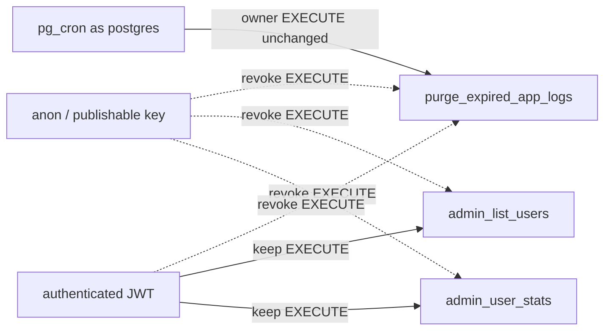

# Epic 1 — Lock down public function EXECUTE grants (S007, S016)

Grant-only schema change. No function rewrite, no cron reschedule, no TypeScript.

## Why this is the right shape

Postgres grants EXECUTE to `PUBLIC` on new functions. Supabase then also default-grants EXECUTE to `anon` and `authenticated`. `REVOKE … FROM PUBLIC` does **not** remove those per-role grants — which is why [`purge_expired_app_logs`](supabase/migrations/20260718135028_schedule_app_logs_retention_purge.sql) is still callable with the publishable key (S007), and why [`admin_list_users`](supabase/migrations/20260720142910_admin_list_users_new_30d_filter.sql) / [`admin_user_stats`](supabase/migrations/20260720142910_admin_list_users_new_30d_filter.sql) remain reachable by `anon` even though they already grant `authenticated` (S016). The in-function admin gate on the list/stats RPCs fails closed today; this is defense-in-depth, not a data leak.

The admin users page calls both RPCs through the **session** client ([`list-actions.ts`](src/app/admin/users/_lib/list-actions.ts) → `createClient` from `@/supabase/server`). That JWT is the `authenticated` role. Revoking `authenticated` on those two functions would empty the users table and stats tiles for a signed-in admin. The purge function is invoked only by pg_cron as the database owner, who keeps EXECUTE regardless of client-role revokes.



## Out of scope

- A `check:*` scanner for function grants (S007 listed it as a later consideration; this epic is one migration).
- Redefining function bodies, dropping overloads, or touching [`rls_auto_enable`](supabase/migrations/20260720151459_revoke_client_execute_trigger_functions.sql) (F175’s uppercase-SQL half).
- Revoking `service_role` or re-scheduling `purge-expired-app-logs`.
- **Changing the platform default** — `alter default privileges … revoke execute on functions` for role `postgres`, so future functions are opt-in. Deferred to a PM decision; tracked in [BACKLOG.md](BACKLOG.md) § Opt-in EXECUTE for new database functions. Do not add it to this migration.

## Preconditions

Run before Step 1:

- `git status --porcelain` returns nothing. This epic lands as a single commit; an unclean tree would sweep unrelated changes into it.
- Confirm the current branch is the one this work should land on.

## Step 1 — One migration

Follow [create-migration](.cursor/skills/create-migration/SKILL.md): first line `-- Generated using the create-migration skill`; UTC timestamp from `date -u +%Y%m%d%H%M%S`, strictly after `20260827223154`.

File: `supabase/migrations/{timestamp}_revoke_client_execute_on_public_functions.sql`

Header: purpose (lock down leftover client EXECUTE grants on three existing functions), affected objects (the three functions), RLS: none.

**Existing functions** (do not `create or replace`; grants only):

- `public.purge_expired_app_logs()` — `revoke execute` from `public`, `anon`, and `authenticated`. Match the three-role pattern already used on [`handle_new_user`](supabase/migrations/20260827223154_profiles_has_password.sql).
- `public.admin_list_users(text, text, int, int, text, boolean, boolean, boolean)` — `revoke execute` from `anon` only. Leave the existing `grant execute … to authenticated`.
- `public.admin_user_stats()` — same: `revoke execute` from `anon` only.

Do not revoke from `service_role`. Nothing else changes — the migration is three `revoke` statements plus the header.

## Step 2 — Convention so the next function does not reintroduce this

Add a short grant rule under **Database functions** in [`.cursor/rules/supabase-sql.mdc`](.cursor/rules/supabase-sql.mdc):

- Postgres grants EXECUTE to `PUBLIC` on every new function, and Supabase additionally grants it to `anon` and `authenticated`. `revoke … from public` alone does **not** remove those per-role grants.
- Every new `public` function must `revoke execute` from `public`, `anon`, **and** `authenticated` in the same migration that creates it, then `grant execute` only to the roles that should call it. Trigger- and cron-only functions get no client grant.

This is the recurrence guard the template has today. It is a prompt, not enforcement — the structural options (opt-in default privileges, or a `check:*` scanner) are both deferred; see Out of scope.

Then run `/sync-repo-docs` — AGENTS.md § Agent workflow step 4 requires it after any `.cursor/rules/` change.

## Step 3 — Close the findings

In [SECURITY_AUDIT.md](SECURITY_AUDIT.md):

- Move **S007** and **S016** to **Resolved** with today’s date (2026-08-28). Every existing Resolved entry (S006, S017) carries verification evidence; these cannot until the migration is applied, so write each Notes cell ending in `Verification pending — has_function_privilege checks after db:push`, to be replaced with the actual results once run.
- Executive summary: replace the `Medium — unauthenticated RPC reachable (S007, W2)` bullet with a `Resolved this window` bullet, following the existing `Resolved this window — Next.js upgraded to 16.3.3 (S006, W7)` bullet as the model (S017 has no exec-summary bullet). Update the open counts in the first bullet from `3 Medium, 8 Low` to `2 Medium, 7 Low`.
- § Verified OK, W2: the sentence naming `handle_new_user` and `rls_auto_enable` as revoked from `public`, `anon`, and `authenticated` now applies to all five SECURITY DEFINER functions. Widen it rather than leaving it listing two.
- **Keep** the S007 verification bullet under Human / tooling follow-ups until the checks below have actually been run and their results recorded. It also carries `select proname, proacl from pg_proc where pronamespace = 'public'::regnamespace;` — the whole-picture enumeration the audit calls highest-value, which nothing in this epic performs. Rewrite it to point at the post-`db:push` checks rather than the pre-fix investigation, and delete it only once those results are in the Resolved rows.

Leave [TECH_DEBT_AUDIT.md](TECH_DEBT_AUDIT.md) alone (F175’s second half is unrelated). No `pnpm db:types` — grants do not change generated types.

## Verification (after you run `pnpm db:push`)

I will not run `pnpm db:push`. After you apply the migration, in the SQL editor:

- `has_function_privilege('anon', 'public.purge_expired_app_logs()', 'execute')` → false
- `has_function_privilege('authenticated', 'public.purge_expired_app_logs()', 'execute')` → false
- same for `anon` on `admin_list_users(text, text, integer, integer, text, boolean, boolean, boolean)` and `admin_user_stats()` → false
- `has_function_privilege('authenticated', …)` on the two admin RPCs stays true
- `select jobname, schedule, command from cron.job where jobname = 'purge-expired-app-logs'` still shows the 03:00 UTC `select public.purge_expired_app_logs();` job
- optional: `select public.purge_expired_app_logs();` as postgres still deletes rows older than `log_retention_days`

Then the whole-picture enumeration the audit asks for, which nothing in this epic performs automatically:

- `select proname, proacl from pg_proc where pronamespace = 'public'::regnamespace;` → no `public` function still carries a client EXECUTE grant beyond `admin_list_users` / `admin_user_stats` to `authenticated`

Then: `/admin/users` as an admin still lists users and shows the four stat tiles. `pnpm pre-push` green (no app-code change; this is a sanity gate).

## Manual-testing checklist (for you after `db:push`)

1. SQL editor: the four `has_function_privilege` checks above.
2. SQL editor: the `pg_proc` / `proacl` enumeration — record the result in the S007 Resolved row and then drop the follow-up bullet.
3. SQL editor: cron job row still present with the same command.
4. Sign in as an admin → `/admin/users`: table populated, stat tiles show counts, paging/filters still work.
5. Optional: call `purge_expired_app_logs()` as postgres; expired rows gone, recent rows remain.

## Close-out

1. `pnpm pre-push` green.
2. Commit the epic as a single commit — this is the authorized Commit epic step under `git-workflow.mdc` § Commits:

```
fix(db): revoke client EXECUTE on public functions

Epic: lock-function-execute-grants
```

3. Tell the PM to review the SQL, run `pnpm db:push`, and work the manual-testing checklist.
