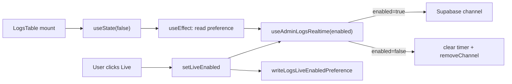

# Admin logs Live toggle — default off + localStorage persistence

## Current state

- [`logs-table.tsx`](src/app/admin/logs/_components/logs-table.tsx) initializes `liveEnabled` with `useState(true)` and passes it straight through to `useAdminLogsRealtime({ enabled: liveEnabled })` and `onLiveEnabledChange={setLiveEnabled}`.
- [`use-admin-logs-realtime.ts`](src/app/admin/logs/_lib/use-admin-logs-realtime.ts) already gates subscription on `enabled` and tears down correctly when disabled or unmounted (clear debounce timer + `removeChannel`). Existing unit tests in [`use-admin-logs-realtime.unit.test.tsx`](src/app/admin/logs/_lib/use-admin-logs-realtime.unit.test.tsx) cover toggle-off and unmount — **no hook changes expected**.
- No repo-wide localStorage convention exists today (banners use cookies; authenticated banner dismissal is in-memory only).
- Docs that imply default-on: [`AGENTS.md`](AGENTS.md) says `LogsLiveToggle` is **"default on"**. [`README.md`](README.md) describes "live on/off toggle" but does not state a default — still worth a one-line clarification.



## Implementation

### 1. New logs-scoped preference module

Add [`src/app/admin/logs/_lib/logs-live-preference.ts`](src/app/admin/logs/_lib/logs-live-preference.ts):

| Export | Responsibility |
|--------|----------------|
| `LOGS_LIVE_ENABLED_STORAGE_KEY` | Single namespaced key, e.g. `'admin-logs-live-enabled'` |
| `readLogsLiveEnabledPreference()` | Returns `boolean`; default **`false`** when key absent |
| `writeLogsLiveEnabledPreference(enabled)` | Persists `'true'` / `'false'`; **silent no-op** on failure |

Crash-proof rules (both helpers):

- **SSR guard:** `typeof window === 'undefined'` → read returns `false`, write returns immediately.
- **try/catch** around `getItem` / `setItem` → read falls back to `false`; write fails silently.
- **Invalid stored values** (garbage string) → treat as `false` (only accept explicit `'true'`).

Keep helpers thin — no React, no hook abstraction (per request).

### 2. Wire preference into LogsTable

In [`logs-table.tsx`](src/app/admin/logs/_components/logs-table.tsx):

- `useState(false)` for initial render (matches SSR/hydration — no localStorage read in render).
- `useEffect` on mount: `setLiveEnabled(readLogsLiveEnabledPreference())`.
- Replace `onLiveEnabledChange={setLiveEnabled}` with a `useCallback` handler that updates state **and** calls `writeLogsLiveEnabledPreference`.

No changes to [`logs-live-toggle.tsx`](src/app/admin/logs/_components/logs-live-toggle.tsx) or [`logs-toolbar.tsx`](src/app/admin/logs/_components/logs-toolbar.tsx) — they remain controlled components.

**Optional consistency tweak (one line):** change `useAdminLogsRealtime` default param from `enabled = true` to `enabled = false` in [`use-admin-logs-realtime.ts`](src/app/admin/logs/_lib/use-admin-logs-realtime.ts). Call site always passes `enabled` today; this is defensive only.

### 3. Subscription teardown — re-confirm only

After wiring, verify (read-only) that [`use-admin-logs-realtime.ts`](src/app/admin/logs/_lib/use-admin-logs-realtime.ts) still:

- Returns early when `!enabled` (clears debounce timer, no channel).
- Cleanup on unmount / toggle-off calls `removeChannel`.

Existing tests already assert toggle-off and unmount behavior — **run them, do not rewrite**.

### 4. Tests

**New [`logs-live-preference.unit.test.ts`](src/app/admin/logs/_lib/logs-live-preference.unit.test.ts)** — focused helper coverage:

- Missing key → `false`
- Stored `'true'` / `'false'` round-trip
- Invalid value → `false`
- `getItem` / `setItem` throw → graceful degrade
- SSR guard (mock `window` absent or spy `getItem` not called when guarded)

**Update [`logs-table.unit.test.tsx`](src/app/admin/logs/_components/logs-table.unit.test.tsx):**

| Test | Change |
|------|--------|
| Current "pressed by default / enabled: true" | Flip to **off by default**: `enabled: false`, `aria-pressed="false"`, button name `/turn live feed on/i` |
| Current "turn off → enabled: false" | Reframe as **turn on → enabled: true** (start off, click on) |
| **New:** restore from storage | Pre-seed `localStorage` with `'true'` before `renderTable()`; `waitFor` hook called with `{ enabled: true }` |
| **New:** write on toggle | Click turn-on; assert `localStorage.getItem(LOGS_LIVE_ENABLED_STORAGE_KEY) === 'true'` (and off path writes `'false'`) |

Use a real or mocked `localStorage` in `beforeEach` (clear key). Mock the preference module only if direct `localStorage` mocking is awkward — prefer testing through the real helpers for integration fidelity.

### 5. Docs sync

Minimal edits per [`sync-repo-docs`](.cursor/skills/sync-repo-docs/SKILL.md):

- **[`AGENTS.md`](AGENTS.md)** — Admin console `/admin/logs` bullet: change `LogsLiveToggle` from **"default on"** to **"default off; preference persisted in localStorage"**.
- **[`README.md`](README.md)** — Step 6 `/admin/logs` sentence: note live feed is **off until toggled on** and the choice **persists across visits** (keep existing feature list intact).

No PRD/ADR changes — product spec describes the live feed capability, not the default toggle state.

### 6. Quality bar

```bash
pnpm type-check && pnpm lint && pnpm format-check && pnpm test:ci
```

Focus targeted runs during dev:

```bash
pnpm test:file -- src/app/admin/logs/_lib/logs-live-preference.unit.test.ts
pnpm test:file -- src/app/admin/logs/_components/logs-table.unit.test.tsx
pnpm test:file -- src/app/admin/logs/_lib/use-admin-logs-realtime.unit.test.tsx
```

## Manual test checklist

1. Open `/admin/logs` in a fresh profile (or cleared site data) — Live toggle is **off**, no Realtime subscription until enabled (Network tab: no lingering channel until toggled).
2. Turn Live **on** — new log rows appear without manual refresh; reload page — toggle stays **on**.
3. Turn Live **off** — reload — toggle stays **off**.
4. DevTools → Application → Local Storage — key `admin-logs-live-enabled` holds `'true'` / `'false'`.
5. (Optional) Disable storage or simulate private-mode throw — page loads with toggle off, toggling does not crash.

## Files touched (expected)

| File | Action |
|------|--------|
| `src/app/admin/logs/_lib/logs-live-preference.ts` | **Add** |
| `src/app/admin/logs/_lib/logs-live-preference.unit.test.ts` | **Add** |
| `src/app/admin/logs/_components/logs-table.tsx` | **Edit** — default, restore, persist |
| `src/app/admin/logs/_components/logs-table.unit.test.tsx` | **Edit** — default + storage cases |
| `AGENTS.md` | **Edit** — default-off + persistence |
| `README.md` | **Edit** — one-line behavior note |

No migration, no hook logic changes beyond optional default param.
