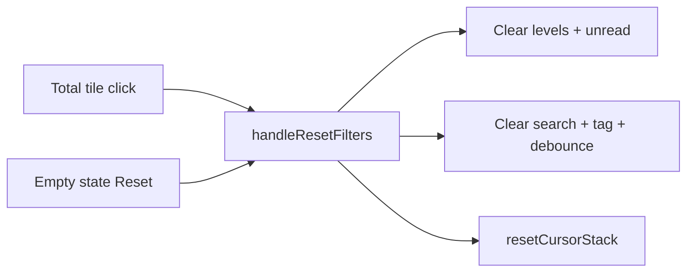

# Admin Logs — Design Critique Follow-up

**Scope:** Three priority items from the `/admin/logs` design critique. No schema, ADR, or AGENTS.md changes (UI-only polish). Phase 13 is complete; this lands as a small standalone commit.

**Precondition:** `git status --porcelain` empty before first edit (stash/commit untracked plan files if needed).

---

## Problem summary

| Issue | Root cause |
| ----- | ---------- |
| Total tile misleads | [`handleTotalClick`](src/app/admin/logs/_components/logs-table.tsx) only clears level + unread; tooltip says “Clear all filters” |
| Total looks “selected” while filtered | [`LogsStatTiles`](src/app/admin/logs/_components/logs-stat-tiles.tsx) `isUnfiltered` ignores search + tag |
| Live / Mark-all scope unclear | No supplementary hints on toolbar controls |
| Unread dot hard to tap | [`LogUnreadIndicator`](src/app/admin/logs/_components/log-unread-indicator.tsx) button is 16×16px |

---

## Step 1 — Full reset on Total tile

**Goal:** Total click, empty-state Reset, and tooltip all mean the same thing.

In [`logs-table.tsx`](src/app/admin/logs/_components/logs-table.tsx):

- Replace `handleTotalClick` body with a call to existing `handleResetFilters` (or inline the same logic once and reuse from both handlers—prefer **one handler, two call sites** to avoid drift).
- Pass `isFullyUnfiltered={!hasActiveLogListFilters(filters)}` into `LogsStatTiles` instead of computing `isUnfiltered` from levels + unread only.

In [`logs-stat-tiles.tsx`](src/app/admin/logs/_components/logs-stat-tiles.tsx):

- Add prop `isFullyUnfiltered: boolean`.
- Use it for Total tile `selected={isFullyUnfiltered}` (remove local `isUnfiltered` derived from levels/unread only).
- Keep tooltip `"Clear all filters"` — now accurate.



**Tests** — extend [`logs-table.unit.test.tsx`](src/app/admin/logs/_components/logs-table.unit.test.tsx):

- New case: set search text and/or tag filter, click Total tile → assert `listLogsAction` called with `defaultListParams` (same assertion as existing empty-state reset test).
- Optional: assert search input cleared in DOM after Total click (mirrors empty-state test depth).

No new test file needed if table-level interaction covers it.

---

## Step 2 — Scope tooltips on Live toggle and Mark all

**Goal:** Clarify paused feed and filtered mark-all scope without adding connection-state UI (Epic 4 decision stands).

Reuse the existing [`Tooltip`](src/components/ui/tooltip.tsx) pattern from [`StatTile`](src/components/stat-tile.tsx) (500ms delay is fine; no need to extract a shared constant).

### Live toggle — [`logs-live-toggle.tsx`](src/app/admin/logs/_components/logs-live-toggle.tsx)

Wrap the button in `Tooltip` + `TooltipTrigger asChild`:

| State | Tooltip copy |
| ----- | -------------- |
| On (`liveEnabled`) | `Pause the live feed. Use Refresh to catch up manually.` |
| Off | `Live feed paused. Turn on or use Refresh to catch up.` |

Keep existing `aria-label` (`Turn live feed on/off`) and `aria-pressed`.

### Mark all — [`logs-toolbar.tsx`](src/app/admin/logs/_components/logs-toolbar.tsx)

Add prop `markAllTooltip: string` from parent (keeps toolbar dumb; parent knows filter state).

In [`logs-table.tsx`](src/app/admin/logs/_components/logs-table.tsx):

- `markAllTooltip = hasActiveLogListFilters(filters) ? 'Mark unread logs in the current filter view as read' : 'Mark all unread logs as read'`

Wrap the Mark-all button in the same Tooltip pattern. Disabled state still shows tooltip (Radix supports this via trigger wrapper).

**Tests** — light additions in [`logs-table.unit.test.tsx`](src/app/admin/logs/_components/logs-table.unit.test.tsx) or a focused [`logs-toolbar.unit.test.tsx`](src/app/admin/logs/_components/logs-toolbar.unit.test.tsx) only if table tests get heavy:

- Prefer **one** table test: with Error filter active, hover/focus Mark-all and assert tooltip text (RTL `getByRole('button', { name: /mark all/i })` + tooltip content if visible on hover—or assert `aria-label` if tooltip uses it; use project Tooltip test pattern from stat-tile tests if any exist).

If tooltip content is not easily asserted on hover in RTL, skip tooltip DOM tests and rely on manual checklist—behavior is copy-only.

---

## Step 3 — Unread dot touch target

**Goal:** Meet ~44px touch guidance without changing the visible dot size.

In [`log-unread-indicator.tsx`](src/app/admin/logs/_components/log-unread-indicator.tsx):

- Increase interactive area: e.g. `size-11` (44px) or `min-h-11 min-w-11` on the button with `inline-flex items-center justify-center`.
- Keep inner dot at `size-1.5`.
- Preserve `stopPropagation` behavior (unchanged).

Read path placeholder (`size-4` span) can stay as-is for column alignment.

**Tests** — optional class assertion avoided per testing.mdc; manual narrow-viewport check suffices. No new unit test unless an existing unread-indicator test breaks.

---

## Out of scope (explicit)

- Users page Total tile + search mismatch (same pattern exists on [`users-stat-tiles.tsx`](src/app/admin/users/_components/users-stat-tiles.tsx) but not in this plan)
- Live toggle pulse ring removal (critique noted as optional; leave unless you ask)
- Page subtitle copy change
- Reconnecting/offline connection indicator
- AGENTS.md / PRD updates

---

## Verification

Quality bar before handoff:

```bash
pnpm type-check && pnpm lint && pnpm format-check && pnpm test:ci
```

Focused run while iterating:

```bash
pnpm test:file -- src/app/admin/logs/_components/logs-table.unit.test.tsx
```

### Manual checklist

1. Apply search + tag + Error tile → Total tile is **not** selected; click Total → all filters clear and table refetches unfiltered.
2. Filtered empty state Reset still clears everything (unchanged).
3. Live on: tooltip explains pause + manual refresh; Live off: tooltip explains catch-up.
4. With filters active, Mark-all tooltip mentions “current filter view”; with no filters, “all unread logs”.
5. On mobile/narrow width, unread dot is easy to tap without opening row detail.

---

## Commit

Single conventional commit when green:

```
fix(admin): align logs filter reset and toolbar clarity

Epic: n/a
```

(No phase epic trailer — post-Phase-13 polish; adjust message if you prefer `chore(admin):`.)
