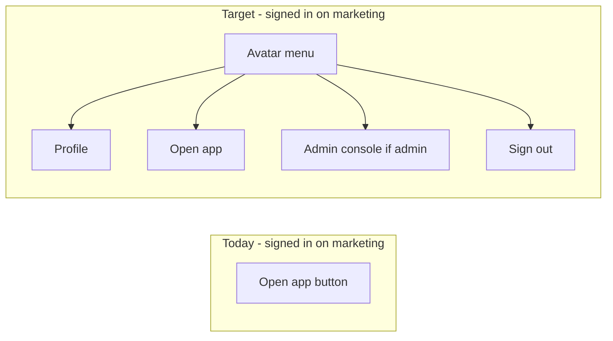

# Marketing header avatar account menu

## Goal

When a signed-in user visits public marketing pages (`/`, `/reference`, `/workflow`, etc.), show the **avatar account menu** (same as [`AppNavUser`](src/app/(app)/_components/app-nav-user.tsx)) instead of the standalone **Open app** button. The menu gives them a return path to the app plus Profile, Admin console (admins), and Sign out — without logging out to browse marketing.

Anonymous visitors keep the current Sign in / Sign up CTAs unchanged.

## Current vs target

**Symmetric with existing shells:**

| Surface | Menu includes |
|---------|----------------|
| Marketing (new) | Profile, **Open app**, Admin console (if admin), Sign out |
| App shell (unchanged) | Profile, Admin console (if admin), Sign out |
| Admin sidebar (unchanged) | Profile, **Open app**, Sign out |

## Architecture (minimal reuse)

Climb the minimalism ladder — extend what exists; no new shared abstraction layer.

1. **Add `showOpenApp?: boolean` to [`AppNavUser`](src/app/(app)/_components/app-nav-user.tsx)** (default `false`).
   - When true, insert an **Open app** item (same icon/label as [`AdminNavUser`](src/app/admin/_components/admin-nav-user.tsx)) after Profile and before Admin console.
   - Menu order: Profile → Open app → Admin console (if admin) → separator → Sign out.

2. **Thread prop through [`AppHeaderAccountNav`](src/app/(app)/_components/app-header-account-nav.tsx)** and pass to `AppNavUser`.
   - App shell continues using default (`showOpenApp` omitted).
   - Marketing authenticated path passes `showOpenApp`.

3. **Replace authenticated branch in [`LandingAuthSlot`](src/app/(marketing)/_components/landing-auth-slot.tsx)**.
   - Today: primary button linking to `APP_HOME`.
   - After: render `AppHeaderAccountNav showOpenApp` wrapped in `ProfileDialogProvider` (profile modal works on public pages — same provider stack as app/admin).
   - Keep `hasServerAuthSession()` gate; only call `getCurrentUserProfile` on the authenticated branch (session already validated).

4. **Mobile marketing header** — new behavior per your decision: **hamburger + avatar** when signed in.

   Today on mobile, auth lives *inside* the hamburger sheet via [`LandingHeader`](src/app/(marketing)/_components/landing-header.tsx) → [`LandingMobileNav`](src/app/(marketing)/_components/landing-mobile-nav.tsx). Desktop auth is in `rightSlot` (hidden below `md`).

   **Add [`LandingMobileHeaderChrome`](src/app/(marketing)/_components/landing-mobile-header-chrome.tsx)** (async server component):
   - **Anonymous:** current behavior — `<LandingMobileNav authSlot={…LandingAuthSlot layout="stack"…} />`.
   - **Signed in:** flex row with `<LandingMobileNav />` (no `authSlot`) + `<AppHeaderAccountNav showOpenApp />`.

   Make `authSlot` optional on `LandingMobileNav` — omit the auth block when `authSlot` is undefined.

   Wire in `landing-header.tsx` as the `mobileNav` prop inside Suspense.

5. **Suspense fallbacks** — align with app shell pattern ([`AppNavUserSkeleton`](src/app/(app)/_components/app-nav-user-skeleton.tsx)):
   - Desktop `rightSlot`: fallback `AppNavUserSkeleton` (replaces `LandingAuthButtons` fallback — avoids signed-in users flashing Sign in buttons).
   - Mobile chrome: fallback = hamburger trigger + `AppNavUserSkeleton` side by side (brief skeleton on anonymous is acceptable).

   **Tradeoff (conscious choice):** The desktop avatar-skeleton fallback removes the sign-in → avatar flash for signed-in users, but introduces a one-time avatar-skeleton → Sign in / Sign up layout shift for anonymous visitors while the auth slot resolves. **Accepted** — signed-in continuity is prioritized over anonymous first-paint shift.

6. **Post-save header refresh on marketing** — no code change in this epic; document the dependency:
   - [`updateProfileAction`](src/app/(app)/_lib/profile/actions.ts) only calls `revalidatePath('/(app)', 'layout')`, which does **not** invalidate the marketing layout cache.
   - The marketing header avatar therefore relies on [`persistField`](src/hooks/use-blur-save-field.ts) calling `router.refresh()` after save (avatar upload/remove passes `refresh: true` via [`use-profile-avatar-upload.ts`](src/app/(app)/_lib/profile/use-profile-avatar-upload.ts)).
   - **Build note:** If the header avatar lags after save on `/`, the fix is to broaden profile-save revalidation scope to cover the marketing layout (e.g. add `revalidatePath('/(marketing)', 'layout')` alongside the existing app layout revalidation) — not to add marketing-specific refresh logic in the header components.

## Files to touch

| File | Change |
|------|--------|
| [`app-nav-user.tsx`](src/app/(app)/_components/app-nav-user.tsx) | `showOpenApp` prop + menu item |
| [`app-header-account-nav.tsx`](src/app/(app)/_components/app-header-account-nav.tsx) | Pass `showOpenApp` through |
| [`landing-auth-slot.tsx`](src/app/(marketing)/_components/landing-auth-slot.tsx) | Authenticated → account nav stack |
| [`landing-header.tsx`](src/app/(marketing)/_components/landing-header.tsx) | Desktop fallback + mobile chrome slot |
| [`landing-mobile-nav.tsx`](src/app/(marketing)/_components/landing-mobile-nav.tsx) | Optional `authSlot` |
| **New** `landing-mobile-header-chrome.tsx` | Auth-branch mobile layout |

No changes to [`AppShell`](src/app/(app)/_components/app-shell.tsx), admin nav, proxy, migrations, or [`updateProfileAction`](src/app/(app)/_lib/profile/actions.ts) revalidation scope (unless manual testing reveals lag — see build note above).

## Tests

| File | Update |
|------|--------|
| [`landing-auth-slot.integration.test.tsx`](src/app/(marketing)/_components/landing-auth-slot.integration.test.tsx) | Authenticated case: expect Account menu button (not Open app link); mock `getCurrentUserProfile` + provider as needed |
| [`app-nav-user.unit.test.tsx`](src/app/(app)/_components/app-nav-user.unit.test.tsx) | `showOpenApp` renders Open app menuitem linking to `/home` |
| [`app-header-account-nav.unit.test.tsx`](src/app/(app)/_components/app-header-account-nav.unit.test.tsx) | Pass-through of `showOpenApp` (if wired through mocked AppNavUser) |
| **New** `landing-mobile-header-chrome.integration.test.tsx` | Signed-in → hamburger + account menu; anonymous → auth in sheet only |

Run `pnpm pre-push` before merge.

## Docs

Run `/sync-repo-docs` after implementation — update AGENTS.md landing-header prose (signed-in marketing uses avatar account menu with Open app in dropdown; mobile = hamburger + avatar). No PRD edit per your direction.

## Manual test checklist

- Signed in on `/` (desktop): avatar visible; menu has Profile, Open app, Admin console (if admin), Sign out; Open app → `/home`; Profile opens modal.
- Signed in on `/` (mobile): hamburger + avatar in header; sheet has nav links only (no Open app / auth buttons); avatar menu works.
- **Signed in on `/` — after avatar upload/remove, confirm the avatar updates in the header (not just the dialog).**
- Signed out on `/` (desktop + mobile): Sign in / Sign up unchanged.
- App shell `/home` and admin `/admin`: unchanged behavior.
- Admin user on marketing: both Open app and Admin console in menu.
