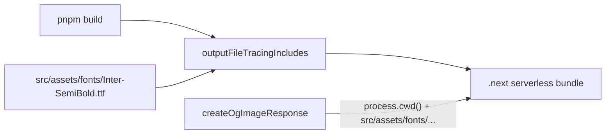

# Fix OG image font bundling

Runtime `ENOENT` happens because [`src/utils/og-image.tsx`](src/utils/og-image.tsx) builds the font path at runtime via `import.meta.url`. Next’s tracer cannot see that path, so `Inter-SemiBold.ttf` is omitted from the serverless output. The build succeeds; the first request fails.

Two coordinated changes: a path the deployed function can actually open, plus an explicit trace include so the file is copied there.



## 1. Project-root font path

In [`src/utils/og-image.tsx`](src/utils/og-image.tsx), replace the module-relative path:

- Today: `dirname(fileURLToPath(import.meta.url))` + `'../assets/fonts/Inter-SemiBold.ttf'`
- After: `join(process.cwd(), 'src/assets/fonts/Inter-SemiBold.ttf')`

Drop unused `dirname` and `fileURLToPath` imports (`node:path` keeps `join` only; remove `node:url`). Leave `loadInterSemiBold`’s module-level promise cache and the `ImageResponse` output unchanged.

Existing unit tests in [`src/utils/og-image.unit.test.ts`](src/utils/og-image.unit.test.ts) already call `createOgImageResponse` against the real TTF via `process.cwd()` in Vitest — they should keep passing with no test edits.

## 2. Explicit file tracing

In [`next.config.ts`](next.config.ts), add both keys (root vs nested OG routes match different patterns):

```ts
outputFileTracingIncludes: {
  '/opengraph-image': ['./src/assets/fonts/**'],
  '/**/opengraph-image': ['./src/assets/fonts/**'],
},
```

Place it on the existing config object alongside `cacheComponents` and `headers()`. No other config changes.

## 3. Verify

After implementation:

- `pnpm build && pnpm start`
- Request all seven routes and confirm HTTP 200 + `Content-Type: image/png`, with no `ENOENT` in server output:
  - `/opengraph-image`
  - `/features/opengraph-image`
  - `/privacy/opengraph-image`
  - `/reference/opengraph-image`
  - `/terms/opengraph-image`
  - `/workflow/opengraph-image`
  - `/auth/login/opengraph-image`
- Confirm the TTF is in the traced output: search `.next/server/**` for `Inter-SemiBold.ttf` or for the font listed in the route `.nft.json` manifests.
- `pnpm pre-push`

No font fallback, no network-fetched font, no docs unless pre-push or a rule check requires them.
