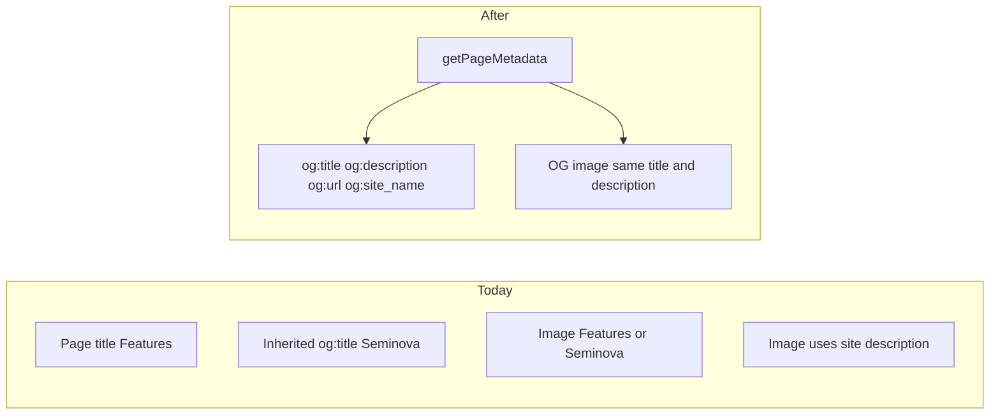

# Fix OG link previews

> **Track progress:** as you complete each step, update the corresponding `todos` entry's `status` to `completed` in this plan's frontmatter.

> **Precondition:** `git status --porcelain --untracked-files=no` must be empty before the first implementation edit. If dirty, halt and ask. Untracked plan files in `.cursor/plans/` are not a halt.

This is standalone SEO work, not Phase 20 (Magic Link). One branch, one implementation — Story B’s helper is the seam Story A would fall back on, so there is no cheap A-first path.

## Current mismatch

Root [`getSiteMetadata`](src/config/site.ts) sets `openGraph.title` / `openGraph.description` to the **site** name and description. Next.js does not copy a page’s `title` / `description` into those fields, so `/features` still previews as “Seminova”.

OG images already print the page title (via `formatOgPageTitle`, which adds `| Seminova`) but still use `siteConfig.description`. Tags and images disagree on both axes.

Canonicals are already correct and per-route. `og:url` and `og:site_name` are missing entirely.

## 1. Create the branch

From clean `main`:

`git checkout -b fix/og-link-previews`

Halt if not on `main` or if the branch already exists with commits. This is not a phase branch.

## 2. Helper in site config (both stories)

Add `getPageMetadata({ title, description, path })` in [`src/config/site.ts`](src/config/site.ts). One call returns:

- `title` and `description` (document title still uses the existing `%s | Seminova` template)
- `alternates.canonical: path`
- `openGraph.title` / `openGraph.description` — same strings as the page fields. Bare page title: `/features` is `"Features"`, not `"Features | Seminova"`. The site wordmark already renders directly above the title in the OG image, so the suffix duplicated brand within a single image.
- `openGraph.url: path` — same value as canonical, resolved against `metadataBase`
- `openGraph.siteName: siteConfig.name`

**Do not use `openGraph.url: './'`.** Next.js can resolve that, but every marketing page already has a path constant for canonical. Passing it through the helper makes `og:url` agree with canonical by construction and avoids the inheritance question.

Update `getSiteMetadata` (root only):

- `openGraph.siteName: siteConfig.name` — inherited on every route via Next’s shallow Open Graph merge
- do **not** set a root `openGraph.url`. Auth, app, and admin routes define no `openGraph` of their own, so a root value would make every `noindex` surface claim the site root as its canonical object URL — a new wrong claim where there is currently no claim at all. `og:url` comes from `getPageMetadata` per marketing route; non-marketing routes emit none, as today.
- leave `openGraph.title` / `openGraph.description` as the site name and site description (root stays correct)
- do **not** add a root canonical (Phase 9 rule still holds)
- do **not** set `openGraph.images` — file-convention `opengraph-image.tsx` still owns that, resolved against `NEXT_PUBLIC_SITE_URL` via `metadataBase`

## 3. Shared page copy, then wire routes

Add one marketing-group module [`src/app/(marketing)/_lib/page-meta.ts`](src/app/(marketing)/_lib/page-meta.ts) exporting the five objects (features, workflow, reference, terms, privacy): `title`, `description`, `path` from [`src/constants/app-paths.ts`](src/constants/app-paths.ts).

Each marketing `page.tsx` becomes `export const metadata = getPageMetadata(...)` with its object. No hardcoded path strings on pages.

Each marketing `opengraph-image.tsx` reads **the same object**: image title = `title`, image description = `description` (not `siteConfig.description`), and the `alt` export derived from `title` rather than a literal. `alt` feeds `og:image:alt` and is currently a third hardcoded copy of the page title — leaving it literal in a file this step already edits preserves the drift this change exists to remove.

Root [`src/app/(marketing)/page.tsx`](src/app/(marketing)/page.tsx) and [`src/app/opengraph-image.tsx`](src/app/opengraph-image.tsx) are unchanged.

**`formatOgPageTitle`:** it exists to apply the document-title template, which is now the divergence. Delete it. Marketing images use the shared `title` field; login’s image ([`src/app/auth/login/opengraph-image.tsx`](src/app/auth/login/opengraph-image.tsx)) passes `'Login'` directly. Login tags stay out of scope (noindex; not a marketing route) — leftover: login card title remains the site name while the image says “Login”.

## 4. Tests and conventions

- Extend [`src/config/site.unit.test.ts`](src/config/site.unit.test.ts): root metadata includes `siteName` and no `openGraph.url`; `getPageMetadata` pairs title, description, canonical, `openGraph.url`, and `siteName` from one input (one happy path, e.g. features).
- Update [`src/utils/og-image.unit.test.ts`](src/utils/og-image.unit.test.ts): drop `formatOgPageTitle` cases.
- Update [`seo.mdc`](.cursor/rules/seo.mdc) (read `rule-authoring` first): site defaults now include `siteName`; per-page marketing metadata goes through `getPageMetadata`, which is the sole source of `og:url`; new public page checklist says OG image copy and `alt` come from the same page-meta object. Do not grow the rule with examples.

## 5. Quality gate and commit

`pnpm pre-push`.

Authorized by this plan — conventional commit, no push:

`fix(seo): preview shared pages as the page, not the site`

## Out of scope

- Auth, app, and admin `og:title` (they inherit site defaults; those surfaces are `noindex`)
- Twitter card fields (none today)
- Changing `og:image` generation beyond title/description copy
- ROADMAP / Phase 20

## Manual check

Dev server running, then:

- View-source or curl `/`, `/features`, `/workflow`: `og:site_name` is Seminova; `og:url` matches `rel=canonical`; `og:image` is absolute on the `NEXT_PUBLIC_SITE_URL` origin.
- `/features` `og:title` / `og:description` are the Features copy, not the site’s; `/` still uses the site name and site description.
- Confirm `/auth/login` emits no `og:url`.
- Open each marketing `/opengraph-image` and confirm the heading and body match those tags.
- **Fit check.** Page descriptions are far longer than the site description the images used before (`/workflow` 172 chars, `/reference` 158, `/features` 152 vs. 88). Satori does not clip, and the unit tests only assert PNG magic bytes plus a byte-length floor, so overflow passes CI silently. Check `/workflow` and `/reference` first: the full description must render without overflowing the canvas or colliding with the title block. If either overflows, the shared `createOgImageResponse` needs a length ceiling — that reopens the § Out of scope line on image generation, so halt and ask rather than editing the helper unprompted.
