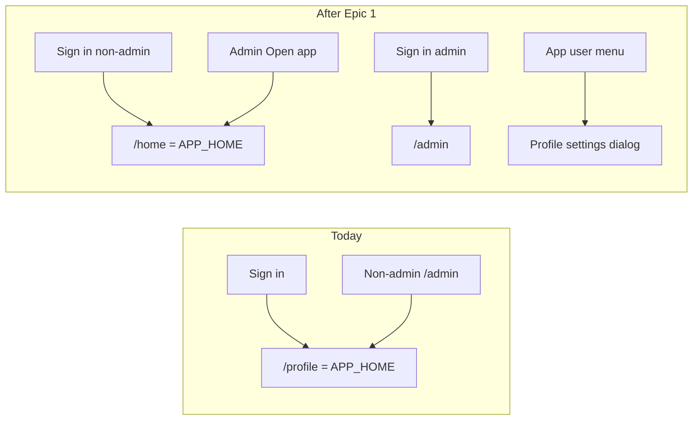

# Phase 10 Epic 1 — App home & profile modal

> **Track progress:** as you complete each step, update the corresponding `todos` entry's `status` to `completed` in this plan's frontmatter.

> **Precondition:** confirm `git branch --show-current` outputs `phase-10/app-home-reference-surfaces`. If it doesn't match, halt and ask the user — do not switch branches.

> **Precondition:** `git status --porcelain` must be empty before recording the epic baseline. If dirty, halt and ask the user to commit or stash.

> **Epic baseline:** Run `git rev-parse HEAD` immediately before the first implementation edit. Record the SHA in the plan body (e.g. `**Epic baseline:** abc1234`) — this is the fixed point for `code-review`.

**Epic baseline:** `de518bd898b6a2c434068de901e51a078a094955`

**Epic commit:** `68c196b` — `feat(phase-10): Epic 1 — app home and profile modal`

---

## Context

Phase 10 is `Active` ([ROADMAP.md](ROADMAP.md)). Epic 1 is the first uncompleted epic in [docs/prds/phase-10-app-home-reference-surfaces.prd.md](docs/prds/phase-10-app-home-reference-surfaces.prd.md). [ADR-0004](docs/adr/ADR-0004-profile-modal-app-home-divergence.md) records the accepted trade-off: no profile deep link, modal-only settings.

Today `APP_HOME` aliases `PROFILE_PATH` (`/profile`) in [src/constants/app-paths.ts](src/constants/app-paths.ts). The `(app)` shell ([src/app/(app)/_components/app-shell.tsx](src/app/(app)/_components/app-shell.tsx)) wraps a single `/profile` page. Several call sites still hardcode `PROFILE_PATH` for redirects instead of `APP_HOME` ([src/supabase/proxy.ts](src/supabase/proxy.ts), [src/app/admin/_components/admin-auth-gate.tsx](src/app/admin/_components/admin-auth-gate.tsx), [src/components/sign-up-form.tsx](src/components/sign-up-form.tsx)).



This epic is **sequential** — stories 1.1 → 1.2 → 1.3 share constants, shell wiring, and relocated profile code. Not a Build in Parallel candidate.

---

## Story 1.1 — Real app home

### Path constant

Add `HOME_PATH = '/home'` and set `APP_HOME = HOME_PATH` in [src/constants/app-paths.ts](src/constants/app-paths.ts). **Keep `PROFILE_PATH` through story 1.1** — the profile page still resolves at `/profile` while redirects diverge. **Delete `PROFILE_PATH` in story 1.2** together with the route removal.

### Placeholder page

Create [src/app/(app)/home/page.tsx](src/app/(app)/home/page.tsx):

- Minimal authenticated landing — heading + short copy that this surface is meant to be replaced by the spinoff's real home
- `metadata.title` for the home surface
- Inherits `(app)` layout shell automatically (header, user menu, footer)
- No links to Epic 4 reference page yet (that's a later epic)

### Retarget redirects

Update every non-admin "go to app" path to `APP_HOME`:

| File | Change |
|------|--------|
| [src/supabase/proxy.ts](src/supabase/proxy.ts) | Non-admin `/admin` redirect: `PROFILE_PATH` → `APP_HOME` |
| [src/app/admin/_components/admin-auth-gate.tsx](src/app/admin/_components/admin-auth-gate.tsx) | Same |
| [src/components/sign-up-form.tsx](src/components/sign-up-form.tsx) | `emailRedirectTo` → `${origin}${APP_HOME}` |
| [src/utils/admin.ts](src/utils/admin.ts) | Already uses `APP_HOME` — no logic change once constant diverges |

`getPostAuthRedirectPath`, login form, update-password form, auth confirm, and landing auth slot already consume `APP_HOME` — they follow automatically.

### Admin "Open app" entry

Update [src/app/admin/_components/admin-nav-user.tsx](src/app/admin/_components/admin-nav-user.tsx):

- Add menu item **Open app** → `APP_HOME` (mirror the admin-console switch in [AppNavUser](src/app/(app)/_components/app-nav-user.tsx))
- Keep Profile link for now (story 1.2 replaces it)

### Tests (1.1)

- [src/utils/admin.unit.test.ts](src/utils/admin.unit.test.ts) — non-admin redirect expects `/home`
- [src/supabase/proxy.unit.test.ts](src/supabase/proxy.unit.test.ts) — non-admin admin-route redirect
- [src/app/admin/_components/admin-auth-gate.integration.test.tsx](src/app/admin/_components/admin-auth-gate.integration.test.tsx)
- [src/app/(marketing)/_components/landing-auth-slot.integration.test.tsx](src/app/(marketing)/_components/landing-auth-slot.integration.test.tsx)
- [src/utils/discover-app-routes.unit.test.ts](src/utils/discover-app-routes.unit.test.ts) — `/home` in `(app)` routes; `/profile` until removed in 1.2

**1.1 success check:** non-admin sign-in lands on `/home`; admin can reach `/home` via new admin menu item; profile page still works at `/profile` until 1.2.

---

## Story 1.2 — Profile settings as modal

### Relocate profile code (route-independent home)

Move profile implementation out of the route tree into shell-co-located modules:

| From | To (suggested) |
|------|----------------|
| `src/app/(app)/profile/actions.ts` | `src/app/(app)/_lib/profile/actions.ts` |
| `src/app/(app)/profile/_lib/*` | `src/app/(app)/_lib/profile/*` |
| `src/app/(app)/profile/_components/*` | `src/app/(app)/_components/profile/*` |

Update all imports and test file paths. Delete `src/app/(app)/profile/` (including `page.tsx`) when modal is wired.

### Delete `PROFILE_PATH`

Remove `PROFILE_PATH` from [src/constants/app-paths.ts](src/constants/app-paths.ts) together with the `/profile` route. Replace every remaining import/usages with `APP_HOME` or remove the link entirely (e.g. admin error escape, nav items). No `PROFILE_PATH` references should remain in the codebase after story 1.2.

### Profile settings dialog

Create `ProfileSettingsDialog` (client) in `src/app/(app)/_components/profile/`:

- shadcn `Dialog` — **no `DialogFooter`** per PRD scope decision
- Title: "Profile" / account settings framing
- Compact card layout inside `DialogContent`:
  - Avatar + upload (existing `ProfileAvatarField` / upload hook)
  - Display name + username (email, read-only) paired on one row where layout allows — **email appears exactly once**, as the read-only username field
  - Bio full-width
  - Appearance section (`ProfileThemeSegment`)
  - Password section placeholder until 1.3 (can ship dialog with existing nested dialog temporarily, then replace in 1.3)
- Reuse `getCurrentUserProfile` data already fetched in `AppShell` — pass `userId`, `email`, `defaultValues`, `profileLoadFailed` as props into a thin client wrapper
- If profile load failed, show section-level `ErrorPanel` inside the dialog (same as current page)

### Shell wiring

Refactor [src/app/(app)/_components/app-shell.tsx](src/app/(app)/_components/app-shell.tsx) + [AppNavUser](src/app/(app)/_components/app-nav-user.tsx):

- Replace Profile `Link` with a menu item that opens the dialog (controlled `open` state; close dropdown before opening dialog to avoid Radix focus traps)
- Mount `ProfileSettingsDialog` at shell level with profile props from server fetch
- Pattern: small client boundary component (e.g. `AppShellNavWithProfile`) composing nav + dialog

### Admin nav adjustment

Update [AdminNavUser](src/app/admin/_components/admin-nav-user.tsx): remove Profile link (route gone); **Open app** (from 1.1) is the path to settings. Profile modal is app-shell-only per PRD.

### Server action revalidation

In relocated `actions.ts`, replace `revalidatePath(PROFILE_PATH)` with `revalidatePath('/(app)', 'layout')`.

### Remove `/profile` route

Delete the profile page. `/profile` should 404 (or hit auth proxy as protected unknown route → login when signed out; authenticated users get 404 from Next).

### Tests (1.2)

- Relocate and update all `profile/**/*.test.*` files
- [app-nav-user.unit.test.tsx](src/app/(app)/_components/app-nav-user.unit.test.tsx) — Profile opens dialog, not a link
- [admin-nav-user.unit.test.tsx](src/app/admin/_components/admin-nav-user.unit.test.tsx) — Open app link; no Profile href
- [discover-app-routes.unit.test.ts](src/utils/discover-app-routes.unit.test.ts) — `/profile` removed
- [route-error-boundaries.integration.test.tsx](src/app/route-error-boundaries.integration.test.tsx) — admin error escape link → `APP_HOME` not profile
- [admin/error.tsx](src/app/admin/error.tsx) — "Back to app" copy + `APP_HOME` href
- Confirm no `PROFILE_PATH` references remain anywhere in source or tests (grep / type-check will surface stragglers)

**1.2 success check:** settings open from app user menu as dialog; blur-save and avatar upload behave identically; dismiss loses no unsaved state; `/profile` no longer resolves; `PROFILE_PATH` is deleted with no remaining references.

---

## Story 1.3 — Inline password change

### Convert nested dialog to inline section

Refactor [profile-password-dialog.tsx](src/app/(app)/profile/_components/profile-password-dialog.tsx) → `ProfilePasswordSection`:

- Remove `Dialog` / `DialogTrigger` wrapper — render as a section inside `ProfileSettingsDialog`
- Keep explicit-submit save model: form with submit button, `showSuccessToast` on success, `InlineError` / `ErrorPanel` branching on `kind`
- Preserve hidden username field, `autocomplete` tokens, and `extractAuthFormError` handling per [forms.mdc](.cursor/rules/forms.mdc)
- On success: reset fields in place (no `setOpen(false)` — modal stays open)
- Section heading + helper copy matching current page tone

Update [profile-page-client.tsx](src/app/(app)/profile/_components/profile-page-client.tsx) logic — either fold into `ProfileSettingsDialog` directly or keep as `ProfileModalContent` composing settings + password + appearance with `Separator`s (same three-section structure as today).

### Tests (1.3)

- Rename/update [profile-password-dialog.integration.test.tsx](src/app/(app)/profile/_components/profile-password-dialog.integration.test.tsx) for inline section
- [profile-page-client.integration.test.tsx](src/app/(app)/profile/_components/profile-page-client.integration.test.tsx) — password section mock name update

**1.3 success check:** password change works inside the profile modal without a nested dialog; submit persistence and error surfaces unchanged.

---

## Out of scope for this epic (defer)

- LEXICON / `forms.mdc` reference path updates — PRD says update after phase build lands
- Auth boundary legal routes (Epic 3)
- Site chrome / favicon (Epic 2)
- Pattern reference page links from home (Epic 4)

---

## Verification

Quality bar — stop on failure:

```bash
pnpm type-check && pnpm lint && pnpm format-check && pnpm test:ci
```

---

## Commit epic

Authorized by this approved plan:

1. Review diff; stage only files in scope for Epic 1.
2. Write a conventional commit message (`feat`) referencing Phase 10 Epic 1.
3. Commit (request `git_write`). Pre-commit hook runs automatically — if it fails, **fix and retry the commit** (a failed pre-commit hook aborts the commit, so there is nothing to amend).
4. Verify `git status --porcelain` is empty after commit.

**Do not push** — push remains `ship-phase`.

---

## Handoff

Epic committed. Next: open a new agent window and run `/code-review` — epic baseline `<sha>`, Epic `1`.

### Manual testing checklist

1. Sign in as non-admin → lands on `/home`, not settings
2. Sign in as admin → lands on `/admin`; **Open app** in admin user menu → `/home`
3. From app shell user menu → **Profile** opens settings dialog; edit display name (blur-save indicator); upload avatar; change theme
4. Change password inline in the same dialog — success toast, validation errors inline
5. Dismiss dialog — no data loss on reopen
6. Visit `/profile` directly → does not render settings page
7. Non-admin visiting `/admin` → redirected to `/home`
