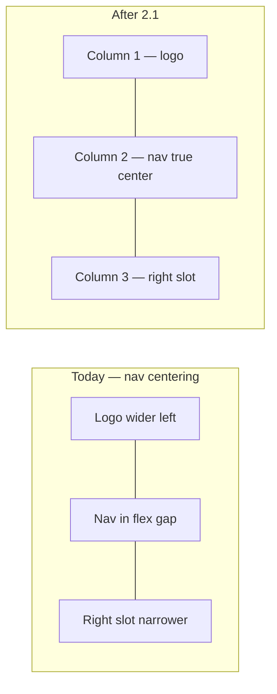

# Phase 10 Epic 2 — Site chrome & identity

> **Track progress:** as you complete each step, update the corresponding `todos` entry's `status` to `completed` in this plan's frontmatter.

> **Precondition:** `git status --porcelain` must be empty before the first implementation edit. If dirty, halt and ask the user to commit or stash. The epic must land as a single commit containing only this epic's work — `code-review` derives its range from that commit.

**This epic is a good candidate for Build in Parallel.** Stories 2.1 (header/footer layout) and 2.2 (favicon util + route) touch disjoint files. The plan below is written sequentially; an executor may run both tracks before the quality gate.

---

## Epic baseline

**Before the first implementation edit:** run `git rev-parse HEAD`, record the SHA below, and mark the `capture-baseline` todo complete. This is the fixed point `code-review` uses as the range start.

**Epic baseline:** `065424b038084d9b1d1f71792cbb259bfe5e9dc3`

---

## Context

Phase 10 is `Active` ([ROADMAP.md](ROADMAP.md)). Epic 1 is `Complete`. Epic 2 is the next uncompleted epic in [docs/prds/phase-10-app-home-reference-surfaces.prd.md](docs/prds/phase-10-app-home-reference-surfaces.prd.md).

**Today:**

- [site-header.tsx](src/components/site-header.tsx) uses `flex justify-between` with nav in a `flex-1 justify-center` middle slot. Because the logo (left) and auth slot / mobile menu (right) differ in width, the nav sits in the gap between them — not at the viewport center.
- [site-footer.tsx](src/components/site-footer.tsx) uses `md:justify-between` with logo, nav, and a single GitHub icon. The social column is far narrower than the logo, so the nav reads off-center.
- [src/app/favicon.ico](src/app/favicon.ico) is the framework-default icon (dated May 2025). No dynamic `icon.tsx` exists. Social previews already use [og-image.tsx](src/utils/og-image.tsx) + [opengraph-image.tsx](src/app/opengraph-image.tsx); the header logo mark lives in [seminova-logo.tsx](src/components/seminova-logo.tsx) (`bg-primary` square + `siteConfig.Logo` Lucide icon).



**Out of scope for this epic:** legal routes and footer link wiring (Epic 3), OG template redesign to use the logo mark (OG still uses the dot badge from Phase 9).

---

## Story 2.1 — True-center site nav

**Goal:** Pin nav to the viewport's true center on desktop by giving header and footer equal outer grid tracks, regardless of flanking content width. Mobile header behavior stays as today (logo left, hamburger/menu right).

### Header layout

**File:** [src/components/site-header.tsx](src/components/site-header.tsx)

Replace the inner `flex justify-between` row with a responsive layout:

- **Mobile (`< md`):** keep `flex items-center justify-between` — logo left, `mobileNav` right. No structural change to mobile UX.
- **Desktop (`md+`):** `grid grid-cols-[minmax(0,1fr)_auto_minmax(0,1fr)] items-center` with:
  - Column 1: `SeminovaLogo` — `justify-self-start`; add `min-w-0` and truncation as needed so long product names do not grow the track past `1fr`
  - Column 2: `SiteNavLinks` when `showNav` — `justify-self-center`; when `showNav` is false, render an empty placeholder (`<div />`) so column balance holds. `SiteNavLinks` must remain hidden below `md` (its current responsive visibility class). Column placement changes only; do not surface desktop nav links on mobile.
  - Column 3: `rightSlot` — `justify-self-end md:col-start-3` (explicit column placement so it does not depend on the middle placeholder existing); hidden on mobile as today. Wrap or constrain the slot with `min-w-0` and truncation where it contains text that can grow (e.g. a signed-in auth button with a long email)

`1fr` floors at min-content, so a wide right slot pushes the nav off center without `minmax(0, 1fr)` on the outer tracks.

Do not change `SiteHeader` props or call sites ([landing-header.tsx](src/app/(marketing)/_components/landing-header.tsx), [app-shell.tsx](src/app/(app)/_components/app-shell.tsx), [app-shell-fallback.tsx](src/app/(app)/_components/app-shell-fallback.tsx)).

### Footer layout

**File:** [src/components/site-footer.tsx](src/components/site-footer.tsx)

Restructure the top row (logo / nav / social):

- **Mobile:** keep stacked `flex-col` flow — no change to mobile behavior.
- **Desktop (`md+`):** same `grid-cols-[minmax(0,1fr)_auto_minmax(0,1fr)]` pattern:
  - Column 1: logo — `justify-self-start`; `min-w-0` + truncation as needed
  - Column 2: `SiteNavLinks` when `showNav` — `justify-self-center`
  - Column 3: social icon links — `justify-self-end`

The copyright / legal sub-row below stays as-is (Epic 3 will wire legal links).

### Tests

Existing tests in [site-header.unit.test.tsx](src/components/site-header.unit.test.tsx) and [site-footer.unit.test.tsx](src/components/site-footer.unit.test.tsx) assert link presence and `showNav` omission — they should still pass after layout-only changes. Do not add CSS-class assertions ([testing.mdc](.cursor/rules/testing.mdc)); centering is verified manually.

---

## Story 2.2 — Favicon from site logo

**Goal:** Browser tab shows the product mark (primary-filled rounded square + logo icon, matching [seminova-logo.tsx](src/components/seminova-logo.tsx)). A spinoff changes `siteConfig.Logo` once; header and favicon track together. Remove the static default so the generated icon wins.

### Shared brand-mark utility

**New:** [src/utils/brand-mark-image.tsx](src/utils/brand-mark-image.tsx)

- Export `BRAND_MARK_SIZE` (32×32) and `BRAND_MARK_CONTENT_TYPE` (`image/png`).
- Export `OG_COLORS` from [src/utils/og-image.tsx](src/utils/og-image.tsx) (currently module-private) and import it here. If `OG_COLORS` has no `primaryForeground` entry, add one; do not hardcode a literal color string in the brand-mark util.
- `createBrandMarkImageResponse()` returns an `ImageResponse` containing:
  - a rounded square filled with `OG_COLORS.primary` (borderRadius ~8px at 32px)
  - `<siteConfig.Logo />` centered, sized ~20px, with an **explicit inline stroke color** set to the primary-foreground value, e.g. `stroke={OG_COLORS.primaryForeground}`
  - every container element with children must carry `display: 'flex'` inline. Satori throws or renders blank otherwise. This applies to the rounded square wrapping the icon.
- Do not rely on `currentColor`. Lucide defaults `stroke="currentColor"`, which Satori renders as a blank glyph with no error and no warning.
- No font loading.

**New test:** [src/utils/brand-mark-image.unit.test.ts](src/utils/brand-mark-image.unit.test.ts), `@vitest-environment node`.

An instance-type assertion is insufficient — a blank render is still a valid `ImageResponse`. Assert rendered content:

- Await the response body to an `ArrayBuffer`.
- Assert the PNG magic bytes (`89 50 4E 47 0D 0A 1A 0A`).
- Assert the buffer is meaningfully larger than a blank 32×32 render. A blank single-color 32×32 PNG is ~140 bytes; a rendered glyph is ~600 bytes. Check whether a PNG decoder already exists in the dependency tree; if one does, decode and assert that pixels of both `OG_COLORS.primary` and the primary-foreground color are present. If not, assert `byteLength > 300` with a comment naming the ~140-byte blank baseline.

### App icon route

**New:** [src/app/icon.tsx](src/app/icon.tsx)

Thin segment file (same pattern as [opengraph-image.tsx](src/app/opengraph-image.tsx)):

- Re-export `size` and `contentType` from the util
- Default export calls `createBrandMarkImageResponse()`

**Delete:** [src/app/favicon.ico](src/app/favicon.ico) — static file would override the dynamic route.

### Proxy matcher (required)

`/icon` is an extensionless path matched by no existing negative lookahead; the matcher **must** be extended. This is an asset carve-out, not an auth-boundary change. `check:auth-boundary` runs [src/supabase/proxy.unit.test.ts](src/supabase/proxy.unit.test.ts), which tests route discovery, not matcher exclusions — no change needed there.

Three files change together:

1. [src/utils/proxy-matcher.ts](src/utils/proxy-matcher.ts) — extend `PROXY_MATCHER_PATTERN` with `icon` and nested `*/icon`, using the same negative-lookahead style as `opengraph-image` and `twitter-image`.
2. [proxy.ts](proxy.ts) — update the mirrored matcher literal **and** the carve-out comment above it that enumerates excluded paths. A sync assertion in [src/utils/proxy-matcher.unit.test.ts](src/utils/proxy-matcher.unit.test.ts) fails if the literal drifts.
3. [src/utils/proxy-matcher.unit.test.ts](src/utils/proxy-matcher.unit.test.ts) — add assertions that `/icon` and `/auth/login/icon` are excluded (`false`), and that `/icon-evil` is not (`true`), matching the existing `opengraph-image-evil` case. Keep all existing exclusions green.

**Do not remove the `favicon.ico` exclusion** when deleting [src/app/favicon.ico](src/app/favicon.ico). Browsers request `/favicon.ico` unprompted whether or not the file exists; removing the carve-out routes those anonymous requests through the auth proxy into a login redirect. The exclusion appears in [proxy.ts](proxy.ts) (comment + literal), [src/utils/proxy-matcher.ts](src/utils/proxy-matcher.ts), and [src/utils/proxy-matcher.unit.test.ts](src/utils/proxy-matcher.unit.test.ts) — all four stay.

### Docs — sync via skill

After the code lands and before the quality gate, invoke `/sync-repo-docs`. Do not hand-edit AGENTS.md; it is owned by the sync skill per AGENTS.md § Change protocol.

Two facts the sync must reflect — verify both are present in the result, and if the skill misses either, report it rather than editing AGENTS.md directly:

- [src/app/icon.tsx](src/app/icon.tsx) is a new route.
- § SEO & metadata's proxy carve-out sentence currently enumerates only `/opengraph-image`, nested `*/opengraph-image`, and `twitter-image`. It must also name the icon paths.

---

## Verification

Quality bar — stop on failure:

```bash
pnpm check:semantic-tokens && pnpm type-check && pnpm lint && pnpm format-check && pnpm test:ci
```

`check:semantic-tokens` runs on pre-push, not in the default quality bar. This epic adds a new `.tsx` file carrying raw hex values as inline SVG attributes; run it here rather than discovering a failure at push.

**Manual smoke:**

1. **Header centering (desktop, ≥ md):** Open `/` signed out. Nav links (Home, Features, GitHub) sit at the true horizontal center of the viewport — not shifted toward the logo. Resize the window; centering holds.
2. **Footer centering (desktop):** Same page — footer nav aligns to viewport center while logo stays left and GitHub icon stays right.
3. **Wide right slot:** Sign in with a long display name or email. Nav stays viewport-centered; right-slot text truncates instead of pushing nav off center.
4. **Mobile header unchanged:** Narrow viewport — logo left, menu/auth control right; no regressions to [landing-mobile-nav.tsx](src/app/(marketing)/_components/landing-mobile-nav.tsx).
5. **App shell (no nav):** Sign in → `/home`. Header shows logo + user menu only (no nav); layout does not collapse or overlap.
6. **Favicon:** Hard-refresh `/`. Browser tab shows the primary-square brand mark (not the Next.js default). View page source — `<link rel="icon">` points at the generated route, not `favicon.ico`.
7. **Spinoff contract (spot-check):** Changing `siteConfig.Logo` in site config updates both the header mark and the favicon — no separate icon asset.

---

## Commit epic

Authorized by this approved plan:

1. Review diff; stage only files in scope for this epic.
2. Write a conventional commit message. It **must** end with an `Epic:` git trailer:

   ```
   feat(phase-10): true-center site nav and dynamic favicon

   Epic: 10.2
   ```

   Blank line before the trailer, nothing after it. Exactly one commit in the repo may carry `Epic: 10.2`.
3. Commit (request `git_write`). Pre-commit hook runs automatically — if it fails, **fix and retry the commit**.
4. Verify `git status --porcelain` is empty after commit.

**Do not push** — push remains `ship-phase`.

---

## Handoff

Epic 10.2 committed. Baseline SHA: `065424b038084d9b1d1f71792cbb259bfe5e9dc3`. Next: open a new agent window and run `/code-review`.
