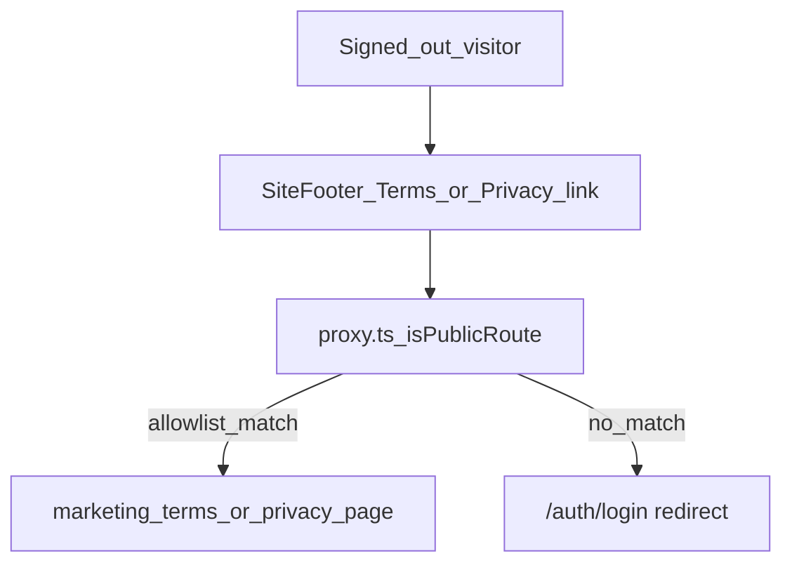

# Phase 10 Epic 3 — Public legal pages

> **Track progress:** as you complete each step, update the corresponding `todos` entry's `status` to `completed` in this plan's frontmatter.

> **Precondition:** `git status --porcelain` must be empty before the first implementation edit. If dirty, halt and ask the user to commit or stash. The epic must land as a single commit containing only this epic's work — `code-review` derives its range from that commit.

**This epic is a good candidate for Build in Parallel.** Story 3.1 (auth boundary + docs) and Story 3.2 (routes + footer wiring) touch mostly disjoint files. The plan is written sequentially; an executor may land both tracks before the quality gate.

---

## Epic baseline

**Before the first implementation edit:** run `git rev-parse HEAD`, record the SHA below, and mark the `capture-baseline` todo complete. This is the fixed point `code-review` uses as the range start.

**Epic baseline:** _(record SHA at execution time)_

---

## Context

Phase 10 is `Active` ([ROADMAP.md](ROADMAP.md)). Epics 1 and 2 are `Complete`. Epic 3 is next in [docs/prds/phase-10-app-home-reference-surfaces.prd.md](docs/prds/phase-10-app-home-reference-surfaces.prd.md).

**Today:**

- Public routes are `/` and `/auth/**` only — enforced inline in [src/supabase/proxy.ts](src/supabase/proxy.ts); mirrored for tests by `isPublicAppRoute` in [src/utils/discover-app-routes.ts](src/utils/discover-app-routes.ts) (single importer: [src/supabase/proxy.unit.test.ts](src/supabase/proxy.unit.test.ts)).
- [src/config/site.ts](src/config/site.ts) defines `SiteLegalStub` with `label` only; legal entries have no `href`.
- [src/components/site-footer.tsx](src/components/site-footer.tsx) renders legal items as inert `<span>` elements (lines 74–76).
- No `/terms` or `/privacy` routes exist under `src/app/(marketing)/`.

**Hard-constraint change protocol** (AGENTS.md): proxy runtime, test allowlist in `proxy.unit.test.ts`, AGENTS.md bullet, and LEXICON entry must update in the same pass. Also sync the allowlist prose in [.cursor/rules/security.mdc](.cursor/rules/security.mdc) and [.cursor/rules/supabase.mdc](.cursor/rules/supabase.mdc).



**Out of scope:** real policy copy (spinoff replaces later), workflow explainer (Epic 5), migrations.

---

## Story 3.1 — Extend auth boundary to legal routes

**Goal:** `/terms` and `/privacy` are public — signed-out visitors reach them without a login redirect; enforcement and docs match.

### Path constants

**File:** [src/constants/app-paths.ts](src/constants/app-paths.ts)

Add:

- `TERMS_PATH = '/terms'`
- `PRIVACY_PATH = '/privacy'`

### Proxy runtime allowlist

**File:** [src/supabase/proxy.ts](src/supabase/proxy.ts)

Keep the existing inline `isPublicRoute` — do **not** extract a shared helper.

Extend it to admit `TERMS_PATH` and `PRIVACY_PATH` (imported from `app-paths.ts`). Strip a trailing slash only when `pathname.length > 1`, so `'/'` is preserved. `/terms/` and `/privacy/` must match; `/` must remain public.

### Test-side allowlist (literal data)

**File:** [src/utils/discover-app-routes.ts](src/utils/discover-app-routes.ts)

Delete `isPublicAppRoute`. It has exactly one importer (`proxy.unit.test.ts`); [src/utils/sitemap-routes.ts](src/utils/sitemap-routes.ts) imports only `discoverMarketingRoutes` and is unaffected.

**File:** [src/supabase/proxy.unit.test.ts](src/supabase/proxy.unit.test.ts)

Replace the imported `isPublicAppRoute` with two literal constants declared in that file:

```typescript
const PUBLIC_EXACT = ['/', '/terms', '/privacy']
const PUBLIC_PREFIXES = ['/auth']
```

Partition `discoveredRoutes` using those constants. The test must **not** import any allowlist predicate from `src/utils/`.

Add explicit cases asserting `/terms/` and `/privacy/` (trailing slash) are public.

Extend the existing discovery sanity assertions (currently ~lines 191–198, which assert known routes were found) to also assert that `discoveredRoutes` contains `'/terms'` and `'/privacy'`. Without this, a missing page file silently removes the route from the `it.each` matrix and the suite still passes.

If any test file covers `isPublicAppRoute` (e.g. [src/utils/discover-app-routes.unit.test.ts](src/utils/discover-app-routes.unit.test.ts)), remove those cases along with the function.

The discovered-route matrix auto-picks up `/terms` and `/privacy` once their page files exist (Story 3.2); no hand-maintained route list beyond the literal constants above.

### Hard-constraint docs (same pass)

| File | Update |
|------|--------|
| [AGENTS.md](AGENTS.md) | Auth boundary bullet: add `/terms` and `/privacy` to public allowlist |
| [LEXICON.md](LEXICON.md) | § Auth boundary — same allowlist wording |
| [.cursor/rules/security.mdc](.cursor/rules/security.mdc) | Auth Proxy section allowlist |
| [.cursor/rules/supabase.mdc](.cursor/rules/supabase.mdc) | Auth Proxy comment allowlist |

Run `/sync-repo-docs` after AGENTS.md edit to keep README in sync if the skill surfaces drift.

**Success check:** Verified by the epic quality gate after Story 3.2 lands. `discoverAppRoutes` reads `src/app` from disk, so `/terms` and `/privacy` do not enter the proxy test matrix until their page files exist.

---

## Story 3.2 — Legal placeholder and footer links

**Goal:** Two routes render the same spinoff guidance placeholder; footer legal labels become navigable links.

### Shared placeholder component

**New file:** [src/app/(marketing)/_components/legal-placeholder.tsx](src/app/(marketing)/_components/legal-placeholder.tsx)

A compact content block modeled on the [home placeholder](src/app/(app)/home/page.tsx): heading prop + muted body copy telling a spinoff to generate policies or engage counsel. No Save/Close chrome — marketing layout already supplies header/footer.

### Route pages

**Files:**

- [src/app/(marketing)/terms/page.tsx](src/app/(marketing)/terms/page.tsx)
- [src/app/(marketing)/privacy/page.tsx](src/app/(marketing)/privacy/page.tsx)

Each page:

- Imports shared `LegalPlaceholder` with a page-specific `<h1>` (e.g. "Terms of Service" / "Privacy Policy")
- Exports `metadata` with unique `title`, short `description`, and `alternates.canonical` (`/terms` or `/privacy`) per [seo.mdc](.cursor/rules/seo.mdc)
- Wraps content in `<main id="main-content">` + [LandingContainer](src/app/(marketing)/_components/landing-container.tsx) (inherits marketing layout chrome from [layout.tsx](src/app/(marketing)/layout.tsx))

**OG segment files** (seo checklist for public marketing routes):

- [src/app/(marketing)/terms/opengraph-image.tsx](src/app/(marketing)/terms/opengraph-image.tsx)
- [src/app/(marketing)/privacy/opengraph-image.tsx](src/app/(marketing)/privacy/opengraph-image.tsx)

Follow the thin re-export pattern from [src/app/auth/login/opengraph-image.tsx](src/app/auth/login/opengraph-image.tsx) — title comes from page metadata + site config via `createOgImageResponse`.

Sitemap auto-includes new `(marketing)` routes via `discoverMarketingRoutes()` — no manual sitemap edit.

### Site config + footer wiring

**File:** [src/config/site.ts](src/config/site.ts)

- Rename `SiteLegalStub` → `SiteLegalLink` (or extend with `href`) — mirror `SiteNavLink` shape: `{ label, href }`
- Set `legal: [{ label: 'Terms', href: TERMS_PATH }, { label: 'Privacy', href: PRIVACY_PATH }]`

**File:** [src/components/site-footer.tsx](src/components/site-footer.tsx)

- Replace legal `<span>` with `next/link` `<Link>` elements
- Reuse the muted hover/focus styles from the existing `publicSiteLink` anchor (lines 66–71) for visual consistency

**File:** [src/components/site-footer.unit.test.tsx](src/components/site-footer.unit.test.tsx)

- Update the legal assertion: `getByRole('link', { name: item.label })` with correct `href` for each config entry
- Keep existing copyright, social, and `publicSiteLink` tests intact

**Success check (manual):** signed out on `/`, click Terms and Privacy in footer → each lands on its placeholder; no login redirect.

---

## Files touched (summary)

| Area | Files |
|------|-------|
| Constants | `app-paths.ts` |
| Auth boundary | `proxy.ts`, `proxy.unit.test.ts`, `discover-app-routes.ts` |
| Routes | `(marketing)/terms/page.tsx`, `(marketing)/privacy/page.tsx`, `(marketing)/terms/opengraph-image.tsx`, `(marketing)/privacy/opengraph-image.tsx`, `(marketing)/_components/legal-placeholder.tsx` |
| Chrome | `site.ts`, `site-footer.tsx`, `site-footer.unit.test.tsx` |
| Docs | `AGENTS.md`, `LEXICON.md`, `security.mdc`, `supabase.mdc` |

No migrations, no new dependencies.

---

### Verification

Quality bar — same commands as [WORKFLOW_GUIDE Step 5 exit condition](docs/WORKFLOW_GUIDE.md). Stop on failure:

```bash
pnpm type-check && pnpm lint && pnpm format-check && pnpm test:ci
```

### Commit epic

Authorized by this approved plan:

1. Review diff; stage only files in scope for this epic.
2. Write a conventional commit message (`feat`/`fix`/`docs`/etc.). It **must** end with an `Epic:` git trailer — this is the only thing `code-review` uses to find the commit:

   ```
   feat(phase-10): public legal pages and auth boundary

   Epic: 10.3
   ```

   Format is `Epic: {phase}.{id}` — phase number as written in ROADMAP (decimals OK: `7.5`), epic id as written (`1`, `1A`). Blank line before the trailer, nothing after it. Exactly one commit in the repo may carry a given `Epic:` value.
3. Commit (request `git_write`). Pre-commit hook runs automatically — if it fails, **fix and retry the commit** (a failed pre-commit hook aborts the commit, so there is nothing to amend).
4. Verify `git status --porcelain` is empty after commit.

**Do not push** — push remains `ship-phase`.

### Handoff

Epic 10.3 committed. Baseline: <SHA recorded in Epic baseline above>.

Next: open a new agent window and run `/code-review`.
