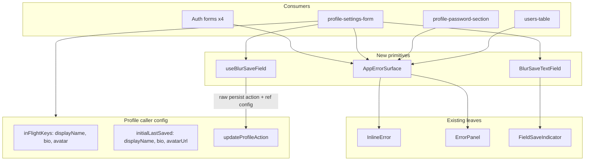

# Phase 10 Epic 4 — Form Primitives

> **Track progress:** as you complete each step, update the corresponding `todos` entry's `status` to `completed` in this plan's frontmatter.

> **Precondition:** `git status --porcelain` must be empty before the first implementation edit. If dirty, halt and ask the user to commit or stash. The epic must land as a single commit containing only this epic's work — `code-review` derives its range from that commit.

This epic is a good candidate for **Build in Parallel**: story 4.1 (error surface) and 4.2 (blur-save) touch mostly disjoint files. The only shared touchpoint is [`profile-settings-form.tsx`](src/app/(app)/_components/profile/profile-settings-form.tsx) — coordinate there last.

---

## Context

Epics 1–3 are `Complete`. Branch is already correct: `phase-10/app-home-reference-surfaces`.

Epic 4 is a **refactor** — no product surface change except one bug fix. Epic 5 (reference page) depends on these primitives existing.

### Story 4.1 — Error surface

Today, eight identical `formError?.kind === 'fault' ? ErrorPanel : InlineError` branches exist across seven files. No shared abstraction. The admin users table additionally **always** renders mutation errors as `InlineError`, dropping fault panel + copy + code — encoded by a test that must flip.

**Consumers to update:**

| File | Lines |
|------|-------|
| [`src/components/login-form.tsx`](src/components/login-form.tsx) | ~102–106 |
| [`src/components/sign-up-form.tsx`](src/components/sign-up-form.tsx) | ~116–120 |
| [`src/components/forgot-password-form.tsx`](src/components/forgot-password-form.tsx) | ~91–98 |
| [`src/components/update-password-form.tsx`](src/components/update-password-form.tsx) | ~93–97 |
| [`src/app/(app)/_components/profile/profile-settings-form.tsx`](src/app/(app)/_components/profile/profile-settings-form.tsx) | ~134–138 |
| [`src/app/(app)/_components/profile/profile-password-section.tsx`](src/app/(app)/_components/profile/profile-password-section.tsx) | ~121–125 |
| [`src/app/admin/users/_components/users-table.tsx`](src/app/admin/users/_components/users-table.tsx) | ~155–163 (list + mutation) |

**Out of scope** (leave as-is): string-only `InlineError` for client validation / file errors; hardcoded `ErrorPanel` in [`profile-settings-dialog.tsx`](src/app/(app)/_components/profile/profile-settings-dialog.tsx); route `error.tsx` boundaries.

### Story 4.2 — Blur-save primitive

[`use-blur-save-field.ts`](src/app/(app)/_lib/profile/use-blur-save-field.ts) is welded to `updateProfileAction` and profile Zod types. [`ProfileTextField`](src/app/(app)/_components/profile/profile-text-field.tsx) and [`FieldSaveIndicator`](src/app/(app)/_components/profile/field-save-indicator.tsx) live under profile `_components/`.

Avatar upload ([`use-profile-avatar-upload.ts`](src/app/(app)/_lib/profile/use-profile-avatar-upload.ts)) reuses `persistField`, `inFlightRef`, and `lastSavedRef` from the hook — profile behavior must stay identical.

**Ref asymmetry (do not normalize away):** `inFlightRef` keys by persist field key (`avatar`); `lastSavedRef` stores the saved value under `avatarUrl`. These are not the same shape — `lastSavedRef` is **not** `Record<TFieldKey, …>`.

---

## Implementation

### Step 1 — Add `AppErrorSurface` component

Create [`src/components/app-error-surface.tsx`](src/components/app-error-surface.tsx):

- Props: `error: AppError | null | undefined`, optional `className`
- Branch on `error?.kind === 'fault'` → `ErrorPanel` (forward `code`); else operational → `InlineError`; null/undefined → render nothing
- Thin composition layer — no new error taxonomy

Add [`src/components/app-error-surface.unit.test.tsx`](src/components/app-error-surface.unit.test.tsx):

- Operational error → `role="alert"`, no copy button
- Fault error → copy button present, code forwarded

### Step 2 — Replace all error ternaries + fix admin mutation bug

In all seven consumer files, replace the dual-import + ternary with `<AppErrorSurface error={…} />`. Drop unused `InlineError` / `ErrorPanel` imports.

In [`users-table.tsx`](src/app/admin/users/_components/users-table.tsx), change the mutation block (currently lines 161–163) from always-`InlineError` to `<AppErrorSurface error={mutationAppError} />` — this is the bug fix.

Update [`users-table.unit.test.tsx`](src/app/admin/users/_components/users-table.unit.test.tsx) test `"should show mutation faults inline without replacing table rows"`:

- Rename to reflect new behavior (fault in reportable panel)
- Assert copy button **is** present for fault mutations
- Keep assertion that table rows remain visible

### Step 3 — Extract blur-save primitives

**Move / create shared artifacts:**

| Artifact | Destination |
|----------|-------------|
| `useBlurSaveField` | [`src/hooks/use-blur-save-field.ts`](src/hooks/use-blur-save-field.ts) |
| `FieldSaveIndicator` | [`src/components/field-save-indicator.tsx`](src/components/field-save-indicator.tsx) |
| `BlurSaveTextField` (rename from `ProfileTextField`) | [`src/components/blur-save-text-field.tsx`](src/components/blur-save-text-field.tsx) |
| `FieldSaveState` type | [`src/types/field-save-state.ts`](src/types/field-save-state.ts) |

**Genericize the hook — type params:**

- `TFieldValues extends FieldValues` — RHF form shape
- `TFieldName extends Path<TFieldValues>` — text field names for blur handlers
- `TFieldKey extends string` — persist/in-flight key union (caller-defined; profile uses `'displayName' | 'bio' | 'avatar'`)
- `TLastSaved` — caller-defined last-saved snapshot shape (**independent of `TFieldKey`** — profile uses `{ displayName, bio, avatarUrl }`)
- `TPayload` — persist payload type

**Genericize the hook — caller config (required; hook must not hardcode field names):**

| Option | Purpose |
|--------|---------|
| `inFlightKeys: readonly TFieldKey[]` | Hook initializes `inFlightRef` (`Record<TFieldKey, boolean>`) and `saveStates` from this list — no baked-in `{ displayName, bio, avatar }` |
| `initialLastSaved: TLastSaved` | Hook seeds `lastSavedRef` from caller-supplied object — hook does not assume `Record<TFieldKey, …>` |
| `persist` | Injected **raw action**: `(payload: TPayload) => Promise<ActionResult>` — e.g. `updateProfileAction`. Returns the server-action envelope; does **not** take `field`, does **not** manage in-flight state |
| `form`, `defaultValues` | Unchanged RHF wiring |

**Two-layer persist API (do not conflate):**

| Layer | Signature | Owner |
|-------|-----------|-------|
| Injected `persist` | `(payload: TPayload) => Promise<ActionResult>` | Caller supplies the raw server action (or mock) |
| Returned `persistField` | `(args: { field: TFieldKey; payload: TPayload; refresh: boolean; onSuccess?: () => void }) => Promise<void>` | Hook — unchanged orchestrator |

The hook's internal `persistField` keeps all orchestration the primitive exists to encapsulate: per-field in-flight guard on hook-owned `inFlightRef`, `setFieldSaveState`, envelope branching on `result.success`, `setFormError` on failure, `router.refresh()` when `refresh: true`, `onSuccess` callback, `form.resetField` from text blur handlers. It calls `persist(payload)` exactly where the current implementation calls `updateProfileAction(payload)` — one line swap, not a shape change.

**`createTextBlurHandler` per-field config** must also carry caller-supplied last-saved accessors (e.g. `getLastSaved` / `setLastSaved` on the handler options) so text blur does not hardcode `displayName` / `bio` branches inside the generic hook.

**Other hook behavior (unchanged inside `persistField` / blur handlers):**

- Per-field in-flight guard, validate-on-blur, skip-unchanged, envelope branching, optional `router.refresh()`, `form.resetField` on success
- Fault fallback message: generic default (`"Could not save. Please try again."`) or injectable
- Return shape unchanged: `{ saveStates, setFieldSaveState, persistField, formError, setFormError, lastSavedRef, inFlightRef, createTextBlurHandler }` — typed concretely at the call site via generics

**Genericize the text field:**

- `control: Control<TFieldValues>`, `name: TFieldName`, plus existing `label`, `placeholder`, `controlType`, `saveState`, `onSavedComplete`, `onBlurSave`

**Unit tests:**

- Move/adapt [`use-blur-save-field.unit.test.ts`](src/app/(app)/_lib/profile/use-blur-save-field.unit.test.ts) → [`src/hooks/use-blur-save-field.unit.test.ts`](src/hooks/use-blur-save-field.unit.test.ts)
- Mock injected `persist` as `(payload) => Promise<ActionResult>` (envelope-returning), not as the orchestrator — no `vi.mock('./actions')`
- Pass explicit `inFlightKeys` and `initialLastSaved` in test setup
- Add at least one test case with a **non-profile** dummy schema + key set to satisfy PRD success criterion ("compiles against a form schema that is not the profile's")

Delete old profile-local files after consumers are rewired.

### Step 4 — Rewire profile as first consumer

**Keep `ProfileFieldKey` profile-local** — define/export it from profile code (e.g. alongside [`profile-form-schema.ts`](src/app/(app)/_lib/profile/profile-form-schema.ts)), not from the generic hook. [`use-profile-avatar-upload.ts`](src/app/(app)/_lib/profile/use-profile-avatar-upload.ts) continues importing `ProfileFieldKey` from profile — its `PersistField`, `inFlightRef`, and `lastSavedRef` types stay profile-concrete and compile unchanged.

**Instantiate the hook in [`profile-settings-form.tsx`](src/app/(app)/_components/profile/profile-settings-form.tsx):**

```typescript
type ProfileLastSaved = {
  displayName: string | null
  bio: string | null
  avatarUrl: string | null
}

useBlurSaveField<
  ProfileFormInputValues,
  'displayName' | 'bio',
  ProfileFieldKey,
  ProfileLastSaved,
  ProfilePartialValues
>({
  form,
  defaultValues,
  inFlightKeys: ['displayName', 'bio', 'avatar'] as const,
  initialLastSaved: {
    displayName: defaultValues.displayName?.trim() || null,
    bio: defaultValues.bio?.trim() || null,
    avatarUrl: defaultValues.avatarUrl,
  },
  persist: updateProfileAction,
})
```

`updateProfileAction` already matches `(payload: ProfilePartialValues) => Promise<UpdateProfileActionResult>` — pass it directly; no wrapper needed. Epic 5's reference page passes a mock with the same envelope shape.

This preserves the `avatar` / `avatarUrl` asymmetry: in-flight keyed by `avatar`, last-saved value stored under `avatarUrl`. The `persistField`, `inFlightRef`, and `lastSavedRef` handed to `useProfileAvatarUpload` retain their current profile-concrete types.

Also in this step:

- Use `BlurSaveTextField` instead of `ProfileTextField`
- Use `AppErrorSurface` for `formError` (if not done in Step 2)
- Update `use-profile-avatar-upload.ts` imports only if `ProfileFieldKey` home moves (not if it stays profile-local)

**Existing integration tests** in [`profile-settings-form.integration.test.tsx`](src/app/(app)/_components/profile/profile-settings-form.integration.test.tsx) should pass unchanged after rewire.

### Step 4b — Shared-ref integration test (highest-risk seam)

Add a new case to [`profile-settings-form.integration.test.tsx`](src/app/(app)/_components/profile/profile-settings-form.integration.test.tsx) that exercises **text blur-save and avatar upload against the same `useBlurSaveField` instance** — the coupling `useProfileAvatarUpload` depends on.

Mock `@/utils/avatar-storage` (`uploadUserAvatar`, `withAvatarCacheBust`) the same way [`use-profile-avatar-upload.unit.test.ts`](src/app/(app)/_lib/profile/use-profile-avatar-upload.unit.test.ts) does.

**Scenario A — avatar in-flight does not block displayName blur-save:**

1. Hold `mockUpdateProfileAction` (or avatar `persistField` path) unresolved on an avatar upload
2. Trigger displayName blur-save while avatar persist is in flight
3. Assert displayName `updateProfileAction` **is** called — per-field keying means `inFlightRef.current.avatar` must not gate `displayName`

**Scenario B — displayName in-flight does not block avatar upload:**

1. Hold `mockUpdateProfileAction` unresolved on a displayName blur-save
2. Trigger avatar upload while displayName persist is in flight
3. Assert `uploadUserAvatar` **is** called — `inFlightRef.current.displayName` must not gate `avatar`

This guards the shared-ref coordination before refs relocate into the generic hook. Unit tests on `useProfileAvatarUpload` alone construct refs in isolation and do not cover this overlap.

### Step 5 — Update rules docs

**[`error-handling.mdc`](.cursor/rules/error-handling.mdc)** (~lines 131–151):

- Replace the inline ternary example with `AppErrorSurface`
- Document when to use the shared component vs raw `InlineError` for string-only client validation

**[`forms.mdc`](.cursor/rules/forms.mdc)** — clear the four stale profile-as-reference anchors:

| Line | Change |
|------|--------|
| 17 | Point blur-save reference at `useBlurSaveField` + `BlurSaveTextField`; profile is a consumer |
| 23 | Validation example stays per-surface in `_lib/` — decouple from profile schema as the blur-save reference |
| 63–64 | Client pattern example uses generic hook + injected persist, not `ProfileFormValues` |
| 81 | Server Action link stays as an envelope example; note persist is caller-supplied for blur-save |

**[`notifications.mdc`](.cursor/rules/notifications.mdc):** update any glob/path reference to `field-save-indicator.tsx` if it points at the old profile path.

---

## Architecture after extraction



---

## Verification

Quality bar — same commands as [WORKFLOW_GUIDE Step 5](docs/WORKFLOW_GUIDE.md). Stop on failure:

```bash
pnpm type-check && pnpm lint && pnpm format-check && pnpm test:ci
```

### Manual smoke checklist

- Sign in → open profile settings modal → blur-save display name and bio (Saved indicator, no regression)
- Upload avatar while display name field is idle, then blur-save display name while avatar upload is in progress (and vice versa) — neither blocks the other
- Change password inline in modal (explicit submit still works)
- Sign out → sign in with wrong password → operational error inline, no copy button
- As admin → `/admin/users` → promote/demote a user with a simulated fault (or inspect via test) → fault shows bordered panel with copy button; table rows remain
- Confirm no hand-written `kind === 'fault'` ternaries remain in the seven consumer files (grep check)

---

## Commit epic

Authorized by this approved plan:

1. Review diff; stage only files in scope for this epic.
2. Write a conventional commit message. It **must** end with an `Epic:` git trailer:

   ```
   feat(phase-10): extract form error and blur-save primitives

   Epic: 10.4
   ```

3. Commit (request `git_write`). Pre-commit hook runs automatically — if it fails, fix and retry the commit.
4. Verify `git status --porcelain` is empty after commit.

**Do not push** — push remains `ship-phase`.

---

## Handoff

Epic committed. Next: open a new agent window and run `/code-review`.
