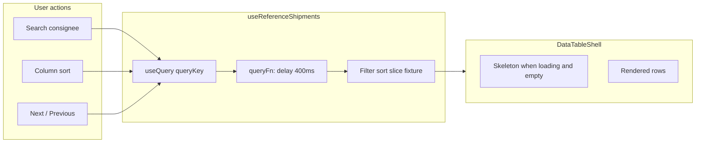
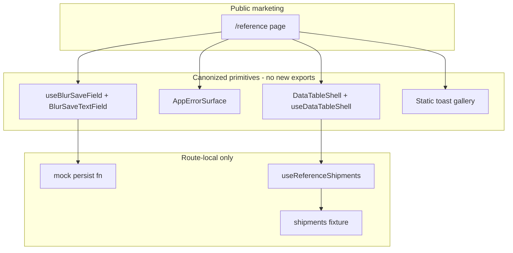

# Phase 10 Epic 5 — Pattern Reference Page

> **Track progress:** as you complete each step, update the corresponding `todos` entry's `status` to `completed` in this plan's frontmatter.

> **Precondition:** `git status --porcelain` must be empty before the first implementation edit. If dirty, halt and ask the user to commit or stash. The epic must land as a single commit containing only this epic's work — `code-review` derives its range from that commit. *(Currently dirty: untracked `.cursor/plans/phase_10_epic_4_form_primitives_46ef2450.plan.md` — archive or delete before starting.)*

Branch is already correct: `phase-10/app-home-reference-surfaces`. Epics 1–4 are `Complete`; Epic 4 primitives ([`AppErrorSurface`](src/components/app-error-surface.tsx), [`useBlurSaveField`](src/hooks/use-blur-save-field.ts), [`BlurSaveTextField`](src/components/blur-save-text-field.tsx), [`DataTableShell`](src/components/data-table-shell.tsx)) are committed and ready to consume.

**Build in parallel:** After Step 1 (route shell + auth boundary), the four section components touch disjoint files — good candidate for parallel agents. Coordinate on shared constants (`REFERENCE_PATH`) and the page composer last.

Visual reference: [`.mockups/reference-page.html`](.mockups/reference-page.html) — hero, anchor nav, four sections. Follow mockup copy and section order; use semantic tokens and shadcn primitives (not inline mockup CSS).

---

## Step 1 — Route shell, path constant, and auth boundary (Story 5.1)

**New path constant** in [`src/constants/app-paths.ts`](src/constants/app-paths.ts):

- `REFERENCE_PATH = '/reference' as const`

**Auth boundary** — hard-constraint change; update enforcement and docs in the same pass:

| File | Change |
|------|--------|
| [`src/supabase/proxy.ts`](src/supabase/proxy.ts) | Add `pathname === REFERENCE_PATH` to `isPublicRoute` (import from `app-paths`) |
| [`src/supabase/proxy.unit.test.ts`](src/supabase/proxy.unit.test.ts) | Add `'/reference'` to `PUBLIC_EXACT` in `isDiscoveredPublicRoute` — discovered-route tests auto-assert public access |
| [`AGENTS.md`](AGENTS.md) | Widen auth-boundary bullet and marketing routes prose to include `/reference` |
| [`LEXICON.md`](LEXICON.md) | Update [Auth boundary](LEXICON.md) allowlist sentence |
| [`.cursor/rules/security.mdc`](.cursor/rules/security.mdc) | Update public-routes sentence |
| [`.cursor/rules/supabase.mdc`](.cursor/rules/supabase.mdc) | Update public-routes sentence |

**Route files** under `src/app/(marketing)/reference/`:

- `page.tsx` — server component; exports `metadata` (title, description, `alternates.canonical: REFERENCE_PATH`); composes section client components inside `LandingContainer` + `main#main-content`
- `opengraph-image.tsx` — mirror [`terms/opengraph-image.tsx`](src/app/(marketing)/terms/opengraph-image.tsx) pattern; title `"Pattern Reference"` or `"What you inherit"`

Sitemap needs no manual edit — [`discoverMarketingRoutes()`](src/utils/discover-app-routes.ts) auto-includes new `(marketing)` pages.

**Entry points** (Story 5.1):

- **Landing surface:** add `{ label: 'Reference', href: REFERENCE_PATH }` to [`siteConfig.nav`](src/config/site.ts) (between Features and GitHub is natural)
- **App home:** update [`src/app/(app)/home/page.tsx`](src/app/(app)/home/page.tsx) with a short signpost paragraph + link to the reference page (workflow explainer link waits for Epic 6)

**Page shell layout** (server page):

- Centered hero: badge "Pattern reference", `h1` "What you inherit", subcopy from mockup
- Anchor nav row linking to `#forms`, `#feedback`, `#toast`, `#table` (real `<a href="#…">` for keyboard/screen-reader access)
- Section slots for Steps 2–4

---

## Step 2 — Forms and save models section (Story 5.2)

Create `src/app/(marketing)/reference/_components/reference-forms-section.tsx` (`'use client'`).

**Live blur-save demo** — separate schema from profile (reuse the note-schema shape already proven generic in [`use-blur-save-field.unit.test.ts`](src/hooks/use-blur-save-field.unit.test.ts)):

- Zod schema in `reference/_lib/reference-demo-form-schema.ts` — `displayName` + `bio` fields (matches mockup labels)
- `react-hook-form` + `useBlurSaveField` with injected **mock persist**:
  - `await` artificial delay (~400ms)
  - Return `{ success: true, data: payload }` envelope (no real server action, no DB)
- Two [`BlurSaveTextField`](src/components/blur-save-text-field.tsx) instances wired via `createTextBlurHandler`
- Wrap fields in a bordered card (`bg-card` / `rounded-xl`) per mockup

**Prose block** below the live demo (static copy from mockup): explain per-field save-model choice; name explicit submit and upload-on-complete as patterns documented in [`forms.mdc`](.cursor/rules/forms.mdc), with pointers to profile modal implementations ([`profile-password-section.tsx`](src/app/(app)/_components/profile/profile-password-section.tsx) for explicit submit; avatar upload in profile settings for upload-on-complete). No live staging for those two.

---

## Step 3 — Feedback and error states section (Story 5.3)

Create `reference/_components/reference-feedback-section.tsx`.

**Errors via shared component** — two always-visible [`AppErrorSurface`](src/components/app-error-surface.tsx) instances with hardcoded `AppError` objects:

- Operational: `{ kind: 'operational', message: "That username's already taken…", code: '…' }`
- Fault: `{ kind: 'fault', message: 'Could not save your profile…', code: 'DEMO_FAULT' }` — assert copy button renders (fault panel behavior)

Label each with muted helper text ("Operational" / "Fault") per mockup. Include explanatory prose about `kind` routing (mockup paragraph).

**Toast gallery** — static visual cards, not live `toast()` calls (mockup: "Static: all five variants"). Build small presentational rows mirroring [`sonner.tsx`](src/components/ui/sonner.tsx) icon mapping (success, info, warning, error, loading) using the same Lucide icons + semantic tokens. Prose note: only success is called in production today via [`showSuccessToast`](src/utils/app-toast.ts); other variants are configured and ready.

Section `id="feedback"`; toast subsection can use `id="toast"` for anchor nav.

---

## Step 4 — Canonical data table section (Story 5.4)

Create route-local artifacts:

| File | Purpose |
|------|---------|
| `reference/_lib/reference-shipment.ts` | Row type + status enum |
| `reference/_lib/reference-shipments.fixture.ts` | ~60–80 static rows in synthetic logistics domain (consignee, route, status, departs) — enough for search hits and 2+ pages at page size 50 |
| `reference/_lib/use-reference-shipments.ts` | Client data hook |
| `reference/_components/reference-shipments-columns.tsx` | Column defs with `meta.searchable` on consignee, `meta.skeletonClassName` per column, sortable headers via `DataTableColumnHeader`, status as `Badge` |
| `reference/_components/reference-table-section.tsx` | Search input + `DataTableShell` + Next/Previous |

**Data hook** — mirror admin table ergonomics with TanStack Query:



- `queryKey`: `['reference-shipments', debouncedSearch, page, sorting]`
- `queryFn`: artificial delay → client-side filter (substring on consignee), sort (TanStack sorted model passed in), paginate (page size **50** per [`data-tables.mdc`](.cursor/rules/data-tables.mdc))
- **Do not** set `placeholderData` on the `useQuery` call. Each query-key change (search, page, sort) must fall to the loading + empty state so `DataTableShell`'s skeleton renders on every fetch, not just initial mount.
- `isLoading` + empty rows → skeleton via `DataTableShell` `isLoading` (fires naturally on mount, search debounce, page change, sort toggle — no manual skeleton trigger)
- Controls (search input, Next/Previous, sort headers) may disable while `isFetching`, but rows must not be held over from the previous fetch.
- Pagination: Next/Previous only (no total count); `hasNextPage` derived from slice bounds
- Search debounce ~300ms (match [`users-table.tsx`](src/app/admin/users/_components/users-table.tsx) pattern)

Section `id="table"`. Closing prose from mockup about fixture vs real data.

---

## Step 5 — Tests

Keep minimal — behavior that would regress silently:

| Test | Asserts |
|------|---------|
| Extend [`proxy.unit.test.ts`](src/supabase/proxy.unit.test.ts) discovery assertion | `discoveredRoutes` contains `/reference` (may already pass via `it.each(publicRoutes)`) |
| `reference/_lib/use-reference-shipments.unit.test.ts` | Delayed query returns filtered rows; `hasNextPage` flips; skeleton path when `isLoading` |
| `reference/_components/reference-forms-section.integration.test.tsx` | Blur-save field triggers mock persist on blur; save indicator reaches saved state |

No render-only tests for static prose sections (per [`testing.mdc`](.cursor/rules/testing.mdc)).

---

## Step 6 — Wire page composer

In `reference/page.tsx`, import and stack:

1. `ReferenceFormsSection` (`id="forms"`)
2. `ReferenceFeedbackSection` (`id="feedback"`)
3. Toast is inside feedback section (`id="toast"`)
4. `ReferenceTableSection` (`id="table"`)

Section dividers: `border-t` between sections per mockup spacing. Single `h1` on page (hero); section titles are `h2`.

---

## Architecture



Deleting `src/app/(marketing)/reference/` and reverting boundary/docs changes removes the epic cleanly — no new shared primitives in `src/components/` beyond what Epic 4 already landed.

---

## Verification

Quality bar — stop on failure:

```bash
pnpm type-check && pnpm lint && pnpm format-check && pnpm test:ci
```

### Manual smoke checklist

- Signed out: open `/reference` directly — no login redirect
- Signed out: click **Reference** in site header nav from `/`
- Signed in: open `/home` — link reaches reference page
- Forms section: blur-save display name and bio — "Saving…" then "Saved"; no network to Supabase
- Feedback section: operational error inline (no copy button); fault in bordered panel with copy button
- Toast section: five static variant cards visible
- Table section: search filters consignee; column sort toggles; Next/Previous paginate; skeleton rows appear briefly on each fetch
- `pnpm pre-push` green

---

## Commit epic

Authorized by this approved plan:

1. Review diff; stage only files in scope for this epic.
2. Conventional commit message ending with trailer:

   ```
   feat(phase-10): pattern reference page

   Epic: 10.5
   ```

3. Commit (request `git_write`). If pre-commit hook fails, fix and retry.
4. Verify `git status --porcelain` is empty after commit.
5. Capture the epic commit SHA: `git rev-parse HEAD`.

---

## Handoff

Epic committed at `932e264`. Next: open a new agent window and run `/code-review`.
