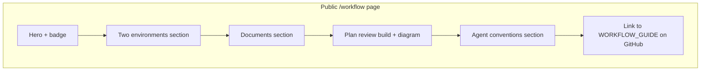
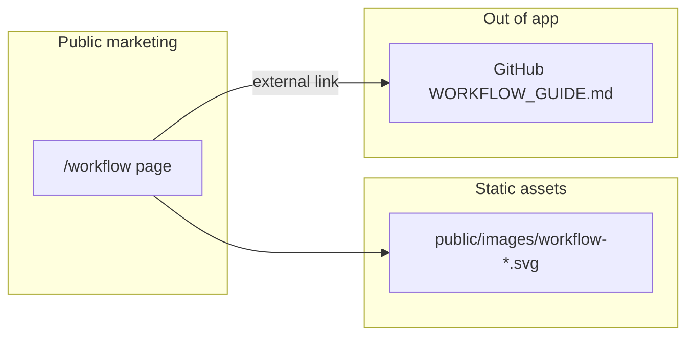

# Phase 10 Epic 6 — Workflow Explainer Page

> **Track progress:** as you complete each step, update the corresponding `todos` entry's `status` to `completed` in this plan's frontmatter.

> **Precondition:** `git status --porcelain` must be empty before the first implementation edit. If dirty, halt and ask the user to commit or stash. The epic must land as a single commit containing only this epic's work — `code-review` derives its range from that commit. *(Currently dirty: untracked `.cursor/plans/` files — archive or delete before starting.)*
>
> After the clean check, record `git rev-parse HEAD` as the **epic baseline SHA** (placeholder below) before the first implementation edit. This is the fixed point `code-review` uses as the range start.

**Epic baseline:** `922249724bca1011519ef3d44e8ed847ab24d68c`

Branch is already correct: `phase-10/app-home-reference-surfaces`. Epics 1–5 are `Complete`; Epic 5 left the app-home workflow link as a follow-up ([`src/app/(app)/home/page.tsx`](src/app/(app)/home/page.tsx)).

**Route choice:** `WORKFLOW_PATH = '/workflow'` — pairs with [`REFERENCE_PATH`](src/constants/app-paths.ts), not used elsewhere, conventional for a workflow explainer. No mockup exists; follow the reference page's marketing layout rhythm (centered hero, `max-w-3xl` prose column, `LandingContainer`, semantic tokens).

This is the **final epic in Phase 10** — after `/code-review` and `/mark-epic-complete`, the phase is ready for `/ship-phase`.

---

## Step 1 — Route shell, path constant, and auth boundary (Story 6.1)

**New path constant** in [`src/constants/app-paths.ts`](src/constants/app-paths.ts):

- `WORKFLOW_PATH = '/workflow' as const`

**Auth boundary** — hard-constraint change (third widening this phase); update enforcement and docs in the same pass:

| File | Change |
|------|--------|
| [`src/supabase/proxy.ts`](src/supabase/proxy.ts) | Add `pathname === WORKFLOW_PATH` to `isPublicRoute` |
| [`src/supabase/proxy.unit.test.ts`](src/supabase/proxy.unit.test.ts) | Add `'/workflow'` to `PUBLIC_EXACT` — discovered-route tests auto-assert public access |
| [`AGENTS.md`](AGENTS.md) | Widen auth-boundary bullet; add `/workflow` to marketing routes prose and directory map |
| [`LEXICON.md`](LEXICON.md) | Update [Auth boundary](LEXICON.md) allowlist sentence |
| [`.cursor/rules/security.mdc`](.cursor/rules/security.mdc) | Update public-routes sentence |
| [`.cursor/rules/supabase.mdc`](.cursor/rules/supabase.mdc) | Update public-routes sentence |

Sitemap needs no manual edit — [`discoverMarketingRoutes()`](src/utils/discover-app-routes.ts) auto-includes new `(marketing)` pages.

**Route files** under `src/app/(marketing)/workflow/`:

- `page.tsx` — server component; exports `metadata` (title ~"PM + Agent Workflow", description summarizing the two-environment model; `alternates.canonical: WORKFLOW_PATH`); composes section content inside `LandingContainer` + `main#main-content`
- `opengraph-image.tsx` — mirror [`terms/opengraph-image.tsx`](src/app/(marketing)/terms/opengraph-image.tsx); title `"PM + Agent Workflow"` or similar

**Page shell layout** (hero only in this step; sections in Step 2):

- Centered hero: `Badge` "Workflow", `h1` (e.g. "How planning and building work"), short subcopy positioning the page as concept-only
- Single `h1` on the page; section titles are `h2`

---

## Step 2 — Concept-only page content (Story 6.1)

Create route-local content in `workflow/_lib/workflow-page-content.ts` (static copy constants + outbound URL) and section components under `workflow/_components/` — keeps [`page.tsx`](src/app/(marketing)/reference/page.tsx) thin like the reference page pattern.

**Outbound link** (the page's only operational escape hatch):

- `WORKFLOW_GUIDE_URL` = `` `${siteConfig.links.github}/blob/main/docs/WORKFLOW_GUIDE.md` ``
- Render as an external `Link` or `<a>` with `target="_blank"` + `rel="noopener noreferrer"` — label like "Read the full workflow guide"
- Do **not** link to or summarize [`WORKFLOW_SETUP.md`](docs/WORKFLOW_SETUP.md) content on the page; the guide owns that handoff

**Content guardrails** (from PRD success criteria):

- Cover the template's **two differentiators**: agent-ready conventions + PM/agent collaboration model
- Include: two-environment split, document set each side owns, plan → review → build loop
- **No** file paths, commands, MCP setup, skill install steps, token-budget tips, or model guidance — those live in the guide
- Describe documents by **role** ("phase roadmap", "phase requirements", "repo truth", "shared vocabulary", "doc maintenance rules") not by filename

**Suggested sections** (static server components, `border-t` dividers, `max-w-prose` body text):

1. **Two environments** — Claude owns planning, alignment, and adversarial review; Cursor owns implementation; hard boundary between them
2. **The documents** — compact table or definition list: who writes, who reads, what each is for (distilled from [WORKFLOW_GUIDE § The documents](docs/WORKFLOW_GUIDE.md), not copied verbatim)
3. **Plan, review, build** — the epic subloop in plain language (plan in Cursor → review in Claude → build → code review → mark complete → ship phase); reuse the existing workflow diagram:
   - Copy [`images/workflow-light.svg`](images/workflow-light.svg) and [`images/workflow-dark.svg`](images/workflow-dark.svg) to `public/images/` (app cannot serve from repo-root `images/`)
   - `workflow/_components/workflow-diagram.tsx` — `<picture>` with `prefers-color-scheme` sources (same pattern as [README](README.md)); meaningful `alt` describing the loop
4. **Agent-ready conventions** — coding standards, rules, and skills encoded so any AI agent inherits the same bar; concept-level only (no `.cursor/` paths)
5. **Closing CTA** — paragraph + button/link to `WORKFLOW_GUIDE_URL` on GitHub

Optional anchor nav (like reference page) if it aids scanning — not required by PRD.



**No new shared primitives** — deleting `src/app/(marketing)/workflow/` and reverting boundary/docs changes removes the epic cleanly.

---

## Step 3 — Entry points (Story 6.1)

- **Site header nav:** add `{ label: 'Workflow', href: WORKFLOW_PATH }` to [`siteConfig.nav`](src/config/site.ts) — place after Reference, before GitHub
- **App home signpost:** extend [`src/app/(app)/home/page.tsx`](src/app/(app)/home/page.tsx) with a second paragraph linking to the workflow explainer (mirror the existing reference link pattern); import `WORKFLOW_PATH` from `app-paths`

Landing features cards already name the two differentiators in copy — nav link satisfies "reached from the landing surface"; no feature-card link changes required.

---

## Step 4 — Tests

Minimal — behavior that would regress silently:

| Test | Asserts |
|------|---------|
| Extend [`proxy.unit.test.ts`](src/supabase/proxy.unit.test.ts) | `PUBLIC_EXACT` includes `'/workflow'`; `discoveredRoutes` contains `/workflow` |

No render-only tests for static prose sections (per [`.cursor/rules/testing.mdc`](.cursor/rules/testing.mdc)).

---

## Architecture



---

## Verification

Quality bar — stop on failure:

```bash
pnpm type-check && pnpm lint && pnpm format-check && pnpm test:ci
```

### Manual smoke checklist

- Signed out: open `/workflow` directly — no login redirect
- Signed out: click **Workflow** in site header nav from `/`
- Signed in: open `/home` — workflow signpost link works
- Page prose: a visitor can explain the two-tool split and plan-review loop without opening the repo
- Page contains **no** file paths, CLI commands, or MCP/setup steps
- "Read the full workflow guide" opens GitHub `docs/WORKFLOW_GUIDE.md`
- Workflow diagram renders in light and dark mode
- `pnpm pre-push` green

---

## Commit epic

Authorized by this approved plan:

1. Review diff; stage only files in scope for this epic.
2. Conventional commit message ending with trailer:

   ```
   feat(phase-10): PM agent workflow explainer page

   Epic: 10.6
   ```

3. Commit (request `git_write`). If pre-commit hook fails, fix and retry.
4. Verify `git status --porcelain` is empty after commit.
5. Capture the epic commit SHA: `git rev-parse HEAD`.

**Do not push** — push remains `ship-phase`.

---

## Handoff

Epic 10.6 committed.

- **Baseline SHA:** `922249724bca1011519ef3d44e8ed847ab24d68c`
- **Epic commit SHA:** `df8da26f67069fc37bebfe32c188c43f708af74c`
- **Epic id:** 10.6

Next: open a new agent window and run `/code-review`.
