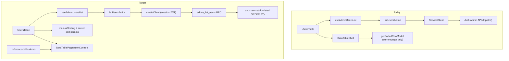

# Phase 11 Epic 10 — Real sort & page-size selector for data tables

> **Track progress:** as you complete each step, update the corresponding `todos` entry's `status` to `completed` in this plan's frontmatter.

> **Precondition:** `git status --porcelain` must be empty before the first implementation edit. If dirty, halt and ask the user to commit or stash. The epic must land as a single commit containing only this epic's work.

**Branch:** already correct — `phase-11/corrections-hardening`.

**Epic baseline SHA:** `a1747edbb1ba03149563943846e4d1fd8ff8d5c0`

## Context

Epics 1–9 are `Complete`. [Epic 10](docs/prds/phase-11-corrections-hardening.prd.md) is next. It replaces the dual-path Admin API listing in [`list-admin-users.ts`](src/app/admin/users/_lib/list-admin-users.ts) with a `SECURITY DEFINER` Postgres function, makes all five user columns sortable against the **full** dataset (not just the current page), adds a page-size selector, extracts shared pagination controls, and updates the reference demo to match.



**Security note (plan-review gate):** The RPC is a new elevated-privilege surface. Before landing, confirm in review:

- Internal admin check uses `(select auth.jwt() -> 'app_metadata' ->> 'role') = 'admin'` (same semantics as [`isAdminFromAppMetadata`](src/utils/admin.ts)) — function **RAISES EXCEPTION** when the caller is not admin (empty-rows-on-denial is not permitted).
- Sort column resolved via static ORDER BY matrix of typed, direction-paired `CASE` expressions — allowlist only (`email`, `email_confirmed_at`, `created_at`, `last_sign_in_at`, `role`); never dynamic SQL interpolation.
- Execute privileges: `REVOKE EXECUTE … FROM PUBLIC` then `GRANT EXECUTE … TO authenticated` only — Postgres grants EXECUTE to PUBLIC by default; GRANT alone does not exclude `anon`. Listing must call RPC via session-scoped [`createClient`](src/supabase/server.ts) so `auth.jwt()` reflects the admin caller — **not** [`createServiceClient`](src/supabase/service.ts) (service key has no admin user JWT).

**Human checkpoint (migration):** After the migration file is written, the human runs `pnpm db:push` and `pnpm db:types` before the quality gate — agents write SQL only ([`do-migrations-agent.mdc`](.cursor/rules/do-migrations-agent.mdc)).

---

## Step 0 — Baseline

Run `git rev-parse HEAD`, then substitute the literal SHA value into two places in this plan — the `**Epic baseline SHA:**` line near the top and the Handoff message at the bottom. Neither may refer to the SHA by location; both carry the value itself. Halt if working tree is dirty.

---

## Step 1 — Migration: `admin_list_users`

Use [`create-migration` skill](.cursor/skills/create-migration/SKILL.md) — one file in [`supabase/migrations/`](supabase/migrations/), UTC timestamp after existing migrations.

**Function signature (conceptual):**

`admin_list_users(p_sort_column text, p_sort_direction text, p_page int, p_per_page int, p_search text)`

**Behavior:**

- `LANGUAGE plpgsql` (required — `RAISE EXCEPTION` is not available in a plain SQL function).
- `SECURITY DEFINER`, `set search_path = ''`, fully qualified `auth.users` reads.
- Admin gate at top — **RAISE EXCEPTION** when the caller's `app_metadata` role is not `'admin'`. Empty-rows-on-denial is not permitted.
- **Alias-qualified column references:** the query aliases `auth.users` as `u` and uses:

  ```sql
  RETURN QUERY SELECT u.id, u.email, u.email_confirmed_at, u.created_at, u.last_sign_in_at, u.app_metadata, u.banned_until FROM auth.users u
  ```

  Every column reference is `u.`-qualified everywhere in the body — the `RETURN QUERY` select list, the WHERE/search predicate (`u.email ILIKE …`), and the ORDER BY matrix. In PL/pgSQL, `RETURNS TABLE(...)` output parameters share a namespace with query column references, so an unqualified `email` (or any other output-param name) raises `column reference "email" is ambiguous` at runtime — document this in the migration header comment alongside security rationale and the sort allowlist.
- Execute privileges (after `CREATE FUNCTION`):

  ```sql
  REVOKE EXECUTE ON FUNCTION public.admin_list_users(text, text, int, int, text) FROM PUBLIC;
  GRANT EXECUTE ON FUNCTION public.admin_list_users(text, text, int, int, text) TO authenticated;
  ```

  Postgres grants EXECUTE to PUBLIC by default; the GRANT alone does not exclude `anon`.

- `p_search`: optional `u.email ILIKE …` when trimmed length ≥ 3 (preserve [`USERS_SEARCH_MIN_LENGTH`](src/app/admin/users/_lib/admin-user-row.ts)); empty/short search returns unfiltered set. **Escape `%` and `_` in `p_search` before wrapping in wildcards** for the ILIKE comparison (prevent user-supplied pattern metacharacters from broadening the match).
- Sort: validated `p_sort_column` / `p_sort_direction` allowlists only (`email`, `email_confirmed_at`, `created_at`, `last_sign_in_at`, `role` + `asc`/`desc`). **Do not use a single `CASE p_sort_column WHEN … END`** — its branches span `text` (`email`, `app_metadata->>'role'`) and `timestamptz` (`email_confirmed_at`, `created_at`, `last_sign_in_at`), which Postgres rejects as unmatched CASE types; casting all branches to text would make timestamps sort lexically. Direction must also be applied via paired expressions, since ASC/DESC cannot be parameterized and dynamic SQL is not permitted.

  Use an ORDER BY matrix of typed, direction-paired CASE expressions:

  ```sql
  ORDER BY
    CASE WHEN p_sort_column = 'email' AND p_sort_direction = 'asc'
         THEN u.email END ASC NULLS LAST,
    CASE WHEN p_sort_column = 'email' AND p_sort_direction = 'desc'
         THEN u.email END DESC NULLS LAST,
    CASE WHEN p_sort_column = 'email_confirmed_at' AND p_sort_direction = 'asc'
         THEN u.email_confirmed_at END ASC NULLS LAST,
    CASE WHEN p_sort_column = 'email_confirmed_at' AND p_sort_direction = 'desc'
         THEN u.email_confirmed_at END DESC NULLS LAST,
    CASE WHEN p_sort_column = 'created_at' AND p_sort_direction = 'asc'
         THEN u.created_at END ASC NULLS LAST,
    CASE WHEN p_sort_column = 'created_at' AND p_sort_direction = 'desc'
         THEN u.created_at END DESC NULLS LAST,
    CASE WHEN p_sort_column = 'last_sign_in_at' AND p_sort_direction = 'asc'
         THEN u.last_sign_in_at END ASC NULLS LAST,
    CASE WHEN p_sort_column = 'last_sign_in_at' AND p_sort_direction = 'desc'
         THEN u.last_sign_in_at END DESC NULLS LAST,
    CASE WHEN p_sort_column = 'role' AND p_sort_direction = 'asc'
         THEN u.app_metadata->>'role' END ASC NULLS LAST,
    CASE WHEN p_sort_column = 'role' AND p_sort_direction = 'desc'
         THEN u.app_metadata->>'role' END DESC NULLS LAST,
    u.created_at DESC
  ```

  Requirements: one asc/desc pair for each of the five allowlisted columns; every branch carries `NULLS LAST`; the allowlist stays static with no interpolation; final `u.created_at DESC` tiebreaker gives deterministic ordering across pages. Default behavior when no sort column matches remains `created_at desc` via the tiebreaker.
- Pagination: `LIMIT p_per_page OFFSET (p_page - 1) * p_per_page` with `p_page` / `p_per_page` clamped server-side.
- Returns (via `RETURN QUERY` above): `id`, `email`, `email_confirmed_at`, `created_at`, `last_sign_in_at`, `app_metadata`, `banned_until` — queried for Epic 11; no display column this epic.

**Pause for human:** `pnpm db:push` → `pnpm db:types` → commit includes regenerated [`database.types.ts`](src/types/database.types.ts).

---

## Step 2 — Data layer: RPC replaces Admin API

**[`list-admin-users.ts`](src/app/admin/users/_lib/list-admin-users.ts)**

- Remove `listUsersViaApi` and `client.auth.admin.listUsers` branches.
- Extend `ListAdminUsersPageParams` with `sortColumn`, `sortDirection`, `perPage`.
- Call `client.rpc('admin_list_users', { … })`.
- Map RPC rows → `AdminUserRow` via updated [`mapUserToAdminRow`](src/app/admin/users/_lib/admin-user-row.ts) (accept a slimmer RPC row type; keep display labels formatted with existing `Intl.DateTimeFormat`). **`banned_until` is always selected by the RPC and always carried on the mapped row type** — no display column this epic.
- Keep `hasNextPage: rows.length === perPage` heuristic.

**[`actions.ts`](src/app/admin/users/actions.ts)**

- Extend `ListUsersActionInput` with sort + `perPage`.
- Validate: page ≥ 1 integer; `perPage` in allowlist `[10, 15, 25, 50]`; sort column/direction in allowlists matching SQL.
- Switch from `createServiceClient()` to `await createClient()` for the list path only (promote/demote keep service client).

**[`admin-users-query-keys.ts`](src/app/admin/users/_lib/admin-users-query-keys.ts)** — include sort + perPage in list key.

**[`use-admin-users-list.ts`](src/app/admin/users/_lib/use-admin-users-list.ts)** — accept and forward new params.

**Constants:** keep `USERS_PAGE_SIZE = 15` as default; add `USERS_PAGE_SIZE_OPTIONS = [10, 15, 25, 50]` in [`admin-user-row.ts`](src/app/admin/users/_lib/admin-user-row.ts) (or a neutral `src/constants/data-table.ts` if cleaner).

**Tests:** rewrite [`list-admin-users.unit.test.ts`](src/app/admin/users/_lib/list-admin-users.unit.test.ts) to mock `.rpc()`; extend [`actions.unit.test.ts`](src/app/admin/users/actions.unit.test.ts) for validation and param forwarding.

---

## Step 3 — `data-table-shell`: server-sort mode

[`data-table-shell.tsx`](src/components/data-table-shell.tsx) today always runs `getSortedRowModel()` — that re-sorts the current page client-side.

Extend `useDataTableShell` options:

- `manualSorting?: boolean` — when true, omit `getSortedRowModel()` and set `manualSorting: true` on the table instance.
- Optional controlled `sorting` / `onSortingChange` props so parent owns sort state (needed to pass sort params to the server query).

**Both** the admin users table and the reference demo use manual mode with the same controlled sorting API — `getSortedRowModel()` does not run for either. Sorting for the reference demo happens in `use-reference-shipments` (Step 6), not in the table shell.

**Template note:** After this epic, `manualSorting` has no consumer using its default (`false`) branch — both shipped tables run in manual mode. The flag is retained deliberately as template surface for spinoffs that want client-side sort; this is not an interim state. Keep `getSortedRowModel()` support in place for that default path.

---

## Step 4 — Shared pagination controls + page-size selector

**Add shadcn Select** (not in repo today):

```bash
pnpm dlx shadcn@latest add select -y -o
```

**New [`src/components/data-table-pagination-controls.tsx`](src/components/data-table-pagination-controls.tsx)**

Props: `page`, `hasNextPage`, `isPending`, `onPrevious`, `onNext`, `pageSize`, `pageSizeOptions`, `onPageSizeChange`, optional `className`.

- Rows-per-page `Select` (10 / 15 / 25 / 50) + Previous/Next outline buttons (same disable rules as today: page ≤ 1, `!hasNextPage`, `isPending`).
- Accessible label for the select.

**Wire consumers (end state, not interim):**

- [`users-table.tsx`](src/app/admin/users/_components/users-table.tsx) — lift `sorting` + `perPage` state; reset `page` to 1 on search/sort/page-size change; map TanStack column ids to RPC sort keys (`email` → `email`, `isVerified` → `email_confirmed_at`, `createdAtLabel` → `created_at`, `lastSignInAtLabel` → `last_sign_in_at`, `isAdmin` → `role`); replace hand-rolled buttons.
- [`reference-table-demo.tsx`](src/app/(marketing)/reference/_components/reference-table-demo.tsx) — same component; optional `className` for card footer border.
- [`reference-table-demo-fallback.tsx`](src/app/(marketing)/reference/_components/reference-table-demo-fallback.tsx) — reuse with disabled state instead of duplicating buttons.

---

## Step 5 — All five columns sortable (admin)

[`users-columns.tsx`](src/app/admin/users/_components/users-columns.tsx): set `enableSorting: true` on Verified, Created, Last sign-in, and Role (Email already true). Actions column stays `enableSorting: false`.

---

## Step 6 — Reference demo parity

[`use-reference-shipments.ts`](src/app/(marketing)/reference/_lib/use-reference-shipments.ts):

- Accept `perPage` and `sorting` (column + direction).
- Pipeline: **filter → sort full fixture → paginate slice** (fix today's sort-current-page-only bug).
- Sort comparators per column type (string for consignee/route/status/departs; match [`reference-shipments-columns.tsx`](src/app/(marketing)/reference/_components/reference-shipments-columns.tsx) accessors).
- Query key includes search, page, perPage, sort.

Update reference demo to pass sort state from `useDataTableShell` (manual mode, controlled sorting) and perPage from shared pagination controls.

Update [`use-reference-shipments.unit.test.tsx`](src/app/(marketing)/reference/_lib/use-reference-shipments.unit.test.tsx) for sort-across-pages and page-size behavior.

---

## Step 7 — Rule sync

Update [`.cursor/rules/data-tables.mdc`](.cursor/rules/data-tables.mdc):

- Pagination: configurable page size (10 / 15 / 25 / 50) via shared `DataTablePaginationControls`; 15 remains default.
- Production tables: server-driven sort (manual sorting); fixture demos may sort client-side before slice.
- Reference implementations: add `data-table-pagination-controls.tsx`.

No AGENTS.md hard-constraint change this epic.

---

## Verification

Quality bar — stop on failure:

```bash
pnpm type-check && pnpm lint && pnpm format-check && pnpm test:ci
```

**Manual smoke checklist:**

- `/admin/users` — sort each of the five columns; confirm order changes across pages (not just within 15 rows).
- Change page size (10 / 15 / 25 / 50); confirm row count and Next/Prev behavior.
- Email search still works; sort + page size reset page to 1.
- `/reference` data table demo — sort all columns across pages; page-size selector matches admin behavior.
- Non-admin cannot reach `/admin/users` (unchanged proxy gate).
- **Stale session on list path** — leave `/admin/users` idle until the access token would expire, then interact with the table (sort, page, or search); confirm the RPC call succeeds after proxy refresh and does not surface a JWT error.

---

## Commit epic

Authorized by this approved plan:

1. Review diff; stage only Epic 10 files (migration, types, data layer, UI, tests, rule).
2. Conventional commit ending with:

   ```
   feat(phase-11): real server sort and page-size for data tables

   Epic: 11.10
   ```

3. Commit (`git_write`). If pre-commit hook fails, fix and retry (new commit, not amend).
4. Verify `git status --porcelain` is empty.

**Do not push** — push remains `ship-phase`.

---

## Handoff

Epic 11.10 committed. Epic baseline SHA: `a1747edbb1ba03149563943846e4d1fd8ff8d5c0`. Next: open a new agent window and run `/code-review`.
