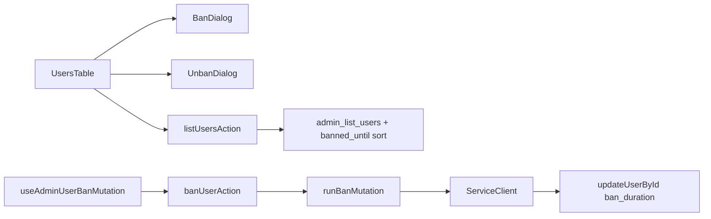

# Phase 11 Epic 11 — Ban functionality

> **Track progress:** as you complete each step, update the corresponding `todos` entry's `status` to `completed` in this plan's frontmatter.

> **Precondition:** `git status --porcelain` must be empty before the first implementation edit. If dirty, halt and ask the user to commit or stash. The epic must land as a single commit containing only this epic's work.

**Branch:** already correct — `phase-11/corrections-hardening`.

**Epic baseline SHA:** `a6a57bfbaa567bba22d313dcce7282bd24652c35`

## Context

Epics 1–10 are `Complete`. [Epic 11](docs/prds/phase-11-corrections-hardening.prd.md) is next. It adds ban/unban to the admin users table, building on Epic 10's `admin_list_users` RPC (which already returns `banned_until` on each row).

**Architectural split (preserve):**
- **Listing + sort** — session client + `admin_list_users` RPC (extend sort allowlist only)
- **Ban mutations** — service client + `auth.admin.updateUserById({ ban_duration })` (same path as promote/demote in [`admin-role-mutations.ts`](src/utils/admin-role-mutations.ts))



**Known UI gap to fix:** [`users-columns.tsx`](src/app/admin/users/_components/users-columns.tsx) returns `null` for the actions cell when neither promote nor demote applies — an admin viewing their own row (no demote) would hide the menu entirely. Epic 11 must show the dropdown whenever any action (promote, demote, ban, or unban) is available.

**Human checkpoint (migration):** After the migration file is written, the human runs `pnpm db:push` and `pnpm db:types` before the quality gate — agents write SQL only ([`do-migrations-agent.mdc`](.cursor/rules/do-migrations-agent.mdc)).

---

## Step 0 — Baseline

Run `git rev-parse HEAD`, confirm it matches the SHA above (update the plan if the branch has moved). Halt if working tree is dirty.

---

## Step 1 — Ban constants and `banStatus` derivation

Add a small constants module (e.g. [`src/constants/admin-ban.ts`](src/constants/admin-ban.ts)):

- `ADMIN_BAN_DURATIONS` — fixed allowlist: `1h`, `24h`, `168h`, `720h`, `876000h` (~100 years, functionally permanent)
- `ADMIN_UNBAN_DURATION` — `'none'`
- `BAN_PERMANENCE_THRESHOLD_MS` — ~10 years (used to classify permanent vs finite display)
- Human labels for the duration picker (e.g. "1 hour", "24 hours", "7 days", "30 days", "Permanent")

In [`admin-user-row.ts`](src/app/admin/users/_lib/admin-user-row.ts):

- Add `BanStatus` type: `null` | `{ permanent: true }` | `{ until: Date }`
- Add `deriveBanStatus(bannedUntil: string | null, now?: Date): BanStatus` — treat `null`, invalid, or past timestamps as not banned; future timestamps beyond the permanence threshold as `{ permanent: true }`; otherwise `{ until: Date }`
- Extend `AdminUserRow` with `banStatus: BanStatus` — **`banStatus` is the only ban-related field on the display DTO**; raw `bannedUntil` stays internal to `mapUserToAdminRow` (not exposed on `AdminUserRow`)
- Update `mapUserToAdminRow` to set `banStatus` from the RPC's `banned_until`
- Add `banned_until` to `USERS_SORT_COLUMNS` in the same file

Unit tests in [`admin-user-row.unit.test.ts`](src/app/admin/users/_lib/admin-user-row.unit.test.ts): not banned, finite ban, permanent ban (876000h-equivalent future date), expired ban.

---

## Step 2 — Ban/unban mutations (service-layer util)

Extend [`admin-role-mutations.ts`](src/utils/admin-role-mutations.ts) alongside promote/demote:

- `BanDuration` type from the constants allowlist + `'none'`
- `BanUserByIdResult` — `{ status: 'banned'; email: string }` | `{ status: 'not_found' }`
- `UnbanUserByIdResult` — `{ status: 'unbanned'; email: string }` | `{ status: 'not_banned'; email: string }` | `{ status: 'not_found' }`
- `banUserById(client, userId, banDuration)` — `getUserById` → `updateUserById(user.id, { ban_duration: banDuration })`
- `unbanUserById(client, userId)` — same lookup → `updateUserById(user.id, { ban_duration: 'none' })`; idempotent `not_banned` when already unbanned
- `getBanMutationToastMessage(status)` — user-facing success copy

Validate `banDuration` against the allowlist in the server action layer (not free text).

Unit tests in [`admin-role-mutations.unit.test.ts`](src/utils/admin-role-mutations.unit.test.ts): happy path, not_found, unban idempotent, correct `updateUserById` payload.

---

## Step 3 — Orchestration and server actions

Add [`run-ban-mutation.ts`](src/app/admin/users/_lib/run-ban-mutation.ts) mirroring [`run-role-mutation.ts`](src/app/admin/users/_lib/run-role-mutation.ts):

- Shared runner: `assertAdminCaller` → validate userId → optional `beforeMutation` → `createServiceClient()` → mutation → map `not_found` to operational error, else success with `console.warn` log tag `[users-ban]` / `[users-unban]`
- `runBanUserMutation(userId, banDuration)` — no self-ban: `targetUserId === callerUserId` → `VALIDATION_ERROR` ("You cannot ban your own account")
- `runUnbanUserMutation(userId)` — no self-guard needed per PRD (only self-ban is blocked)

Extend [`actions.ts`](src/app/admin/users/actions.ts):

- `banUserAction({ userId, banDuration })` — validate duration against allowlist
- `unbanUserAction({ userId })`
- Extend `listUsersAction` sort validation to accept `banned_until` (flows from updated `USERS_SORT_COLUMNS`)

Unit tests in [`actions.unit.test.ts`](src/app/admin/users/actions.unit.test.ts): auth gates, self-ban block, invalid duration, NOT_FOUND, success envelopes — mirror existing promote/demote cases.

---

## Step 4 — Migration: extend `admin_list_users` sort allowlist

Use [`create-migration` skill](.cursor/skills/create-migration/SKILL.md) — one new file in [`supabase/migrations/`](supabase/migrations/).

> **Precondition (filename timestamp):** Before writing the migration file, compare the generated filename timestamp against the existing [`20260715003530_admin_list_users.sql`](supabase/migrations/20260715003530_admin_list_users.sql). If the generated UTC timestamp sorts at or before `20260715003530`, rename the new file to a timestamp **strictly greater** than `20260715003530`. A filename that sorts earlier causes the original migration to re-replace the function on a fresh `db:push` — the new migration must run after Epic 10's, not before it.

`CREATE OR REPLACE FUNCTION public.admin_list_users(...)` — copy the existing function body from [`20260715003530_admin_list_users.sql`](supabase/migrations/20260715003530_admin_list_users.sql) and add `banned_until` asc/desc CASE pairs to the ORDER BY matrix. Update the header-comment sort allowlist.

**Verbatim retention (required):** The copied function body must retain, unchanged:
- `SECURITY DEFINER`
- `set search_path = ''` (existing `SET search_path`)
- The in-function `auth.jwt() -> 'app_metadata' ->> 'role'` admin gate that raises on denial

Only the ORDER BY matrix and the header-comment sort allowlist change.

**`banned_until` ORDER BY semantics:**
- Add asc and desc CASE pairs using the same static allowlist pattern as `created_at` / `role`.
- Both the asc and desc branches must state **`NULLS LAST` explicitly** — Postgres defaults `desc` to `NULLS FIRST`, so omitting it on the desc branch would invert null ordering.
- **Expired bans:** normalize past `banned_until` values to `NULL` inside the ORDER BY expression (e.g. `CASE WHEN u.banned_until <= now() THEN NULL ELSE u.banned_until END`) so expired bans sort with unbanned rows (`NULL`) and match the empty Ban cell rendered by `deriveBanStatus`. Active (future) bans sort by their timestamp; unbanned and expired rows group together at the null end.

No signature change — `REVOKE`/`GRANT` unchanged.

Tell the human to run `pnpm db:push` and `pnpm db:types`.

---

## Step 5 — Ban column and server-side sort wiring

[`users-columns.tsx`](src/app/admin/users/_components/users-columns.tsx):

- New **Ban** column **between Role and Actions**: `enableSorting: true`, accessor `banStatus`
- Cell: empty when `banStatus === null`; `Badge variant="destructive"` "Banned" for permanent; `Badge` "Banned until {date}" for finite — format date with the same `Intl.DateTimeFormat` medium style as Created/Last sign-in (extract shared formatter from `admin-user-row.ts` if needed, e.g. `formatBanUntilLabel`)
- Extend `CreateUsersColumnsOptions` with `onBan`, `onUnban`
- Actions dropdown: add "Ban user" (when not banned and not self) and "Unban" (when banned); change visibility guard to `canPromote || canDemote || canBan || canUnban`

[`users-table.tsx`](src/app/admin/users/_components/users-table.tsx):

- Add `banStatus: 'banned_until'` to `COLUMN_ID_TO_SORT_KEY`
- Wire ban/unban confirm state alongside existing `confirmAction`

[`page.tsx`](src/app/admin/users/page.tsx): update subhead copy to mention ban/unban alongside promote/demote.

---

## Step 6 — Ban/unban UI (dialog, hook, table integration)

**Ban dialog** — new [`ban-user-dialog.tsx`](src/app/admin/users/_components/ban-user-dialog.tsx):

- **`Dialog`** (not `AlertDialog`) — the duration `<Select>` is an interactive control; `AlertDialog` is confirmation-only
- Duration `<Select>` with options from `ADMIN_BAN_DURATIONS` + labels
- Controlled open state; destructive confirm button; disabled while pending
- Standard `DialogFooter` confirm/cancel pattern (no `AlertDialogAction` preventDefault workaround)

**Unban dialog** — separate [`unban-user-dialog.tsx`](src/app/admin/users/_components/unban-user-dialog.tsx):

- **`AlertDialog`** confirmation only (no duration picker), mirroring [`promote-demote-dialog.tsx`](src/app/admin/users/_components/promote-demote-dialog.tsx) copy and preventDefault pattern
- Not a branch inside the ban dialog — two distinct components

**Client hook** — [`use-admin-user-ban-mutation.ts`](src/app/admin/users/_lib/use-admin-user-ban-mutation.ts):

- `useMutation` calling `banUserAction` / `unbanUserAction`
- `unwrap` helper (extend or parallel [`unwrap-users-action.ts`](src/app/admin/users/_lib/unwrap-users-action.ts))
- Success toast via `getBanMutationToastMessage`; invalidate `adminUsersQueryKeys.all`
- One `pendingUserId` in `users-table`, shared by the role mutation and the ban/unban mutation — both disable the same row while either is in flight

**Table wiring** in `users-table.tsx`:

- Compose `BanUserDialog`, `UnbanUserDialog`, and `PromoteDemoteDialog`
- `AppErrorSurface` for mutation faults (same as promote/demote)
- Pass `onBan` / `onUnban` into `createUsersColumns`

UI tests in [`users-table.unit.test.tsx`](src/app/admin/users/_components/users-table.unit.test.tsx): Ban hidden for current admin row; ban flow opens dialog + toast; unban for banned row; mutation fault panel.

---

## Step 7 — List/sort validation tests

Update [`list-admin-users.unit.test.ts`](src/app/admin/users/_lib/list-admin-users.unit.test.ts) if sort-column validation is tested there.

Ensure [`actions.unit.test.ts`](src/app/admin/users/actions.unit.test.ts) accepts `sortColumn: 'banned_until'`.

No AGENTS.md sync in this epic — ban is admin-console scope already described at a high level; full ban UX lands in this commit and can be synced at phase ship via `/sync-repo-docs` unless the implementer sees a hard-constraint or route change (there isn't one).

---

### Verification

Quality bar — same commands as [WORKFLOW_GUIDE Step 5 exit condition](docs/WORKFLOW_GUIDE.md). Stop on failure:

```bash
pnpm type-check && pnpm lint && pnpm format-check && pnpm test:ci
```

### Commit epic

Authorized by this approved plan:

1. Review diff; stage only files in scope for this epic.
2. Write a conventional commit message (`feat`/`fix`/`docs`/etc.). It **must** end with an `Epic:` git trailer — this is the only thing `code-review` uses to find the commit:

   ```
   feat(phase-11): admin user ban and unban

   Epic: 11.11
   ```

   Format is `Epic: {phase}.{id}` — phase number as written in ROADMAP (decimals OK: `7.5`), epic id as written (`1`, `1A`). Blank line before the trailer, nothing after it. Exactly one commit in the repo may carry a given `Epic:` value.
3. Commit (request `git_write`). Pre-commit hook runs automatically — if it fails, **fix and retry the commit** (a failed pre-commit hook aborts the commit, so there is nothing to amend).
4. Verify `git status --porcelain` is empty after commit.

**Do not push** — push remains `ship-phase`.

### Handoff

Epic **11.11** committed (baseline SHA: `a6a57bfbaa567bba22d313dcce7282bd24652c35`). Next: open a new agent window and run `/code-review`.
