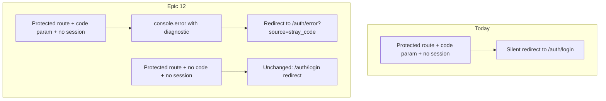

# Phase 11 Epic 12 — Email confirmation setup fix & stray-code hardening

> **Track progress:** as you complete each step, update the corresponding `todos` entry's `status` to `completed` in this plan's frontmatter.

> **Precondition:** `git status --porcelain` must be empty before the first implementation edit. If dirty, halt and ask the user to commit or stash. The epic must land as a single commit containing only this epic's work — `code-review` derives its range from that commit.
>
> Then run `git rev-parse HEAD` and record the result as the **epic baseline SHA** before the first implementation edit (update this plan's Handoff section with the captured value).

**Branch:** `phase-11/corrections-hardening` (confirmed).

**Scope:** Four stories, four touch surfaces — README docs, proxy redirect branch, auth error copy, auth-boundary test. No migrations, no hard-constraint changes (`/auth/**` is already public so `/auth/error` needs no allowlist widening).

---

## Problem recap

When Supabase email templates still point at the default hosted verify endpoint (or redirect URLs are missing), confirmation links can land on a **protected route** carrying a `code` search param instead of routing through [`/auth/confirm`](src/app/auth/confirm/route.ts) with `token_hash`. Today [`src/supabase/proxy.ts`](src/supabase/proxy.ts) treats that as a normal logged-out visit and silently redirects to `/auth/login` — the failure is invisible. Epic 12 makes the misconfiguration discoverable in docs and at runtime.

**Recovery-template scope (deliberate boundary):** Runtime stray-code detection applies to the **Confirm signup** template only. Sign-up's `emailRedirectTo` resolves to `/home` (protected), so a stray `code` hits the proxy's no-session branch. Reset Password's `redirectTo` resolves to `/auth/update-password` (public), which the proxy does not gate — a misconfigured Reset Password template is covered by the README step alone and produces no runtime diagnostic. This is intentional scope for this epic, not a gap to fix here.



---

## Implementation steps

### 1. README — Supabase Auth setup step (Story 12.1)

Edit [`README.md`](README.md) **Initial setup** section (currently starts at line 105 with sign-up as step 1).

Insert a **new step 1** before sign-up, covering both required Supabase dashboard changes:

1. **Email templates** — Authentication → Email Templates. Replace the default verify link in each template with the `/auth/confirm` route (exact strings from PRD):
   - **Confirm signup:** `{{ .SiteURL }}/auth/confirm?token_hash={{ .TokenHash }}&type=email&next={{ .RedirectTo }}`
   - **Reset Password:** `{{ .SiteURL }}/auth/confirm?token_hash={{ .TokenHash }}&type=recovery&next={{ .RedirectTo }}`
2. **Redirect URLs** — Authentication → URL Configuration → Redirect URLs. Add `http://localhost:3000/**` (and production wildcard once deployed, e.g. `https://yourapp.com/**`).

Include the searchable diagnostic string `Missing access token on protected route` — this is what [`require-auth.ts`](src/supabase/require-auth.ts) logs when RSC reads hit a protected route without a valid cookie token (a symptom of the same misconfiguration when the proxy gate is bypassed post-refresh).

Renumber existing steps 1–5 → 2–6. No other README sections need changes.

### 2. Proxy — stray `code` detection (Story 12.2)

In [`src/supabase/proxy.ts`](src/supabase/proxy.ts), inside the existing no-session branch (lines 85–100), **before** building the login redirect:

- Check `request.nextUrl.searchParams.has('code')`.
- **If present:** log `console.error('[proxy] Stray auth code on protected route — email templates likely not routed through /auth/confirm', { pathname })` (tag per [`logging.mdc`](.cursor/rules/logging.mdc)); redirect to `/auth/error?source=stray_code` instead of `/auth/login`.
- **If absent:** keep current behavior unchanged (`clearLocalSession()` → `buildLoginRedirectUrl` → login redirect with cookie copy).

**Design constraints:**
- Detect `code` only — not `token_hash` (that belongs on the public `/auth/confirm` route).
- Run `clearLocalSession()` on the stray-code branch too: a misconfigured exchange can leave partial or invalid auth cookies even when `getClaims()` returns null, and clearing them before the error redirect prevents corrupted cookie state from affecting a subsequent login attempt.
- Keep the cookie-copy loop on both branches.
- Ordinary logged-out visits must produce zero new console noise.

Root [`proxy.ts`](proxy.ts) stays unchanged.

### 3. Auth error copy for `stray_code` (Story 12.3)

Extend [`src/app/auth/_lib/auth-error-messages.ts`](src/app/auth/_lib/auth-error-messages.ts):

- Add `'stray_code'` to `AuthErrorSource`.
- Add distinct user-facing copy explaining the confirmation link did not complete and pointing at the likely dashboard misconfiguration (email templates not routed through `/auth/confirm`, redirect URLs missing). Keep tone consistent with existing `confirm` / `invalid_link` messages — actionable, no raw Supabase jargon.

[`src/app/auth/error/page.tsx`](src/app/auth/error/page.tsx) already calls `getAuthErrorMessage(params?.source)` — no page change needed.

Add a unit test in [`src/app/auth/_lib/auth-error-messages.unit.test.ts`](src/app/auth/_lib/auth-error-messages.unit.test.ts) for the new source (matches existing pattern for `confirm` / `invalid_link`).

### 4. Auth-boundary test coverage (Story 12.4)

Add cases to [`src/supabase/proxy.unit.test.ts`](src/supabase/proxy.unit.test.ts):

| Case | Input | Expected |
|------|-------|----------|
| Stray code | `/home?code=abc`, no claims | 307 → `/auth/error?source=stray_code`; `signOut({ scope: 'local' })` called |
| Control | `/home`, no claims | 307 → `/auth/login` (unchanged) |

Use existing `createRequest()` helper — it already accepts query strings embedded in the path string (see line 66 pattern: `'/admin/users?email=foo'`).

Optionally spy on `console.error` for the stray-code case to assert the diagnostic fires; not required by PRD but low-cost if the test file already mocks console.

Run `pnpm check:auth-boundary` to confirm the hard-constraint gate passes.

---

## Files touched (expected)

| File | Change |
|------|--------|
| [`README.md`](README.md) | New setup step + renumber |
| [`src/supabase/proxy.ts`](src/supabase/proxy.ts) | Stray-code branch |
| [`src/app/auth/_lib/auth-error-messages.ts`](src/app/auth/_lib/auth-error-messages.ts) | `stray_code` source + copy |
| [`src/app/auth/_lib/auth-error-messages.unit.test.ts`](src/app/auth/_lib/auth-error-messages.unit.test.ts) | New source test |
| [`src/supabase/proxy.unit.test.ts`](src/supabase/proxy.unit.test.ts) | Stray-code + control cases |

**Not in scope:** `AGENTS.md`, auth-boundary allowlist, `/auth/confirm/route.ts`, `require-auth.ts` (code unchanged; README references its log line only).

---

### Verification

Quality bar — same commands as [WORKFLOW_GUIDE Step 5 exit condition](docs/WORKFLOW_GUIDE.md). Stop on failure:

```bash
pnpm type-check && pnpm lint && pnpm format-check && pnpm test:ci
```

Also run the auth-boundary check explicitly after proxy test changes:

```bash
pnpm check:auth-boundary
```

### Commit epic

Authorized by this approved plan:

1. Review diff; stage only files in scope for this epic.
2. Write a conventional commit message (`feat`/`fix`/`docs`/etc.). It **must** end with an `Epic:` git trailer — this is the only thing `code-review` uses to find the commit:

   ```
   fix(phase-11): surface stray auth code misconfiguration

   Epic: 11.12
   ```

   Format is `Epic: {phase}.{id}` — phase number as written in ROADMAP (decimals OK: `7.5`), epic id as written (`1`, `1A`). Blank line before the trailer, nothing after it. Exactly one commit in the repo may carry a given `Epic:` value.
3. Commit (request `git_write`). Pre-commit hook runs automatically — if it fails, **fix and retry the commit** (a failed pre-commit hook aborts the commit, so there is nothing to amend).
4. Verify `git status --porcelain` is empty after commit.

**Do not push** — push remains `ship-phase`.

### Handoff

Epic committed. Epic baseline SHA: `<record at capture-baseline step>`. Epic: 11.12. Next: open a new agent window and run `/code-review`.
