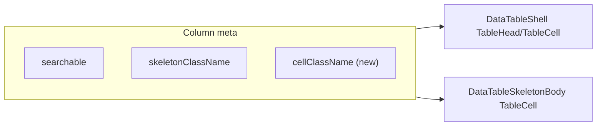

# Phase 11 Epic 13 — Data-table column sizing & pattern refresh

> **Track progress:** as you complete each step, update the corresponding `todos` entry's `status` to `completed` in this plan's frontmatter.

> **Precondition:** `git status --porcelain` must be empty before the first implementation edit. If dirty, halt and ask the user to commit or stash. The epic must land as a single commit containing only this epic's work — `code-review` derives its range from that commit.

**Note:** The working tree currently has one untracked file (`.cursor/plans/phase_11_epic_12_email_setup_0afa3a81.plan.md`). Remove or archive it before starting so the precondition passes.

**Branch:** already on `phase-11/corrections-hardening` (correct for Phase 11).

**No hard-constraint changes** in this epic — no auth-boundary, admin-gate, or `check:*` edits.

---

## Context

Today, [`data-table-shell.tsx`](src/components/data-table-shell.tsx) applies uniform `px-3` to every `TableHead` / `TableCell` and only reads `column.meta.skeletonClassName` for loading skeletons. Column-specific width and alignment are hand-rolled in column defs (wrapper divs in [`reference-shipments-columns.tsx`](src/app/(marketing)/reference/_components/reference-shipments-columns.tsx)) or absent (the admin actions column stretches, leaving dead space beside the ⋯ button). The LEXICON entry still describes a fixed page size of 15, which Epic 10 replaced with selectable sizes via [`DataTablePaginationControls`](src/components/data-table-pagination-controls.tsx).



---

## Step 1 — Extend column meta in the shared shell (Story 13.1)

**Files:** [`src/components/data-table-shell.tsx`](src/components/data-table-shell.tsx), [`src/components/data-table-skeleton-body.tsx`](src/components/data-table-skeleton-body.tsx)

1. Add `cellClassName?: string` to the `ColumnMeta` module augmentation (sibling to `skeletonClassName`, documented as Tailwind classes for header **and** body cells).
2. In `DataTableShell`, when rendering each header and body cell, merge `cellClassName` from `header.column.columnDef.meta` / `cell.column.columnDef.meta` onto `TableHead` / `TableCell` via `cn('px-3', meta?.cellClassName)`.
3. In `DataTableSkeletonBody`, apply the same `cellClassName` to each skeleton `TableCell` so loading state matches loaded alignment/width — no per-column wrapper divs.

**Helper (optional, inline is fine):** a tiny `getColumnMetaClassName(column)` if it avoids repeating the meta read in three places; skip if a one-liner at each call site is clearer.

---

## Step 2 — Shrink the admin users actions column (Story 13.2)

**File:** [`src/app/admin/users/_components/users-columns.tsx`](src/app/admin/users/_components/users-columns.tsx)

Add `cellClassName` on the `actions` column meta using the standard HTML-table shrink trick: `w-0 whitespace-nowrap` (column takes only the width its content needs). Keep `skeletonClassName: 'h-8 w-8 rounded-md'` — skeleton width is already correct; cell-level class handles column width.

**Diagnosis note:** If visual gap persists after actions shrinks, inspect the Ban column (`banStatus`) — its widest cell is a `Banned until {date}` badge. Only add Ban-column meta (e.g. a max-width or nowrap constraint) if the gap is actually coming from Ban, not actions. PRD allows fixing wherever the gap actually lives.

**Verify visually:** load `/admin/users` with at least one time-banned row on screen; actions ⋯ should sit flush with no trailing dead space.

---

## Step 3 — Reference departs column via meta, no wrappers (Story 13.3)

**Files:**
- [`src/app/(marketing)/reference/_components/reference-shipments-columns.tsx`](src/app/(marketing)/reference/_components/reference-shipments-columns.tsx)
- [`src/app/(marketing)/reference/_components/reference-table-demo-fallback.tsx`](src/app/(marketing)/reference/_components/reference-table-demo-fallback.tsx)

**`reference-shipments-columns.tsx`:**
- Add `cellClassName: 'text-right'` to the `departs` column meta.
- Remove the header wrapper (`<div className="flex justify-end">`) and body wrapper (`<div className="text-muted-foreground text-right">`) — render `DataTableColumnHeader` and cell text directly; keep `text-muted-foreground` on the cell content span only.
- Drop `ml-auto` from `skeletonClassName` (e.g. `'h-4 w-16'`). Right alignment comes from `cellClassName` on the cell; if the block skeleton doesn't right-align under `text-right`, add `inline-block` to `skeletonClassName` — not `ml-auto`.

**`reference-table-demo-fallback.tsx`:**
- Mirror departs meta in `SKELETON_COLUMNS` (`cellClassName: 'text-right'`, skeleton without `ml-auto`).
- Replace the hard-coded last-column `text-right` on `TableHead` with `cn('px-3', col.meta?.cellClassName)` mapped from `SKELETON_COLUMNS` so fallback and live demo stay aligned.

---

## Step 4 — Refresh LEXICON and rule doc (Story 13.4)

**Files:**
- [`LEXICON.md`](LEXICON.md) — `### Canonical data table` entry (~line 152)
- [`data-tables.mdc`](.cursor/rules/data-tables.mdc) — Loading Pattern section (mentions only `skeletonClassName` today)

Update the LEXICON entry to describe the pattern as shipped:
- Selectable page size (10 / 15 / 25 / 50; default 15) via shared `DataTablePaginationControls`
- Shared pagination controls used by production and reference demo
- Per-column styling via `columnDef.meta.cellClassName` (header + body) and `skeletonClassName` (loading skeletons)

Add a short **Column sizing** bullet to `data-tables.mdc` documenting `cellClassName` — keeps the rule file in sync with the pattern agents copy.

No AGENTS.md sync needed unless routes/schema/env change (they don't).

---

## Step 5 — Quality gate

Run the full quality bar and fix anything that fails:

```bash
pnpm type-check && pnpm lint && pnpm format-check && pnpm test:ci
```

**Manual smoke checklist:**
- `/admin/users` — actions column width tight; ban badges still readable; sort/pagination unchanged
- `/reference` — departs column right-aligned in header, cells, and skeleton loading state
- Toggle light/dark — no layout regression on either table

---

### Verification

Quality bar — same commands as [WORKFLOW_GUIDE Step 5 exit condition](docs/WORKFLOW_GUIDE.md). Stop on failure:

```bash
pnpm type-check && pnpm lint && pnpm format-check && pnpm test:ci
```

### Commit epic

Authorized by this approved plan:

1. Review diff; stage only files in scope for this epic.
2. Write a conventional commit message (`feat`/`fix`/`docs`/etc.). It **must** end with an `Epic:` git trailer — this is the only thing `code-review` uses to find the commit:

   ```
   feat(phase-11): data-table column sizing and pattern refresh

   Epic: 11.13
   ```

   Format is `Epic: {phase}.{id}` — phase number as written in ROADMAP (decimals OK: `7.5`), epic id as written (`1`, `1A`). Blank line before the trailer, nothing after it. Exactly one commit in the repo may carry a given `Epic:` value.
3. Commit (request `git_write`). Pre-commit hook runs automatically — if it fails, **fix and retry the commit** (a failed pre-commit hook aborts the commit, so there is nothing to amend).
4. Verify `git status --porcelain` is empty after commit.

**Do not push** — push remains `ship-phase`.

### Handoff

Epic committed. Next: open a new agent window and run `/code-review`.
