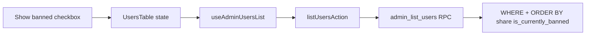

# Phase 11 Epic 14 — Show/hide banned users

> **Track progress:** as you complete each step, update the corresponding `todos` entry's `status` to `completed` in this plan's frontmatter.

> **Precondition:** `git status --porcelain` must be empty before the first implementation edit. If dirty, halt and ask the user to commit or stash. The epic must land as a single commit containing only this epic's work — `code-review` derives its range from that commit.

**Branch:** already on `phase-11/corrections-hardening` (correct for Phase 11).

**No hard-constraint changes** — no auth-boundary, admin-gate, or `check:*` edits.

**Human step after migration SQL:** review the file, then run `pnpm db:push` and `pnpm db:types` before the quality gate (agents write SQL only per [do-migrations-agent.mdc](.cursor/rules/do-migrations-agent.mdc)). If `pnpm db:types` has not been run, halt and ask the user.

---

## Context

Today [`admin_list_users`](supabase/migrations/20260715004901_admin_list_users_banned_sort.sql) returns all users regardless of ban status; "currently banned" is duplicated — inline in the SQL sort (`banned_until <= now() → null`) and separately in [`isUserCurrentlyBanned`](src/utils/is-user-currently-banned.ts) for display. Epic 14 adds a boolean filter (default **on**) and unifies the ban predicate in SQL so pagination stays honest when banned rows are hidden.



Data-table convention ([data-tables.mdc](.cursor/rules/data-tables.mdc)): boolean filters are separate controls beside search, not folded into the search box.

---

## Step 1 — Checkbox primitive (Story 14.1)

Install via shadcn CLI (non-interactive):

```bash
pnpm dlx shadcn@latest add checkbox -y -o
```

Expect [`src/components/ui/checkbox.tsx`](src/components/ui/checkbox.tsx) plus any peer dep the CLI adds. No local customization beyond what the CLI ships — semantic tokens only.

---

## Step 2 — Migration: `admin_list_users` + show-banned filter (Story 14.2)

Use the [create-migration skill](.cursor/skills/create-migration/SKILL.md): UTC timestamp from `date -u +%Y%m%d%H%M%S`, strictly after `20260715004901`.

**Critical:** `CREATE OR REPLACE` with a new parameter list creates a **second overload** and breaks PostgREST RPC resolution.

```sql
drop function if exists public.admin_list_users(text, text, int, int, text);
```

**New signature:**

`admin_list_users(p_sort_column text, p_sort_direction text, p_page int, p_per_page int, p_search text, p_show_banned boolean)`

**Single "currently banned" expression** — derive once in the `FROM` subquery and reuse everywhere:

```sql
-- conceptual shape (implement in migration file)
from (
  select
    u.*,
    (u.banned_until is not null and u.banned_until > now()) as is_currently_banned
  from auth.users u
) u
where
  (search predicate unchanged)
  and (coalesce(p_show_banned, true) or not u.is_currently_banned)
```

**Sort on `banned_until`:** replace the inline `case when u.banned_until <= now() then null else u.banned_until end` with `case when u.is_currently_banned then u.banned_until else null end` — same behavior, one source of truth.

**Grants:** `revoke execute on function …(text, text, int, int, text, boolean) from public`; `grant execute … to authenticated`; update `comment on function` to the new arg list.

Preserve all existing behavior: admin gate, sort allowlist, page-size allowlist, email search escape logic, `security definer` + `set search_path = ''`.

---

## Step 3 — Filter plumbing (Story 14.3)

Thread `showBanned` (default `true`) through the stack:

| Layer | File | Change |
|-------|------|--------|
| RPC caller | [`list-admin-users.ts`](src/app/admin/users/_lib/list-admin-users.ts) | Add `showBanned?: boolean` to `ListAdminUsersPageParams`; pass `p_show_banned: params.showBanned ?? true` in `client.rpc` |
| Server action | [`actions.ts`](src/app/admin/users/actions.ts) | Add `showBanned?: boolean` to `ListUsersActionInput`; validate `typeof showBanned === 'boolean'` when provided; default `true`; forward to `listAdminUsersPage` |
| Query keys | [`admin-users-query-keys.ts`](src/app/admin/users/_lib/admin-users-query-keys.ts) | Add `showBanned` to the list key object |
| Hook | [`use-admin-users-list.ts`](src/app/admin/users/_lib/use-admin-users-list.ts) | Accept `showBanned`; pass through to action + query key |
| Types | [`database.types.ts`](src/types/database.types.ts) | Regenerated by `pnpm db:types` after the human runs `pnpm db:push` — not hand-edited. Confirm `admin_list_users` Args includes `p_show_banned: boolean`. |

**Tests** (extend existing unit tests, no new files unless needed):

- [`list-admin-users.unit.test.ts`](src/app/admin/users/_lib/list-admin-users.unit.test.ts) — assert default RPC call includes `p_show_banned: true`; add case forwarding `showBanned: false`
- [`actions.unit.test.ts`](src/app/admin/users/actions.unit.test.ts) — assert `showBanned: false` reaches `listAdminUsersPage`; reject non-boolean `showBanned` with `VALIDATION_ERROR`

---

## Step 4 — "Show banned" control in the table toolbar (Story 14.4)

**File:** [`users-table.tsx`](src/app/admin/users/_components/users-table.tsx)

1. Add `showBanned` state, default `true`.
2. Pass `showBanned` into `useAdminUsersList`.
3. On toggle, set `showBanned` and reset `page` to `1` (same pattern as sort/page-size changes).
4. Layout: keep the email search label + input block; add a horizontal row **beside** the search input (e.g. `flex flex-wrap items-end gap-4` — search field grows, checkbox group stays compact on the right). Use `Checkbox` + `Label` with `htmlFor`/`id` pairing (`Show banned` label text per PRD).
5. Checkbox **checked = show banned** (default checked on load).

Do not change ban/unban mutations — they already invalidate `adminUsersQueryKeys.all`, which covers the new key dimension.

---

## Verification

Quality bar — same commands as [WORKFLOW_GUIDE Step 5 exit condition](docs/WORKFLOW_GUIDE.md). Stop on failure:

```bash
pnpm type-check && pnpm lint && pnpm format-check && pnpm test:ci
```

**Manual smoke checklist:**

- `/admin/users` loads with "Show banned" checked; banned rows visible when present
- Uncheck → page resets to 1; banned users absent from every page (paginate forward to confirm)
- Re-check → banned users return
- Sort by Ban column still works with filter on and off
- Email search + filter interact correctly (search still server-side; banned filter still applies)

---

## Commit epic

Authorized by this approved plan:

1. Review diff; stage only files in scope for this epic.
2. Write a conventional commit message. It **must** end with an `Epic:` git trailer:

   ```
   feat(phase-11): show/hide banned users filter on admin users table

   Epic: 11.14
   ```

3. Commit (request `git_write`). Pre-commit hook runs automatically — if it fails, **fix and retry the commit**.
4. Verify `git status --porcelain` is empty after commit.

**Do not push** — push remains `ship-phase`.

---

## Handoff

Epic committed.

- **Epic:** 11.14
- **Baseline SHA:** 2fa79de1d9094955997d81ddca2bdc51f187f6f4

Next: open a new agent window and run `/code-review`, using the baseline SHA above as the review range start.
