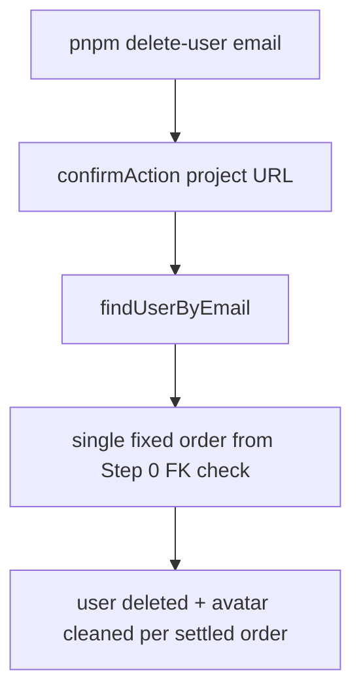

# Phase 11 Epic 15 — CLI user delete

> **Track progress:** as you complete each step, update the corresponding `todos` entry's `status` to `completed` in this plan's frontmatter.

> **Precondition:** `git status --porcelain` must be empty before the first implementation edit. If dirty, halt and ask the user to commit or stash. The epic must land as a single commit containing only this epic's work — `code-review` derives its range from that commit.

**Branch:** already on `phase-11/corrections-hardening` (correct for Phase 11).

**No hard-constraint changes** — no auth-boundary, admin-gate, or `check:*` edits. No migration unless FK verification surfaces a blocker (unlikely on current Supabase).

**Scope guard:** no `/admin/users` UI — CLI-only, per [PRD Epic 15](docs/prds/phase-11-corrections-hardening.prd.md).

**Epic baseline SHA:** _record at Step 0 before any file edits._

**Delete order (settled at Step 0):** _record FK finding and chosen order here before implementing Step 2._

---

## Context

Phase 11's final epic adds break-glass test-account cleanup via the existing secret-key CLI pattern ([`scripts/admin/`](scripts/admin/)). Role and ban mutations already live in [`src/utils/admin-user-mutations.ts`](src/utils/admin-user-mutations.ts); email resolution and CLI orchestration live in [`scripts/admin/lib/admin-users.ts`](scripts/admin/lib/admin-users.ts) and [`scripts/admin/lib/cli.ts`](scripts/admin/lib/cli.ts).

Profile rows cascade from `auth.users` ([`20260622120000_create_profiles.sql`](supabase/migrations/20260622120000_create_profiles.sql)). Avatar files at `{userId}/avatar.webp` do **not** cascade — cleanup must call Storage explicitly, mirroring the profile-remove path in [`src/app/(app)/_lib/profile/actions.ts`](src/app/(app)/_lib/profile/actions.ts) (`buildAvatarStoragePath` + `AVATAR_BUCKET` from [`src/constants/storage-paths.ts`](src/constants/storage-paths.ts)).



---

## Step 0 — Baseline SHA, FK check, settle order

**First actions — before any file edits:**

1. Confirm `git status --porcelain` is empty (halt if not).
2. Capture epic baseline SHA: `git rev-parse HEAD` — write it into this plan's **Epic baseline SHA** line above and keep it for the handoff message.
3. Query the linked Supabase project (MCP `execute_sql` or Dashboard SQL editor):

```sql
select conname, confdeltype, pg_get_constraintdef(oid) as definition
from pg_constraint
where conrelid = 'storage.objects'::regclass
  and contype = 'f'
  and pg_get_constraintdef(oid) ilike '%owner%';
```

Interpret `confdeltype`: `a`/`r` = restrictive → **avatar storage delete before auth user**; `n` = set null; `c` = cascade; **no rows** = modern Supabase (FK dropped) → **auth user delete before avatar storage delete** (PRD default).

4. Write the FK finding and chosen order into this plan's **Delete order** line above. Implementation uses **exactly one path** — no runtime branch, no constant toggled by environment.

5. In `runDeleteUser`, add a short code comment at the orchestration site naming the FK finding, the chosen order, and the verification date (2026-07-15 or the date the query actually ran).

---

## Step 1 — Delete mutation (Story 15.1)

Extend [`src/utils/admin-user-mutations.ts`](src/utils/admin-user-mutations.ts):

- Add `DeleteUserByIdResult`: `{ status: 'deleted'; email: string } | { status: 'not_found' }`.
- Add `deleteUserById(client, userId)` following the existing pattern: `getUserById` → not-found short-circuit → `auth.admin.deleteUser(userId)` → return `{ status: 'deleted', email }`. Propagate unexpected errors (throw, same as promote/demote/ban).
- No self-delete or last-admin guards (service-key script has no calling admin — matches `demote-admin`).

Add focused unit tests in [`src/utils/admin-user-mutations.unit.test.ts`](src/utils/admin-user-mutations.unit.test.ts): not-found (no `deleteUser` call), happy path (`deleteUser` called with id).

---

## Step 2 — CLI wiring (Story 15.2)

### Shared lib

In [`scripts/admin/lib/admin-users.ts`](scripts/admin/lib/admin-users.ts):

- Re-export `deleteUserById` from mutations (for direct use by the CLI runner).
- Add `deleteUserAvatarStorage(client, userId)` — service client calls `storage.from(AVATAR_BUCKET).remove([buildAvatarStoragePath(userId)])`; returns `{ ok: boolean }` without throwing; caller logs `[delete-user]` warn on failure.

**Do not** add a `deleteUser(client, email)` wrapper or unit tests for it — the runner already calls `findUserByEmail` and needs the resolved `user.id` for both `deleteUserById` and the avatar path.

### CLI runner

In [`scripts/admin/lib/cli.ts`](scripts/admin/lib/cli.ts), add `runDeleteUser(args)`:

1. Parse email via existing `parseEmailArg` (reuse missing-email message pattern).
2. `loadAdminEnv()` + `confirmAction(env.supabaseUrl, 'Delete user', email)` — declining prints cancelled and returns cleanly.
3. `createServiceClient` → `findUserByEmail`; `null` → `console.error` with clear copy, `process.exit(1)`.
4. Execute the **single settled order** from Step 0 (with FK verification comment):
   - If order is auth-first: `deleteUserById(client, user.id)` then `deleteUserAvatarStorage(client, user.id)` — storage failure: `console.warn` naming the path left behind; command still succeeds.
   - If order is avatar-first: `deleteUserAvatarStorage` then `deleteUserById`.
5. Success: `console.warn('[delete-user] {email} deleted')` per [`logging.mdc`](.cursor/rules/logging.mdc).

Add entry script [`scripts/admin/delete-user.ts`](scripts/admin/delete-user.ts) mirroring [`scripts/admin/demote-admin.ts`](scripts/admin/demote-admin.ts).

Register in [`package.json`](package.json):

```json
"delete-user": "node --env-file=.env.local --import tsx scripts/admin/delete-user.ts"
```

---

## Step 3 — Docs

Update companion CLI mentions (minimal, same places as promote/demote):

- [`README.md`](README.md) — companion CLI line (~152) and commands table (~212): add `pnpm delete-user <email>` with note that it requires secret key + confirmation naming the target project; test-account cleanup only.
- [`AGENTS.md`](AGENTS.md):
  - **Setup/quality commands table** — add `pnpm delete-user <email>` row alongside existing admin CLI entries.
  - **Where things live** — update the `scripts/admin/` row (currently "promote / demote / list") to include delete.
  - **Implemented now → Admin console** — update the Admin CLI parenthetical (currently `pnpm promote-admin` / `demote-admin` / `list-admins`) to include `delete-user`.

No PRD or ROADMAP edits in this epic (epic completion is a separate `/mark-epic-complete` step).

---

## Verification

Quality bar — same commands as [WORKFLOW_GUIDE Step 5](docs/WORKFLOW_GUIDE.md). Stop on failure:

```bash
pnpm type-check && pnpm lint && pnpm format-check && pnpm test:ci
```

### CLI unit tests

[`scripts/admin/lib/cli.ts`](scripts/admin/lib/cli.ts) has **no** existing unit tests today (only [`scripts/admin/lib/admin-users.unit.test.ts`](scripts/admin/lib/admin-users.unit.test.ts) covers the admin-users lib). Add [`scripts/admin/lib/cli.unit.test.ts`](scripts/admin/lib/cli.unit.test.ts) with `runDeleteUser` coverage:

- not-found email → exit 1, clear error
- declined confirmation → cancelled, no delete calls
- storage-failure path → user still deleted, warn logged (mock `deleteUserAvatarStorage` / storage client)

Mock `findUserByEmail`, `confirmAction`, `loadAdminEnv`, `createServiceClient`, and mutation/storage helpers at module boundaries — same mocking style as admin-users tests.

### Manual testing checklist

- Run `pnpm delete-user` with no email — usage error, exit 1.
- Run against unknown email — clear not-found message, exit 1.
- Decline confirmation — "Cancelled", user untouched.
- Accept confirmation on a user **without** avatar — user gone, profile row gone.
- Accept confirmation on a user **with** avatar — user gone, `{userId}/avatar.webp` absent from `avatars` bucket.
- If possible, simulate storage-delete failure — user still deleted, warn mentions leftover file.

---

## Commit epic

Authorized by this approved plan:

1. Review diff; stage only files in scope for this epic.
2. Write a conventional commit message. It **must** end with an `Epic:` git trailer:

   ```
   feat(phase-11): CLI user delete for test-account cleanup

   Epic: 11.15
   ```

3. Commit (request `git_write`). Pre-commit hook runs automatically — if it fails, **fix and retry the commit**.
4. Verify `git status --porcelain` is empty after commit.

**Do not push** — push remains `ship-phase`.

---

## Handoff

Epic committed. Baseline SHA: `{epic-baseline-sha}`. Epic: `11.15`. Next: open a new agent window and run `/code-review`.
