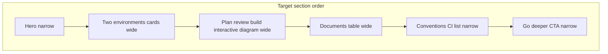

# Phase 11 Epic 5 — Workflow page rethink

> **Track progress:** as you complete each step, update the corresponding `todos` entry's `status` to `completed` in this plan's frontmatter.

> **Precondition:** confirm `git branch --show-current` outputs `phase-11/corrections-hardening`. If it doesn't match, halt and ask the user — do not switch branches.

> **Precondition:** `git status --porcelain` must be empty before the first implementation edit. If dirty, halt and ask the user to commit or stash. The epic must land as a single commit containing only this epic's work — `code-review` derives its range from that commit.

---

## Epic baseline

**Before the first implementation edit:** run `git rev-parse HEAD`, record the SHA below, and mark the `capture-baseline` todo complete. This is the fixed point `code-review` uses as the range start (paired with `Epic: 11.5`).

**Epic baseline:** `cf57c3b3beead4e84f9f1f42bef5a3522c71e314`

---

## Context

Epics 1–4 are `Complete`. Epic 5 is the first open epic in [phase-11-corrections-hardening.prd.md](docs/prds/phase-11-corrections-hardening.prd.md).

**Current state:** [workflow/page.tsx](src/app/(marketing)/workflow/page.tsx) wraps everything in a single `max-w-3xl` column. Section order is: two environments (prose) → documents (table) → plan/review/build (prose + static SVG) → conventions (prose) → CTA.

**Target state:** Order becomes environments → loop → documents → conventions → CTA. Content-heavy sections (environment cards, interactive diagram, documents table) render at `max-w-6xl`; prose stays at `max-w-3xl` / `max-w-prose`, matching [reference-table-section.tsx](src/app/(marketing)/reference/_components/reference-table-section.tsx).

**Mockup authority:** [.mockups/workflow_loop_exact_recreation_interactive.html](.mockups/workflow_loop_exact_recreation_interactive.html) — preserve geometry (nested dashed containers, L-shaped connectors, visible dashed "revise" arrow), add hover-to-reveal skill + environment detail below the SVG.

**Document table authority:** [docs/DOC_RULES.md](docs/DOC_RULES.md) roles table + [docs/WORKFLOW_GUIDE.md](docs/WORKFLOW_GUIDE.md) quick reference — replace abstract names ("Phase roadmap", "Planning environment") with real paths and accurate writer/reader columns.



## Step 1 — Expand the content module

Extend [workflow-page-content.ts](src/app/(marketing)/workflow/_lib/workflow-page-content.ts) so all copy/data lives in one place (components stay presentational):

| Export | Purpose |
| ------ | ------- |
| `WORKFLOW_ENVIRONMENTS` | Two cards: Claude Desktop + Cursor, each with a short "owns" bullet list drawn from WORKFLOW_GUIDE |
| `WORKFLOW_DOCUMENTS` (replace) | Real document names/paths, accurate `writtenBy` / `readBy`, purpose column — e.g. `ROADMAP.md` (Claude Desktop / Both), `docs/prds/` (Claude Desktop / Cursor), `AGENTS.md` (Cursor / Both), `LEXICON.md` (Both / Both), `docs/DOC_RULES.md` (Claude Desktop / Both) |
| `WORKFLOW_LOOP_NODES` | Eight nodes with `id`, display label, skill slug (nullable for Build), environment, and detail string — lift copy from mockup `data-detail` attributes |
| `WORKFLOW_CI_CONSTRAINTS` | Short list of the four PRD-named hard constraints: auth boundary, admin gate, semantic tokens, SEO base URL — one line each describing what CI enforces |

Keep `WORKFLOW_GUIDE_URL` unchanged. Update [workflow-page-content.unit.test.ts](src/app/(marketing)/workflow/_lib/workflow-page-content.unit.test.ts) only if exports change shape (minimal assertions on array lengths or a sample row).

## Step 2 — Restructure page layout and section order

In [workflow/page.tsx](src/app/(marketing)/workflow/page.tsx):

- Keep hero in `mx-auto max-w-3xl px-4 sm:px-0` (unchanged copy is fine).
- Remove the single outer `max-w-3xl` wrapper around all sections.
- Render sections in Epic 5 order:
  1. `WorkflowTwoEnvironmentsSection`
  2. `WorkflowPlanReviewSection`
  3. `WorkflowDocumentsSection`
  4. `WorkflowConventionsSection`
  5. `WorkflowGuideCta` (unchanged behavior)

Each section component owns its own width split (reference-page pattern).

## Step 3 — Two environments as side-by-side cards

Rewrite [workflow-two-environments-section.tsx](src/app/(marketing)/workflow/_components/workflow-two-environments-section.tsx):

- Replace three prose paragraphs with a brief intro (`max-w-prose`) and a two-column card grid at `max-w-6xl`.
- Cards: `bg-card rounded-xl border`, environment name as **h3** (section title stays the sole **h2**), "owns" as a short bullet list from `WORKFLOW_ENVIRONMENTS`.
- Responsive: stack on small screens, side-by-side from `sm` or `md` up.

## Step 4 — Interactive loop diagram (replaces static SVG)

Rewrite [workflow-diagram.tsx](src/app/(marketing)/workflow/_components/workflow-diagram.tsx) as a `'use client'` component:

- Inline SVG with the same `viewBox="0 0 860 320"` geometry as the mockup — nested dashed phase/epic containers, L-shaped connector, dashed "revise" arrow, arrow markers.
- **Theme handling (semantic tokens only — no raw hex):** replace dual static files + `prefers-color-scheme` by referencing existing semantic CSS variables so light/dark follows `next-themes` automatically and `check:semantic-tokens` stays clean:
  - Claude-environment nodes → `primary` / `primary-foreground` (fill + label text)
  - Cursor-environment nodes → `success` / `success-foreground`
  - Connectors, dashed containers, revise arrow → `border` / `muted-foreground`
  - Reference variables via `hsl(var(--primary))` or Tailwind arbitrary values only if the SVG cannot use `currentColor` inheritance from a token-colored wrapper — never inline hex in the component or a one-off wrapper variable with hardcoded values.
  - If primary/success do not read clearly as two distinct environments after eyeballing in-app, add paired tokens in [globals.css](src/app/globals.css) using the Epic 3 success/warning pattern (light + dark values in `:root` / `.dark`, registered in `@theme inline`) — still no hex in the React component.
- **Interaction:** hover a node → highlight (reduced opacity per mockup) + update a detail line below the SVG with skill name and environment. Default text: "Hover a step to see what happens there." Keyboard-focusable nodes (`tabIndex={0}` + focus handlers) for general interactive-widget a11y — not because Epic 6 enforces focus.
- **Accessibility (Epic 6 exposure):** PRD 6.1 covers exactly one `<h1>`, non-empty `alt`, and no skipped heading levels — not keyboard focus. Pin the hierarchy explicitly:
  - Page hero retains the sole **h1**; every section title stays **h2** (unchanged pattern).
  - Environment card titles are **h3** under "Two environments" (Step 3).
  - Diagram does **not** add a second h2 — the section's visible h2 ("Plan, review, build") is the heading; wire the diagram via `aria-labelledby` to that h2 (or `aria-describedby` for the detail panel). Keep `<title>`/`<desc>` inside the SVG for `role="img"`.
  - Before finishing, verify no heading level is skipped (h1 → h2 → h3 only; no h1 → h3 jumps).
- Node metadata driven from `WORKFLOW_LOOP_NODES`; SVG markup can stay co-located or split into a sibling file if the component grows unwieldy.

The static assets at `public/images/workflow-*.svg` are no longer consumed by the page (README/WORKFLOW_GUIDE still use repo-root `images/` — leave those alone).

## Step 5 — Documents section accuracy + wide table

Update [workflow-documents-section.tsx](src/app/(marketing)/workflow/_components/workflow-documents-section.tsx):

- Intro copy stays narrow (`max-w-3xl` / `max-w-prose`).
- Table card breaks out to `max-w-6xl` (same split as reference table).
- Table columns consume the updated `WORKFLOW_DOCUMENTS` — document column shows real path/name.

## Step 6 — Conventions as CI constraint list

Rewrite [workflow-conventions-section.tsx](src/app/(marketing)/workflow/_components/workflow-conventions-section.tsx):

- Replace marketing prose with a short intro + unordered list from `WORKFLOW_CI_CONSTRAINTS`.
- Keep section narrow (`max-w-prose`).

## Step 7 — Plan/review section width + trimmed prose

Update [workflow-plan-review-section.tsx](src/app/(marketing)/workflow/_components/workflow-plan-review-section.tsx):

- Keep one or two short intro paragraphs at `max-w-prose` in the narrow wrapper.
- Render `WorkflowDiagram` in a `max-w-6xl` breakout below the intro (diagram is the content-heavy element).
- Section order within the page already places this before documents — no further reordering here.

## Step 8 — Trim plan-review prose (optional tighten)

If the existing two paragraphs overlap heavily with the interactive diagram detail panel, shorten them to one paragraph framing the nested loops — the diagram now carries step-level detail. Do not remove the adversarial-review guardrail sentence entirely.

---

### Verification

Quality bar — same commands as [WORKFLOW_GUIDE Step 5 exit condition](docs/WORKFLOW_GUIDE.md). Stop on failure:

```bash
pnpm type-check && pnpm lint && pnpm format-check && pnpm test:ci
```

Manual smoke after implementation:

- Visit `/workflow` signed out — no auth redirect
- Section order: environments → loop → documents → conventions → CTA
- Prose sections feel narrow; cards, diagram, and table feel wider
- Toggle app theme (not just OS) — diagram colors update correctly
- Hover and keyboard-focus each loop step — highlight + detail text appears
- Documents table shows real file paths and accurate writer/reader values
- Conventions lists the four CI-enforced constraints, not marketing prose
- CTA still opens the GitHub workflow guide in a new tab
- Heading hierarchy: one page h1, section h2s only, environment card h3s — no skipped levels

### Commit epic

Authorized by this approved plan:

1. Review diff; stage only files in scope for this epic.
2. Write a conventional commit message. It **must** end with an `Epic:` git trailer:

   ```
   feat(phase-11): rework workflow page layout and interactive loop

   Epic: 11.5
   ```

3. Commit (request `git_write`). Pre-commit hook runs automatically — if it fails, **fix and retry the commit**.
4. Verify `git status --porcelain` is empty after commit.

**Do not push** — push remains `ship-phase`.

### Handoff

Epic 11.5 committed. Baseline: `<SHA recorded in Epic baseline above>`.

Next: open a new agent window and run `/code-review` — epic baseline `<SHA>`, Epic `11.5`.
