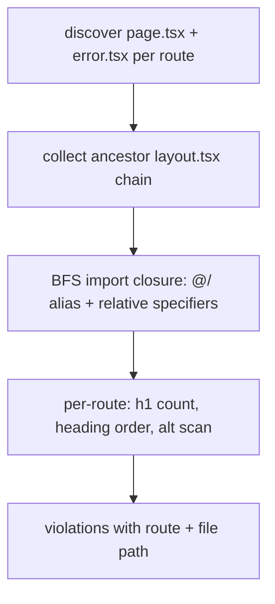

# Phase 11 Epic 6 — Deterministic a11y check

> **Track progress:** as you complete each step, update the corresponding `todos` entry's `status` to `completed` in this plan's frontmatter.

> **Precondition:** `git status --porcelain` must be empty before the first implementation edit. The working tree currently has untracked `.cursor/plans/*.plan.md` files — commit or stash them first. The epic must land as a single commit containing only this epic's work.

---

## Epic baseline

**Before the first implementation edit:** run `git rev-parse HEAD`, record the SHA below, and mark the `capture-baseline` todo complete. This is the fixed point `code-review` uses as the range start (paired with `Epic: 11.6`).

**Epic baseline:** _(record at implementation start)_

---

## Context

Phase 11 Epic 6 ([`docs/prds/phase-11-corrections-hardening.prd.md`](docs/prds/phase-11-corrections-hardening.prd.md)) promotes three deterministic rules from guidance to enforcement:

| Rule | Current state |
|------|---------------|
| Exactly one `<h1>` per route | Marketing/app/admin pages mostly comply; **auth surfaces use `CardTitle` (a `div`) instead of `h1`** — login, sign-up, forgot/update password forms, sign-up-success, and auth error page all have **zero** semantic h1 |
| Non-empty `alt` on meaningful images | [`landing-tech-stack-item.tsx`](src/app/(marketing)/_components/landing-tech-stack-item.tsx) uses `alt=""` with `role="presentation"` (valid decorative); [`UserAvatar`](src/components/user-avatar.tsx) uses `alt={imageAlt}` where `imageAlt` defaults to `''` — **not flagged by the check** (non-literal expression treated as satisfied at the JSX site) |
| No skipped heading levels | Landing, workflow, and reference pages look healthy (h1 → h2 → h3); verify under the new checker |

A new `check:*` pairs 1:1 with a hard-constraint entry per the [AGENTS.md change protocol](AGENTS.md#change-protocol).

## Recommended enforcement approach

Follow the existing static-check pattern ([`scripts/checks/seo-base-url.mjs`](scripts/checks/seo-base-url.mjs)) — not a new dependency.



### Route scope

For each discovered route entry (`page.tsx` or segment `error.tsx`):

1. Walk up to `src/app/` collecting every `layout.tsx` in the segment chain (exclude root `src/app/layout.tsx` — providers only).
2. BFS-follow `import … from '…'` resolving:
   - `@/` → `src/`
   - **Relative specifiers (`./` and `../`) resolved against the importing file's own directory** — several routes import co-located `_components` this way (e.g. `./_components/foo`, `../_components/bar`); an alias-only resolver would build an incomplete closure and miss headings/images in those files.
   - Try `.tsx`/`.ts`/index extensions; skip `node_modules`, test files, and `src/components/ui/**` (primitives are not page content).
3. Analyze the combined file set for that route.

### Rule definitions

**One h1 per route**

- Count literal `<h1` JSX across the route's closure.
- Must equal exactly `1`.
- `error.tsx` boundaries are separate surfaces (each has its own h1 when shown) — check them independently from their sibling `page.tsx`.

**Heading order**

- Extract heading levels (`h1`–`h6`) in **document order** by depth-first walking JSX in `page.tsx` (or `error.tsx`), following capitalized component imports into their source files recursively (via the full import closure, including relative imports).
- Flag when level jumps by more than 1 (e.g. h1 → h3).
- Portals/dialogs (profile settings `h2` inside `ProfileDialogProvider`) are in the closure but follow the page `h1` — h1 → h2 is valid; no special-case needed.

**Alt text**

- Scan `` or a meaningful `<Image alt="…">`). Assert the closure reaches that file and the check passes/fails correctly — proving relative-path resolution works, not just `@/` alias resolution.

## Implementation steps

### 0. Capture epic baseline

Before any implementation edit:

```bash
git rev-parse HEAD
```

Record the output in the **Epic baseline** section above and mark `capture-baseline` complete.

### 1. Build `check:a11y`

Create [`scripts/checks/a11y.mjs`](scripts/checks/a11y.mjs):

- Reuse file-walking patterns from [`seo-base-url.mjs`](scripts/checks/seo-base-url.mjs) (collect files, relative paths, `fail()` helper, `isMain` guard).
- Add route discovery (glob `src/app/**/page.tsx` and `src/app/**/error.tsx`).
- Implement import resolver: `@/` alias **and** `./` / `../` relative specifiers resolved from the importing file's directory; try `.tsx`/`.ts`/index extensions.
- Implement the three analyzers above with actionable violation messages: `[check:a11y] /auth/login: expected 1 h1, found 0 (login-form.tsx)`.

Add [`scripts/checks/a11y.unit.test.ts`](scripts/checks/a11y.unit.test.ts) — mirror [`seo-base-url.unit.test.ts`](scripts/checks/seo-base-url.unit.test.ts) structure, **plus** the relative-import closure fixture described above.

### 2. Wire enforcement into the gate

| File | Change |
|------|--------|
| [`package.json`](package.json) | Add `"check:a11y": "node scripts/checks/a11y.mjs"`; insert into `pre-push` after `check:seo-base-url` |
| [`.github/workflows/pull-request.yaml`](.github/workflows/pull-request.yaml) | Add `Check a11y` step in the same position |
| [`.cursor/rules/git-workflow.mdc`](.cursor/rules/git-workflow.mdc) | Update the documented `pre-push` / CI check list to include `check:a11y` |

### 3. Hard-constraint protocol (AGENTS.md)

Add to [AGENTS.md § Hard constraints](AGENTS.md#hard-constraints):

> **Deterministic a11y** — every route has exactly one `<h1>`; meaningful images have non-empty `alt`; heading levels do not skip. Subjective a11y (contrast, screen-reader UX) stays guidance. **Enforced:** `check:a11y`.

Update the pre-push prose in the Foundation section to list the new check.

### 4. Update `ui-accessibility.mdc`

Split [`.cursor/rules/ui-accessibility.mdc`](.cursor/rules/ui-accessibility.mdc) per rule-authoring signal density:

- **Enforced (deterministic):** one h1 per route, non-empty alt on meaningful images (decorative exemption via `role="presentation"` / `aria-hidden`), no skipped heading levels — `check:a11y`.
- **Guidance (unchanged):** keyboard, focus rings, contrast intent, screen-reader testing, modals, forms — manual checklist stays.

Cross-reference AGENTS.md hard constraint; do not duplicate the full rule text.

### 5. Fix violations the check surfaces

**Auth page titles → semantic h1**

Add `asChild` support to [`CardTitle`](src/components/ui/card.tsx) via Radix `Slot` (shadcn-standard pattern), then update auth surfaces to render the card title as `h1`:

- [`src/components/login-form.tsx`](src/components/login-form.tsx)
- [`src/components/sign-up-form.tsx`](src/components/sign-up-form.tsx)
- [`src/components/forgot-password-form.tsx`](src/components/forgot-password-form.tsx) (both branches)
- [`src/components/update-password-form.tsx`](src/components/update-password-form.tsx)
- [`src/app/auth/sign-up-success/page.tsx`](src/app/auth/sign-up-success/page.tsx)
- [`src/app/auth/error/page.tsx`](src/app/auth/error/page.tsx)

Pattern: `CardTitle asChild` wrapping `h1` with existing title classes. Admin dashboard card titles (`CardTitle` inside feature cards on [`admin/page.tsx`](src/app/admin/page.tsx)) stay non-h1 — the route already has its own `h1`.

**UserAvatar — decorative image marking (not check-surfaced)**

[`UserAvatar`](src/components/user-avatar.tsx) is **not** on the fix list because the check treats `alt={imageAlt}` as satisfied regardless of the default value. Separately, the avatar image sits inside controls that already carry an accessible name (e.g. `aria-label="Account menu"` on the app header trigger; visible account label on the admin sidebar button), so the image is decorative.

Mark it accordingly on `AvatarImage`: keep empty `alt` and add `role="presentation"` (or `aria-hidden`) — the decorative-exemption path the check already recognizes. Do **not** derive a descriptive alt string.

**Anything else flagged**

Run `pnpm check:a11y` iteratively during implementation and fix remaining heading-order or alt violations — do not weaken the checker to greenwash.

## Out of scope

- Subjective a11y (contrast auditing, keyboard-only manual pass, axe integration)
- Changing `CardTitle` globally to always be `h3` (only auth page titles become `h1`)
- Epic 7 chrome/copy work

## Verification

Quality bar — stop on failure:

```bash
pnpm type-check && pnpm lint && pnpm format-check && pnpm test:ci
```

Also confirm the new check passes in isolation:

```bash
pnpm check:a11y
```

## Commit epic

Authorized by this approved plan:

1. Review diff; stage only files in scope for this epic.
2. Write a conventional commit message. It **must** end with an `Epic:` git trailer:

   ```
   feat(phase-11): add deterministic a11y check

   Epic: 11.6
   ```

3. Commit (request `git_write`). Pre-commit hook runs automatically — if it fails, fix and retry the commit.
4. Verify `git status --porcelain` is empty after commit.

**Do not push** — push remains `ship-phase`.

## Handoff

Epic 11.6 committed. Baseline: `<SHA recorded in Epic baseline above>`.

Next: open a new agent window and run `/code-review` — epic baseline `<SHA>`, Epic `11.6`.
