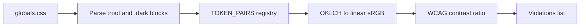

# Phase 11 Epic 8 — Contrast enforcement & a11y check naming

> **Track progress:** as you complete each step, update the corresponding `todos` entry's `status` to `completed` in this plan's frontmatter.

> **Precondition:** `git status --porcelain` must be empty before the first implementation edit, **excluding this plan file** (baseline SHA and todo updates during the run are expected here and do not count as dirty). If other paths are dirty, halt and ask the user to commit or stash. The epic must land as a single commit containing only this epic's product work — `code-review` derives its range from that commit.

> **Plan file scope:** This plan file is **out of scope for the epic commit** — never stage it. Post-commit `git status --porcelain` must be empty **after excluding this plan file**.

**Active phase:** 11 — Corrections & Hardening ([`docs/prds/phase-11-corrections-hardening.prd.md`](docs/prds/phase-11-corrections-hardening.prd.md))
**Branch:** `phase-11/corrections-hardening` (already checked out)
**Next epic:** Epic 8 — Contrast enforcement & a11y check naming (Epics 1–7 `Complete`)

This epic is sequential — rename, new script, docs, and token fixes share `package.json`, AGENTS.md, and `globals.css`.

---

## Epic baseline

**Before the first implementation edit:** run `git rev-parse HEAD`, record the SHA below, and mark the `capture-baseline` todo complete. This is the fixed point `code-review` uses as the range start (paired with `Epic: 11.8`).

**Epic baseline:** `072ce9d2f522095c8e2ab41a2c502bc76a11416a`

---

## What ships

| Story | Deliverable |
| ----- | ----------- |
| **8.1** | Rename `check:a11y` → `check:a11y-structure` everywhere; no behavior change |
| **8.2** | New `check:a11y-contrast` — parses `:root` / `.dark` OKLCH pairs, computes WCAG contrast ratios |
| **8.3** | Split hard-constraint docs: structure + contrast in AGENTS.md, `ui-accessibility.mdc`, pre-push, CI |
| **8.4** | Fix failing token values per the bounded policy below (not unbounded theme retuning) |

**Hard-constraint protocol:** AGENTS.md gains a second deterministic-a11y bullet (`check:a11y-contrast`) and renames the existing one (`check:a11y-structure`). Both wire into `pnpm pre-push` and CI together — one change-protocol pass, one commit.

---

## Step 1 — Rename structure check (8.1)

Rename files and update every reference (PRD list + collateral from Epic 6):

| From | To |
| ---- | -- |
| [`scripts/checks/a11y.mjs`](scripts/checks/a11y.mjs) | `scripts/checks/a11y-structure.mjs` |
| [`scripts/checks/a11y.unit.test.ts`](scripts/checks/a11y.unit.test.ts) | `scripts/checks/a11y-structure.unit.test.ts` |

Inside the renamed script:
- Log prefix `[check:a11y]` → `[check:a11y-structure]`
- Export rename: `checkA11y` → `checkA11yStructure` (update test import)

Grep-replace `check:a11y` (not `check:a11y-contrast`) in:
- [`package.json`](package.json) — **script key only** (`"check:a11y-structure": "node scripts/checks/a11y-structure.mjs"`). Do **not** touch the `pre-push` chain here — Step 3 (`wire-gates`) sets the final chain once.
- [`AGENTS.md`](AGENTS.md) — commands table, hard-constraints bullet, pre-push prose
- [`README.md`](README.md) — commands table + CI prose
- [`.github/workflows/pull-request.yaml`](.github/workflows/pull-request.yaml) — step name/command only; chain assembly deferred to Step 3
- [`.cursor/rules/git-workflow.mdc`](.cursor/rules/git-workflow.mdc)
- [`.cursor/rules/ui-accessibility.mdc`](.cursor/rules/ui-accessibility.mdc) — "Enforced" section references

Leave archived plan files and shipped PRD history untouched (historical record). No bare `check:a11y` references should remain in active enforcement paths.

---

## Step 2 — Build `check:a11y-contrast` (8.2)

Create [`scripts/checks/a11y-contrast.mjs`](scripts/checks/a11y-contrast.mjs) following the export/testability contract of [`scripts/checks/seo-base-url.mjs`](scripts/checks/seo-base-url.mjs):



**Source file:** [`src/app/globals.css`](src/app/globals.css) only — authoritative token values.

**Parsing:** Extract `--token: oklch(...)` declarations inside `:root { }` and `.dark { }`. Reject `var(--...)` indirection (all semantic color values are literal OKLCH today). Fail clearly if a registered pair's token is missing in a theme layer.

**Pair registry** — explicit list (not regex discovery), each entry `{ base, foreground, minRatio }`. All pairs use **4.5:1** (WCAG 1.4.3 text-on-surface).

| Base token | Foreground | Min ratio |
| ---------- | ---------- | --------- |
| `background` | `foreground` | 4.5:1 |
| `card` | `card-foreground` | 4.5:1 |
| `popover` | `popover-foreground` | 4.5:1 |
| `primary` | `primary-foreground` | 4.5:1 |
| `secondary` | `secondary-foreground` | 4.5:1 |
| `muted` | `muted-foreground` | 4.5:1 |
| `accent` | `accent-foreground` | 4.5:1 |
| `destructive` | `destructive-foreground` | 4.5:1 |
| `success` | `success-foreground` | 4.5:1 |
| `warning` | `warning-foreground` | 4.5:1 |
| `sidebar` | `sidebar-foreground` | 4.5:1 |
| `sidebar-primary` | `sidebar-primary-foreground` | 4.5:1 |
| `sidebar-accent` | `sidebar-accent-foreground` | 4.5:1 |

Chart, border, ring, and input tokens are out of scope (no foreground partner).

**Color math (no new dependency):** Parse `oklch(L C H)` / optional alpha → OKLab → linear sRGB (clamp) → relative luminance → contrast ratio `(lighter + 0.05) / (darker + 0.05)`.

**CLI output:** `[check:a11y-contrast] :root muted/muted-foreground: 3.8:1 (min 4.5:1)` per violation; success line when clean.

**Tests:** [`scripts/checks/a11y-contrast.unit.test.ts`](scripts/checks/a11y-contrast.unit.test.ts):
- Passes on shipped `globals.css` (both themes)
- Fails on a temp CSS fixture with a known-bad pair
- Unit test the OKLCH→ratio helper with a fixed known pair (stable, no browser)

Add to [`package.json`](package.json):
- `"check:a11y-contrast": "node scripts/checks/a11y-contrast.mjs"`

Do **not** edit `pre-push` or CI here — Step 3 sets the final chain in one pass.

---

## Step 3 — Wire gates (8.1 + 8.2 + 8.3 chain)

Set the **final** `pre-push` and CI check order in one edit (avoids duplicate `check:a11y-structure` from split steps):

```
… check:seo-base-url && check:a11y-structure && check:a11y-contrast && lint …
```

Files:
- [`package.json`](package.json) — `pre-push` script
- [`.github/workflows/pull-request.yaml`](.github/workflows/pull-request.yaml) — add a `check:a11y-contrast` step immediately after the existing `check:a11y-structure` step
- [`.cursor/rules/git-workflow.mdc`](.cursor/rules/git-workflow.mdc) — documented chain

---

## Step 4 — Update docs & rules (8.3)

**[`AGENTS.md`](AGENTS.md) Hard constraints** — replace the single deterministic-a11y bullet with two:

1. **`check:a11y-structure`** — one `<h1>` per route; non-empty `alt`; no skipped heading levels
2. **`check:a11y-contrast`** — semantic token foreground pairs in `globals.css` meet WCAG AA 4.5:1 in both `:root` and `.dark`

Update the commands table (`pnpm check:a11y-structure`, `pnpm check:a11y-contrast`) and pre-push prose.

**[`ui-accessibility.mdc`](.cursor/rules/ui-accessibility.mdc):**
- **Enforced (deterministic):** split into structure rules (`check:a11y-structure`) and color-contrast rules (`check:a11y-contrast`) — name the checked token pairs and 4.5:1 threshold
- **Guidance:** remove the standalone "Color contrast" bullet from Principles/checklist (now enforced at token-definition layer); keep screen-reader UX, keyboard flows, and other subjective items under Guidance
- Remove "contrast intent" from the Guidance intro line (contrast on token pairs is no longer subjective)

**[`README.md`](README.md):** mirror both check names in commands and pre-push/CI lists.

---

## Step 5 — Fix token violations (8.4)

Run `pnpm check:a11y-contrast` early. Apply a **bounded fix policy** — do not silently retune inherited Clean Slate base theme values across the whole product.

**Phase-owned pairs (fix autonomously):** `success`/`success-foreground`, `warning`/`warning-foreground` — introduced in Phase 11 Epic 3; adjusting them to clear 4.5:1 is in scope for this epic.

**Inherited Clean Slate pairs (halt for PM decision):** every other registered pair — `background`, `card`, `popover`, `primary`, `secondary`, `muted`, `accent`, `destructive`, and the sidebar set. If any of these fail in either theme:
1. **Stop** — do not commit token changes for that pair yet.
2. **Surface to the PM:** theme layer (`:root` or `.dark`), pair name, measured ratio, current OKLCH values for base and foreground, and a proposed before/after OKLCH adjustment that would clear 4.5:1.
3. **Wait for PM approval** before applying any inherited-pair change. Approval is the only path forward — do not add exemptions, lower thresholds, remove pairs, or land the check unwired. If the PM declines the proposed values, halt and report that the epic needs re-planning.

For phase-owned pairs, adjust OKLCH in [`src/app/globals.css`](src/app/globals.css) until ratio clears 4.5:1 while preserving green/orange intent. Ask the PM to eyeball light/dark in the browser after those changes land.

**Forbidden without PM direction:** lowering thresholds, or removing pairs from the registry.

---

## Step 6 — Verify end-to-end

Confirm:
- `pnpm check:a11y-structure` — same behavior as old `check:a11y`
- `pnpm check:a11y-contrast` — passes on both themes
- `rg --pcre2 'check:a11y(?!-)'` returns no active enforcement references to the old bare name (only historical docs/plans)
- Pre-push order: `… check:seo-base-url && check:a11y-structure && check:a11y-contrast && lint …`

---

### Verification

Quality bar — stop on failure:

```bash
pnpm type-check && pnpm lint && pnpm format-check && pnpm test:ci
```

Also run both new checks explicitly:

```bash
pnpm check:a11y-structure && pnpm check:a11y-contrast
```

### Commit epic

Authorized by this approved plan:

1. Review diff; stage only files in scope for this epic. **Do not stage this plan file.**
2. Write a conventional commit message. It **must** end with an `Epic:` git trailer:

   ```
   feat(phase-11): a11y structure rename and token contrast check

   Epic: 11.8
   ```

3. Commit (request `git_write`). If pre-commit hook fails, fix and retry the commit.
4. Verify `git status --porcelain` is empty **after excluding this plan file**.

**Do not push** — push remains `ship-phase`.

### Handoff

Epic committed. Next: open a new agent window and run `/code-review`.

Pass forward for `code-review`:
- **Epic:** `11.8`
- **Baseline SHA:** the value recorded in [Epic baseline](#epic-baseline) above (pre-epic `git rev-parse HEAD`)
- **Commit:** the single commit whose `Epic: 11.8` trailer `code-review` resolves
