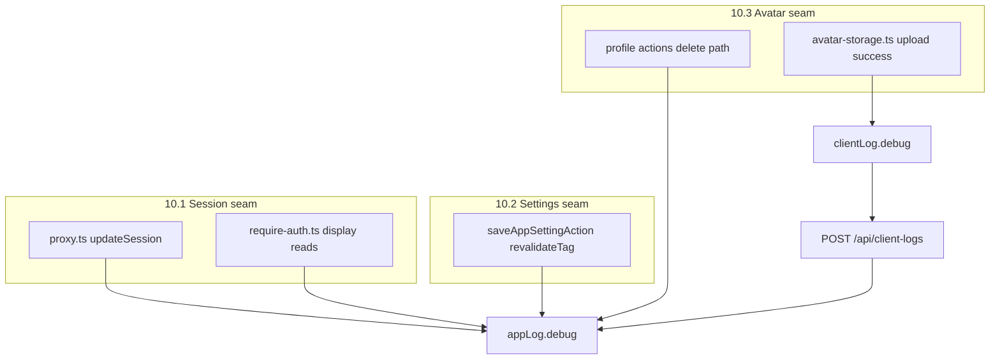

# Phase 12 Epic 10 — Debug logs at the three seams

> **Track progress:** as you complete each step, update the corresponding `todos` entry's `status` to `completed` in this plan's frontmatter.

> **Precondition:** `git status --porcelain` must be empty before the first implementation edit. The working tree currently has untracked `.cursor/plans/` files only — remove, commit, or stash those first. This epic lands as a single commit containing only Epic 10 work.
>
> **Pre-epic baseline:** capture `git rev-parse HEAD` as the epic baseline SHA before the first implementation edit. `/code-review` diffs from this SHA to the Epic 12.10 commit.

**Branch:** `phase-12/observability-app-settings` (confirmed — prior epics are complete; no kickoff check needed).

**Scope:** Epic 10 only — three stories, one integrated verification pass. No migrations, no schema changes, no new registry keys, no hard-constraint changes.

**Baseline:** There is **no `appLog.debug` or `clientLog.debug` anywhere in `src/` today**. Existing seams only log at `error`/`warn`. This epic introduces the first debug usage and proves threshold gating end-to-end.

**PRD success criteria (epic-level gate):**
- With `min_log_level` at **debug**, one pass through sign-in → settings save → avatar upload produces a legible trace on `/admin/logs` (session, settings invalidation on save, avatar upload/delete).
- With threshold at **info**, none of the new debug rows appear.
- No seam's control flow or behavior changes.



---

## 1. Session seam — proxy refresh vs reuse, expired display reads (Story 10.1)

**Files:** [`src/supabase/proxy.ts`](src/supabase/proxy.ts), [`src/supabase/require-auth.ts`](src/supabase/require-auth.ts)

**Tags:** keep existing `proxy` and `require-auth` tags per [`logging.mdc`](.cursor/rules/logging.mdc).

### Proxy — token refreshed vs reused

After the existing successful `getClaims()` on a **protected route** with valid `sessionClaims`, emit one debug line:

- **Message:** `"Session token refreshed"` when auth cookies were rewritten during this request; `"Session token reused"` otherwise.
- **Context:** `{ pathname, refreshed: boolean }` — never log tokens.

**Implementation:** track a boolean (e.g. `authCookiesUpdated`) set to `true` inside the existing `setAll` callback before cookie writes. Only log on the happy protected-route path (valid session, no redirect) — skip public-route anonymous traffic.

Do **not** add debug on existing error paths; those stay at `error`.

### Require-auth — claims read while expired

[`parseAuthenticatedClaims`](src/supabase/require-auth.ts) drops `exp` from the returned shape. Add a tiny helper (co-locate in `require-auth.ts` or [`read-auth-cookie.ts`](src/supabase/read-auth-cookie.ts)) that reads `exp` from the JWT payload segment of the access token — decode only, no verification (signature already validated by `getClaims`).

**`getDisplayAuthClaims`:** on success, if `exp` is in the past, log `"Display claims read with expired access token"` with `{ sub, exp }`. Optionally log `"Display claims read"` with `{ sub }` when not expired — keep volume reasonable.

**`hasServerAuthSession`:** on success with expired token only, log `"Session probe succeeded with expired access token"` with `{ sub, exp }`. Skip debug when probe returns false or token is fresh (marketing traffic noise).

**Security:** never log access tokens, refresh tokens, or full JWTs.

**ADR alignment:** [ADR-0005](docs/adr/ADR-0005-proxy-as-sole-session-authority.md) — debug observes refresh authority vs display reads tolerating `exp`, without changing either behavior.

---

## 2. Settings seam — invalidation on save (Story 10.2)

**File:** [`src/app/admin/settings/_lib/actions.ts`](src/app/admin/settings/_lib/actions.ts)

**Tag:** `app-settings` (distinct from save errors at `save-app-setting`).

Do **not** change [`src/utils/app-settings.ts`](src/utils/app-settings.ts) — leave the existing single `unstable_cache(...)` export on `getResolvedAppSettings` unchanged.

### Invalidation — `saveAppSettingAction`

After successful upsert, immediately **before** `revalidateTag(APP_SETTINGS_CACHE_TAG, 'max')`, log `"Invalidating settings cache after save"` with `{ key }`.

---

## 3. Avatar seam — upload success and delete paths (Story 10.3)

**Files:** [`src/utils/avatar-storage.ts`](src/utils/avatar-storage.ts), [`src/app/(app)/_lib/profile/actions.ts`](src/app/(app)/_lib/profile/actions.ts)

PRD note: upload is browser → storage (server never sees the file); delete-failure-without-blocking is server-side in `updateProfileAction`.

### Upload success — browser

In [`uploadUserAvatar`](src/utils/avatar-storage.ts), after successful `.upload()` and before returning `publicUrl`:

- `clientLog.debug('avatar-storage', 'Avatar uploaded', { storagePath, byteSize: webpBlob.size })`
- Registry key `'avatar-storage'` already exists — persists as `client-avatar-storage` via relay.
- Browser console mirrors immediately (ungated per Epic 5); persistence is threshold-gated on relay → `appLog`.

### Delete success — server

In `updateProfileAction`, when `avatarUrl === null` and `removeAvatarStorage` returns `{ ok: true }`:

- `appLog.debug('profile-update', 'Avatar storage deleted', { userId: user.id })` (or storage path — no PII beyond user id already used elsewhere in this action).

### Delete failure without blocking — server

Existing `appLog.warn('profile-update', 'Avatar storage delete failed', …)` stays.

Add `appLog.debug('profile-update', 'Profile updated; avatar storage delete failed without blocking success', { storageDeleteOk: false })` on the same branch so the trace shows the non-blocking outcome at debug threshold.

---

## 4. Tests

Extend existing unit tests — mock `appLog` / `clientLog`, assert debug calls fire with expected tags/messages/context. Do not add integration/E2E for log rows.

| File | What to assert |
| ---- | -------------- |
| [`src/supabase/proxy.unit.test.ts`](src/supabase/proxy.unit.test.ts) | Debug on protected happy path; `refreshed: true` when `setAll` runs, `false` when not |
| [`src/supabase/require-auth.unit.test.ts`](src/supabase/require-auth.unit.test.ts) | Expired-token debug on `getDisplayAuthClaims` and `hasServerAuthSession`; no debug on failure paths |
| [`src/app/admin/settings/_lib/actions.unit.test.ts`](src/app/admin/settings/_lib/actions.unit.test.ts) | Debug invalidation log on successful save |
| [`src/app/(app)/_lib/profile/actions.unit.test.ts`](src/app/(app)/_lib/profile/actions.unit.test.ts) | Debug on delete success; debug + warn on delete failure (success envelope unchanged) |
| [`src/utils/avatar-storage.unit.test.ts`](src/utils/avatar-storage.unit.test.ts) | `clientLog.debug` after successful upload mock |

Follow [`app-logger.unit.test.ts`](src/utils/app-logger.unit.test.ts) patterns for mocking `after()` when testing threshold gating is impractical at seam level — seam tests can assert the debug call is **made**; threshold behavior is already covered by the logger unit tests.

---

## 5. Manual verification (after quality gate)

1. Set **Minimum log level** to **debug** on [`/admin/settings`](src/app/admin/settings/page.tsx).
2. Sign in and load a protected page (e.g. `/home`) — expect `[proxy]` refresh/reuse and possibly `[require-auth]` expired/read lines on `/admin/logs`.
3. Save any setting — expect one `[app-settings]` invalidation debug line (`Invalidating settings cache after save`). Loading `/admin/settings` alone does not produce a settings-seam debug row.
4. Upload an avatar — expect `client-avatar-storage` debug row (relay).
5. Remove avatar — expect `[profile-update]` delete debug; if storage delete fails, expect warn + debug and action still succeeds.
6. Set threshold back to **info** — repeat steps 2–5; confirm **no new debug rows** persist (existing error/warn rows unaffected).
7. Confirm browser devtools still show client mirror immediately regardless of threshold.

---

### Verification

Quality bar — stop on failure:

```bash
pnpm type-check && pnpm lint && pnpm format-check && pnpm test:ci
```

### Commit epic

Authorized by this approved plan:

1. Review diff; stage only files in scope for this epic.
2. Write a conventional commit message. It **must** end with an `Epic:` git trailer:

   ```
   feat(phase-12): debug logs at session, settings, and avatar seams

   Epic: 12.10
   ```

3. Commit (request `git_write`). If pre-commit hook fails, fix and retry the commit.
4. Verify `git status --porcelain` is empty after commit.
5. Capture the epic commit SHA (`git rev-parse HEAD`).

**Do not push** — push remains `ship-phase`.

### Handoff

Epic committed. For `/code-review`, pass:

- **Baseline SHA** — captured before the first implementation edit (precondition above)
- **Epic commit SHA** — captured after the commit-epic step
- **Epic id:** 12.10

Open a new agent window and run `/code-review`.
