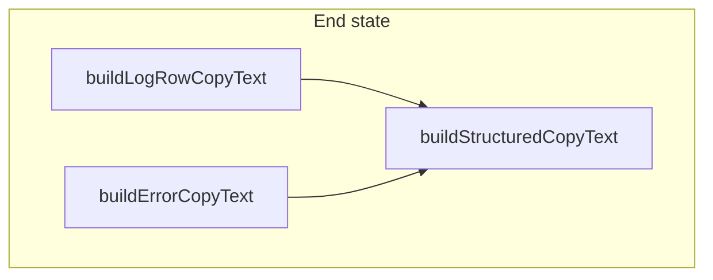

# Phase 12 Epic 11 — Structured copy standardization

> **Track progress:** as you complete each step, update the corresponding `todos` entry's `status` to `completed` in this plan's frontmatter.

> **Precondition:** `git status --porcelain` must be empty before the first implementation edit. The working tree is currently dirty — six untracked plan files under [`.cursor/plans/`](.cursor/plans/). Stash them or leave them untracked — Step 4 stages only Epic 11 files, so the untracked plan files won't enter the epic commit. Do not delete them. This epic lands as a single commit containing only Epic 11 work.
>
> **Epic baseline:** After the working tree precondition is satisfied and before the first implementation edit, run `git rev-parse HEAD` and record the SHA below as `{BASELINE_SHA}`. `/code-review` diffs from this SHA to the Epic 12.11 commit.

**Branch:** `phase-12/observability-app-settings` (confirmed — not a first-epic kickoff).

**Pre-epic baseline:** `2e408d8f5006edd22ca2ed397977b478da9a3829`

**Scope:** Pure refactor in application code — no migration, no schema, no new routes. Touches the log copy helper shipped in Epic 8 and the error-panel copy helper from Phase 5.

**Foundation:**

- [`build-log-row-copy-text.ts`](src/app/admin/logs/_lib/build-log-row-copy-text.ts) — already emits pretty-printed JSON; conditionally includes `context` when non-null; covered by [`build-log-row-copy-text.unit.test.ts`](src/app/admin/logs/_lib/build-log-row-copy-text.unit.test.ts) (must pass unchanged after 11.2).
- [`error-panel.tsx`](src/components/error-panel.tsx) — `buildErrorCopyText` today returns plain text (`message` or `message\nCode: {code}`); route error boundaries pass `error.digest` through the `code` prop ([`(app)/error.tsx`](src/app/(app)/error.tsx), [`auth/error.tsx`](src/app/auth/error.tsx), [`admin/error.tsx`](src/app/admin/error.tsx)); fault envelopes pass taxonomy `code` via [`AppErrorSurface`](src/components/app-error-surface.tsx).



---

## Step 0 — Capture baseline

After the precondition is satisfied and before the first implementation edit, run `git rev-parse HEAD`, substitute the result for `{BASELINE_SHA}` in this plan (precondition block and handoff below), then proceed to Step 1.

---

## Step 1 — Shared primitive (Story 11.1)

Add [`src/utils/build-structured-copy-text.ts`](src/utils/build-structured-copy-text.ts):

- Export `buildStructuredCopyText(fields: Record<string, unknown>): string`
- Iterate keys; include only values that are neither `null` nor `undefined`
- Return `JSON.stringify(filtered, null, 2)` — this is the **only** place omit-nullish + pretty-print lives

Add [`src/utils/build-structured-copy-text.unit.test.ts`](src/utils/build-structured-copy-text.unit.test.ts) covering:

- Omits `null` and `undefined` keys; retains `0`, `''`, and `false`
- Output is valid JSON with 2-space indent (assert parsed round-trip + newline indent marker)

---

## Step 2 — Log row copy delegates (Story 11.2)

Update [`build-log-row-copy-text.ts`](src/app/admin/logs/_lib/build-log-row-copy-text.ts):

- Import `buildStructuredCopyText`
- Replace inline payload assembly + `JSON.stringify` with a single call:

```typescript
buildStructuredCopyText({
  timestamp: createdAt,
  level,
  tag,
  message,
  context, // null omitted by primitive — same as today's explicit guard
})
```

- Keep `BuildLogRowCopyTextParams` and the public signature unchanged
- **Do not** modify [`build-log-row-copy-text.unit.test.ts`](src/app/admin/logs/_lib/build-log-row-copy-text.unit.test.ts) — existing assertions are the regression gate

Call sites ([`logs-columns.tsx`](src/app/admin/logs/_components/logs-columns.tsx), [`log-detail-dialog.tsx`](src/app/admin/logs/_components/log-detail-dialog.tsx)) need no changes.

---

## Step 3 — Error copy migrates to JSON (Story 11.3)

### Helper + panel

Update [`error-panel.tsx`](src/components/error-panel.tsx):

- Extend `BuildErrorCopyTextParams` and `ErrorPanelProps` with optional `digest?: string`
- `buildErrorCopyText({ message, code, digest })` → `buildStructuredCopyText({ message, code, digest })`
- Wire `useCopyToClipboard(buildErrorCopyText({ message, code, digest }))`
- **UI unchanged:** chip displays `code ?? digest` (preserves today's digest-in-chip appearance for route errors once boundaries stop overloading `code`)
- Copy → Copied button, `aria-live` status — no changes

### Call sites

| Surface | Change |
| ------- | ------ |
| [`(app)/error.tsx`](src/app/(app)/error.tsx), [`auth/error.tsx`](src/app/auth/error.tsx), [`admin/error.tsx`](src/app/admin/error.tsx) | Replace `code={error.digest}` with `digest={error.digest}` |
| [`app-error-surface.tsx`](src/components/app-error-surface.tsx) | No change — keeps `code={error.code}` |
| Profile fault panel, reference demo | No prop changes |

### Tests

Update [`error-panel.unit.test.tsx`](src/components/error-panel.unit.test.tsx):

- **`buildErrorCopyText`:** assert parsed JSON shape instead of plain-string equality:
  - `{ message, code }` when code present
  - `{ message }` when neither code nor digest
  - `{ message, digest }` when digest present (add case)
  - `{ message, code, digest }` when both present (add case)
- **`ErrorPanel` interaction tests:** unchanged — still assert Copy → Copied and `aria-live`; no clipboard-content assertions required there

Grep for any other imports of `buildErrorCopyText` — today only the unit test file; no additional call-site updates expected.

---

## Step 4 — Quality gate + commit

Run full quality bar; fix any failures before committing.

**Out of scope (per PRD):** no `error-handling.mdc` copy-format update, no reference-page prose refresh, no AGENTS.md sync — behavior change is clipboard payload only.

### Verification

```bash
pnpm type-check && pnpm lint && pnpm format-check && pnpm test:ci
```

**Manual smoke checklist:**

1. `/admin/logs` — row Copy and detail-dialog Copy still produce the same JSON shape as before (timestamp, level, tag, message, optional context).
2. `/reference` — fault ErrorPanel demo: Copy places pretty-printed JSON with `message` and `code` keys.
3. Trigger a route error boundary (or use an existing fault surface): chip still shows the digest; Copy JSON has `message` + `digest` as separate keys (not stuffed into `code`).
4. Confirm Copy → Copied affordance and screen-reader status unchanged on ErrorPanel.

### Commit epic

1. Stage only Epic 11 files.
2. Conventional commit, e.g.:

```
feat(phase-12): standardize structured copy helpers

Epic: 12.11
```

3. Verify clean working tree after commit. **Do not push.**

### Handoff

Epic 12.11 committed. Baseline SHA: `2e408d8f5006edd22ca2ed397977b478da9a3829`. Next: open a new agent window and run `/code-review` against `2e408d8f5006edd22ca2ed397977b478da9a3829`.
