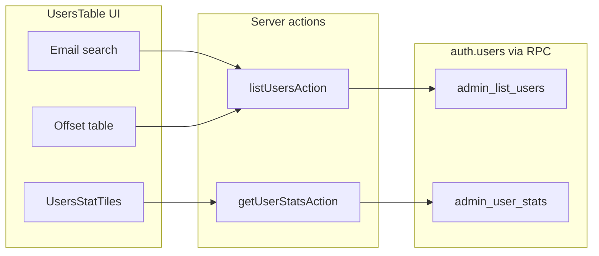

# Phase 12 Epic 12 — Users page stat tile filters

> **Track progress:** as you complete each step, update the corresponding `todos` entry's `status` to `completed` in this plan's frontmatter.

> **Precondition:** `git status --porcelain` must be empty before the first implementation edit. The working tree currently has untracked files under [`.cursor/plans/`](.cursor/plans/) — commit, stash, or remove those first. This epic lands as a single commit containing only Epic 12 work.
>
> Capture the baseline SHA with `git rev-parse HEAD` immediately before the first implementation edit — this is the ref `/code-review` diffs from. Record it in the Handoff section when the epic commits.

**Branch:** `phase-12/observability-app-settings` (confirmed — prior epics are `Complete`; no kickoff gate).

**Foundation:** Epic 9 shipped reusable [`StatTile`](src/components/stat-tile.tsx) and [`useToggleFilterSet`](src/hooks/use-toggle-filter-set.ts). The logs page ([`logs-stat-tiles.tsx`](src/app/admin/logs/_components/logs-stat-tiles.tsx), [`logs-table.tsx`](src/app/admin/logs/_components/logs-table.tsx)) is the reference wiring pattern. The users page today ([`users-table.tsx`](src/app/admin/users/_components/users-table.tsx)) uses a **Show banned** checkbox with `showBanned` defaulting to `false` (banned users hidden). Epic 12 replaces that with tile filters whose default is **fully unfiltered**. Mockup: [`.mockups/admin_users_page.html`](.mockups/admin_users_page.html).

**Filter semantics (end state):**

| Tile state | List behavior |
| --- | --- |
| Neither tile active (Total) | All users — banned and verified included |
| Unverified active | Restrict to `email_confirmed_at is null` |
| Banned active | Restrict to currently banned |
| Both active | AND both predicates (may legitimately return zero rows) |

Tile counts are **global** (unaffected by search or the other tile's selection), matching logs.



---

## 1. Migration — `admin_list_users` filters + `admin_user_stats` (Stories 12.2, partial 12.1)

Write one migration via [`create-migration`](.cursor/skills/create-migration/SKILL.md) (must sort after [`20260718191656_app_logs_read_state_and_context_text.sql`](supabase/migrations/20260718191656_app_logs_read_state_and_context_text.sql)):

**Drop and recreate** `admin_list_users` — signature change must not leave an overload ([Phase 11 Epic 14 precedent](.cursor/plans/archive/phase_11_epic_14_banned_filter_bb2f9b2f.plan.md)):

```sql
drop function if exists public.admin_list_users(text, text, int, int, text, boolean);
```

New signature:

`admin_list_users(p_sort_column, p_sort_direction, p_page, p_per_page, p_search, p_filter_unverified boolean, p_filter_banned boolean)`

In the inner subquery over `auth.users`, derive **once**:

- `is_currently_banned` — keep existing predicate (`banned_until is not null and banned_until > now()`)
- `is_verified` — `email_confirmed_at is not null`

WHERE clause (compose with existing email search):

- `(not coalesce(p_filter_unverified, false) or not u.is_verified)` — when filter on, only unverified rows pass
- `(not coalesce(p_filter_banned, false) or u.is_currently_banned)` — when filter on, only banned rows pass

Keep the existing sort allowlist and `is_currently_banned`-aware `banned_until` sort. Copy security header verbatim from [`20260715175218_admin_list_users_show_banned_filter.sql`](supabase/migrations/20260715175218_admin_list_users_show_banned_filter.sql) (`security definer`, `set search_path = ''`, admin JWT gate, `u.` aliases, REVOKE PUBLIC + GRANT authenticated).

**Add** `admin_user_stats()` returning `{ total, unverified, banned }` — same admin gate, counts over all `auth.users` using the same derived predicates. No search/filter params (global tile counts).

**Human step after file lands:** review SQL → `pnpm db:push` → `pnpm db:types` (regenerates [`src/types/database.types.ts`](src/types/database.types.ts)). Agent does not run push/types.

---

## 2. Server layer — list + stats (Stories 12.2, 12.3)

**Replace `showBanned` with tile filter flags** across the users data path:

| File | Change |
| --- | --- |
| [`list-admin-users.ts`](src/app/admin/users/_lib/list-admin-users.ts) | `filterUnverified` / `filterBanned` booleans → `p_filter_unverified` / `p_filter_banned` RPC args |
| [`actions.ts`](src/app/admin/users/actions.ts) | Replace `showBanned` on `ListUsersActionInput` with the two filter booleans + validation; add `getUserStatsAction` (admin gate → stats helper) |
| New [`list-admin-user-stats.ts`](src/app/admin/users/_lib/list-admin-user-stats.ts) | `listAdminUserStats(client)` calling `admin_user_stats` RPC; export `AdminUserStats` type `{ total, unverified, banned }` |

Follow the logs stats pattern ([`list-app-log-stats.ts`](src/app/admin/logs/_lib/list-app-log-stats.ts), [`getLogStatsAction`](src/app/admin/logs/actions.ts)): try/catch with [`mapUsersActionFault`](src/app/admin/users/_lib/map-users-action-fault.ts).

Default both filter flags to `false` at the action boundary (unfiltered default per story 12.4).

---

## 3. Client data layer (Story 12.3)

| File | Change |
| --- | --- |
| [`admin-users-query-keys.ts`](src/app/admin/users/_lib/admin-users-query-keys.ts) | Replace `showBanned` in list key with `{ filterUnverified, filterBanned }`; add `stats()` key |
| [`use-admin-users-list.ts`](src/app/admin/users/_lib/use-admin-users-list.ts) | Pass new filter params |
| New [`use-admin-user-stats.ts`](src/app/admin/users/_lib/use-admin-user-stats.ts) | Mirror [`use-admin-log-stats.ts`](src/app/admin/logs/_lib/use-admin-log-stats.ts) |

Existing ban/role mutations already invalidate `adminUsersQueryKeys.all` — that covers the new stats query automatically.

---

## 4. UI — stat tiles + retire checkbox (Stories 12.1, 12.3, 12.4)

**New** [`users-stat-tiles.tsx`](src/app/admin/users/_components/users-stat-tiles.tsx) — three-column grid (mockup layout), consuming shared `StatTile`:

- **Total** — `role="total"`, never `selected`, clears both filters on click
- **Unverified** — `role="warn"`, toggles `unverified` in `useToggleFilterSet<'unverified' | 'banned'>()`
- **Banned** — `role="error"`, toggles `banned`

Wire in [`users-table.tsx`](src/app/admin/users/_components/users-table.tsx):

- Add `useToggleFilterSet` + `useAdminUserStats`
- Map active set → `filterUnverified` / `filterBanned` booleans for `useAdminUsersList`
- Reset `page` to 1 on tile toggle (same as logs cursor reset)
- Render `UsersStatTiles` above search
- **Remove** the Show banned checkbox, its state, handler, and Checkbox/Label imports
- Surface stats fetch errors via `AppErrorSurface` (same pattern as list errors)

Do **not** duplicate stat-tile or toggle-filter logic in page-local code — consume the Epic 9 primitives only.

---

## 5. Tests

Update existing tests for the renamed/changed API and add focused coverage:

| File | Focus |
| --- | --- |
| [`list-admin-users.unit.test.ts`](src/app/admin/users/_lib/list-admin-users.unit.test.ts) | New RPC arg names; filter combinations |
| [`actions.unit.test.ts`](src/app/admin/users/actions.unit.test.ts) | Remove showBanned cases; add filter validation + `getUserStatsAction` happy/fault paths |
| [`users-table.unit.test.tsx`](src/app/admin/users/_components/users-table.unit.test.tsx) | Default list call has both filters `false`; tile toggle resets page and passes flags; no checkbox |
| New `list-admin-user-stats.unit.test.ts` | RPC wiring |
| New `users-stat-tiles.unit.test.tsx` (optional, keep minimal) | Total clears; tile `aria-pressed` toggles |

Remove all references to "Show banned" in test descriptions and assertions.

---

## Verification

Quality bar — same commands as [WORKFLOW_GUIDE Step 5](docs/WORKFLOW_GUIDE.md). Stop on failure:

```bash
pnpm type-check && pnpm lint && pnpm format-check && pnpm test:ci
```

**Manual smoke (after human runs `pnpm db:push`):**

- `/admin/users` loads with three stat tiles showing global counts
- Default table includes banned users (no hidden-by-default behavior)
- Click **Unverified** — table narrows; count on tile unchanged; search still composes
- Click **Banned** — same; both tiles active can show zero rows
- Click **Total** — both tiles deselect; full list returns
- Sort and paging still work under active filters
- Ban/unban a user — tile counts refresh after mutation toast

---

## Commit epic

Authorized by this approved plan:

1. Review diff; stage only files in scope for this epic.
2. Conventional commit message ending with:

   ```
   feat(phase-12): users page stat tile filters

   Epic: 12.12
   ```

3. Commit (request `git_write`). If pre-commit hook fails, fix and retry (do not amend a failed commit).
4. Verify `git status --porcelain` is empty after commit.

**Do not push** — push remains `ship-phase`.

---

## Handoff

Epic 12.12 committed on top of baseline `84e7a1d9aacffdcc540b756730c1b53a72375cd8`. Next: open a new agent window and run `/code-review` against `baseline..HEAD`.
