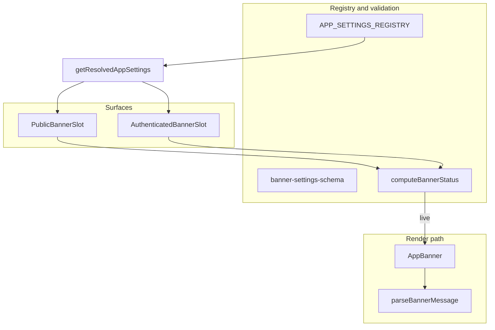

# Phase 12 Epic 13 — Banner engine & placement

> **Track progress:** as you complete each step, update the corresponding `todos` entry's `status` to `completed` in this plan's frontmatter.

> **Precondition:** `git status --porcelain` must be empty before the first implementation edit. The working tree currently has untracked files under [`.cursor/plans/`](.cursor/plans/) — commit, stash, or remove those first. This epic lands as a single commit containing only Epic 13 work.
>
> Capture the baseline SHA with `git rev-parse HEAD` immediately before the first implementation edit — this is the ref `/code-review` diffs from. Record it in the Handoff section when the epic commits.

**Branch:** `phase-12/observability-app-settings` (confirmed — Epics 1–12 are `Complete`; no kickoff gate).

**Scope boundary:** Epic 13 ships the engine (types, registry, validation, parser, status, component, placement). Epic 14 adds settings-page accordion controls and live preview — do **not** build admin UI beyond excluding banner entries from the generic settings row loop (see step 1).

**Foundation:** Reuses Epic 1's settings store ([`app-settings-registry.ts`](src/config/app-settings-registry.ts), [`saveAppSettingAction`](src/app/admin/settings/_lib/actions.ts), [`getResolvedAppSettings`](src/utils/app-settings.ts)). No migration — banner values are JSON objects in existing `app_settings.value` jsonb column.



---

## 1. Banner types, registry entries, and validation (Story 13.1)

**New type module** [`src/types/banner.ts`](src/types/banner.ts):

- `BANNER_MODES`: `off` | `on` | `scheduled`
- `BANNER_VARIANTS`: `primary` | `success` | `warning` | `destructive` | `info`
- `BannerSettingValue` shape per PRD: `mode`, `starts_at` (nullable ISO string), `expires_at` (nullable ISO string), `headline` (max 80), `detail` (optional, max 100), `variant`, `show_icon` (boolean)
- `BannerComputedStatus`: `off` | `scheduled` | `live`
- `DEFAULT_BANNER_SETTING` — `mode: 'off'`, empty headline, `detail: null`, sensible defaults for variant/show_icon

**Extend** [`src/types/app-settings.ts`](src/types/app-settings.ts):

- Add keys `banner_public` | `banner_authenticated` to `AppSettingKey`
- Add `valueType: 'banner'` to `AppSettingValueType`
- Map both keys to `BannerSettingValue` in `AppSettingValueMap`

**Extend registry** [`src/config/app-settings-registry.ts`](src/config/app-settings-registry.ts):

- New group constant `APP_SETTINGS_GROUP_BANNERS = 'Banners'`
- Two entries with labels/descriptions matching mockup intent (public = marketing page; authenticated = signed-in app shell)
- Both use `valueType: 'banner'` and `default: DEFAULT_BANNER_SETTING`

**New validation module** [`src/utils/banner-settings-schema.ts`](src/utils/banner-settings-schema.ts):

- Zod schema for the full banner object
- Character caps enforced at save boundary: headline ≤ 80, detail ≤ 100 — return clear operational messages, never silent truncation
- Scheduled mode: `expires_at` required; `starts_at` optional (null = start immediately)
- Timestamp fields validated as ISO datetimes
- Link syntax in headline/detail is **not** parsed at save — only length/mode/timestamp rules apply here

**Wire into existing save path** [`src/utils/app-settings-schema.ts`](src/utils/app-settings-schema.ts):

- Add `banner` branch in `parseAppSettingValue` delegating to banner schema
- Existing [`saveAppSettingAction`](src/app/admin/settings/_lib/actions.ts) works unchanged once parsing is extended

**Settings panel guard:** In [`app-settings-panel.tsx`](src/app/admin/settings/_components/app-settings-panel.tsx), skip registry entries where `valueType === 'banner'` in the generic row loop — [`AppSettingRow`](src/app/admin/settings/_components/app-setting-row.tsx) only handles `log_level` and `positive_int` today; rendering banner rows there would mis-route to the positive-int control. Epic 14 adds the dedicated Banners accordion section.

---

## 2. Message parser (Story 13.2)

**New util** [`src/utils/parse-banner-message.ts`](src/utils/parse-banner-message.ts):

- Regex-based (no markdown library) tokenizer producing segments: `{ type: 'text' | 'bold' | 'link', content, href? }`
- Support `**bold**` and `[label](url)` inline, including mid-sentence combinations in the same string
- No raw HTML output — segments render as React text, `<strong>`, or validated links only
- URL validation at parse/render time:
  - Allow relative paths beginning with a single `/` (reject protocol-relative `//…`).
  - Allow absolute URLs whose protocol is `http:` or `https:` — any origin.
  - Render anything else (other schemes such as `javascript:` / `data:`, or malformed URLs) as plain text, not a clickable link.

**Renderer:** co-locate a small `BannerMessage` component (in the same file or [`src/components/banner-message.tsx`](src/components/banner-message.tsx)) that maps segments to elements — detail links use `text-muted-foreground underline` (underline-only distinction per PRD)

---

## 3. Computed status (Story 13.3)

**New pure function** [`src/utils/banner-status.ts`](src/utils/banner-status.ts):

```typescript
computeBannerStatus(config: BannerSettingValue, now?: Date): BannerComputedStatus
```

Rules (from PRD):

| Condition | Status |
| --- | --- |
| `mode === 'off'` | `off` |
| `mode === 'on'` | `live` |
| `mode === 'scheduled'` and `expires_at` in the past | `off` |
| `mode === 'scheduled'` and `starts_at` in the future | `scheduled` |
| `mode === 'scheduled'` and now within window (null `starts_at` = immediate) | `live` |

Export a helper `isBannerLive(config, now?)` for placement components. Epic 14 will reuse this for settings-page status badges.

---

## 4. Shared banner component (Story 13.4)

**New component** [`src/components/app-banner.tsx`](src/components/app-banner.tsx) (`'use client'` — dismiss button, optional for Epic 14 preview reuse):

- Accepts `config: BannerSettingValue`, optional `onDismiss`, optional `dismissible`
- Returns `null` unless `computeBannerStatus(config) === 'live'` (unless a future Epic 14 `forcePreview` prop — do not add now)
- Layout: full-width bar with variant-tinted background using semantic tokens (`bg-{variant}/15` pattern consistent with [`stat-tile.tsx`](src/components/stat-tile.tsx) and [`log-level-badge.tsx`](src/app/admin/logs/_components/log-level-badge.tsx))
- Headline in `text-foreground`; optional detail prefixed with ` · ` in `text-muted-foreground`
- When `show_icon`: solid variant-colored badge (`bg-{variant}`) with knockout icon — icon glyph uses the banner's tinted background color (same `/15` token as the bar fill); variant icon map per PRD: primary → Megaphone, success → Check, warning → AlertTriangle, destructive → AlertCircle, info → Info (lucide-react)
- Dismiss control: icon button with accessible label when `dismissible && onDismiss` provided

---

## 5. Placement and dismissal (Story 13.5)

**Public surface** — [`src/app/(marketing)/layout.tsx`](src/app/(marketing)/layout.tsx):

- Async layout: `getResolvedAppSettings()` → pass `settings.banner_public` to new client slot
- New [`src/components/public-banner-slot.tsx`](src/components/public-banner-slot.tsx): renders `AppBanner` when live; dismiss writes a client cookie keyed by hash of `headline + detail` (small hash helper in [`src/utils/banner-dismiss-hash.ts`](src/utils/banner-dismiss-hash.ts)); SSR reads the cookie via [`resolveLiveBannerSlot`](src/utils/banner-dismiss-cookie.ts) so dismissal survives reload until content changes
- Place banner **above** [`LandingHeader`](src/app/(marketing)/_components/landing-header.tsx) so it spans the full page width

**Authenticated surface** — [`src/app/(app)/layout.tsx`](src/app/(app)/layout.tsx):

- Layout reads settings via [`AuthenticatedBannerSlotEntry`](src/components/authenticated-banner-slot-entry.tsx) (async server entry, Suspense-wrapped) and renders it **above** [`AppShell`](src/app/(app)/_components/app-shell.tsx) — banner spans full width before site chrome; `AppShell` itself has no banner prop
- [`src/components/authenticated-banner-slot.tsx`](src/components/authenticated-banner-slot.tsx): `useState` dismissal only — hides instantly on close, reappears on next page load/navigation refresh; no cookie or localStorage
- Banner sits above [`SiteHeader`](src/components/site-header.tsx) in the visual stack (layout sibling, not inside `AppShell`)
- **Admin routes excluded** — admin uses its own layout; authenticated banner targets `(app)` shell only

Both slots read cached settings server-side (Epic 1.3 path) — no client fetch needed.

---

## 6. Tests

| File | Coverage |
| --- | --- |
| [`banner-settings-schema.unit.test.ts`](src/utils/banner-settings-schema.unit.test.ts) | Char-cap rejection; scheduled requires `expires_at`; valid defaults parse |
| [`parse-banner-message.unit.test.ts`](src/utils/parse-banner-message.unit.test.ts) | Bold, link, combined; no HTML; external `https` link renders as clickable; `javascript:` URL renders as plain text; other invalid schemes/malformed URLs stay text |
| [`banner-status.unit.test.ts`](src/utils/banner-status.unit.test.ts) | All mode/time branches including null `starts_at` and expired scheduled |
| [`app-banner.unit.test.tsx`](src/components/app-banner.unit.test.tsx) | Renders when live; null when off; dismiss callback; icon toggle |
| [`public-banner-slot.unit.test.tsx`](src/components/public-banner-slot.unit.test.tsx) | Dismissal persists to the public dismiss cookie keyed by headline+detail hash; visibility resets when headline or detail changes |
| [`authenticated-banner-slot.unit.test.tsx`](src/components/authenticated-banner-slot.unit.test.tsx) | Dismissal is in-memory only — no localStorage write; banner reappears on remount |
| Update [`app-settings-registry.unit.test.ts`](src/config/app-settings-registry.unit.test.ts) | Registry length 4; banner keys present |
| Update [`app-settings.unit.test.ts`](src/utils/app-settings.unit.test.ts) | Resolved snapshot includes banner defaults |

---

## Files touched (summary)

| Action | Path |
| --- | --- |
| New | `src/types/banner.ts`, `src/utils/banner-settings-schema.ts`, `src/utils/parse-banner-message.ts`, `src/utils/banner-status.ts`, `src/utils/banner-dismiss-hash.ts`, `src/components/app-banner.tsx`, `src/components/public-banner-slot.tsx`, `src/components/authenticated-banner-slot.tsx`, unit tests (incl. `public-banner-slot.unit.test.tsx`, `authenticated-banner-slot.unit.test.tsx`) |
| Edit | `src/types/app-settings.ts`, `src/config/app-settings-registry.ts`, `src/utils/app-settings-schema.ts`, `src/app/admin/settings/_components/app-settings-panel.tsx`, `src/app/(marketing)/layout.tsx`, `src/app/(app)/layout.tsx`, `src/components/authenticated-banner-slot-entry.tsx`, existing registry/settings tests |

No migration, no AGENTS.md sync (Epic 13 alone doesn't ship admin banner controls — doc sync at phase ship or Epic 14).

---

### Verification

Quality bar — stop on failure:

```bash
pnpm type-check && pnpm lint && pnpm format-check && pnpm test:ci
```

### Commit epic

Authorized by this approved plan:

1. Review diff; stage only files in scope for this epic.
2. Write a conventional commit message. It **must** end with an `Epic:` git trailer:

   ```
   feat(phase-12): banner engine and surface placement

   Epic: 12.13
   ```

3. Commit (request `git_write`). Pre-commit hook runs automatically — if it fails, **fix and retry the commit**.
4. Verify `git status --porcelain` is empty after commit.

**Do not push** — push remains `ship-phase`.

### Handoff

End the run by telling the user (substitute the SHA captured in the precondition step):

*"Epic 12.13 committed. Baseline SHA (pre-edit): `<sha>`. Next: open a new agent window and run `/code-review`."*

Populate `<sha>` from the `git rev-parse HEAD` output recorded immediately before the first implementation edit.
