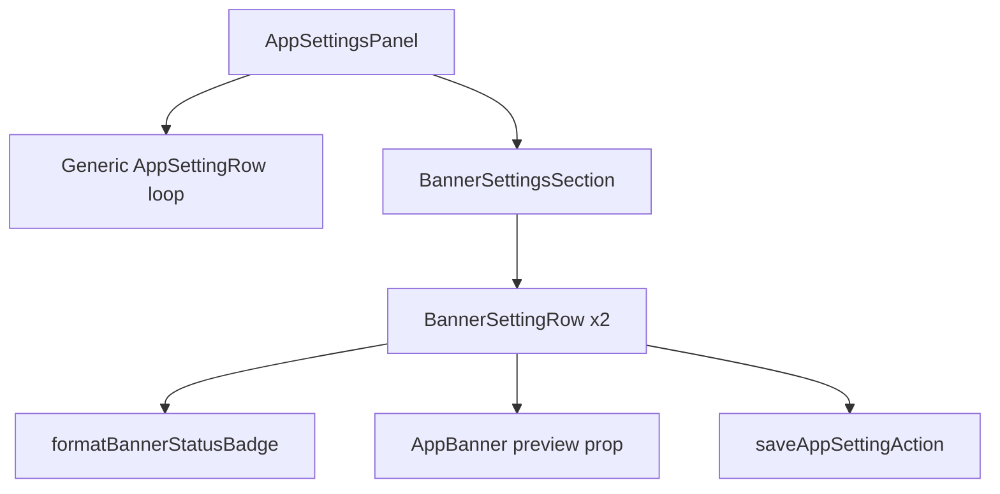

# Phase 12 Epic 14 — Banner settings-page controls

> **Track progress:** as you complete each step, update the corresponding `todos` entry's `status` to `completed` in this plan's frontmatter.

> **Precondition:** `git status --porcelain` must be empty before the first implementation edit. The working tree currently has untracked files under [`.cursor/plans/`](.cursor/plans/) — commit, stash, or remove those first. This epic lands as a single commit containing only Epic 14 work.
>
> Capture the baseline SHA with `git rev-parse HEAD` immediately before the first implementation edit — this is the ref `/code-review` diffs from. Record it in the Handoff section when the epic commits.

**Branch:** `phase-12/observability-app-settings` (confirmed — Epics 1–13 are `Complete`; no kickoff gate).

**Scope boundary:** Epic 13 shipped the engine ([`AppBanner`](src/components/app-banner.tsx), [`computeBannerStatus`](src/utils/banner-status.ts), [`bannerSettingValueSchema`](src/utils/banner-settings-schema.ts), registry entries, placement slots). Epic 14 adds the admin UI only — no migration, no new persistence, no auth-boundary changes.

**Mockup reference:** [`.mockups/admin_settings_banners.html`](.mockups/admin_settings_banners.html)

**Accordion pattern reference:** [profile modal password section](src/app/(app)/_components/profile/profile-modal-content.tsx) — shadcn [`Accordion`](src/components/ui/accordion.tsx), `type="multiple"` here so both banners can expand independently.



---

## 1. Preview mode on AppBanner (Story 14.1 / 14.2 dependency)

[`AppBanner`](src/components/app-banner.tsx) currently returns `null` when [`computeBannerStatus`](src/utils/banner-status.ts) is not `live`. Settings previews must render **regardless of computed status** (an Off banner still shows what it would look like).

- Add optional `preview?: boolean` prop — when `true`, skip the live-status gate and never render dismiss chrome (previews are not dismissible).
- Keep production placement unchanged (`PublicBannerSlot`, `AuthenticatedBannerSlot` do not pass `preview`).
- Extend [`app-banner.unit.test.tsx`](src/components/app-banner.unit.test.tsx): preview renders when mode is `off`; non-preview still returns null.

---

## 2. Status badge helper (Story 14.1)

**New util** [`src/utils/format-banner-status-badge.ts`](src/utils/format-banner-status-badge.ts):

- Input: `BannerSettingValue`, optional `now` (testability).
- Delegates status to `computeBannerStatus`.
- Returns `{ label, tone }` where `tone` maps to badge styling:
  - **off** → gray/muted — `"Off"`
  - **scheduled** → accent — `"Scheduled — starts {date}"` only; computed `scheduled` status always implies a future non-null `starts_at` (immediate-start scheduled banners resolve to `live`, not `scheduled`)
  - **live** → success/green — `"Live"` or `"Live until {date}"` when `expires_at` is set
- Date formatting: reuse the same `Intl.DateTimeFormat(undefined, { dateStyle: 'medium', timeStyle: 'short' })` pattern as [`admin-user-row.ts`](src/app/admin/users/_lib/admin-user-row.ts) — no new date library.
- Unit tests in [`format-banner-status-badge.unit.test.ts`](src/utils/format-banner-status-badge.unit.test.ts) covering off, scheduled-future-start, live-with-expiry, live-without-expiry.

---

## 3. Datetime-local conversion helpers (Story 14.2)

**New util** [`src/utils/banner-datetime-local.ts`](src/utils/banner-datetime-local.ts):

- `isoToDatetimeLocalValue(iso: string | null): string` — converts stored ISO to `datetime-local` input value (local timezone); empty string when null.
- `datetimeLocalToIso(value: string): string | null` — parses non-empty local value to ISO UTC string for save; empty input → null.
- Small unit tests for round-trip and empty/null cases.

No Calendar/date-picker component — native `<Input type="datetime-local">` keeps scope minimal and matches the repo's existing input primitives.

---

## 4. Banner setting row component (Stories 14.1 + 14.2)

**New client component** [`src/app/admin/settings/_components/banner-setting-row.tsx`](src/app/admin/settings/_components/banner-setting-row.tsx):

### Collapsed accordion header (14.1)

- Custom [`AccordionTrigger`](src/components/ui/accordion.tsx) layout matching mockup: label, description, status badge inline on the description row (badge uses `tone` from step 2 — semantic token classes, not raw colors).
- Below the trigger (still inside `AccordionItem`, outside `AccordionContent`): when [`hasBannerPreviewContent`](src/app/admin/settings/_components/banner-setting-row.tsx) — `headline.trim().length > 0` on **saved** value — render `<AppBanner preview config={savedValue} />`.

### Expanded form (14.2)

Local draft state via `react-hook-form` + zod (same stack as [`app-setting-row.tsx`](src/app/admin/settings/_components/app-setting-row.tsx)):

| Field | Control | Notes |
| --- | --- | --- |
| Mode | `ToggleGroup` (`off` / `on` / `scheduled`) | Outline variant; selected styling aligned with mockup accent fill |
| Starts / Expires | `datetime-local` inputs | **Only when mode is `scheduled`**. Starts shows helper `"Now"` when draft `starts_at` is null; picking a value sets ISO. Optional clear control resets starts to null. Expires required in scheduled mode (client + server schema). |
| Headline | text input | Live count `{n} / 80`; over-cap disables Save and shows validation message |
| Detail | text input | Optional; count `{n} / 100` |
| Variant | `Select` | Maps `BANNER_VARIANTS` with title-case labels |
| Show icon | `Checkbox` | |
| Preview | `<AppBanner preview config={draftAsBannerValue} />` | Draft values from `useWatch`; updates as admin types |
| Preview theme | Button toggling local `previewTheme` | Wrap preview in `<div className={previewTheme === 'dark' ? 'dark' : undefined}>`; label reflects mode it will switch **to** (`Preview dark` / `Preview light`) per mockup |
| Save | outline button | Explicit submit per [`forms.mdc`](.cursor/rules/forms.mdc); calls existing [`saveAppSettingAction`](src/app/admin/settings/_lib/actions.ts); toast on success; `AppErrorSurface` on failure |

Save path: serialize draft → `saveAppSettingAction({ key, value })` — server validation already enforced by [`bannerSettingValueSchema`](src/utils/banner-settings-schema.ts). Disable Save when draft equals saved value, while saving, or when client validation fails (including over character caps).

Reset draft from saved value when `savedValue` prop changes (post-save via parent state).

---

## 5. Banners section + panel wiring

**New component** [`src/app/admin/settings/_components/banner-settings-section.tsx`](src/app/admin/settings/_components/banner-settings-section.tsx):

- Sole owner of the **Banners** group heading — exactly one `<h2>Banners</h2>` on the page, rendered here and nowhere else.
- Renders a `Card` wrapping an `Accordion` with `type="single"` and `collapsible` — only one banner row expands at a time; revisiting `/admin/settings` collapses all rows (visit-key sync + bfcache `pageshow` handler in [`banner-settings-section.tsx`](src/app/admin/settings/_components/banner-settings-section.tsx)).
- One [`BannerSettingRow`](src/app/admin/settings/_components/banner-setting-row.tsx) per registry entry where `valueType === 'banner'` (read keys/labels/descriptions from [`APP_SETTINGS_REGISTRY`](src/config/app-settings-registry.ts)).
- Accepts `savedSettings`, `onSaved` callback — same pattern as generic rows.

**Update** [`app-settings-panel.tsx`](src/app/admin/settings/_components/app-settings-panel.tsx):

- Keep filtering `valueType !== 'banner'` from the generic grouped loop (logging rows unchanged).
- **Keep** the existing `if (visibleEntries.length === 0) return null` guard inside the generic loop — once banner entries are filtered out, the Banners registry group has zero visible entries and must not emit a section or heading. Do not remove this guard; it prevents an empty duplicate **Banners** block above the dedicated section.
- After the grouped loop, render `BannerSettingsSection` with `banner_public` and `banner_authenticated` from `savedSettings`.

---

## 6. Tests

| File | Coverage |
| --- | --- |
| [`format-banner-status-badge.unit.test.ts`](src/utils/format-banner-status-badge.unit.test.ts) | Badge labels for off / scheduled / live variants |
| [`banner-datetime-local.unit.test.ts`](src/utils/banner-datetime-local.unit.test.ts) | ISO ↔ local conversion |
| [`app-banner.unit.test.tsx`](src/components/app-banner.unit.test.tsx) | Preview bypasses live gate |
| [`banner-setting-row.unit.test.tsx`](src/app/admin/settings/_components/banner-setting-row.unit.test.tsx) | Expand form; schedule fields visible only in scheduled mode; over-cap blocks save; successful save calls action |
| [`app-settings-panel.unit.test.tsx`](src/app/admin/settings/_components/app-settings-panel.unit.test.tsx) | Exactly one **Banners** heading; banner accordion labels render |

No migration. No AGENTS.md sync in this epic — `/sync-repo-docs` runs at phase ship; AGENTS.md already notes banner controls defer to Epic 14.

---

### Verification

Quality bar — stop on failure (includes hard-constraint `check:*` scripts):

```bash
pnpm pre-push
```

### Commit epic

Authorized by this approved plan:

1. Review diff; stage only files in scope for this epic.
2. Write a conventional commit message. It **must** end with an `Epic:` git trailer:

   ```
   feat(phase-12): banner settings-page controls

   Epic: 12.14
   ```

3. Commit (request `git_write`). Pre-commit hook runs automatically — if it fails, **fix and retry the commit**.
4. Verify `git status --porcelain` is empty after commit.

**Do not push** — push remains `ship-phase`.

### Handoff

Epic **12.14** committed at `176483d2183bc6458f3f89430d130cc90d78baa2`. Next: open a new agent window and run `/code-review` — it reviews `176483d2183bc6458f3f89430d130cc90d78baa2` against baseline `5688b1048936b59afae27b3dbfbce9aded46ab17` (the `git rev-parse HEAD` captured before the first implementation edit).
