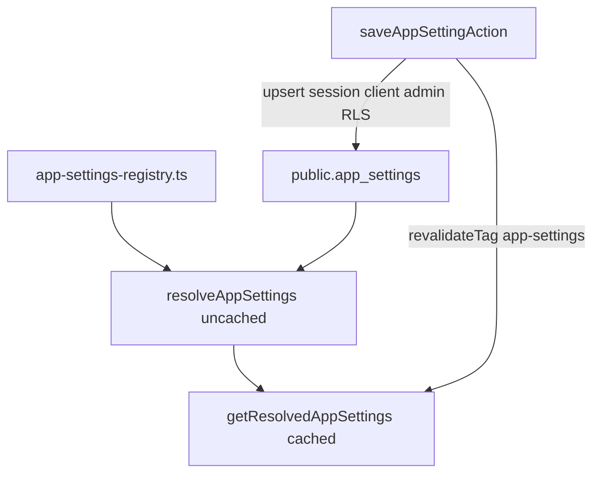

# Phase 12 Epic 1 — App settings store (revised)

> **Track progress:** as you complete each step, update the corresponding `todos` entry's `status` to `completed` in this plan's frontmatter.

> **Precondition:** confirm `git branch --show-current` outputs `phase-12/observability-app-settings`. If it doesn't match, halt and ask the user — do not switch branches.

> **Precondition:** `git status --porcelain` must be empty before the first implementation edit. If dirty, halt and ask the user to commit or stash. The epic must land as a single commit containing only this epic's work — `code-review` derives its range from that commit.

**Branch:** already on `phase-12/observability-app-settings` (correct for Phase 12).

**No hard-constraint changes** — no auth-boundary, admin-gate, or new `check:*` scripts in this epic.

**Human step after migration SQL:** review the file, then run `pnpm db:push` and `pnpm db:types` before the quality gate (agents write SQL only per [do-migrations-agent.mdc](.cursor/rules/do-migrations-agent.mdc)). If `pnpm db:types` has not been run, halt and ask the user.

**No admin page in this epic** — Epic 2 consumes the registry, read helpers, and save action built here.

---

## Context

Phase 12 needs a generic settings store before logging, retention, and admin UI land. Epic 1 delivers the registry (code is source of truth for *what* settings exist), a persisted value table (source of truth for *overrides*), and ADR-0006's coarse tagged cache for reads with tag invalidation on save.

Two seed settings (from [`.mockups/admin_settings_page.html`](.mockups/admin_settings_page.html)):

| Key | Type | Default | Group |
| --- | --- | --- | --- |
| `min_log_level` | enum: `debug` \| `info` \| `warn` \| `error` | `info` | Logging |
| `log_retention_days` | positive integer (days) | `30` | Logging |



### Read-path split (important)

Success criteria require **non-admins cannot read or write settings** at the trust boundary. Epic 3's log wrapper will need `min_log_level` on every request (including non-admin traffic) — that is a **server-internal** read, not an exposed settings API.

| Path | Client | Who can call | RLS |
| --- | --- | --- | --- |
| Cached merge read | `createServiceClient()` inside `unstable_cache` via `getResolvedAppSettings()` | Next.js server helpers with request context | Bypassed — never returned to browsers |
| Uncached merge read | `createServiceClient()` via `resolveAppSettings()` | Callers with no Next.js request context (admin CLI scripts, Epic 3.3/3.4) | Bypassed — never returned to browsers |
| Admin save | `createClient()` (session) after `assertAdminCaller` | Admins only | Admin-only policies enforce |
| Direct Supabase query | Browser / arbitrary session client | Blocked for non-admins | Admin-only SELECT |

Do **not** expose a server action or route that returns settings to non-admin callers. Epic 2's admin page will call an admin-gated read path.

---

## Step 1 — Registry and types (Story 1.1)

**New files:**

| File | Purpose |
| --- | --- |
| [`src/types/app-settings.ts`](src/types/app-settings.ts) | Setting key union, value types, resolved setting shapes |
| [`src/config/app-settings-registry.ts`](src/config/app-settings-registry.ts) | Declarative registry: key, label, description, `valueType`, `default`, `group` |
| [`src/constants/app-settings.ts`](src/constants/app-settings.ts) | `APP_SETTINGS_CACHE_TAG = 'app-settings'` (matches ADR-0006) |
| [`src/utils/app-settings-schema.ts`](src/utils/app-settings-schema.ts) | Zod parsers — sole location for setting value validation |

**Registry shape** — discriminated by `valueType`:

- `log_level` — allowed values `['debug', 'info', 'warn', 'error']`; export a `LOG_LEVELS` const array and ordering helper (`logLevelRank`) for Epic 3 threshold checks (define now, used later).
- `positive_int` — for retention days; validate `Number.isInteger(n) && n > 0` at save boundary.

Export from registry:

- `APP_SETTINGS_REGISTRY` — readonly array (order = render order within group)
- `isAppSettingKey(key: string): key is AppSettingKey`
- `getRegistryEntry(key)` — throws or returns undefined for unknown keys
- Group constant `APP_SETTINGS_GROUP_LOGGING = 'Logging'` for Epic 2 headings

Export from [`src/utils/app-settings-schema.ts`](src/utils/app-settings-schema.ts):

- `parseAppSettingValue(key, raw)` — dispatches on registry `valueType`
- Reject keys not in registry before touching the DB

No DB migration yet — registry and schema are pure TypeScript.

---

## Step 2 — Migration: `public.app_settings` (Story 1.2)

Use the [create-migration skill](.cursor/skills/create-migration/SKILL.md):

1. `date -u +%Y%m%d%H%M%S` → must sort after `20260715175218`
2. One file: `supabase/migrations/{timestamp}_create_app_settings.sql`

**Table and RLS enablement** — `enable row level security` is explicit in the migration DDL block, not implied by skill conventions:

```sql
create table public.app_settings (
  key text not null,
  value jsonb not null,
  updated_at timestamptz not null default now(),
  primary key (key)
);

alter table public.app_settings enable row level security;
```

- `comment on table` — admin-editable runtime configuration values; keys must exist in the code registry.
- **No seed rows** — absent keys fall back to registry defaults at read time.
- Index: PK on `key` is sufficient (small table).

**RLS policies** — admin-only, one policy per operation ([`supabase-sql.mdc`](.cursor/rules/supabase-sql.mdc)), defined after the `enable row level security` statement:

```sql
(select auth.jwt() -> 'app_metadata' ->> 'role') = 'admin'
```

Policies: SELECT, INSERT, UPDATE for `authenticated` only. No DELETE policy (values are upserted, not removed). No anon access.

**Grants:** default table grants for authenticated; RLS gates actual access.

---

## Step 3 — Read layer: cached and uncached (Stories 1.2 + 1.3)

**New file:** [`src/utils/app-settings.ts`](src/utils/app-settings.ts)

Implement:

1. **`fetchAppSettingsRows()`** (private) — `createServiceClient().from('app_settings').select('key, value')`; map to `Record<AppSettingKey, unknown>`.
2. **`resolveAppSettings()`** (public, uncached) — calls `fetchAppSettingsRows()`, merges each registry entry with DB value or `default`, parses/coerce DB jsonb through `parseAppSettingValue` from [`app-settings-schema.ts`](src/utils/app-settings-schema.ts). Corrupt DB values fail loudly (fault) rather than silently pass through. **This is the read path for callers with no Next.js request context** — admin CLI scripts (Epic 3.3) and direct threshold reads at process startup (Epic 3.4).
3. **`getResolvedAppSettings()`** (public, cached) — `unstable_cache(resolveAppSettings, ['app-settings-snapshot'], { tags: [APP_SETTINGS_CACHE_TAG] })`. Used by Next.js server code within request context (Epic 3 request wrapper, Epic 6 purge job when running inside Next).
4. **`getAppSetting(key)`** — `getResolvedAppSettings()` then return typed value for one key.

**Do not** call `revalidatePath` — ADR-0006 uses tag invalidation only.

Re-export `APP_SETTINGS_CACHE_TAG` from constants if callers need it (save action).

---

## Step 4 — Save server action (Stories 1.2 + 1.3)

**New file:** [`src/app/admin/settings/_lib/actions.ts`](src/app/admin/settings/_lib/actions.ts) (`'use server'`)

Pattern: [`assertAdminCaller`](src/app/admin/users/_lib/assert-admin-caller.ts) + typed envelope per [`error-handling.mdc`](.cursor/rules/error-handling.mdc).

**`saveAppSettingAction(input: unknown)`:**

1. `assertAdminCaller()` — return `FORBIDDEN` envelope on failure
2. Parse `{ key, value }` from input (zod object: `key` must be `AppSettingKey`, `value` unknown)
3. `isAppSettingKey(key)` — else `VALIDATION_ERROR` ("Unknown setting")
4. `parseAppSettingValue(key, value)` — else `VALIDATION_ERROR` with user-safe message
5. Upsert via session `createClient()`: `.from('app_settings').upsert({ key, value: parsedValue, updated_at: new Date().toISOString() })`
6. `revalidateTag(APP_SETTINGS_CACHE_TAG)` from `next/cache`
7. Return `{ success: true, data: { key, value } }`

Reuse `UsersActionError` types from assert-admin-caller or define a narrow `SettingsActionError` alias — keep codes consistent (`FORBIDDEN`, `VALIDATION_ERROR`, `INTERNAL_ERROR`).

No `revalidatePath` — no settings page route yet.

---

## Step 5 — Tests and docs (all success criteria)

**Unit tests** (new files alongside sources):

| File | Cases |
| --- | --- |
| `src/config/app-settings-registry.unit.test.ts` | Both seed settings present; defaults match mockup; unknown key rejected |
| `src/utils/app-settings.unit.test.ts` | Merge via `resolveAppSettings()`: no DB row → default; row present → stored value; heterogeneous types coexist |
| `src/app/admin/settings/_lib/actions.unit.test.ts` | Non-admin → `FORBIDDEN`; unknown key → `VALIDATION_ERROR`; invalid value shape → `VALIDATION_ERROR`; admin happy path upserts and asserts `revalidateTag` is called with `APP_SETTINGS_CACHE_TAG` |

Mock Supabase at module boundary (`vi.mock('@/supabase/server')`, `vi.mock('@/supabase/service')`) following [`list-admin-users.unit.test.ts`](src/app/admin/users/_lib/list-admin-users.unit.test.ts) / [`actions.unit.test.ts`](src/app/admin/users/actions.unit.test.ts) patterns.

Mock `next/cache` `revalidateTag` and `unstable_cache` (pass-through wrapper in tests).

**AGENTS.md** — after the migration lands, run `/sync-repo-docs` to update the Data model table and migration count (do not hand-edit AGENTS.md).

**Types:** [`src/types/database.types.ts`](src/types/database.types.ts) — regenerated by human via `pnpm db:types`; do not hand-edit.

---

## Epic success criteria checklist

Before commit, confirm:

- [ ] Reading an unset setting returns its registry default; reading a set one returns the stored value
- [ ] Save action calls `revalidateTag` with the `app-settings` tag
- [ ] `min_log_level` (string enum) and `log_retention_days` (number) coexist in one table without schema change
- [ ] Key absent from registry cannot be written (validation before DB)
- [ ] Non-admin save returns `FORBIDDEN`; no server action exposes settings reads to non-admins
- [ ] `pnpm pre-push` green

---

### Verification

Quality bar — same commands as [WORKFLOW_GUIDE Step 5 exit condition](docs/WORKFLOW_GUIDE.md). Stop on failure:

```bash
pnpm type-check && pnpm lint && pnpm format-check && pnpm test:ci
```

### Commit epic

Authorized by this approved plan:

1. Review diff; stage only files in scope for this epic.
2. Write a conventional commit message. It **must** end with an `Epic:` git trailer:

   ```
   feat(phase-12): app settings store with registry and cached reads

   Epic: 12.1
   ```

3. Commit (request `git_write`). Pre-commit hook runs automatically — if it fails, **fix and retry the commit**.
4. Verify `git status --porcelain` is empty after commit.

**Do not push** — push remains `ship-phase`.

### Handoff

Epic 12.1 committed. Next: open a new agent window and run `/code-review`.
