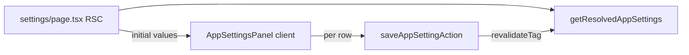

# Phase 12 Epic 2 — Settings admin page

> **Track progress:** as you complete each step, update the corresponding `todos` entry's `status` to `completed` in this plan's frontmatter.

> **Precondition:** `git status --porcelain` must be empty before the first implementation edit. If dirty, halt and ask the user to commit or stash. The epic must land as a single commit containing only this epic's work — `code-review` derives its range from that commit. (There is currently an untracked `.cursor/plans/phase_12_epic_1_app_settings_store.plan.md` — stash, commit, or delete it before starting.)

**Branch:** already on `phase-12/observability-app-settings` (correct for Phase 12; Epic 1 is `Complete`, so no kickoff gate).

**No hard-constraint changes** — `/admin/settings` is protected by the existing auth boundary and admin proxy gate; no new `check:*` scripts or migrations.

**Human step:** none — Epic 1 migration is already landed; no `db:push` / `db:types` in this epic.

**Consumes Epic 1:** registry ([`src/config/app-settings-registry.ts`](src/config/app-settings-registry.ts)), cached reads ([`getResolvedAppSettings`](src/utils/app-settings.ts)), save action ([`saveAppSettingAction`](src/app/admin/settings/_lib/actions.ts)). Do not add a public settings read API — the page is a Server Component on an admin-only route.

---

## Context

Epic 2 story **2.1** delivers the admin UI mockup at [`.mockups/admin_settings_page.html`](.mockups/admin_settings_page.html): page title + subtitle, group headings, card of setting rows (label, description, monospace key, typed control, per-row Save), toast on success.



**Read path:** Server page calls `getResolvedAppSettings()` and passes resolved values to a client panel. Non-admins never reach `/admin/**` (proxy + `AdminAuthGate`); this is not an exposed read action — consistent with Epic 1's trust-boundary design.

**Save model:** Explicit per-row Save → toast ([`forms.mdc`](.cursor/rules/forms.mdc) / [`notifications.mdc`](.cursor/rules/notifications.mdc)). Not blur-save.

**Registry-driven:** Iterate `APP_SETTINGS_REGISTRY`, group by `entry.group`, switch control on `entry.valueType` (`log_level` → Select, `positive_int` → number Input). A future registry entry auto-renders with no page-code change.

---

## Step 1 — Admin route plumbing

**Update** [`src/constants/admin-paths.ts`](src/constants/admin-paths.ts):

- Add `ADMIN_SETTINGS = '/admin/settings'`.

**Update** admin chrome (mirror Users patterns):

| File | Change |
| --- | --- |
| [`src/app/admin/_components/admin-sidebar.tsx`](src/app/admin/_components/admin-sidebar.tsx) | Add Settings nav item (`Settings` icon from lucide) pointing to `ADMIN_SETTINGS` |
| [`src/app/admin/_components/admin-breadcrumb.tsx`](src/app/admin/_components/admin-breadcrumb.tsx) | Add `settings: 'Settings'` to `BREADCRUMB_LABELS` |
| [`src/app/admin/page.tsx`](src/app/admin/page.tsx) | Add dashboard card linking to Settings (same card pattern as Users) |

**Update tests** for sidebar and breadcrumb to assert the new link/label (extend existing unit tests — do not add render-only page tests).

---

## Step 2 — Settings page shell (server)

**New** [`src/app/admin/settings/page.tsx`](src/app/admin/settings/page.tsx):

- `metadata.title = 'Settings'`
- Single `<h1>Settings</h1>` + subtitle matching mockup copy ("Runtime configuration. Changes take effect immediately, no redeploy.")
- `const settings = await getResolvedAppSettings()`
- Render client panel with `initialSettings={settings}`

Layout matches [`src/app/admin/users/page.tsx`](src/app/admin/users/page.tsx) (`flex flex-col gap-6`, title block + content).

---

## Step 3 — Registry-driven panel and per-row save (client)

**New** [`src/app/admin/settings/_components/app-settings-panel.tsx`](src/app/admin/settings/_components/app-settings-panel.tsx) (`'use client'`):

- Accept `initialSettings: ResolvedAppSettings` and hold a saved snapshot (initialized from it; update per key via each row's `onSaved`)
- Group registry entries by `group` (inline `Map` or small local helper in `_lib/` — no shared abstraction unless reused)
- Per group: `<h2>` heading + [`Card`](src/components/ui/card.tsx) containing rows; pass each row `savedValue` from the snapshot and `onSaved` to update it

**New** [`src/app/admin/settings/_components/app-setting-row.tsx`](src/app/admin/settings/_components/app-setting-row.tsx):

- Props: registry `entry`, `savedValue`, `onSaved(key, value)` callback so the panel can update its saved snapshot for that key
- **Draft state is row-local:** initialize `draft` from the `savedValue` prop; after a successful save, reset `draft` from the updated `savedValue` (panel updates the prop via `onSaved`; row syncs when the prop changes)
- Copy block: label (`font-medium`), description (`text-muted-foreground`), key (`font-mono text-xs text-muted-foreground`) — match mockup structure with semantic tokens
- **Control by `valueType`:**
  - `log_level` — shadcn [`Select`](src/components/ui/select.tsx) over `LOG_LEVELS` (display lowercase values per mockup); associate with [`Label`](src/components/ui/label.tsx)
  - `positive_int` — [`Input`](src/components/ui/input.tsx) `type="number"` `min={1}`; an empty or non-numeric input disables Save (treated as unchanged/invalid) — do not parse to `NaN` and call `saveAppSettingAction`
- **Save button** — disabled when draft equals `savedValue`, when the `positive_int` draft is empty/non-numeric, or while in-flight for that key
- On click: call `saveAppSettingAction({ key, value })`
  - Success: call `onSaved` with the returned value, reset `draft` from the updated `savedValue`, `showSuccessToast(\`${entry.label} saved\`)` ([`app-toast.ts`](src/utils/app-toast.ts))
  - Failure: set row-level error, render [`AppErrorSurface`](src/components/app-error-surface.tsx) below the control (operational/fault from envelope)
- Only the clicked row saves — no batch submit

**Optional thin helper** [`src/app/admin/settings/_lib/group-registry-entries.ts`](src/app/admin/settings/_lib/group-registry-entries.ts) if grouping logic exceeds ~10 lines in the panel; otherwise keep inline.

---

## Step 4 — Tests and docs

**Component / integration tests** (behavior-focused, mock `saveAppSettingAction`):

| File | Cases |
| --- | --- |
| `src/app/admin/settings/_components/app-settings-panel.unit.test.tsx` | Both seed settings render under "Logging" heading with correct labels/keys; log level select shows current value; retention input shows current value |
| `src/app/admin/settings/_components/app-setting-row.unit.test.tsx` (or fold into panel test) | Save calls action with correct key/value; success toast + updated display; validation error renders `AppErrorSurface`; Save disabled when unchanged; `positive_int` row disables Save when input is cleared or non-numeric |

Follow [`users-table.unit.test.tsx`](src/app/admin/users/_components/users-table.unit.test.tsx) mocking patterns for server actions and `showSuccessToast`.

**Docs:** run [`/sync-repo-docs`](.cursor/skills/sync-repo-docs/SKILL.md) to add `/admin/settings` to AGENTS.md admin console prose (route, sidebar nav, settings page behavior). Do not hand-edit AGENTS.md.

---

## Epic success criteria checklist

Before commit, confirm:

- [ ] Every registry setting renders with a control matching its `valueType`, showing live resolved value (or default when unset)
- [ ] Saving one row persists only that setting and shows a success toast
- [ ] A hypothetical new registry entry would render a new row without editing page composition logic (verify by reading the map/switch — no hardcoded key list in the page)
- [ ] `/admin/settings` is unreachable to non-admins (existing proxy gate — no new enforcement needed)
- [ ] `pnpm pre-push` green

---

### Verification

This epic adds a new route and new markup, so hard-constraint checks (`check:a11y-structure`, `check:a11y-contrast`, `check:semantic-tokens`, and the rest of the pre-push mirror) must run before commit — not just `type-check` / `lint` / `format-check` / `test:ci`. Stop on failure:

```bash
pnpm pre-push
```

### Commit epic

Authorized by this approved plan:

1. Review diff; stage only files in scope for this epic.
2. Write a conventional commit message. It **must** end with an `Epic:` git trailer:

   ```
   feat(phase-12): admin settings page with per-row save

   Epic: 12.2
   ```

3. Commit (request `git_write`). Pre-commit hook runs automatically — if it fails, **fix and retry the commit**.
4. Verify `git status --porcelain` is empty after commit.
5. Record the epic commit SHA: `git rev-parse HEAD` — keep this value for the handoff close-out.

**Do not push** — push remains `ship-phase`.

### Handoff

Epic 12.2 committed at `<sha>`. Next: open a new agent window and run `/code-review` against that baseline.
