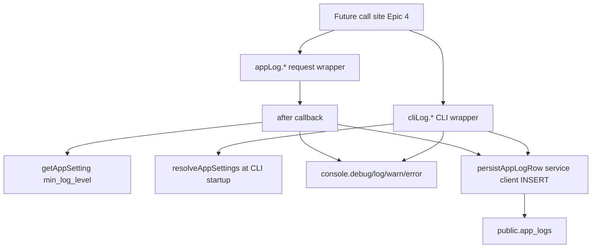

# Phase 12 Epic 3 — Log persistence

> **Track progress:** as you complete each step, update the corresponding `todos` entry's `status` to `completed` in this plan's frontmatter.

> **Precondition:** `git status --porcelain` must be empty before the first implementation edit. If dirty, halt and ask the user to commit or stash. The epic must land as a single commit containing only this epic's work — `code-review` derives its range from that commit. (There are currently untracked plan files under `.cursor/plans/` — stash, commit, or delete them before starting.)

**Branch:** already on `phase-12/observability-app-settings` (correct for Phase 12).

**No hard-constraint changes** — no new `check:*` scripts, no auth-boundary or admin-gate edits.

**Human step after migration SQL:** review the file, then run `pnpm db:push` and `pnpm db:types` before the quality gate (agents write SQL only per [do-migrations-agent.mdc](.cursor/rules/do-migrations-agent.mdc)). If types are stale, halt and ask the user.

**No call-site sweep in this epic** — Epic 4 migrates existing `console.*` sites. Epic 3 delivers the infrastructure and proves it via unit tests.

**No admin logs page** — Epic 7/8 consume the table.

---

## Context

Epics 1–2 shipped the settings store ([`src/utils/app-settings.ts`](src/utils/app-settings.ts), [`src/config/app-settings-registry.ts`](src/config/app-settings-registry.ts)). Epic 3 adds durable log rows and a wrapper that mirrors today's `console.*` behavior plus a persisted write, gated by `min_log_level`.



### Threshold read split (confirm PRD open item)

| Variant | Threshold source | Rationale |
| --- | --- | --- |
| Request wrapper | [`getAppSetting('min_log_level')`](src/utils/app-settings.ts) via tagged cache — **inside the `after` callback** | Next.js server contexts; propagates admin saves on next read after cache invalidation |
| CLI wrapper | [`resolveAppSettings()`](src/utils/app-settings.ts) once at module init (lazy on first call) | No Next cache in short-lived CLI processes; direct service read is harmless |

Reuse existing [`logLevelRank`](src/config/app-settings-registry.ts) for gating: skip when `logLevelRank(eventLevel) < logLevelRank(threshold)`.

### Console mapping (preserve [`logging.mdc`](.cursor/rules/logging.mdc))

| Level | Console method | Persisted `level` column |
| --- | --- | --- |
| debug | `console.debug` | `debug` |
| info | `console.log` | `info` |
| warn | `console.warn` | `warn` |
| error | `console.error` | `error` |

Keep bracket tags in console output for Vercel searchability: `` `[${tag}] ${message}` `` with optional context as a second argument (same as today).

---

## Step 1 — Types and migration (Story 3.1)

### Types — [`src/types/app-logs.ts`](src/types/app-logs.ts)

- Re-export `LogLevel` from [`src/types/app-settings.ts`](src/types/app-settings.ts) (single source of truth).
- `AppLogContext` — `Record<string, unknown> | null` (stored jsonb).
- `AppLogInsert` — `{ level, tag, message, context }` shape for the persist helper.

### Migration — use [create-migration skill](.cursor/skills/create-migration/SKILL.md)

1. Run `date -u +%Y%m%d%H%M%S`; confirm sort after `20260716041928`.
2. One file: `supabase/migrations/{timestamp}_create_app_logs.sql`

**Table `public.app_logs`:**

| Column | Type | Notes |
| --- | --- | --- |
| `id` | `bigint generated always as identity primary key` | Cursor paging tiebreaker for Epic 7 |
| `level` | `text not null` | Check: `debug`, `info`, `warn`, `error` |
| `tag` | `text not null` | Kebab-case source; required at API boundary |
| `message` | `text not null` | Human-readable line |
| `context` | `jsonb` | Nullable; errors and structured data live here |
| `created_at` | `timestamptz not null default now()` | Sort key (with `id` tiebreaker) |

**Defer to later epics:** `read_at` (Epic 8 triage), UPDATE policies (Epic 8 mark-as-read), pg_cron purge (Epic 6).

**Indexes:**

```sql
create index app_logs_created_at_id_idx on public.app_logs (created_at desc, id desc);
```

Epic 7 cursor paging uses the **`(created_at, id)` pair**, not `created_at` alone — rows inserted in one transaction share the same `now()` exactly and need `id` as a stable tiebreaker.

**RLS** — admin read only; writes bypass RLS via service client (same pattern as settings cache reads in Epic 1):

```sql
alter table public.app_logs enable row level security;

create policy "App logs are readable by admin"
on public.app_logs for select to authenticated
using ((select auth.jwt() -> 'app_metadata' ->> 'role') = 'admin');
```

No INSERT/UPDATE/DELETE policies for `authenticated` — only the service role inserts rows.

**Human:** `pnpm db:push` then `pnpm db:types` before quality gate.

---

## Step 2 — Shared persist helper

**New file:** [`src/utils/persist-app-log.ts`](src/utils/persist-app-log.ts)

Responsibilities:

- `normalizeLogContext(context?: unknown): AppLogContext` — `Error` → `{ name, message, stack }`; plain objects pass through; `undefined` → `null`. Never throw at normalize time. **Insert-time safety:** after building the context object, verify it round-trips through `JSON.stringify` / `JSON.parse`; if it doesn't, substitute `{ unserializable: String(context) }`.
- `persistAppLogRow(input: AppLogInsert): Promise<void>` — `createServiceClient().from('app_logs').insert({...})`; catch/log failures with `console.error('[persist-app-log] …', error)` and **never rethrow** (silent-drop transport model from PRD).

**Guardrail note:** `persistAppLogRow`'s internal `console.error` is a deliberate raw-console site — the persist path cannot log through the wrapper without recursion. Epic 5's guardrail must exempt this call site.

This module is the only DB write path for logs in Epic 3.

---

## Step 3 — Request wrapper (Stories 3.2 + 3.4)

**New file:** [`src/utils/app-logger.ts`](src/utils/app-logger.ts)

Export a frozen object `appLog` with sync **void** methods:

```typescript
appLog.debug(tag: string, message: string, context?: unknown): void
appLog.info(tag: string, message: string, context?: unknown): void
appLog.warn(tag: string, message: string, context?: unknown): void
appLog.error(tag: string, message: string, context?: unknown): void
```

**Implementation contract:**

1. **Do not** wrap the body in an async IIFE that awaits the threshold before calling `after()`.
2. Each `appLog.*` method calls `after()` from `next/server` **synchronously as its first statement**. Method signatures stay sync void; call sites never await.
3. **Inside the `after` callback:** read threshold via `getAppSetting('min_log_level')`; if below threshold, return immediately (no console, no persist); otherwise mirror to the matching `console.*` with `` `[${tag}] ${message}` `` formatting, then `await persistAppLogRow({ level, tag, message, context: normalizeLogContext(context) })`.

   ```typescript
   after(async () => {
     const threshold = await getAppSetting('min_log_level')
     if (logLevelRank(level) < logLevelRank(threshold)) return
     // console mirror, then await persistAppLogRow(...)
   })
   ```

4. **No try/catch fallback** around `after()` and no `void persistAppLogRow(...)` degradation path. Production carries no fallback. Unit tests mock `after` from `next/server` and assert the callback's behavior directly.

**Supported contexts:** `appLog` is for Next.js server contexts that have the data cache — server components, server actions, and route handlers. It is **not** usable from [`proxy.ts`](proxy.ts) / middleware, which has no `unstable_cache`. Epic 4's sweep must exclude proxy call sites or handle them separately. Epic 3 delivers **no middleware-safe variant** (Epic 9's proxy seam logging will need its own approach).

**Do not** migrate existing call sites in this epic. The wrapper must be importable and testable in isolation.

---

## Step 4 — CLI wrapper (Stories 3.3 + 3.4)

**New file:** [`src/utils/app-logger-cli.ts`](src/utils/app-logger-cli.ts)

Export `cliLog` with **async** methods returning `Promise<void>`:

```typescript
cliLog.info(tag: string, message: string, context?: unknown): Promise<void>
// … debug, warn, error
```

**Implementation contract:**

1. Lazy-load threshold once: first call runs `resolveAppSettings()` and caches `min_log_level` for the process lifetime.
2. Same level gate and console mirror as the request wrapper.
3. **Await** `persistAppLogRow` before resolving — no `after()`.
4. Epic 4 will add `await cliLog.*` at CLI call sites; for now tests prove persistence by awaiting directly.

Keep CLI env loading out of this module — it only imports [`resolveAppSettings`](src/utils/app-settings.ts) (already uses service client + env).

---

## Step 5 — Tests and docs

### Unit tests

| File | Coverage |
| --- | --- |
| [`src/utils/persist-app-log.unit.test.ts`](src/utils/persist-app-log.unit.test.ts) | Happy insert; `Error` context normalization; non-JSON-serializable context → `{ unserializable: … }`; insert failure swallowed |
| [`src/utils/app-logger.unit.test.ts`](src/utils/app-logger.unit.test.ts) | Mock `after` to capture and invoke callback; below threshold → no console/persist; at/above → console + persist; threshold change reflected when `getAppSetting` mock changes |
| [`src/utils/app-logger-cli.unit.test.ts`](src/utils/app-logger-cli.unit.test.ts) | Awaited persist on success; below threshold skips; threshold loaded once from `resolveAppSettings` |

Mock boundaries only: `@/supabase/service`, `next/server` (`after`), `next/cache` + `@/utils/app-settings` as needed (follow [`app-settings.unit.test.ts`](src/utils/app-settings.unit.test.ts) patterns).

### Docs

Run [`/sync-repo-docs`](.cursor/skills/sync-repo-docs/SKILL.md) — add `public.app_logs` to AGENTS.md data model (6 → 7 migrations), note wrapper modules and admin-only SELECT RLS. Do **not** update `logging.mdc` yet (Epic 4/5 own that transition).

---

## Epic success criteria mapping

| Criterion | How verified |
| --- | --- |
| Below threshold → no console, no row | Unit tests on both wrappers (request: inside `after` callback) |
| Settings page level change affects next behavior | Unit test: mock `getAppSetting` returning different levels across callback invocations |
| No call site awaits request wrapper | Sync void signatures; tests call without await |
| Log survives response completing | Unit test mocks `after`, invokes callback, asserts persist runs inside it |
| CLI logs persist | Unit test awaits `cliLog.info` and asserts insert |
| Non-admins cannot read logs | RLS migration + AGENTS.md; no SELECT policy except admin |
| `pnpm pre-push` green | Quality gate |

---

### Verification

Quality bar — stop on failure:

```bash
pnpm type-check && pnpm lint && pnpm format-check && pnpm test:ci
```

(Requires human has run `pnpm db:push` and `pnpm db:types` so generated types include `app_logs`.)

### Commit epic

Authorized by this approved plan:

1. Review diff; stage only files in scope for this epic.
2. Write a conventional commit message. It **must** end with an `Epic:` git trailer:

   ```
   feat(phase-12): log persistence table and logger wrappers

   Epic: 12.3
   ```

3. Commit (request `git_write`). Pre-commit hook runs automatically — if it fails, **fix and retry the commit**.
4. Verify `git status --porcelain` is empty after commit.
5. Record the epic commit SHA: `git rev-parse HEAD`.

**Do not push** — push remains `ship-phase`.

### Handoff

Epic 12.3 committed at `<sha>`. Capture the epic baseline SHA (the commit immediately preceding this epic's commit) and pass both SHAs to `/code-review` in a new agent window.
