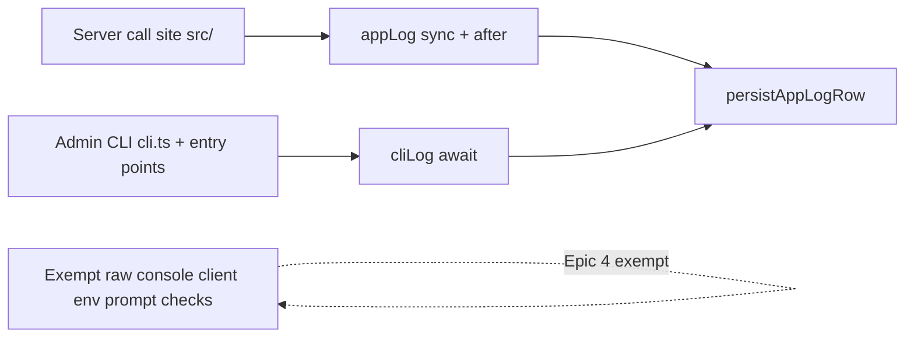

# Phase 12 Epic 4 — Console sweep

> **Track progress:** as you complete each step, update the corresponding `todos` entry's `status` to `completed` in this plan's frontmatter.

> **Precondition:** `git status --porcelain` must be empty before the first implementation edit. If dirty, halt and ask the user to commit or stash. The epic must land as a single commit containing only this epic's work — `code-review` derives its range from that commit. *(Currently dirty: untracked `.cursor/plans/phase_12_epic_1_app_settings_store.plan.md` and `phase_12_epic_2_settings_admin_page_4a7393c7.plan.md` — stash, commit, or delete before starting.)*

**Branch:** already on `phase-12/observability-app-settings` (correct for Phase 12).

**No hard-constraint changes** — Epic 5 adds the raw-console guardrail later. No migrations, no new routes, no `db:push`.

**Dependencies satisfied:** Epics 1–3 shipped [`appLog`](src/utils/app-logger.ts), [`cliLog`](src/utils/app-logger-cli.ts), and [`persistAppLogRow`](src/utils/persist-app-log.ts).

---

## Goal

Every **in-scope** server-side application log in `src/` and admin CLI scripts routes through a wrapper with an **explicit tag argument** (kebab-case, no brackets in the arg). Client-only modules, CLI env/prompt stdout, and CI hard-constraint scripts stay on plain `console.*` this epic.



---

## Step 1 — Fix the two non-conforming admin-user mutation sites

PRD calls out two patterns in the admin users mutation path that cannot be mechanically find-replaced:

| File | Today | Target |
| --- | --- | --- |
| [`run-admin-user-mutation.ts`](src/app/admin/users/_lib/run-admin-user-mutation.ts) | `` console.warn(`${logTag} ${email} — ${status}`) `` — tag embedded in message | `appLog.warn(logTag, `${email} — ${status}`)` |
| [`map-users-action-fault.ts`](src/app/admin/users/_lib/map-users-action-fault.ts) | `console.error(logTag, caught)` where the first arg is a full bracketed fault string | `appLog.error(logTag, logMessage, caught)` |

Split `mapUsersActionFault`'s misnamed first parameter into two parameters — **`logTag`** (bare kebab tag) and **`logMessage`** (bare fault message) — so the call site is `appLog.error(logTag, logMessage, caught)`.

Update callers in [`run-role-mutation.ts`](src/app/admin/users/_lib/run-role-mutation.ts) and [`run-ban-mutation.ts`](src/app/admin/users/_lib/run-ban-mutation.ts) to pass both:

- `logTag: 'users-promote'` (not `'[users-promote]'`)
- `logMessage: 'Failed to mutate user role'` (not `'[users-promote] Failed…'`)

Wire `run-admin-user-mutation.ts` to pass `logTag` and `logMessage` separately into `mapUsersActionFault`.

---

## Step 2 — Mark appLog server-only and sweep server-side `src/` call sites

Add `import 'server-only'` to [`app-logger.ts`](src/utils/app-logger.ts) so accidental client imports fail at build time.

Replace raw `console.*` with `appLog.{debug|info|warn|error}(tag, message, context?)` at server-side call sites. Split existing bracket prefixes into the tag arg; pass error objects as the context arg per logging conventions.

| File | Level(s) | Tag(s) |
| --- | --- | --- |
| [`require-auth.ts`](src/supabase/require-auth.ts) | error | `require-auth` |
| [`proxy.ts`](src/supabase/proxy.ts) | error | `proxy` |
| [`get-current-user-profile.ts`](src/app/(app)/_lib/get-current-user-profile.ts) | error | `app-shell` |
| [`profile/actions.ts`](src/app/(app)/_lib/profile/actions.ts) | error, warn | `profile-update` |
| [`admin/settings/_lib/actions.ts`](src/app/admin/settings/_lib/actions.ts) | error | `save-app-setting` |
| [`auth/confirm/route.ts`](src/app/auth/confirm/route.ts) | error | `auth-confirm` |
| Admin mutation path (Step 1) | warn, error | `users-promote`, `users-demote`, `users-ban`, `users-unban` |

**Leave exempt (document in [`logging.mdc`](.cursor/rules/logging.mdc); Epic 5 guardrail will mirror this list):**

- [`persist-app-log.ts`](src/utils/persist-app-log.ts) — recursion guard on persist failure
- [`app-log-console.ts`](src/utils/app-log-console.ts) — wrapper internals
- Test files that spy on `console.*`
- **Client-only call sites** (exempt pending a dedicated client-logging epic; `appLog` cannot run in client bundles because it imports `after()` from `next/server`):
  - [`src/app/(app)/error.tsx`](src/app/(app)/error.tsx)
  - [`src/app/admin/error.tsx`](src/app/admin/error.tsx)
  - [`src/app/auth/error.tsx`](src/app/auth/error.tsx)
  - [`src/utils/avatar-storage.ts`](src/utils/avatar-storage.ts)
  - [`src/utils/extract-auth-form-error.ts`](src/utils/extract-auth-form-error.ts)
- [`src/utils/env.ts`](src/utils/env.ts) (`loadServiceEnvForCli`) — sync function with unawaited callers; `env.ts` is reachable from the client bundle via [`src/supabase/client.ts`](src/supabase/client.ts)
- [`scripts/admin/lib/prompt.ts`](scripts/admin/lib/prompt.ts) — interactive prompt output is stdout UI, not application logging

Update [`logging.mdc`](.cursor/rules/logging.mdc) to document `appLog` / `cliLog`, the `server-only` constraint on `appLog`, and the exempt call sites above.

---

## Step 3 — Sweep admin CLI to `cliLog` (awaited)

Migrate [`scripts/admin/lib/cli.ts`](scripts/admin/lib/cli.ts) and the four entry-point catch blocks ([`promote-admin.ts`](scripts/admin/promote-admin.ts), [`demote-admin.ts`](scripts/admin/demote-admin.ts), [`delete-user.ts`](scripts/admin/delete-user.ts), [`list-admins.ts`](scripts/admin/list-admins.ts)).

- Replace `console.log` → `await cliLog.info`, `console.warn` → `await cliLog.warn`, `console.error` → `await cliLog.error`.
- Tags: `promote-admin`, `demote-admin`, `delete-user`, `list-admins`.
- Entry-point `.catch` handlers must `await cliLog.error(...)` before `process.exit(1)`.

**Do not touch:**

- `scripts/checks/*.mjs` — CI output, out of scope per PRD
- [`src/utils/env.ts`](src/utils/env.ts) / `loadServiceEnvForCli` — exempt (see Step 2)
- [`scripts/admin/lib/prompt.ts`](scripts/admin/lib/prompt.ts) — stdout UI, exempt (see Step 2)

---

## Step 4 — Tests

- Existing [`app-logger.unit.test.ts`](src/utils/app-logger.unit.test.ts) and [`app-logger-cli.unit.test.ts`](src/utils/app-logger-cli.unit.test.ts) should remain green — no behavior change to wrappers themselves.
- If any integration test spies on `console.*` at swept sites, update expectations to mock `appLog` / `cliLog` instead.

---

## Step 5 — Verification grep (manual, before quality gate)

Confirm zero raw `console.*` in swept surfaces:

```bash
rg 'console\.(log|debug|info|warn|error)' src/ scripts/admin/ --glob '!**/*.test.*' --glob '!**/app-log-console.ts' --glob '!**/persist-app-log.ts' --glob '!**/error.tsx' --glob '!**/avatar-storage.ts' --glob '!**/extract-auth-form-error.ts' --glob '!**/env.ts' --glob '!**/prompt.ts'
```

Expected: no matches (`scripts/checks/*.mjs` excluded entirely by scoping to `scripts/admin/` only).

---

## Out of scope (later epics)

- **Epic 5** — raw-console guardrail + AGENTS.md hard-constraint entry (will mirror Step 2 exempt list)
- **Dedicated client-logging epic** — migrate exempt client-only call sites off raw `console.*`
- **Epic 9** — new debug logs at session/settings/avatar seams (server-side additions, not part of this sweep)
- **Logs admin page** — Epics 7–8

---

### Verification

Quality bar — stop on failure:

```bash
pnpm type-check && pnpm lint && pnpm format-check && pnpm test:ci
```

### Commit epic

Authorized by this approved plan:

1. Review diff; stage only files in scope for this epic.
2. Write a conventional commit message. It **must** end with an `Epic:` git trailer:

   ```
   feat(phase-12): migrate application logs to appLog and cliLog wrappers

   Epic: 12.4
   ```

3. Commit (request `git_write`). Pre-commit hook runs automatically — if it fails, **fix and retry the commit**.
4. Verify `git status --porcelain` is empty after commit.
5. Record the resulting commit SHA — this is the **epic baseline SHA** for handoff.

**Do not push** — push remains `ship-phase`.

### Handoff

After the commit step, record:

- **Epic id:** `12.4`
- **Epic baseline SHA:** `<commit SHA from Commit epic step>`

Open a new agent window and run `/code-review` against that SHA.
