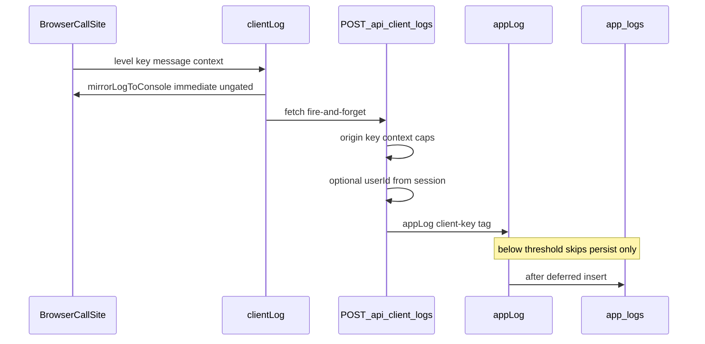

# Phase 12 Epic 5 — Client log relay (revised Step 6 + handoff)

> **Track progress:** as you complete each step, update the corresponding `todos` entry's `status` to `completed` in [`.cursor/plans/phase_12_epic_5_client_log_relay_97cc1656.plan.md`](.cursor/plans/phase_12_epic_5_client_log_relay_97cc1656.plan.md) frontmatter.

> **Precondition:** `git status --porcelain` must be empty before the first implementation edit. If dirty, halt and ask the user to commit or stash. The epic must land as a single commit containing only this epic's work — `code-review` derives its range from that commit.

**Branch:** already on `phase-12/observability-app-settings` (correct for Phase 12).

**Hard-constraint change required:** the relay must be reachable without a session ([ADR-0007](docs/adr/ADR-0007-client-log-relay-unauthenticated.md)). Adding `/api/client-logs` to the auth-boundary allowlist routes through the [AGENTS.md change protocol](AGENTS.md#change-protocol) — update the Hard constraints bullet, [LEXICON.md](LEXICON.md) auth-boundary entry, and [`proxy.unit.test.ts`](src/supabase/proxy.unit.test.ts) allowlist together with [`proxy.ts`](src/supabase/proxy.ts).

**No migrations, no `db:push`.** First API route in the repo.

**Dependencies satisfied:** Epics 1–4 shipped [`appLog`](src/utils/app-logger.ts), settings threshold, and the server console sweep.

---

## Goal

Browser call sites log through a **client wrapper** that prints immediately to the browser console and fire-and-forgets a POST to a **relay route handler**, which validates the payload and forwards to `appLog`. Five existing raw-`console.*` browser sites move onto the wrapper; importing the request wrapper or its persist chain from a client module is blocked by ESLint (and by `server-only` on `appLog` itself).



---

## Caps (settled)

| Bound | Value | Rationale |
| ----- | ----- | --------- |
| Message length | **2,000 characters** | Covers full error messages + stack snippets; tail truncated after parse |
| Context JSON size | **8,192 bytes** (serialized) | Common log-pipeline chunk size; large enough for `{ digest, email, stack }` |

When context exceeds the byte cap, drop keys in deterministic order until under the cap, then set `contextTruncated: true` on the resulting object.

---

## Steps 1–5 — unchanged

Steps 1–5 from the approved plan remain as written: registry, client wrapper, relay route, auth-boundary widening, browser sweep. See [`.cursor/plans/phase_12_epic_5_client_log_relay_97cc1656.plan.md`](.cursor/plans/phase_12_epic_5_client_log_relay_97cc1656.plan.md) for full detail.

---

## Step 6 — Server-only boundary (Story 5.4) — **revised**

**Do not** add `import 'server-only'` to [`persist-app-log.ts`](src/utils/persist-app-log.ts) or [`service.ts`](src/supabase/service.ts). Admin CLI scripts import the persist chain under plain Node (`node --import tsx scripts/admin/…`); `server-only` on those modules would break all four admin CLI scripts at import time.

Keep `import 'server-only'` on [`app-logger.ts`](src/utils/app-logger.ts) only — direct client import of `appLog already fails the Next.js build.

### ESLint approach: **default-deny with explicit server allowlist (approach a)**

**Why not client-surface globs (approach b):**

- The repo has **69** `'use client'` files, but client-reachable code is not coextensive with `'use client'` — e.g. [`extract-auth-form-error.ts`](src/utils/extract-auth-form-error.ts) has no directive yet is imported by auth forms.
- Confirmed real importers of [`avatar-storage.ts`](src/utils/avatar-storage.ts) live under **`src/app/(app)/_lib/profile/`** ([`use-profile-avatar-upload.ts`](src/app/(app)/_lib/profile/use-profile-avatar-upload.ts), [`profile-avatar-field.tsx`](src/app/(app)/_components/profile/profile-avatar-field.tsx)) — neither matches `src/components/**` or `src/hooks/**`.
- A broad glob like `src/app/**/_lib/**` would **false-positive** on server-only `_lib` modules that legitimately import `appLog` / `service` today ([`actions.ts`](src/app/(app)/_lib/profile/actions.ts), [`get-current-user-profile.ts`](src/app/(app)/_lib/get-current-user-profile.ts), [`run-admin-user-mutation.ts`](src/app/admin/users/_lib/run-admin-user-mutation.ts), etc.).

**Default-deny** applies `no-restricted-imports` to **`src/**/*.{ts,tsx}`** with an **`ignores` allowlist** of confirmed server-only import sites. Any new client file under `src/app/**/_lib/`, `src/app/**/_components/`, or elsewhere is covered automatically without config churn.

### Rule shape in [`eslint.config.mjs`](eslint.config.mjs)

Add a new config block (separate from the repo-wide shadcn restriction):

- **`files`:** `src/**/*.{ts,tsx}`
- **`ignores` (allowlist — may import `@/utils/app-logger`, `@/utils/persist-app-log`, `@/supabase/service`):**
  - Persist/logger chain: `src/utils/app-logger.ts`, `src/utils/persist-app-log.ts`, `src/utils/app-logger-cli.ts`, `src/supabase/service.ts`, `src/utils/app-settings.ts`
  - Server consumers (confirmed today): `src/supabase/require-auth.ts`, `src/supabase/proxy.ts`, `src/app/auth/confirm/route.ts`, `src/app/admin/users/actions.ts`, `src/app/admin/users/_lib/run-admin-user-mutation.ts`, `src/app/admin/users/_lib/map-users-action-fault.ts`, `src/app/(app)/_lib/get-current-user-profile.ts`, `src/app/(app)/_lib/profile/actions.ts`, `src/app/admin/settings/_lib/actions.ts`
  - Epic 5 relay: `src/app/api/client-logs/route.ts`
  - Test infrastructure: `**/*.{test,unit.test,integration.test}.{ts,tsx}`
  - Boundary fixture (excluded from normal lint — see below): `**/*.boundary.fixture.ts`
- **`rules.no-restricted-imports`:** ban `@/utils/app-logger`, `@/utils/persist-app-log`, `@/supabase/service` with a message pointing to `clientLog` / server-only surfaces.

`scripts/**` stays outside `src/**` — CLI import chain unaffected.

### Boundary fixture (required, not optional)

Add [`src/app/(app)/_lib/profile/client-server-boundary.fixture.ts`](src/app/(app)/_lib/profile/client-server-boundary.fixture.ts):

- `'use client'` directive (same territory as [`use-profile-avatar-upload.ts`](src/app/(app)/_lib/profile/use-profile-avatar-upload.ts))
- Intentional banned import, e.g. `import { appLog } from '@/utils/app-logger'`
- Excluded from normal lint via the rule block's `ignores` entry for `**/*.boundary.fixture.ts`

Add [`eslint.config.unit.test.ts`](eslint.config.unit.test.ts) (or equivalent under `scripts/checks/`) that runs ESLint programmatically **against the fixture path** (without the fixture ignore) and asserts `no-restricted-imports` reports violations. **If the restriction is removed, this test fails** — replacing the prior "optional comment-only fixture" note.

### Test-suite blind spot (unchanged)

[`server-only-stub.ts`](src/test/server-only-stub.ts) aliases over `server-only` in Vitest — do not rely on tests to catch `server-only` added to `persist-app-log.ts` or `service.ts`. ESLint default-deny + fixture test is the enforcement mechanism.

### Docs touch

Update [`logging.mdc`](.cursor/rules/logging.mdc) server-only section: `server-only` on `app-logger.ts` only; client/persist-chain boundary enforced by ESLint default-deny on `src/**` with server allowlist.

---

## Step 7 — Documentation — unchanged

README relay exposure + Vercel WAF example; regroup `logging.mdc` exemptions; correct Phase 12 PRD Notes; `/sync-repo-docs` for AGENTS auth boundary.

---

## Verification

```bash
pnpm type-check && pnpm lint && pnpm format-check && pnpm test:ci
pnpm check:auth-boundary
```

Manual smoke checklist unchanged (devtools client log, threshold gating, cross-origin curl 403, no Origin/Referer curl 403).

---

## Commit epic

1. Review diff; stage only files in scope for this epic.
2. Conventional commit message ending with:

   ```
   feat(phase-12): client log relay and browser sweep

   Epic: 12.5
   ```

3. Commit (request `git_write`). If pre-commit hook fails, fix and retry — do not amend a failed commit.
4. Verify `git status --porcelain` is empty after commit.
5. Record the resulting commit SHA — this is the **epic baseline** for `/code-review`.

**Do not push** — push remains `ship-phase`.

---

## Handoff — **revised**

**Before sending the handoff message:** after the commit-epic step records the actual commit SHA, **substitute that literal SHA value** into the handoff line below. The handoff **must not** be sent with the placeholder token still present.

Template (replace `PASTE_SHA_HERE` with the real SHA from step 5):

> Epic committed at baseline SHA `PASTE_SHA_HERE` (`Epic: 12.5`).
>
> Next: open a new agent window and run `/code-review` — it derives its range from epic **12.5** and that baseline commit.
