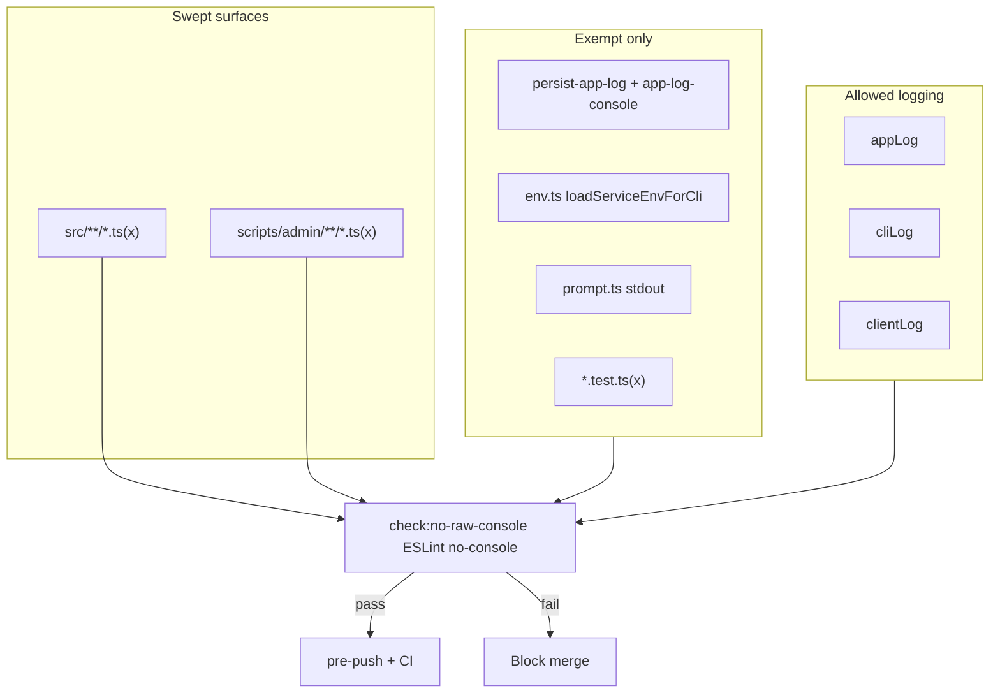

# Phase 12 Epic 6 — Raw console guardrail

> **Track progress:** as you complete each step, update the corresponding `todos` entry's `status` to `completed` in this plan's frontmatter.

> **Precondition:** `git status --porcelain` must be empty before the first implementation edit. If dirty, halt and ask the user to commit or stash. The epic must land as a single commit containing only this epic's work — `code-review` derives its range from that commit.

**Branch:** already on `phase-12/observability-app-settings` (correct for Phase 12).

**Hard-constraint change required:** Epic 6 adds a new AGENTS.md bullet paired with `check:no-raw-console` — routes through the [change protocol](AGENTS.md#change-protocol): constraint text + enforcement script + pre-push + CI together, never the list alone.

**No migrations, no routes, no `db:push`.** Enforcement-only epic; both sweeps (Epics 4 and 5) are complete.

**Dependencies satisfied:** All application call sites already route through `appLog`, `cliLog`, or `clientLog`. Remaining raw `console.*` in scope is exactly the exempt set documented in [logging.mdc](.cursor/rules/logging.mdc):

| Category | Files (today) |
| -------- | ------------- |
| Wrapper internals | [`persist-app-log.ts`](src/utils/persist-app-log.ts), [`app-log-console.ts`](src/utils/app-log-console.ts) |
| Bootstrap path | [`env.ts`](src/utils/env.ts) (`loadServiceEnvForCli`) |
| Not application logging | [`scripts/admin/lib/prompt.ts`](scripts/admin/lib/prompt.ts) |
| Test infrastructure | `**/*.{test,unit.test,integration.test}.{ts,tsx}` |
| CI output (out of ESLint scan scope) | `scripts/checks/*.mjs` |

---

## Goal

Lock in the console sweep with a deterministic guardrail so new raw `console.*` call sites cannot creep back into swept surfaces. The check fails on a planted violation and passes clean on the shipped codebase.



---

## Step 0 — Capture pre-epic baseline

Before any implementation edit:

```bash
git rev-parse HEAD
```

Record the output as the **epic baseline SHA** (pre-epic commit — the parent range `/code-review` diffs against). Write it into this plan body below this step so the Handoff section can reference it.

**Baseline at plan authoring:** `aa0c5ca3dc0c1eea1af567f7c292684583a9a2fd` — re-run Step 0 at implementation start; if HEAD differs, use the fresh SHA.

---

## Step 1 — ESLint enforcement block

Add a new config block in [`eslint.config.mjs`](eslint.config.mjs) following the same pattern as `check:no-shadcn-pkg` / `check:semantic-tokens`:

- **Scope:** `src/**/*.{ts,tsx}` and `scripts/admin/**/*.{ts,tsx}`
- **Rule:** ESLint built-in `no-console: error` (catches all `console.*` member calls)
- **Ignores (must mirror [logging.mdc](.cursor/rules/logging.mdc) exemption table exactly):**
  - `**/*.{test,unit.test,integration.test}.{ts,tsx}`
  - `src/utils/persist-app-log.ts`
  - `src/utils/app-log-console.ts`
  - `src/utils/env.ts`
  - `scripts/admin/lib/prompt.ts`
  - `src/**/raw-console-boundary.fixture.ts` (Step 3)

Do **not** scan `scripts/checks/*.mjs` — they are `.mjs`, outside this ESLint config, and deliberately stay on plain `console.*` per PRD out-of-scope.

Extract the `no-console` rule entry into a small exported helper (same pattern as [`eslint.config.unit.test.ts`](eslint.config.unit.test.ts) already uses for the server-only import rule) so the boundary test can apply the rule without duplicating config.

---

## Step 2 — Named check script + wiring

**package.json**

- Add script: `"check:no-raw-console": "eslint --max-warnings 0 --no-error-on-unmatched-pattern \"src/**/*.{ts,tsx}\" \"scripts/admin/**/*.{ts,tsx}\""`
- Insert into `pre-push` after `check:a11y-contrast` and before `lint` (same position in CI)

**CI:** add a named step in [`.github/workflows/pull-request.yaml`](.github/workflows/pull-request.yaml) — `Check no raw console` — matching pre-push order.

**AGENTS.md change protocol (constraint + enforcement together):**

Add a new bullet to § Hard constraints (after a11y contrast):

> **Application logging via wrappers** — application code in `src/` and admin CLI scripts under `scripts/admin/` must log through `appLog`, `cliLog`, or `clientLog`; raw `console.*` is allowed only at the exempt surfaces listed in `logging.mdc`. **Enforced:** `check:no-raw-console` (ESLint `no-console` with category-aligned exemptions).

Also add a row to the setup/commands table: `pnpm check:no-raw-console`.

**README.md:** add the command to the quality-commands table and update the CI sentence to include `check:no-raw-console` in the listed order.

**logging.mdc:** add one line under the exempt table header noting enforcement via `check:no-raw-console` — keeps the rule file and hard constraint linked for spinoffs adding new exempt surfaces.

---

## Step 3 — Boundary fixture + unit test

Add [`src/utils/raw-console-boundary.fixture.ts`](src/utils/raw-console-boundary.fixture.ts) containing a single planted `console.log(...)` — lint-excluded via the Step 1 ignores list, never imported by production code.

Extend [`eslint.config.unit.test.ts`](eslint.config.unit.test.ts):

1. **`should report no-console on the raw-console boundary fixture`** — apply the exported `no-console` rule block to the fixture; expect at least one `no-console` message.
2. **`should pass no-console on shipped swept paths`** — run ESLint with the rule block against a small set of known-good production files (e.g. [`src/supabase/proxy.ts`](src/supabase/proxy.ts), [`scripts/admin/lib/cli.ts`](scripts/admin/lib/cli.ts)) and expect zero `no-console` messages.

This satisfies PRD success criteria without a separate `.mjs` scanner — consistent with how `check:no-shadcn-pkg` and `check:semantic-tokens` delegate to ESLint while still giving test:ci a planted-violation proof.

---

## Step 4 — Manual smoke (before quality gate)

Temporarily add `console.log('smoke')` to a non-exempt swept file (e.g. [`src/supabase/proxy.ts`](src/supabase/proxy.ts)), confirm `pnpm check:no-raw-console` fails with a clear file/line message, revert, confirm pass. Do not commit the smoke edit.

Optionally confirm `scripts/checks/seo-base-url.mjs` still runs (its own `console.log`/`console.error` are out of scan scope).

---

## Verification

Quality bar — stop on failure:

```bash
pnpm type-check && pnpm lint && pnpm format-check && pnpm test:ci
```

Also run explicitly once after wiring:

```bash
pnpm check:no-raw-console
```

## Commit epic

Authorized by this approved plan:

1. Review diff; stage only files in scope for this epic.
2. Write a conventional commit message. It **must** end with an `Epic:` git trailer:

   ```
   feat(phase-12): raw console guardrail hard constraint

   Epic: 12.6
   ```

3. Commit (request `git_write`). Pre-commit hook runs automatically — if it fails, fix and retry the commit.
4. Verify `git status --porcelain` is empty after commit.

**Do not push** — push remains `ship-phase`.

## Handoff

Epic 12.6 committed. Baseline SHA: `aa0c5ca3dc0c1eea1af567f7c292684583a9a2fd`. Next: open a new agent window and run `/code-review`.

*(Substitute the SHA recorded in Step 0 if re-run at implementation start produced a different value.)*
