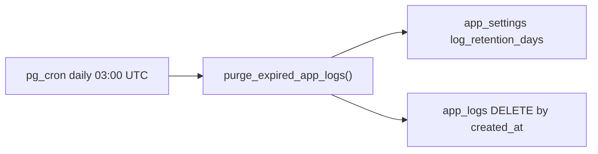

# Phase 12 Epic 7 — Log retention purge

> **Track progress:** as you complete each step, update the corresponding `todos` entry's `status` to `completed` in this plan's frontmatter.

> **Precondition:** `git status --porcelain` must be empty before the first implementation edit. If dirty, halt and ask the user to commit or stash. The epic must land as a single commit containing only this epic's work — `code-review` derives its range from that commit. **Currently dirty:** two untracked plan files under [`.cursor/plans/`](.cursor/plans/) — commit, stash, or delete them before starting.

**Branch:** already on `phase-12/observability-app-settings` (correct for Phase 12).

**Scope:** migration-only epic — no routes, no admin UI, no hard-constraint changes. Epic 1 shipped [`log_retention_days`](src/config/app-settings-registry.ts) (default `30`); Epic 3 shipped [`public.app_logs`](supabase/migrations/20260717234520_create_app_logs.sql). This epic wires the setting's second real consumer: a scheduled purge in Postgres.

**Dependencies satisfied:** Epics 1 (settings store) and 3 (log table) are `Complete`.

---

## Goal

Delete `app_logs` rows older than the retention window on a daily schedule. The window is read from `public.app_settings` at job runtime (registry default when unset), so an admin change on `/admin/settings` affects the next run with no migration or redeploy. Retention is uniform — no exemptions for CLI privilege-change logs.



---

## Step 1 — Migration: extension, purge function, cron schedule

Use the [create-migration skill](.cursor/skills/create-migration/SKILL.md):

1. Run `date -u +%Y%m%d%H%M%S`; confirm sort after `20260717234520`.
2. One file: `supabase/migrations/{timestamp}_schedule_app_logs_retention_purge.sql`

**Header:** purpose (scheduled log retention purge), affected objects (`pg_cron`, `public.purge_expired_app_logs`, `cron.job`), RLS note (function bypasses RLS as `security definer`; no new policies).

### Enable pg_cron

```sql
create extension if not exists pg_cron with schema extensions;
```

Supabase hosts `pg_cron` in the `extensions` schema; the migration enables it in source control per PRD story 7.1.

### Purge function — `public.purge_expired_app_logs()`

Follow [supabase-sql.mdc](.cursor/rules/supabase-sql.mdc) function conventions (match [`admin_list_users`](supabase/migrations/20260715003530_admin_list_users.sql)):

| Property | Value |
| -------- | ----- |
| Language | `plpgsql` |
| Security | `security definer` — must DELETE without an authenticated admin session |
| `search_path` | `set search_path = ''` — fully qualify `public.app_settings`, `public.app_logs` |
| Returns | `void` |
| Grants | `revoke all on function public.purge_expired_app_logs() from public` — no grant to `authenticated`/`anon`; only the cron runner invokes it |

**Retention resolution (mirror TypeScript merge logic in [`app-settings.ts`](src/utils/app-settings.ts)):**

1. Read `value` from `public.app_settings` where `key = 'log_retention_days'`.
2. Accept only when `jsonb_typeof(value) = 'number'` and `(value #>> '{}')::int > 0`.
3. Fall back to **`30`** when the row is absent or invalid — must stay in sync with the registry default in [`app-settings-registry.ts`](src/config/app-settings-registry.ts) (add a `-- debt:` comment in SQL naming the upgrade path if the default ever diverges).

**Delete:**

```sql
delete from public.app_logs
where created_at < now() - make_interval(days => v_retention_days);
```

Uses the existing [`app_logs_created_at_id_idx`](supabase/migrations/20260717234520_create_app_logs.sql) for the range scan. No `read_at` column yet (Epic 8) — delete by `created_at` only.

### Schedule the job

Idempotent pattern (re-running migration must not duplicate jobs or error when the job is absent):

```sql
do $$
begin
  if exists (select 1 from cron.job where jobname = 'purge-expired-app-logs') then
    perform cron.unschedule('purge-expired-app-logs');
  end if;
end $$;

select cron.schedule(
  'purge-expired-app-logs',
  '0 3 * * *',
  $$select public.purge_expired_app_logs();$$
);
```

Daily **03:00 UTC** — not specified in the PRD; a quiet off-peak default. Job name is stable for dashboard inspection in Supabase → Integrations → Cron.

**Human after migration lands:** review SQL, then `pnpm db:push` and `pnpm db:types` (function may appear in generated types; no app imports expected).

---

## Step 2 — Setup docs

**[`README.md`](README.md)** — extend the [Database migrations](README.md) section (after the existing push/types steps):

- Note that one migration enables the **`pg_cron`** extension and schedules the log retention purge.
- Point admins to **Log retention window** on `/admin/settings` as the live control (no redeploy).
- Mention verifying the job under Supabase Dashboard → Integrations → Cron (optional sanity check after first push).

**[`AGENTS.md`](AGENTS.md)** — run `/sync-repo-docs` after the migration file exists:

- Bump custom migration count to **8** and list the new file in [Data model](AGENTS.md#data-model-summary).
- Extend the `app_logs` row note: rows older than `log_retention_days` are purged daily by `pg_cron` via `purge_expired_app_logs()`.

No PRD or ROADMAP edits — epic not complete until `/mark-epic-complete` after code review.

---

## Step 3 — Manual verification (before commit)

After human `pnpm db:push`, confirm PRD success criteria in Supabase SQL editor or Studio:

1. **Job exists:** `select jobname, schedule from cron.job where jobname = 'purge-expired-app-logs';` — one row, schedule `0 3 * * *`.
2. **Old rows deleted:** insert two rows into `app_logs` (via service role or SQL) — one with `created_at = now() - interval '40 days'`, one with `created_at = now() - interval '1 day'`. Run `select public.purge_expired_app_logs();`. Only the 40-day row should be gone (default window 30).
3. **Setting changes window:** upsert `app_settings` with `log_retention_days = 7`. Insert a row at `now() - interval '10 days'`. Run purge again — that row should be deleted while the 1-day row remains.
4. **Newer rows survive:** confirm rows within the active window are untouched after each run.

No new Vitest files — the behavior lives entirely in SQL; the repo has no migration test harness and a mocked test would not exercise real purge semantics.

---

## Epic success criteria checklist

- [ ] Scheduled job exists after migrations run (`cron.job` row present)
- [ ] Rows older than the window are deleted; newer rows survive
- [ ] Changing `log_retention_days` changes what the next manual/cron run deletes — no migration or redeploy
- [ ] README notes the `pg_cron` extension
- [ ] `pnpm pre-push` green

---

### Verification

Quality bar — same commands as [WORKFLOW_GUIDE Step 5 exit condition](docs/WORKFLOW_GUIDE.md). Stop on failure:

```bash
pnpm type-check && pnpm lint && pnpm format-check && pnpm test:ci
```

### Commit epic

Authorized by this approved plan:

1. Review diff; stage only files in scope for this epic (migration + README + AGENTS.md from doc sync).
2. Write a conventional commit message. It **must** end with an `Epic:` git trailer:

   ```
   feat(phase-12): schedule app logs retention purge

   Epic: 12.7
   ```

3. Commit (request `git_write`). Pre-commit hook runs automatically — if it fails, **fix and retry the commit**.
4. Verify `git status --porcelain` is empty after commit.

**Do not push** — push remains `ship-phase`.

### Handoff

Epic **12.7** committed. Pre-epic baseline: `{BASELINE_SHA}` (recorded in the capture-baseline step — substitute the actual SHA before closing the implementing agent). Next: open a new agent window and run `/code-review`.
