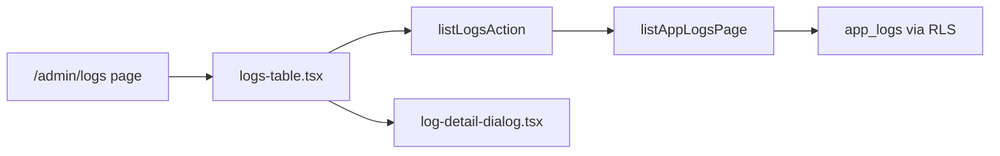

# Phase 12 Epic 8 — Logs page browse

> **Track progress:** as you complete each step, update the corresponding `todos` entry's `status` to `completed` in this plan's frontmatter.

> **Precondition:** `git status --porcelain` must be empty before the first implementation edit. If dirty, halt and ask the user to commit or stash. The epic must land as a single commit containing only this epic's work — `code-review` derives its range from that commit. **Currently dirty:** untracked plan files under [`.cursor/plans/`](.cursor/plans/) — commit, stash, or delete them before starting.

**Branch:** already on `phase-12/observability-app-settings` (correct for Phase 12).

**Scope:** application code only — no migration. [`public.app_logs`](supabase/migrations/20260717234520_create_app_logs.sql) and admin SELECT RLS already exist. Epic 9 adds filters, search, and read-state; **do not** ship those UI elements (mockup [`.mockups/admin_logs_page.html`](.mockups/admin_logs_page.html) shows the full vision — Epic 8 is the table + timestamp sort + pagination + modal detail only).

**Dependencies satisfied:** Epics 1–7 are `Complete`; log rows are being written and purged on schedule.

---

## Step 0 — Capture baseline

Before the first implementation edit, run `git rev-parse HEAD` and record the SHA in this plan (substitute `{BASELINE_SHA}` below). `code-review` uses it as the pre-epic baseline.

---

## Goal

Admins can browse persisted logs at `/admin/logs`: newest-first by default, cursor-paged table, row click opens a modal with full message and formatted context, copy affordance on both the collapsed row and inside the modal, and a timestamp header that toggles newest ↔ oldest. Only the timestamp column sorts — level, tag, and message headers are plain text.



---

## Architecture decisions

| Decision | Choice | Why |
| -------- | ------ | --- |
| Data fetch | Server Action + TanStack Query | Matches [`users-table.tsx`](src/app/admin/users/_components/users-table.tsx) pattern |
| DB access | Direct `.from('app_logs').select(...)` with session client | Admin RLS already gates SELECT; no RPC needed for unfiltered browse |
| Paging | Cursor on `(created_at, id)` with cursor stack | PRD requirement; offset paging ([`listAdminUsersPage`](src/app/admin/users/_lib/list-admin-users.ts)) would drift under concurrent inserts |
| Table UI | `DataTableShell` + `useDataTableShell` (TanStack Table), same pattern as [`users-table.tsx`](src/app/admin/users/_components/users-table.tsx) | Detail opens in a modal, not an inline expand — shell fits as-is with one optional prop |
| Row click → modal | **Option (a):** add optional `onRowClick?: (row: TData) => void` to [`DataTableShell`](src/components/data-table-shell.tsx) | PRD wants the whole row clickable; a single `TableRow` handler is the right seam. Prop is optional — [`UsersTable`](src/app/admin/users/_components/users-table.tsx) and the reference fixture table do not pass it, so their behavior is unchanged (no handler, no `cursor-pointer`). Column-level triggers (option b) would duplicate handlers across cells or shrink the click target to one column |
| Row detail | shadcn `Dialog` (`log-detail-dialog.tsx`) | Full message + context without inline expand; keeps table rows single-line |
| Pagination controls | Reuse [`DataTablePaginationControls`](src/components/data-table-pagination-controls.tsx) | Track `page = cursorStackIndex + 1`; `hasNextPage` from over-fetch-by-one (see below) |
| Copy UX | New `buildLogRowCopyText` — standalone helper (does **not** share or extend [`buildErrorCopyText`](src/components/error-panel.tsx); do not modify error-panel) | PRD 8.2: clipboard gets a pretty-printed JSON object of the full row; Copy → Copied **button** affordance matches [`ErrorPanel`](src/components/error-panel.tsx) on row **and** in modal |

### Cursor query shape

Index [`app_logs_created_at_id_idx`](supabase/migrations/20260717234520_create_app_logs.sql) matches `(created_at desc, id desc)`.

**Newest-first (desc), first page:** order `created_at desc, id desc`, `limit(perPage + 1)`.

**Newest-first, next page** with cursor `(t, id)`:

PostgREST compound filter — rows strictly before cursor:

`(created_at < t) OR (created_at = t AND id < cursorId)`

**Oldest-first (asc):** flip operators (`>` / `gt`) and order ascending.

Fetch explicit columns only (`id, level, tag, message, context, created_at`) — no `select('*')`.

**Over-fetch by one:** request `limit(perPage + 1)`. If `perPage + 1` rows return, set `hasNextPage = true`, drop the extra row, and return `perPage` rows; otherwise `hasNextPage = false` and return all rows fetched. This avoids ambiguous `hasNextPage` when the total row count is an exact multiple of `perPage`.

### Cursor stack (Previous/Next)

Maintain `cursorStack: Array<AppLogCursor | null>` — index `0` is always `null` (first page). On Next, push `{ createdAt, id }` from the **last row** of the current page. On Previous, decrement index (keep stack for forward navigation). **Reset stack to `[null]`** when sort direction or page size changes.

---

## Step 1 — Admin route wiring

Update navigation surfaces (no page logic yet):

| File | Change |
| ---- | ------ |
| [`src/constants/admin-paths.ts`](src/constants/admin-paths.ts) | Add `ADMIN_LOGS = '/admin/logs'` |
| [`src/app/admin/_components/admin-sidebar.tsx`](src/app/admin/_components/admin-sidebar.tsx) | Add Logs nav item (`ScrollText` icon), between Users and Settings |
| [`src/app/admin/_components/admin-breadcrumb.tsx`](src/app/admin/_components/admin-breadcrumb.tsx) | Add `logs: 'Logs'` label |
| [`src/app/admin/page.tsx`](src/app/admin/page.tsx) | Add third dashboard card linking to logs |

---

## Step 2 — Data layer

Create `src/app/admin/logs/_lib/` following the users list layout:

**Types** — `app-log-row.ts`:
- `AppLogCursor` — `{ createdAt: string; id: number }`
- `LogsSortDirection` — `'asc' | 'desc'` (timestamp only)
- `AppLogRow` — mapped row with `timestampLabel` (mono-friendly; include ms like mockup), raw `createdAt` + `id` for cursor
- `mapAppLogRow` from DB row shape
- Reuse [`formatDateLabel`](src/app/admin/users/_lib/admin-user-row.ts) pattern or a dedicated `formatLogTimestamp` with fractional seconds

**List helper** — `list-app-logs.ts`:
- `listAppLogsPage(client, { cursor, sortDirection, perPage })` → `{ rows, hasNextPage }`
- Query with `limit(perPage + 1)`; if more than `perPage` rows return, set `hasNextPage = true` and slice to `perPage`; otherwise `hasNextPage = false`
- Unit tests in `list-app-logs.unit.test.ts` — mock Supabase chain; cover first page, cursor next page, asc vs desc filter strings; **short final page** (`perPage + 1` not returned → `hasNextPage = false`); **exact perPage multiple** (`perPage + 1` returned → `hasNextPage = true`, returned rows length === `perPage`)

**Server action** — `src/app/admin/logs/actions.ts`:
- `listLogsAction` — [`assertAdminCaller`](src/app/admin/users/_lib/assert-admin-caller.ts), zod-validate `cursor`, `sortDirection`, `perPage` (allowlist from [`DATA_TABLE_PAGE_SIZE_OPTIONS`](src/constants/data-table.ts))
- Fault mapping helper (mirror [`mapUsersActionFault`](src/app/admin/users/_lib/map-users-action-fault.ts))
- `unwrapListLogsResult` for the query hook
- `admin-logs-query-keys.ts` — key includes cursor + direction + perPage
- `use-admin-logs-list.ts` — `keepPreviousData`, fault retry parity with users hook

**Copy helper** — `build-log-row-copy-text.ts` (new file; **do not** modify [`buildErrorCopyText`](src/components/error-panel.tsx) or [`error-panel.tsx`](src/components/error-panel.tsx)):

- `buildLogRowCopyText({ createdAt, level, tag, message, context })` → single pretty-printed JSON string (2-space indent)
- Output shape — one object with:
  - `timestamp` — ISO 8601 string from the row's `created_at`
  - `level`
  - `tag`
  - `message`
  - `context` — the row's context object; **omit this key entirely** when `context` is null (never emit `"context": null`)

Example with context:

```json
{
  "timestamp": "2026-07-18T14:32:07.412Z",
  "level": "error",
  "tag": "auth-session",
  "message": "Token refresh failed",
  "context": {
    "userId": "abc123",
    "reason": "expired_refresh_token"
  }
}
```

Example without context (`context` key absent):

```json
{
  "timestamp": "2026-07-18T14:32:07.412Z",
  "level": "info",
  "tag": "settings-read",
  "message": "Cache hit"
}
```

- Unit test in `build-log-row-copy-text.unit.test.ts` — parse output as JSON; assert all four/five fields present and correctly typed; when context is null, assert `context` key is **absent** (not null)

---

## Step 3 — Logs page UI

**Shared component** — [`src/components/data-table-shell.tsx`](src/components/data-table-shell.tsx):

- Add optional `onRowClick?: (row: TData) => void` to `DataTableShellProps`
- When provided: attach `onClick` to body `TableRow`, call `onRowClick(row.original)`; add `cursor-pointer`; support Enter via `tabIndex={0}` + `onKeyDown` on the row
- When omitted: no click handler, no pointer cursor — existing consumers unchanged
- Confirm [`users-table.tsx`](src/app/admin/users/_components/users-table.tsx) and the reference fixture table still compile and behave as today without passing the prop

**Page** — [`src/app/admin/logs/page.tsx`](src/app/admin/logs/page.tsx):
- `metadata.title = 'Logs'`
- h1 + subtitle: "Runtime application logs." (no unread count — Epic 9)
- Render client [`LogsTable`](src/app/admin/logs/_components/logs-table.tsx)

**Components** — `src/app/admin/logs/_components/`:

| Component | Responsibility |
| --------- | -------------- |
| [`logs-columns.tsx`](src/app/admin/logs/_components/logs-columns.tsx) | Column defs: timestamp (sortable via [`DataTableColumnHeader`](src/components/data-table-shell.tsx) — **only** sortable column), level ([`LogLevelBadge`](src/app/admin/logs/_components/log-level-badge.tsx)), tag (mono), message (truncated single line). Dedicated actions column holds the row copy button (with `stopPropagation` — does not rely on column-level row-open wiring) |
| [`log-level-badge.tsx`](src/app/admin/logs/_components/log-level-badge.tsx) | Semantic-token badges per level (error→destructive, warn→warning, info→primary/accent, debug→muted outline) — mirror mockup intent via tokens in [`globals.css`](src/app/globals.css) |
| [`log-detail-dialog.tsx`](src/app/admin/logs/_components/log-detail-dialog.tsx) | shadcn `Dialog`: full message + "Context" label + `<pre>` formatted JSON; copy button (outline xs, Copy/Copied 2s, `aria-live`) calling `buildLogRowCopyText` with full row fields (`createdAt`, `level`, `tag`, `message`, `context`) |
| [`logs-table.tsx`](src/app/admin/logs/_components/logs-table.tsx) | Wraps `useDataTableShell` + `DataTableShell` with `onRowClick` → set `selectedLog` + open modal; `manualSorting` on timestamp only — level/tag/message headers are plain text (no `DataTableColumnHeader`); skeleton loading when empty + fetching (8 rows); `AppErrorSurface` above table on fault; `DataTablePaginationControls` below; owns `selectedLog` state + `LogDetailDialog` open/close |

**Copy on collapsed row:**
- Add a copy button on each table row (actions column) so admins can copy without opening the modal — primary usage path per PRD 8.2.
- **`stopPropagation` on copy button click** so copy does not also trigger row-click → modal.
- Copy button uses same Copy/Copied 2s UX as [`ErrorPanel`](src/components/error-panel.tsx) and the modal.

**Interaction rules (PRD 8.1 / 8.3):**
- Default sort: newest-first (`desc`)
- Timestamp header via `DataTableColumnHeader` → flip direction, reset cursor stack, refetch from top
- Row click (anywhere except copy button) → open `LogDetailDialog` for that row
- Level / tag / message headers: static text, no sort affordance
- Page size change resets cursor stack

**Accessibility:** when `onRowClick` is set, row is keyboard-activatable (Enter opens modal); copy buttons have explicit `aria-label`; modal uses shadcn Dialog focus trap; list errors use `AppErrorSurface`.

---

## Step 4 — Tests

Minimum meaningful coverage (see [`testing.mdc`](.cursor/rules/testing.mdc)):

| File | Focus |
| ---- | ----- |
| `list-app-logs.unit.test.ts` | Cursor filter construction, asc/desc; over-fetch: short final page → `hasNextPage = false`; exact `perPage` multiple with one extra row fetched → `hasNextPage = true` and `rows.length === perPage` |
| `build-log-row-copy-text.unit.test.ts` | Valid JSON output; timestamp/level/tag/message typed correctly; context included when present; `context` key absent (not null) when row context is null |
| `actions.unit.test.ts` | Admin gate, invalid perPage, happy envelope |
| `logs-table.unit.test.tsx` | Renders rows; row click opens modal with full content; row copy button writes clipboard **without** opening modal (`stopPropagation`); timestamp sort toggle resets to page 1 / refetches with new direction |
| `log-detail-dialog.unit.test.tsx` | Renders message and context when open; copy button writes structured JSON to clipboard |

Mock Supabase at module boundary for action/list tests; mock `listLogsAction` in table component test.

---

## Step 5 — Doc sync

Run [`/sync-repo-docs`](.cursor/skills/sync-repo-docs/SKILL.md) — update [AGENTS.md](AGENTS.md) Implemented now (admin `/admin/logs` route, sidebar nav, logs table with modal detail) and Where things live. No hard-constraint changes.

---

### Verification

Quality bar — stop on failure:

```bash
pnpm type-check && pnpm lint && pnpm format-check && pnpm test:ci
```

**Manual smoke (after dev server running; logs exist from prior epics or trigger a few via settings save / auth flow):**
- Sign in as admin → sidebar shows Logs → `/admin/logs` loads rows in table
- Timestamp header toggles newest ↔ oldest; paging Previous/Next stays consistent
- Row click opens modal with full message + JSON context
- Row copy button copies structured JSON (full row fields) without opening modal
- Modal copy button writes the same structured JSON
- Non-admin cannot reach page (proxy redirect)

---

### Commit epic

Authorized by this approved plan:

1. Review diff; stage only files in scope for this epic.
2. Conventional commit message ending with:

   ```
   feat(phase-12): admin logs browse page

   Epic: 12.8
   ```

3. Commit (request `git_write`). If pre-commit hook fails, fix and retry.
4. Verify `git status --porcelain` is empty after commit.

**Do not push** — push remains `ship-phase`.

---

### Handoff

Epic **12.8** committed on baseline `96e87310f2786799509e41f0757106951385416e` as `6fcfbfd66f0816d6af05f11a63d68dd015ae1498`. Next: open a new agent window and run `/code-review`.
