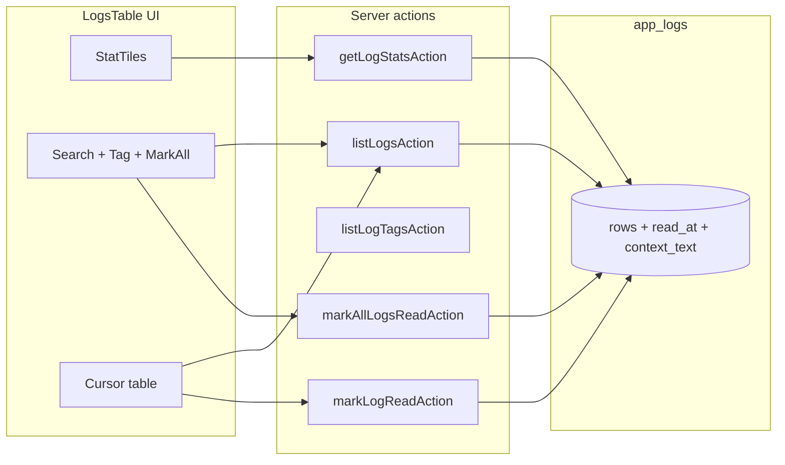

# Phase 12 Epic 9 — Logs page triage

> **Track progress:** as you complete each step, update the corresponding `todos` entry's `status` to `completed` in this plan's frontmatter.

> **Precondition:** `git status --porcelain` must be empty before the first implementation edit. The working tree is currently dirty (mockup/PRD edits and prior plan files). Commit or stash those first — this epic lands as a single commit containing only Epic 9 work.
>
> **Pre-epic baseline:** `f0a1ace09a135c4633907b5f950ded49ab2f8cdb` (`git rev-parse HEAD` at plan approval). `/code-review` diffs from this SHA to the Epic 12.9 commit.

**Branch:** `phase-12/observability-app-settings` (confirmed — not a first-epic kickoff check).

**Foundation:** Epic 8 shipped cursor browse at [`src/app/admin/logs/`](src/app/admin/logs/) — `listLogsAction` accepts only `cursor`, `sortDirection`, and `perPage`; [`listAppLogsPage`](src/app/admin/logs/_lib/list-app-logs.ts) selects `id, level, tag, message, context, created_at` with no filters. Mockup reference: [`.mockups/admin_logs_page.html`](.mockups/admin_logs_page.html).

**PRD note on search:** Epic 9.2 intentionally searches message, context, and tag together. That overrides the single-column search guidance in [`data-tables.mdc`](.cursor/rules/data-tables.mdc) for this page only — do not refactor the rule.



---

## 1. Migration — global read state and context search column

Write one migration (use [`create-migration`](.cursor/skills/create-migration/SKILL.md) timestamp workflow; must sort after `20260718135028_schedule_app_logs_retention_purge.sql`):

- Add `read_at timestamptz null` to `public.app_logs` — **null = unread**; existing rows stay unread.
- Add a stored generated column for context substring search (filtering only — never returned to the client):

  ```sql
  context_text text generated always as (coalesce(context::text, '')) stored
  ```

- Partial index for unread counts: `create index … on app_logs (read_at) where read_at is null` (or equivalent partial index on `(created_at desc, id desc) where read_at is null` if better for filtered unread paging).
- Admin-only **UPDATE** RLS policy mirroring the existing SELECT admin gate in [`20260717234520_create_app_logs.sql`](supabase/migrations/20260717234520_create_app_logs.sql) — `using` + `with check`, `(select auth.jwt() -> 'app_metadata' ->> 'role') = 'admin'`.

**Human step after file lands:** review SQL → `pnpm db:push` → `pnpm db:types` (regenerates [`src/types/database.types.ts`](src/types/database.types.ts)). Agent does not run push/types. Generated `context_text` will appear in generated types but must not be added to `APP_LOG_COLUMNS` or `AppLogRow`.

---

## 2. Shared filter primitives (Story 9.0)

Extract reusable modules consumed by this epic and later Epic 12:

| Module | Location | Contract |
|--------|----------|----------|
| `StatTile` | [`src/components/stat-tile.tsx`](src/components/stat-tile.tsx) | Props: `label`, `count`, `role` (`total` \| `debug` \| `info` \| `warn` \| `error` \| `unread`), `selected`, `onClick`. Resting: light tint + 0.5px role border; selected: 2px bold border. Map roles to semantic tokens: `total`/`debug` → `muted`; `info` → `accent` (blue); `warn` → `warning`; `error` → `destructive`; `unread` → `chart-1` (purple). No raw hex. |
| `useToggleFilterSet` | [`src/hooks/use-toggle-filter-set.ts`](src/hooks/use-toggle-filter-set.ts) | Generic `Set<T>` state; `toggle(value)`, `clearAll()`, `isActive(value)`, `activeValues`. Total tile calls `clearAll()` — Total is never stored as selected. |

Add focused unit tests for the hook (toggle, multi-select, clear-all). Stat tile can be covered via logs integration tests or a small render test.

---

## 3. Shared server filter layer

Add [`src/app/admin/logs/_lib/log-list-filters.ts`](src/app/admin/logs/_lib/log-list-filters.ts):

- **Types:** `LogLevelFilter`, `LogListFilters` — `levels: LogLevel[]`, `unreadOnly: boolean`, `tag: string | null`, `search: string | null`.
- **`applyLogListFilters(query, filters)`** — single PostgREST filter builder reused by list and mark-all:
  - Levels: `.in('level', levels)` when non-empty.
  - Unread: `.is('read_at', null)` when `unreadOnly`.
  - Tag: `.eq('tag', tag)` when set.
  - Search: escaped `ilike` `.or()` across **`message`**, **`tag`**, and **`context_text`** (PRD 9.2). Do **not** cast `context` inline in the filter — use the generated column only.
- **Validation helpers** at the action boundary (allowed levels, tag length, search length cap).

Extend [`app-log-row.ts`](src/app/admin/logs/_lib/app-log-row.ts): include `readAt` / derived `isUnread` in `AppLogRow`; extend `APP_LOG_COLUMNS` in [`list-app-logs.ts`](src/app/admin/logs/_lib/list-app-logs.ts) to select `read_at` only — leave `APP_LOG_COLUMNS` / `AppLogRow` selecting `context` (jsonb), **not** `context_text`; apply shared filters **before** cursor filter; keep `(created_at, id)` ordering unchanged.

Add [`list-app-log-stats.ts`](src/app/admin/logs/_lib/list-app-log-stats.ts): six **global** counts (unaffected by active filters) via parallel `{ count: 'exact', head: true }` queries — acceptable at template scale with retention purge; wrap in one lib function returning `{ total, debug, info, warn, error, unread }`.

Add [`list-app-log-tags.ts`](src/app/admin/logs/_lib/list-app-log-tags.ts): distinct tags ordered ascending (dedupe in SQL if needed — small-table `select tag` + Set dedupe is acceptable only if a single ordered query is awkward; prefer one round trip).

Add [`mark-app-logs-read.ts`](src/app/admin/logs/_lib/mark-app-logs-read.ts): `markLogRead(client, id)` sets `read_at = now()`; `markAllLogsRead(client, filters)` applies **the same** `applyLogListFilters` then bulk-updates unread rows — scoped to current tile + tag + search view per PRD 9.3.

Unit-test filter composition and cursor compatibility in [`list-app-logs.unit.test.ts`](src/app/admin/logs/_lib/list-app-logs.unit.test.ts).

---

## 4. Server actions

Extend [`src/app/admin/logs/actions.ts`](src/app/admin/logs/actions.ts):

| Action | Purpose |
|--------|---------|
| `listLogsAction` | Add validated `filters` to input; return rows with read state |
| `getLogStatsAction` | Global tile counts |
| `listLogTagsAction` | Tag dropdown options |
| `markLogReadAction` | Single-row explicit mark (idempotent if already read) |
| `markAllLogsReadAction` | Bulk mark using current filter snapshot |

Follow existing patterns: `assertAdminCaller`, zod/safeParse validation, [`mapUsersActionFault`](src/app/admin/users/_lib/map-users-action-fault.ts) for faults, typed envelopes. Extend [`actions.unit.test.ts`](src/app/admin/logs/actions.unit.test.ts).

---

## 5. Client data layer

- Expand [`admin-logs-query-keys.ts`](src/app/admin/logs/_lib/admin-logs-query-keys.ts): `list` key includes full filter object; add `stats` and `tags` keys.
- Extend [`use-admin-logs-list.ts`](src/app/admin/logs/_lib/use-admin-logs-list.ts) to accept filters; keep `keepPreviousData`.
- Add `use-admin-log-stats.ts` and `use-admin-log-tags.ts` (or one hook returning both).
- Add `use-mark-log-read-mutation.ts` / `use-mark-all-logs-read-mutation.ts` — on success, invalidate `adminLogsQueryKeys.all`.

**Filter change behavior:** any tile, tag, or debounced search change calls the existing `resetCursorStack()` pattern from [`logs-table.tsx`](src/app/admin/logs/_components/logs-table.tsx) (mirror users table page-1 reset intent).

---

## 6. Logs page UI (Stories 9.1–9.3)

Wire into [`logs-table.tsx`](src/app/admin/logs/_components/logs-table.tsx) (or extract [`logs-filter-bar.tsx`](src/app/admin/logs/_components/logs-filter-bar.tsx) if the file grows):

**Stat tiles (9.1):** six-tile grid above the table — Total (clears level + unread selections), Debug/Info/Warn/Error (multi-select via `useToggleFilterSet<LogLevel>`), Unread (separate boolean toggle on the same row). Counts from `getLogStatsAction`, not derived from filtered rows.

**Toolbar:**
- Debounced search input (~300ms, same as users) — placeholder per mockup: "Search message, context, or tag".
- Tag [`Select`](src/components/ui/select.tsx) populated from `listLogTagsAction` ("All tags" clears).
- "Mark all as read" button — disabled when no unread rows match current filter view; calls `markAllLogsReadAction` with current filter snapshot; toast on success ([`showSuccessToast`](src/utils/app-toast.ts)).

**Table (9.3):**
- New leading column: purple unread dot ([`chart-1`](src/app/globals.css) fill) when `isUnread`; empty when read. Dot click (or dedicated control) marks that row read — **opening the detail dialog does not mark read**.
- Update `getRowAccessibilityLabel` to mention unread state.

Do **not** auto-mark on page load, scroll, or row expand.

---

## 7. Tests and verification

- Hook + filter lib unit tests (new/extended).
- [`logs-table.unit.test.tsx`](src/app/admin/logs/_components/logs-table.unit.test.tsx): tile toggle composes with query key; filter change resets cursor; mark-all passes filter snapshot; no auto-mark on dialog open.
- Run quality bar before commit.

---

## Verification

Quality bar — stop on failure:

```bash
pnpm type-check && pnpm lint && pnpm format-check && pnpm test:ci
```

**Manual checklist (post `db:push`):**
- Stat tile counts match DB totals regardless of active filters.
- Level tiles + Unread toggle independently; Total clears all five.
- Tag + search compose with tiles and cursor paging (Previous/Next stay consistent).
- Unread rows show purple dot; explicit mark-read clears dot; mark-all respects current filter view only.
- Detail dialog open does not change read state.
- Threshold/debug logs from Epic 10 are not required yet.

---

## Commit epic

Authorized by this approved plan:

1. Review diff; stage only Epic 9 files.
2. Conventional commit ending with:

   ```
   feat(phase-12): logs page triage filters and read state

   Epic: 12.9
   ```

3. Commit (`git_write`). If pre-commit hook fails, fix and retry (do not amend a failed commit).
4. Verify `git status --porcelain` is empty.

**Do not push** — push remains `ship-phase`.

---

## Handoff

Epic committed. Next: open a new agent window and run `/code-review` — baseline `f0a1ace09a135c4633907b5f950ded49ab2f8cdb`, epic **12.9**.
