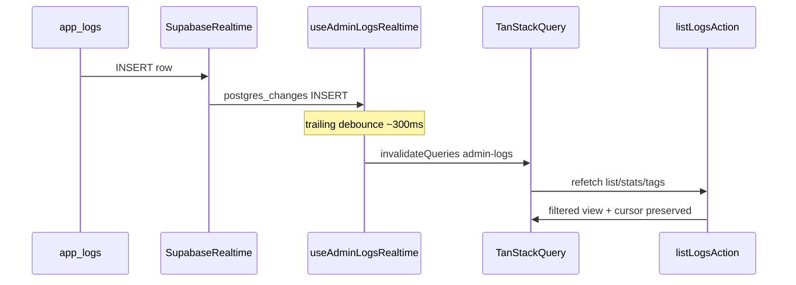

# Phase 13 Epic 2 — Realtime logs feed

> **Track progress:** as you complete each step, update the corresponding `todos` entry's `status` to `completed` in this plan's frontmatter.

> **Precondition:** `git status --porcelain` must be empty before the first implementation edit. If dirty, halt and ask the user to commit or stash. The epic must land as a single commit containing only this epic's work — `code-review` derives its range from that commit.

## Context

Epic 1 (`Complete`) re-enabled browser foreground auto-refresh in [`src/supabase/client.ts`](src/supabase/client.ts), unblocking long-lived Realtime subscriptions. Epic 2 ships the live feed per [Phase 13 PRD](docs/prds/phase-13-realtime-logs-session-refresh.prd.md) stories 2.1–2.2 and [ADR-0008](docs/adr/ADR-0008-realtime-scoped-to-logs-tiered-freshness.md).

**Architecture (invalidate-and-refetch, INSERT-only):**



- **Do not** merge INSERT payloads into the client cache — server refetch via existing [`listLogsAction`](src/app/admin/logs/actions.ts) / [`applyLogListFilters`](src/app/admin/logs/_lib/log-list-filters.ts) decides whether a row belongs in the active view.
- **Do not** subscribe to UPDATE/DELETE (read-state, mark-all-read, retention purge).
- **Do not** add manual resubscribe loops — rely on the JS client's heartbeat + exponential backoff ([RESEARCH-0004 §3](docs/research/RESEARCH-0004-supabase-realtime-session-refresh-nextjs.md)).
- **Coalesce INSERT bursts** — trailing debounce (~300ms, same order of magnitude as search debounce in [`logs-table.tsx`](src/app/admin/logs/_components/logs-table.tsx)) so rapid inserts collapse into one refetch.

**Existing integration points:**
- Query keys: [`admin-logs-query-keys.ts`](src/app/admin/logs/_lib/admin-logs-query-keys.ts) — invalidate/refetch prefix `adminLogsQueryKeys.all` (`['admin-logs']`).
- Client orchestrator: [`logs-table.tsx`](src/app/admin/logs/_components/logs-table.tsx) — already exposes `isFetching` from `useAdminLogsList` for table `aria-busy`; toolbar refresh busy state is separate (manual only).
- Toolbar extension point: [`logs-toolbar.tsx`](src/app/admin/logs/_components/logs-toolbar.tsx) — trailing cluster beside Mark all as read.
- RLS already admin-gates SELECT on `app_logs` ([`20260717234520_create_app_logs.sql`](supabase/migrations/20260717234520_create_app_logs.sql)) — Realtime delivery respects this.

## Step 1 — Realtime publication migration (Story 2.1)

Create **one** migration via the [create-migration skill](.cursor/skills/create-migration/SKILL.md):

- File: `supabase/migrations/{UTC_timestamp}_app_logs_realtime_publication.sql` (timestamp from `date -u +%Y%m%d%H%M%S`, strictly after `20260719042859`).
- SQL (minimal):

```sql
-- Generated using the create-migration skill
alter publication supabase_realtime add table public.app_logs;
```

- Header comment: purpose (INSERT broadcast for admin logs live feed), affected object, note that default replica identity is sufficient for INSERT-only.
- **No** `replica identity full` — not needed per ADR-0008 / RESEARCH-0004 §4.

**Human gate (before manual verification):** remind the user to review SQL, run `pnpm db:push`, then `pnpm db:types`. Agent must not run push/types.

## Step 2 — Realtime subscription hook (Story 2.2 core)

Add [`src/app/admin/logs/_lib/use-admin-logs-realtime.ts`](src/app/admin/logs/_lib/use-admin-logs-realtime.ts):

- Export `AdminLogsConnectionState = 'live' | 'reconnecting' | 'offline'`.
- `useAdminLogsRealtime()` returns `{ connectionState, refresh, isRefreshing }`.
- **`useEffect` lifecycle:**
  - `createClient()` from [`@/supabase/client`](src/supabase/client.ts).
  - Channel: `.channel('admin-logs-inserts')` (stable name; page-scoped).
  - `.on('postgres_changes', { event: 'INSERT', schema: 'public', table: 'app_logs' }, handler)`.
  - **INSERT handler — trailing debounce (~300ms):**
    - Do **not** call `invalidateQueries` synchronously on every event.
    - On each INSERT, (re)start a trailing debounce timer; when it fires, call `queryClient.invalidateQueries({ queryKey: adminLogsQueryKeys.all })`.
    - A rapid run of inserts within the window collapses into a single refetch.
    - **Effect cleanup:** clear any pending debounce timer (and remove channel as below).
  - `.subscribe((status) => …)` maps Supabase status to UI state:
    - `SUBSCRIBED` → `live`
    - `TIMED_OUT` | `CHANNEL_ERROR` → `reconnecting`
    - `CLOSED` → `offline`
  - Cleanup: clear debounce timer + `supabase.removeChannel(channel)`.
- **`refresh` callback (manual catch-up):**
  - `queryClient.refetchQueries({ queryKey: adminLogsQueryKeys.all })` — immediate, not debounced.
  - Used by the toolbar refresh button only.
- **`isRefreshing` — manual refresh only:**
  - Do **not** derive from `useIsFetching` (that would spin the button on every Realtime-triggered background refetch).
  - Track locally: set `true` when `refresh` is invoked, `await` the `refetchQueries` promise, set `false` on settle (success or failure).
  - Realtime debounced invalidations do not touch this flag — table `aria-busy` continues to use list-query `isFetching` separately.
- No logging unless debugging is needed — YAGNI.

Mount the hook in [`logs-table.tsx`](src/app/admin/logs/_components/logs-table.tsx) and pass props down to the toolbar.

## Step 3 — Toolbar UI: connection indicator + manual refresh

Extend [`logs-toolbar.tsx`](src/app/admin/logs/_components/logs-toolbar.tsx):

- New props: `connectionState`, `onRefresh`, `isRefreshing`.
- Trailing cluster (before Mark all as read on desktop; group with existing controls):
  - **Connection indicator** — small `Badge` (reuse pattern from [`log-level-badge.tsx`](src/app/admin/logs/_components/log-level-badge.tsx)) with semantic tokens:
    - Live — success variant + optional pulsing dot (`aria-live="polite"`, label e.g. "Live")
    - Reconnecting — warning variant ("Reconnecting")
    - Offline — muted/destructive as appropriate ("Offline")
  - **Manual refresh** — outline `Button` with `RefreshCw` icon; `aria-label="Refresh logs"`; disabled/spinning while `isRefreshing` (manual only — not during background Realtime refetches); calls `onRefresh`.

Keep layout responsive (stack on mobile per existing toolbar flex pattern).

## Step 4 — Tests

Follow [testing.mdc](.cursor/rules/testing.mdc) — mock at system boundary only.

**New:** [`use-admin-logs-realtime.unit.test.ts`](src/app/admin/logs/_lib/use-admin-logs-realtime.unit.test.ts)
- Mock `@/supabase/client` with chainable channel stub (`.on`, `.subscribe`, `.removeChannel`).
- Assert: subscribe called with INSERT filter on `app_logs`; multiple rapid INSERT handlers coalesce to one `invalidateQueries` after debounce window (use fake timers); status callback maps to connection states; effect cleanup clears debounce timer and removes channel.
- Assert: `refresh` sets `isRefreshing` true during awaited `refetchQueries`, false after settle; Realtime-triggered invalidation does not set `isRefreshing`.

**Extend:** [`logs-table.unit.test.tsx`](src/app/admin/logs/_components/logs-table.unit.test.tsx)
- Mock the new hook module (default return: `live`, no-op refresh, `isRefreshing: false`).
- Add cases: refresh button triggers hook's `refresh`; indicator renders Live / Reconnecting / Offline labels for each state; refresh button shows busy state when hook reports `isRefreshing: true`.

No migration SQL unit test (DB boundary).

## Step 5 — Manual verification (PRD success gate)

Requires linked Supabase project with migration applied (`pnpm db:push`).

| Flow | How | Pass |
|------|-----|------|
| Live INSERT | Open `/admin/logs`; emit a log above admin threshold (CLI or action that persists) | Row appears without reload; only if it matches active filters |
| Filter respect | Apply level/tag/unread/search filters; emit matching vs non-matching rows | Only matching rows surface |
| Burst coalescing | Emit several logs in quick succession | Single refetch wave (not one per row); rows appear after debounce settles |
| Connection indicator | Observe on load; optionally toggle network offline/online in DevTools | Live → Reconnecting → Live (or Offline during extended outage) |
| Manual refresh | Click refresh after inserting while disconnected or filtered | Immediate catch-up refetch; button busy only during that click, not during background live updates |
| Reconnect recovery | Drop network briefly; restore without reload | Feed resumes; no manual resubscribe code needed |
| Admin-only delivery | Non-admin cannot reach page (proxy gate) — Realtime inherits table RLS | No delivery to non-admin sessions |

Cursor position / page index should stay stable on INSERT refetch (existing `keepPreviousData` on list query).

## Step 6 — Doc note

Do **not** edit AGENTS.md in this epic. After human runs `pnpm db:types`, the migration count in AGENTS.md can be synced at ship via `/sync-repo-docs` if still open — optional, not blocking this commit.

### Verification

Quality bar — stop on failure:

```bash
pnpm type-check && pnpm lint && pnpm format-check && pnpm test:ci
```

### Commit epic

Authorized by this approved plan:

1. Review diff; stage only files in scope for this epic.
2. Conventional commit ending with epic trailer:

   ```
   feat(phase-13): admin logs realtime feed

   Epic: 13.2
   ```

3. Commit (request `git_write`). If pre-commit hook fails, fix and retry (new commit, not amend).
4. Verify `git status --porcelain` is empty after commit.

**Do not push** — push remains `ship-phase`.

### Handoff

Epic committed. Next: open a new agent window and run `/code-review`.
