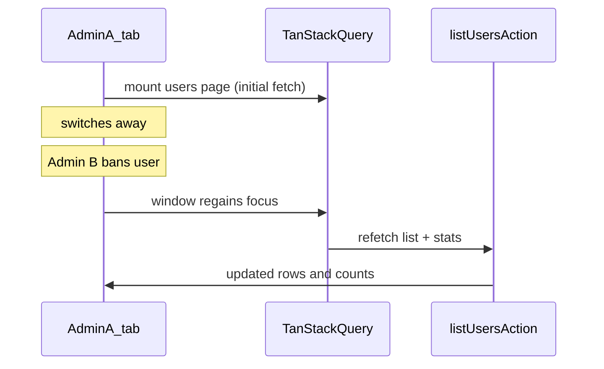

# Phase 13 Epic 3 — Users-page freshness

> **Track progress:** as you complete each step, update the corresponding `todos` entry's `status` to `completed` in this plan's frontmatter.

> **Precondition:** `git status --porcelain` must be empty before the first implementation edit. If dirty, halt and ask the user to commit or stash. The epic must land as a single commit containing only this epic's work — `code-review` derives its range from that commit.

**Note:** Working tree is currently dirty (modified [`logs-table.unit.test.tsx`](src/app/admin/logs/_components/logs-table.unit.test.tsx), rules files, untracked plan files). Resolve before implementation.

## Context

Epics 1 and 2 are `Complete` in [phase-13-realtime-logs-session-refresh.prd.md](docs/prds/phase-13-realtime-logs-session-refresh.prd.md). Epic 3 (Story 3.1) is the final epic in Phase 13.

[ADR-0008](docs/adr/ADR-0008-realtime-scoped-to-logs-tiered-freshness.md) assigns the users page a **lighter freshness tier** than logs: refetch-on-focus only — no Realtime subscription, no connection indicator, no manual refresh button.

Today the global QueryClient defaults in [`ReactQueryProvider.tsx`](src/providers/ReactQueryProvider.tsx) set `refetchOnWindowFocus: false`. The users page reads through two hooks:

- [`use-admin-users-list.ts`](src/app/admin/users/_lib/use-admin-users-list.ts) — paginated table
- [`use-admin-user-stats.ts`](src/app/admin/users/_lib/use-admin-user-stats.ts) — stat tiles (Total / Unverified / Banned)

Both must refetch on focus so another admin's ban or promote updates the table **and** tile counts. Mutations already invalidate queries locally — this change is only for cross-admin staleness.



**Scope guardrails (PRD + ADR):**

- Do **not** change global `ReactQueryProvider` defaults — logs and other surfaces keep `refetchOnWindowFocus: false`.
- Do **not** add toolbar controls to [`users-table.tsx`](src/app/admin/users/_components/users-table.tsx).
- Do **not** touch logs Realtime code or migrations.

## Step 1 — Opt users queries into refetch-on-focus

In both [`use-admin-users-list.ts`](src/app/admin/users/_lib/use-admin-users-list.ts) and [`use-admin-user-stats.ts`](src/app/admin/users/_lib/use-admin-user-stats.ts), add per-query option:

`refetchOnWindowFocus: 'always'`

Use `'always'` (not bare `true`) so focus refetch runs even while data is still within the inherited 60s `staleTime`. A quick tab switch is a common "another admin acted while I was away" scenario; `true` alone could skip refetch for up to 60 seconds.

Leave all other query options unchanged (`placeholderData`, retry logic, query keys).

No shared helper or constant — two one-line additions inline.

## Step 2 — Unit tests (focus refetch behavior)

Add [`use-admin-users-focus-refetch.unit.test.tsx`](src/app/admin/users/_lib/use-admin-users-focus-refetch.unit.test.tsx) (single file covering both hooks to avoid duplication):

- Mock [`../actions`](src/app/admin/users/actions.ts) at the boundary (`listUsersAction`, `getUserStatsAction`) with resolved success payloads (same shape as [`users-table.unit.test.tsx`](src/app/admin/users/_components/users-table.unit.test.tsx)).
- Wrap `renderHook` in `QueryClientProvider` with `retry: false`.
- After initial fetch settles, use TanStack Query's `focusManager` from `@tanstack/react-query`:
  - `focusManager.setFocused(false)` then `focusManager.setFocused(true)`
- Assert each mocked action is called **twice** (initial + focus refetch) for its hook.
- Test both hooks in one describe block — list hook needs minimal sort/page args; stats hook is zero-arg.

This tests the user-facing contract (focus triggers server refetch) without asserting raw `useQuery` config objects.

## Step 3 — Manual verification (PRD success gate)

Requires two admin sessions (two browsers or one normal + one incognito), linked Supabase project, `pnpm dev`.

| Flow | How | Pass |
|------|-----|------|
| Ban surfaces on focus | Admin A on `/admin/users`; Admin B bans a visible user; Admin A refocuses tab | Row shows banned state without manual reload |
| Promote surfaces on focus | Admin A on users page; Admin B promotes/demotes a user; Admin A refocuses | Role column updates |
| Stat tiles update | Repeat with Unverified/Banned filters relevant to the action | Tile counts match after focus |
| No extra UI | Inspect users toolbar | No connection indicator, no manual refresh button |
| Logs unchanged | Open `/admin/logs` | Live feed + indicator still work; no spurious refetch-on-focus behavior added globally |

Pagination, search, and sort state should be preserved across focus refetch (existing `keepPreviousData` on list query).

## Step 4 — Doc note

Do **not** edit AGENTS.md in this epic. The Implemented now prose for users freshness can sync at phase ship via `/sync-repo-docs` if still open — optional, not blocking this commit.

### Verification

Quality bar — stop on failure:

```bash
pnpm type-check && pnpm lint && pnpm format-check && pnpm test:ci
```

### Commit epic

Authorized by this approved plan:

1. Review diff; stage only files in scope for this epic.
2. Conventional commit ending with epic trailer:

   ```
   feat(phase-13): admin users refetch on focus

   Epic: 13.3
   ```

3. Commit (request `git_write`). If pre-commit hook fails, fix and retry (new commit, not amend).
4. Verify `git status --porcelain` is empty after commit.

**Do not push** — push remains `ship-phase`.

### Handoff

Epic committed. Next: open a new agent window and run `/code-review`.
