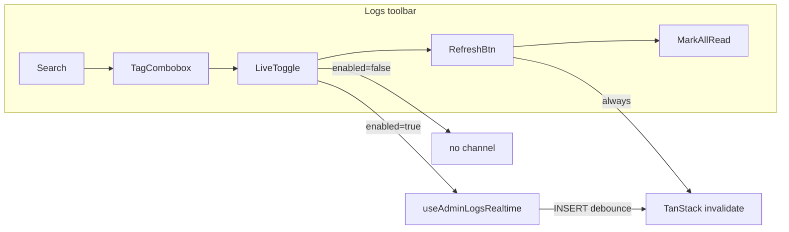

# Phase 13 Epic 4 — Logs toolbar and empty-state polish

> **Track progress:** as you complete each step, update the corresponding `todos` entry's `status` to `completed` in this plan's frontmatter.

> **Precondition:** `git status --porcelain` must be empty before the first implementation edit. If dirty, halt and ask the user to commit or stash. The epic must land as a single commit containing only this epic's work — `code-review` derives its range from that commit. *(Currently untracked plan files under `.cursor/plans/` count as dirty — commit or stash them first.)*

## Context

Epics 1–3 are `Complete` in [phase-13-realtime-logs-session-refresh.prd.md](docs/prds/phase-13-realtime-logs-session-refresh.prd.md). Epic 4 is UI polish on top of the shipped Realtime hook and toolbar:

- **4.1** — Replace [`LogsConnectionIndicator`](src/app/admin/logs/_components/logs-connection-indicator.tsx) (static Live/Reconnecting/Offline badge) with a **Live toggle** that controls subscription. Per PM decision: **only two visual states** — no reconnecting/offline affordances.
- **4.2** — When the **filtered** view is empty, show richer empty copy and action buttons.

**Existing integration points:**

- Subscription hook: [`use-admin-logs-realtime.ts`](src/app/admin/logs/_lib/use-admin-logs-realtime.ts) — always subscribes on mount today; needs an `enabled` gate.
- Toolbar: [`logs-toolbar.tsx`](src/app/admin/logs/_components/logs-toolbar.tsx) — trailing cluster is currently indicator + icon refresh + Mark all as read.
- Table empty row: [`DataTableShell`](src/components/data-table-shell.tsx) accepts only `emptyMessage: string` today.
- Filter reset partial path exists via [`handleTotalClick`](src/app/admin/logs/_components/logs-table.tsx) (clears level tiles + unread only) — full reset must also clear search + tag.

**Settings reference (contrast only):** banner live badge uses filled success pill via [`format-banner-status-badge.ts`](src/utils/format-banner-status-badge.ts) (`bg-success/15 text-success`). Epic 4 on-state is **outline only** — `text-success border-success`, no background fill.



## Step 1 — Opt-in Realtime subscription (Story 4.1 foundation)

Refactor [`use-admin-logs-realtime.ts`](src/app/admin/logs/_lib/use-admin-logs-realtime.ts):

- Accept `{ enabled: boolean }` (default `true` preserves current always-on behavior until the toggle wires in).
- Move channel subscribe/unsubscribe into a `useEffect` keyed on `enabled`:
  - `enabled === true` → create channel, wire INSERT debounce + `invalidateQueries`, cleanup removes channel on disable/unmount.
  - `enabled === false` → no channel; clear any pending debounce timer.
- **Drop `connectionState` from the public return** — nothing consumes it after Epic 4 and PM confirmed no reconnecting/offline UI. Remove `AdminLogsConnectionState` export unless still needed elsewhere (grep first; delete type if unused).
- Keep `refresh` + `isRefreshing` unchanged — manual refresh works regardless of `enabled`.

Update [`use-admin-logs-realtime.unit.test.tsx`](src/app/admin/logs/_lib/use-admin-logs-realtime.unit.test.tsx):

- Add cases: no subscribe when `enabled: false`; subscribe when toggled to true; channel removed when toggled to false.
- Remove connection-state mapping tests.
- Keep debounce, manual refresh, and unmount cleanup tests.

## Step 2 — Live toggle component (Story 4.1)

Replace [`logs-connection-indicator.tsx`](src/app/admin/logs/_components/logs-connection-indicator.tsx) with a new **`logs-live-toggle.tsx`** (delete the old file):

| State | Icon | Label | Styling |
| ----- | ---- | ----- | ------- |
| Off (`liveEnabled === false`) | `Play` | Live | `Button variant="outline"` — **same variant as refresh**; use default size with icon + text (refresh stays `size="icon"`) |
| On (`liveEnabled === true`) | `Pause` | Live | `variant="outline"` + `text-success border-success` — **text and border only, no bg fill** |

Props: `liveEnabled`, `onLiveEnabledChange`, optional `className`.

Accessibility: `aria-pressed={liveEnabled}`, label like `"Turn live feed on"` / `"Turn live feed off"` (or a single toggle name with pressed state).

**Toolbar layout** in [`logs-toolbar.tsx`](src/app/admin/logs/_components/logs-toolbar.tsx):

- Remove `connectionState` prop and `LogsConnectionIndicator` import.
- Insert `LogsLiveToggle` **left of the refresh button**, right of the tag combobox (still inside the trailing `sm:ml-auto` cluster).
- Add `liveEnabled` + `onLiveEnabledChange` props from parent.

## Step 3 — Wire toggle state in logs table (Story 4.1)

In [`logs-table.tsx`](src/app/admin/logs/_components/logs-table.tsx):

- Add `const [liveEnabled, setLiveEnabled] = useState(true)` — default **on** so behavior matches Epic 2 until the user toggles off.
- Pass `enabled: liveEnabled` into `useAdminLogsRealtime({ enabled: liveEnabled })`.
- Pass toggle props through to `LogsToolbar`.
- Remove all `connectionState` wiring.

## Step 4 — Filtered empty state (Story 4.2)

**Helper** — add to [`log-list-filters.ts`](src/app/admin/logs/_lib/log-list-filters.ts):

- `hasActiveLogListFilters(filters: LogListFilters): boolean` — true when any field differs from `EMPTY_LOG_LIST_FILTERS` (levels non-empty, `unreadOnly`, tag, or search).

**Reset handler** in [`logs-table.tsx`](src/app/admin/logs/_components/logs-table.tsx):

- `handleResetFilters` — reuse `handleTotalClick` logic **plus** `setSearchInput('')`, `setDebouncedSearch('')`, `setSelectedTag(null)`, and `resetCursorStack()`.

**DataTableShell extension** — minimal change to [`data-table-shell.tsx`](src/components/data-table-shell.tsx):

- Add optional `emptyContent?: React.ReactNode`.
- In the zero-rows branch, render `emptyContent ?? emptyMessage` (string fallback unchanged for all other tables).

**Empty UI** — new small component `logs-filtered-empty-state.tsx` (or inline in logs-table if ≤15 lines — prefer extracted component for testability):

- Copy: **"No logs found for selected filters"**
- Primary button: **Reset filters** → `handleResetFilters`
- Secondary button: **Refresh** → existing `refresh` from hook
- Only shown when `!isLoading && rows.length === 0 && hasActiveLogListFilters(filters)`
- Unfiltered empty keeps `emptyMessage="No logs found."`

## Step 5 — Tests

Update [`logs-table.unit.test.tsx`](src/app/admin/logs/_components/logs-table.unit.test.tsx):

- **Remove** reconnecting/offline label tests (dropped per PM).
- **Add** Live toggle: default pressed/on; click toggles off → hook `enabled` false (mock return should expose or spy subscribe behavior via mock); click again re-enables.
- **Add** filtered empty state: mock zero rows + active filters → copy + Reset filters + Refresh buttons; Reset clears filters and refetches; Refresh calls `refreshMock`.
- **Add** unfiltered empty: still shows `"No logs found."` without action buttons.

Add [`log-list-filters.unit.test.ts`](src/app/admin/logs/_lib/log-list-filters.unit.test.ts) case for `hasActiveLogListFilters` if not covered inline.

Optional focused test for `LogsLiveToggle` aria-pressed and class application — only if logs-table tests become heavy; prefer table-level interaction tests first per [testing.mdc](.cursor/rules/testing.mdc).

## Out of scope

- No migration, ADR, or AGENTS.md changes (behavior polish only).
- No reconnecting/offline badge or token variants.
- No changes to users page or other admin surfaces.

### Verification

Quality bar — same commands as [WORKFLOW_GUIDE Step 5](docs/WORKFLOW_GUIDE.md). Stop on failure:

```bash
pnpm type-check && pnpm lint && pnpm format-check && pnpm test:ci
```

### Commit epic

Authorized by this approved plan:

1. Review diff; stage only files in scope for this epic.
2. Write a conventional commit message. It **must** end with an `Epic:` git trailer:

   ```
   feat(phase-13): logs live toggle and filtered empty state

   Epic: 13.4
   ```

3. Commit (request `git_write`). Pre-commit hook runs automatically — if it fails, **fix and retry the commit**.
4. Verify `git status --porcelain` is empty after commit.

**Do not push** — push remains `ship-phase`.

### Handoff

Epic committed. Next: open a new agent window and run `/code-review`.
