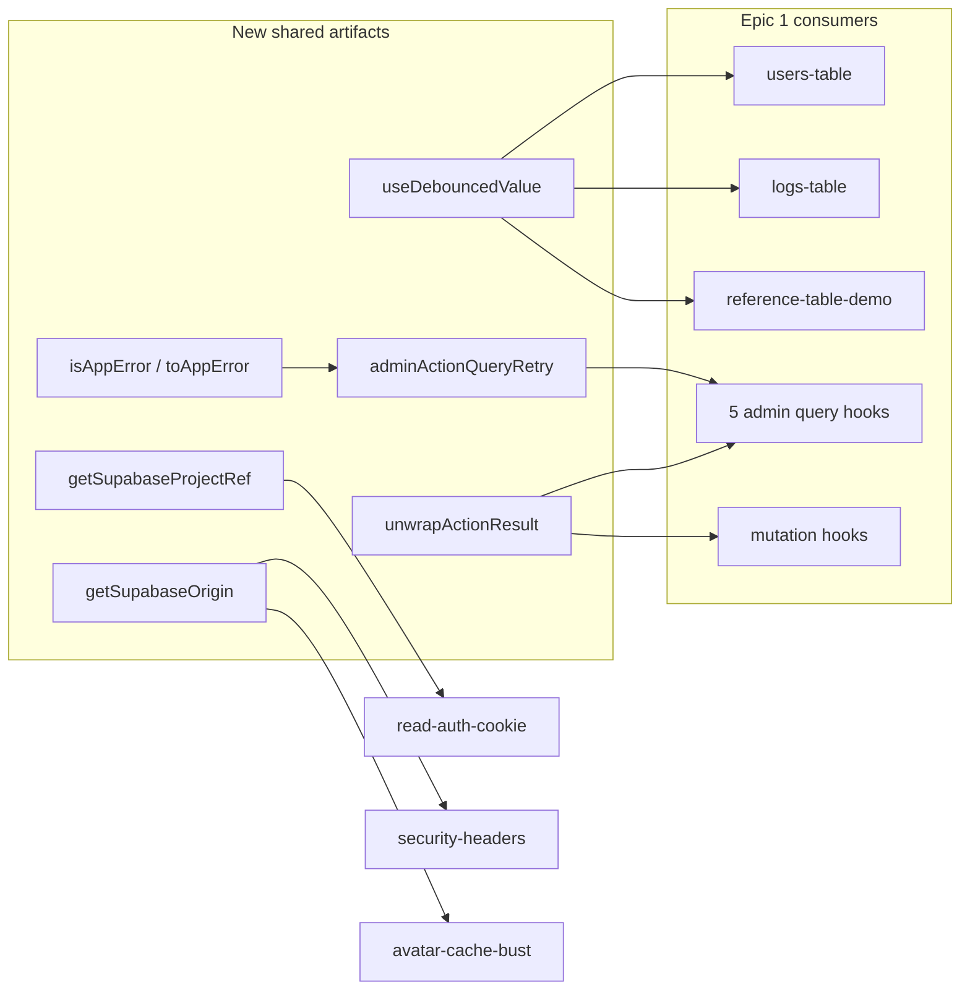

# Phase 14 Epic 1 — Foundation Sweep

> **Track progress:** as you complete each step, update the corresponding `todos` entry's `status` to `completed` in this plan's frontmatter.

> **Precondition:** confirm `git branch --show-current` outputs `phase-14/tech-debt-hardening`. If it doesn't match, halt and ask the user — do not switch branches.

> **Precondition:** `git status --porcelain` must be empty before the first implementation edit. If dirty, halt and ask the user to commit or stash. The epic must land as a single commit containing only this epic's work — `code-review` derives its range from that commit.

This epic is a good candidate for **Build in Parallel** across three disjoint clusters: (1) admin shared primitives, (2) marketing alias cleanup, (3) CLI + env + config hygiene. Write and land as one commit regardless.

---

## Context

Phase 14 PRD ([docs/prds/phase-14-tech-debt-hardening.prd.md](docs/prds/phase-14-tech-debt-hardening.prd.md)) Epic 1 resolves ten audit findings (F011, F063, F068, F069, F070, F077, F088, F086, F097, F073) by extracting shared helpers before Epics 2–3 consume them. **F060** (grid constant extraction) is explicitly out of scope for this epic — the inline class stays coupled with an intentional comment instead (Step 9). **F099** is only partially addressed: the inaccurate workflow `_components/**` exclude and its `// debt:` comment are fixed here; the OG segment exclude at `vitest.config.ts` line ~32 is unchanged and remains deferred.

Success criteria: exactly one canonical implementation per pattern, all prior duplicates removed, workflow diagram in the coverage denominator, thresholds still pass, zero user-visible behavior change — **except** the deliberate accepted delta documented in Step 1 for non-`AppError` error messages.



---

## Step 1 — Error kind guard (F077)

Add [`src/utils/is-app-error.ts`](src/utils/is-app-error.ts) next to [`src/types/app-error.ts`](src/types/app-error.ts):

- Export `isAppError(error: unknown): error is AppError` — runtime guard: object with `kind` in `('operational' | 'fault')` and `message` string
- Export `toAppError(error: unknown): AppError` — **always returns an `AppError`**, never `null`:
  - If `isAppError(error)`, return it unchanged
  - Otherwise wrap into a synthetic fault: `{ kind: 'fault', message: '<generic user-safe message>' }` (reuse existing operational copy pattern from error-handling conventions — e.g. a single generic "Something went wrong" string, not the raw thrown value)
- Admin error surfaces (`AppErrorSurface`, hook `error` fields, mutation error props) call `toAppError(query.error)` when `query.isError` — the outer ternary may still yield `null` when there is no error, but the render path never receives `null` from `toAppError` itself

**Accepted behavior delta:** today, a non-`AppError` throw surfaced through `as unknown as AppError` can display a garbage or raw `Error.message` in the UI. Wrapping into a synthetic fault replaces that with generic copy. Record this as a **deliberate accepted delta** to the epic's "zero user-visible behavior change" criterion — non-`AppError` failures are rare on these paths, and generic fault copy is strictly safer than a cast-sourced raw message.

Unit test in [`src/utils/is-app-error.unit.test.ts`](src/utils/is-app-error.unit.test.ts):

- Valid operational and fault `AppError` values pass through unchanged
- Plain `Error`, string, and non-object values produce synthetic fault with `kind: 'fault'` and the generic message (assert fallback contract)

This unblocks Step 2 and replaces every `as unknown as AppError` cast in admin hooks and table mutation error surfaces.

---

## Step 2 — Admin query retry config (F069)

Add [`src/app/admin/_lib/admin-query-options.ts`](src/app/admin/_lib/admin-query-options.ts):

- Export `ADMIN_ACTION_QUERY_RETRY_DELAY = 0`
- Export `adminActionQueryRetry(failureCount, error)` — fault-only, max 1 retry, using `isAppError(error) && error.kind === 'fault'`

**Non-`AppError` behavior (must match today):** the current cast `(error as unknown as AppError)?.kind === 'fault'` yields `undefined === 'fault'` → **no retry** for network errors, plain `Error`, or any non-`AppError` throw. The new guard preserves this: `isAppError(error)` is false → no retry. **No behavior delta.**

Callers import `toAppError` from [`src/utils/is-app-error.ts`](src/utils/is-app-error.ts) directly for error surfaces — do **not** add a `toAdminQueryError` wrapper.

Migrate all five hooks (audit's four plus [`use-admin-log-tags.ts`](src/app/admin/logs/_lib/use-admin-log-tags.ts)):

- [`use-admin-users-list.ts`](src/app/admin/users/_lib/use-admin-users-list.ts)
- [`use-admin-user-stats.ts`](src/app/admin/users/_lib/use-admin-user-stats.ts)
- [`use-admin-logs-list.ts`](src/app/admin/logs/_lib/use-admin-logs-list.ts)
- [`use-admin-log-stats.ts`](src/app/admin/logs/_lib/use-admin-log-stats.ts)
- [`use-admin-log-tags.ts`](src/app/admin/logs/_lib/use-admin-log-tags.ts)

Pattern: `retry: adminActionQueryRetry`, `retryDelay: ADMIN_ACTION_QUERY_RETRY_DELAY`, `error: query.isError ? toAppError(query.error) : null`.

Also update mutation error casts in [`users-table.tsx`](src/app/admin/users/_components/users-table.tsx) and [`logs-table.tsx`](src/app/admin/logs/_components/logs-table.tsx) to use `toAppError`.

---

## Step 3 — Generic action unwrap (F070, F088)

Add [`src/app/admin/_lib/unwrap-action-result.ts`](src/app/admin/_lib/unwrap-action-result.ts):

- Single generic `unwrapActionResult<TData>(result: { success: true; data: TData } | { success: false; error: AppError }): TData` — throw `result.error` on failure (same semantics as today; folds in F088 `unwrapMutationResult`)

Update all consumers, then **delete** the old modules (not supplement):

- Remove [`unwrap-stats-action-result.ts`](src/app/admin/_lib/unwrap-stats-action-result.ts)
- Remove [`unwrap-users-action.ts`](src/app/admin/users/_lib/unwrap-users-action.ts)
- Replace [`use-admin-log-tags.ts`](src/app/admin/logs/_lib/use-admin-log-tags.ts) local `unwrapTagsResult` with shared helper

Consumers: the five query hooks above, three mark-read mutation hooks, two users mutation hooks. List-users keeps calling the shared unwrap directly (no list-specific wrapper).

Add [`src/app/admin/_lib/unwrap-action-result.unit.test.ts`](src/app/admin/_lib/unwrap-action-result.unit.test.ts).

---

## Step 4 — Debounced search hook (F068)

Add [`src/hooks/use-debounced-value.ts`](src/hooks/use-debounced-value.ts) (`'use client'`):

- Signature: `useDebouncedValue<T>(value: T, delayMs: number): T` — no `trim` option; all three call sites apply `.trim()` at the read site (already done in `appliedSearch` / filter objects)
- Standard `useEffect` + `setTimeout` / cleanup pattern currently duplicated at lines ~156–163 in users-table, ~87–95 in logs-table, ~38–45 in reference-table-demo
- Unit test in [`src/hooks/use-debounced-value.unit.test.ts`](src/hooks/use-debounced-value.unit.test.ts) (fake timers)

Replace duplicated debounce state/effects in all three components with the shared hook plus React's **adjust-state-during-render** pattern for paging reset:

- Hold the previous debounced value in a `useRef`, initialized to the initial debounced value
- During render, when the current debounced value differs from the ref: update the ref and call the reset setter immediately — `setPage(1)` in [`users-table.tsx`](src/app/admin/users/_components/users-table.tsx) and [`reference-table-demo.tsx`](src/app/(marketing)/reference/_components/reference-table-demo.tsx); cursor-stack reset (`setCursorStack([null])`, `setCursorStackIndex(0)`) in [`logs-table.tsx`](src/app/admin/logs/_components/logs-table.tsx)
- **Same-render requirement:** the new debounced search value and the reset page/cursor must reach the query key (or client-side slice inputs) in the **same render pass**, so no request fires against the new search with a stale page or cursor. Ref initialization to the initial debounced value means mount does not trigger a spurious reset.

Remove local `SEARCH_DEBOUNCE_MS` constants and paired `debouncedSearch` state; delete the three inline `useEffect` debounce blocks.

---

## Step 5 — Marketing alias removal (F011)

- Update nine consumers to import `SiteContainer` from [`src/components/site-container.tsx`](src/components/site-container.tsx) directly — swap JSX tag from `LandingContainer` to `SiteContainer` only; **preserve every existing prop and `className` on the container element verbatim** (e.g. `className="text-center"` stays on the same element)
  - [`landing-hero.tsx`](src/app/(marketing)/_components/landing-hero.tsx), [`landing-features.tsx`](src/app/(marketing)/_components/landing-features.tsx), [`landing-proof-cta.tsx`](src/app/(marketing)/_components/landing-proof-cta.tsx), [`landing-tech-stack.tsx`](src/app/(marketing)/_components/landing-tech-stack.tsx)
  - [`terms/page.tsx`](src/app/(marketing)/terms/page.tsx), [`privacy/page.tsx`](src/app/(marketing)/privacy/page.tsx), [`reference/page.tsx`](src/app/(marketing)/reference/page.tsx), [`workflow/page.tsx`](src/app/(marketing)/workflow/page.tsx), [`workflow-guide-cta.tsx`](src/app/(marketing)/workflow/_components/workflow-guide-cta.tsx)
- Before deleting the alias: grep the repo for `LandingContainer` imports/usages and confirm **no file outside the nine consumers** still references it (archived plans/docs are fine; no runtime import may remain)
- Delete [`landing-container.tsx`](src/app/(marketing)/_components/landing-container.tsx)

---

## Step 6 — CLI catch-and-exit wrapper (F063)

In [`scripts/admin/lib/cli.ts`](scripts/admin/lib/cli.ts), add:

```typescript
runCliScript(run: () => Promise<void>, tag: string): void
```

The wrapper **invokes `run()` inside** a `.catch` chain so synchronous throws from the runner are also caught — not merely attaching `.catch` to an already-created promise at the call site.

Replace the duplicated bottom-of-file catch blocks in all four entry scripts with one-liners passing a thunk, e.g. `runCliScript(() => runPromoteAdmin(process.argv.slice(2)), 'promote-admin')`:

- [`promote-admin.ts`](scripts/admin/promote-admin.ts), [`demote-admin.ts`](scripts/admin/demote-admin.ts), [`delete-user.ts`](scripts/admin/delete-user.ts), [`list-admins.ts`](scripts/admin/list-admins.ts)

Remove the `// debt:` comment from promote-admin.

---

## Step 7 — Supabase env accessors (F097)

Extend [`src/utils/env.ts`](src/utils/env.ts):

- `getSupabaseUrlOptional(): string | undefined` — single env read point
- `getSupabaseOrigin(): string | null` — parse origin safely; `null` when unset or malformed (same as current local `parseSupabaseOrigin` in security-headers / avatar-cache-bust)
- `getSupabaseProjectRef(): string | null` — first label of Supabase project hostname (`new URL(url).hostname.split('.')[0]`); `null` when unset or malformed (same as current logic in read-auth-cookie when URL is present)

**Parity requirement:** for every input (unset env, malformed URL string, valid Supabase URL), each helper returns the same value the current inline/local parse produces today — no semantic drift.

Route call sites (remove local `parseSupabaseOrigin` duplicates):

- [`read-auth-cookie.ts`](src/supabase/read-auth-cookie.ts) → `getSupabaseProjectRef()` (not `getSupabaseOrigin()`); keep `'sb-auth-token'` fallback when project ref is null
- [`security-headers.ts`](src/utils/security-headers.ts) → `getSupabaseOrigin()`
- [`avatar-cache-bust.ts`](src/utils/avatar-cache-bust.ts) → `getSupabaseOrigin()`

Do **not** change throw semantics in `getPublicSupabaseEnv()`.

Add [`src/utils/env-supabase-helpers.unit.test.ts`](src/utils/env-supabase-helpers.unit.test.ts) (or extend an existing env test file) covering unset, malformed, and valid URL cases for both `getSupabaseOrigin` and `getSupabaseProjectRef`.

---

## Step 8 — Package author (F086)

Update [`package.json`](package.json) `author` field from legacy template attribution (`Michael Troya`) to current maintainer aligned with repo ownership (`aaronwllms/seminova` in README). One-line metadata fix only.

---

## Step 9 — Site chrome comment (F060 deferred)

In [`site-header.tsx`](src/components/site-header.tsx) and [`site-footer.tsx`](src/components/site-footer.tsx), replace the `// debt:` markers with a plain comment that the two files **intentionally share** the same grid class string inline — F060 constant extraction is deferred, not forgotten.

No code or class-string changes beyond the comment swap.

---

## Step 10 — Vitest coverage exclude (F073)

In [`vitest.config.ts`](vitest.config.ts):

- Replace the blanket `'src/app/(marketing)/workflow/_components/**'` exclude with an explicit exclude list for **static** section files in that directory — build the list by **reading `src/app/(marketing)/workflow/_components/` at implementation time** (every file except `workflow-diagram.tsx`), not by copying filenames from this plan, so no unlisted file silently enters the denominator
- **Do not** exclude [`workflow-diagram.tsx`](src/app/(marketing)/workflow/_components/workflow-diagram.tsx) — it is the only newly-included file; it already has [`workflow-diagram.integration.test.tsx`](src/app/(marketing)/workflow/_components/workflow-diagram.integration.test.tsx)
- Update the workflow `// debt:` comment to reflect accurate scope (interactive diagram is measured; static sections remain excluded)
- **Leave the OG segment exclude unchanged** — that F099 item is out of scope for this epic

Run `pnpm test:ci` and confirm 80% thresholds still pass after the denominator change.

**If thresholds fail:** extend coverage in [`workflow-diagram.integration.test.tsx`](src/app/(marketing)/workflow/_components/workflow-diagram.integration.test.tsx) (or add focused unit tests colocated with the diagram) — static section files remain excluded and are not the remedy target. If thresholds still fail after one round of diagram test extension, **halt and ask the user** — do not silently widen excludes or lower thresholds.

---

## Verification

Quality bar — same commands as [WORKFLOW_GUIDE Step 5 exit condition](docs/WORKFLOW_GUIDE.md). Stop on failure:

```bash
pnpm type-check && pnpm lint && pnpm format-check && pnpm test:ci
```

Manual smoke (no behavior change expected, but confirm wiring):

- Admin Users: type in search box — debounced filter still applies at 3+ chars; confirm **exactly one request fires per settled search** (network panel or React Query devtools), not two
- Admin Logs: search debounce still resets cursor paging; confirm **exactly one request fires per settled search** (network panel or React Query devtools), not two; fault errors still show in error surface
- Reference page table demo: search debounce + client pagination unchanged
- Marketing pages render with same container width and classNames after `SiteContainer` swap

---

## Commit epic

Authorized by this approved plan:

1. Review diff; stage only files in scope for this epic.
2. Write a conventional commit message. It **must** end with an `Epic:` git trailer:

   ```
   refactor(phase-14): foundation sweep shared helpers

   Epic: 14.1
   ```

3. Commit (request `git_write`). Pre-commit hook runs automatically — if it fails, **fix and retry the commit**.
4. Verify `git status --porcelain` is empty after commit.
5. Record the epic baseline SHA: `git rev-parse HEAD` — this is the single commit for Epic 14.1.

**Do not push** — push remains `ship-phase`.

---

## Handoff

Epic **14.1** committed at baseline SHA `<SHA from step 5 of Commit epic>` (`git rev-parse HEAD` on the epic commit). That SHA is the range anchor for `/code-review`.

Next: open a new agent window and run `/code-review`.
