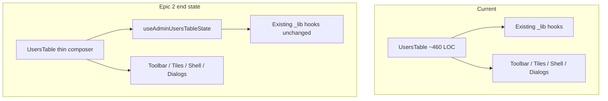

# Phase 14 Epic 2 — Users Table Decomposition

> **Track progress:** as you complete each step, update the corresponding `todos` entry's `status` to `completed` in this plan's frontmatter.

> **Precondition:** `git status --porcelain` must be empty before the first implementation edit. If dirty, halt and ask the user to commit or stash. The epic must land as a single commit containing only this epic's work — `code-review` derives its range from that commit. Before the first implementation edit, record `git rev-parse HEAD` — this is the epic baseline SHA, carried into the handoff below.

## Context

Phase 14 is active on branch `phase-14/tech-debt-hardening` (verified). Epic 1 (`Complete`) shipped shared helpers this epic must consume — not reimplement:


| Helper            | Location                                                                                                                    |
| ----------------- | --------------------------------------------------------------------------------------------------------------------------- |
| Debounce          | `[src/hooks/use-debounced-value.ts](src/hooks/use-debounced-value.ts)`                                                      |
| Admin query retry | `[src/app/admin/_lib/admin-query-options.ts](src/app/admin/_lib/admin-query-options.ts)` — already used by list/stats hooks |
| Action unwrap     | `[src/app/admin/_lib/unwrap-action-result.ts](src/app/admin/_lib/unwrap-action-result.ts)` — already used by mutation hooks |
| Error guard       | `[src/utils/is-app-error.ts](src/utils/is-app-error.ts)` — `toAppError` for merged mutation error                           |


**Current problem:** `[src/app/admin/users/_components/users-table.tsx](src/app/admin/users/_components/users-table.tsx)` (~460 LOC) owns paging, debounced search, tile filters, sort mapping, three confirmation dialogs, mutation orchestration, data-hook wiring, column factory inputs, and table shell setup — a god-file per `[TECH_DEBT_AUDIT.md](TECH_DEBT_AUDIT.md)` F064.

**Target:** one state hook owns orchestration; the component composes presentational children only. Epic 3 (logs) will mirror this pattern later — do not touch logs in this epic.




## Scope boundaries

**In scope:**

- New hook: `[src/app/admin/users/_lib/use-admin-users-table-state.ts](src/app/admin/users/_lib/use-admin-users-table-state.ts)`
- Slim `[users-table.tsx](src/app/admin/users/_components/users-table.tsx)` to composition-only
- Move sort constants (`COLUMN_ID_TO_SORT_KEY`, `DEFAULT_SORTING`) into the hook file (or a small co-located constants block at top of that file)

**Out of scope (unchanged):**

- Presentational components: toolbar, stat tiles, active filters, filtered empty, columns, dialogs
- Existing data/mutation hooks in `_lib/` (composed by state hook, not inlined)
- Server actions, query keys, filter helpers, page server boundary
- Logs table (Epic 3)
- New tests unless needed to keep coverage — primary regression gate is `[users-table.unit.test.tsx](src/app/admin/users/_components/users-table.unit.test.tsx)` (~670 LOC, 20 behavioral cases)

## Implementation steps

### 1. Create `useAdminUsersTableState`

Add `[use-admin-users-table-state.ts](src/app/admin/users/_lib/use-admin-users-table-state.ts)` accepting `{ currentAdminUserId: string }`.

**Move into the hook** (lift verbatim from `users-table.tsx` today):

- **Paging:** `page`, `perPage`, prev/next handlers, page reset on filter/search/sort/page-size change
- **Debounced search:** `searchInput`, `useDebouncedValue(300)`, `trackedDebouncedSearch` reset-to-page-1 pattern, `appliedSearch` with `USERS_SEARCH_MIN_LENGTH`
- **Tile filters:** `useToggleFilterSet`, filter booleans, toggle/remove/clear handlers, `filters` memo via `[user-list-filters.ts](src/app/admin/users/_lib/user-list-filters.ts)`
- **Sort mapping:** `COLUMN_ID_TO_SORT_KEY`, `DEFAULT_SORTING`, `sorting` → `sortColumn` / `sortDirection`, `handleSortingChange`
- **Data orchestration:** compose `useAdminUsersList`, `useAdminUserStats`, `useAdminUsersRefresh` from derived params
- **Mutations:** compose `useAdminUserRoleMutation` + `useAdminUserBanMutation`; `pendingUserId`, merged `mutationAppError` via `toAppError`, `resetMutations`
- **Dialog state:** `confirmAction`, `banConfirmAction`, `unbanConfirmAction`, open handlers (`handlePromote` / `handleDemote` / `handleBan` / `handleUnban`), confirm handlers
- **Derived UI:** `showFilteredEmptyState`, `columns` via `createUsersColumns(...)`, `useDataTableShell` setup

**Return flat named fields.** The hook returns a single flat object of named values and handlers — no nested prop-bag objects intended to be spread onto children (no `toolbarProps`, `shellProps`, `dialogProps`, or similar). This matches the existing convention across `use-toggle-filter-set`, `use-blur-save-field`, `use-admin-users-list`, `use-admin-user-stats`, `use-admin-users-refresh`, and `useDataTableShell`, all of which return flat named fields. `users-table.tsx` destructures those fields and passes explicit named props to each presentational child.

**Do not** reimplement debounce, query retry, or unwrap logic — child hooks already use Epic 1 helpers.

### 2. Slim `UsersTable` to a composer

Refactor `[users-table.tsx](src/app/admin/users/_components/users-table.tsx)` to:

1. Call `useAdminUsersTableState({ currentAdminUserId })`
2. Render presentational children with hook outputs:
  Pass explicit named props to each child. Do not spread a hook-returned object onto a component.
  - `UsersStatTiles`, `UsersToolbar`, `UsersActiveFilters`
  - `AppErrorSurface` for stats / list / mutation errors
  - `DataTableShell` + `DataTablePaginationControls`
  - `PromoteDemoteDialog`, `BanUserDialog`, `UnbanUserDialog`
3. Remove all local `useState` / orchestration logic

Target: component holds **no orchestration beyond composition** — roughly the JSX block that exists today (lines 356–457), plus the hook call.

### 3. Verify no behavior change

Run the full users-table test suite and confirm all 20 cases still pass:

```bash
pnpm test:file -- src/app/admin/users/_components/users-table.unit.test.tsx
```

Also run focus-refetch hook test (list/stats wiring unchanged but sanity check):

```bash
pnpm test:file -- src/app/admin/users/_lib/use-admin-users-focus-refetch.unit.test.tsx
```

Manual smoke on `/admin/users` (see checklist below).

## Success criteria (from PRD)

- Depends on Epic 1 — consumes debounce, query-options, and unwrap helpers; no duplicates
- Extracted hook is the **single owner** of users-table state; component holds no orchestration beyond composition
- **No visible behavior change** — existing coverage passes against new structure
- No changes to logs, actions barrel split, or type derivation (Epics 3–6)

## Manual testing checklist

After implementation, verify on `/admin/users`:

- [x] Table loads with default sort (Created desc)
- [x] Email search debounces (~300ms) and resets to page 1
- [x] Stat tiles toggle independently; Total clears all filters + search
- [x] Active filter chips remove individual filters
- [x] Pagination prev/next and page-size change work; controls disable while fetching
- [x] Promote, demote, ban (with duration), unban flows open correct dialogs and complete with toast
- [x] Filtered zero results shows reset + refresh empty state
- [x] Manual refresh spinner runs ≥1s minimum
- [ ] Mutation fault renders inline error panel (not toast)

### Verification

Quality bar — same commands as [WORKFLOW_GUIDE Step 5 exit condition](docs/WORKFLOW_GUIDE.md). Stop on failure:

```bash
pnpm type-check && pnpm lint && pnpm format-check && pnpm test:ci
```

### Commit epic

Authorized by this approved plan:

1. Review diff; stage only files in scope for this epic.
2. Write a conventional commit message. It **must** end with an `Epic:` git trailer:

```
   refactor(phase-14): extract users table state hook

   Epic: 14.2
   

```

   Format is `Epic: {phase}.{id}` — blank line before the trailer, nothing after it. Exactly one commit in the repo may carry a given `Epic:` value.
3. Commit (request `git_write`). Pre-commit hook runs automatically — if it fails, **fix and retry the commit** (a failed pre-commit hook aborts the commit, so there is nothing to amend).
4. Verify `git status --porcelain` is empty after commit.

**Do not push** — push remains `ship-phase`.

### Handoff

Epic 14.2 committed.

- Epic id: `14.2`
- Epic baseline SHA: `<SHA recorded in the Precondition step>`
- Epic commit SHA: `<output of git rev-parse HEAD after commit>`

Next: open a new agent window and run `/code-review`, reviewing the range from the epic baseline SHA to the epic commit SHA.